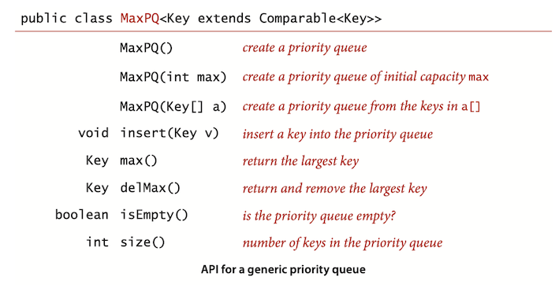
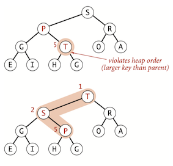
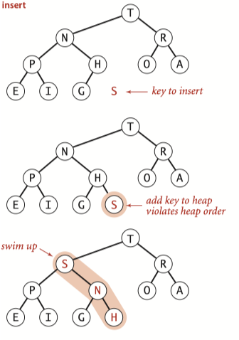
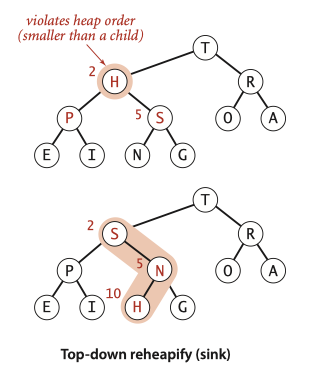
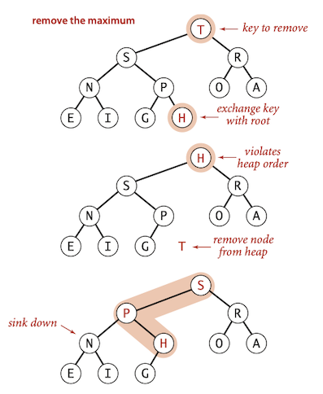

### **Topic 4: Priority Queues**


> A **priority queue** is an abstract data type which is like a regular queue or stack data structure, but where additionally each element has a "priority" associated with it.  It basically supports two operations: *remove the maximum* and *insert*.

### 1 API




!!! Question
    Q: The purpose of Binary Heap: Why exactly don’t we just sort and then consider the items in increasing order in the sorted array?
    
    * In some data-processing examples such as TopM and Multiway, the total amount of data is far too large to consider sorting (or even storing in memory).
    * In other examples, all the data does not even exist together at any point in time.
    
    
### 2 Elementary implementations

#### Array representation (unordered)

Perhaps the simplest priority-queue implementation is based on pushdown stacks. The code for <C>insert</C> in the priority queue is the same as for <C>push</C> in the stack. To implement <C>remove the maximum</C>, we can add code like the inner loop of selection sort to exchange the maximum item with the item at the end and then delete that one, the same as <C>pop()</C> for stacks. As with stacks, we can add resizing-array code to ensure that the data structure is always at least one-quarter full and never overflows.

<details><summary>click here</summary>
```Java
public class UnorderedMaxPQ<Key extends Comparable<Key>> {

    private Key[] pq; // pq[i] = ith element on pq
    private int N; // number of elements on pq

    @SuppressWarnings("unchecked")
    public UnorderedMaxPQ(int capacity) {
        pq = (Key[]) new Comparable[capacity];
    }

    public boolean isEmpty() {
        return N == 0;
    }

    public void insert(Key x) {
        pq[N++] = x;
    }

    public Key delMax() {
        int max = 0;
        for (int i = 1; i < N; i++)
            if (less(max, i))
                max = i;
        exch(max, N - 1);
        Key max_element = pq[--N];
        pq[N] = null; //null out entry, to prevent loitering
        return max_element;
    }

    private void exch(int i, int j) {
        Key swap = pq[i];
        pq[i] = pq[j];
        pq[j] = swap;
    }

    private boolean less(int i, int j) {
        return pq[i].compareTo(pq[j]) < 0;
    }
}
```
</details>


#### Array representation (ordered)

Another approach for <C>insert</C>  is to move larger entries one position to the right, thus keeping the keys in the array in order (as in insertion sort). Thus, the largest element is always at the end, and the code for remove the maximum in the priority queue is the same as for <C>pop</C> in the stack.


#### Linked-list representations
#### Analysis

Order of growth of worst-case running time for priority-queue implementations：


### 3 Heap definitions

> A binary tree is <font color='red'>heap-ordered</font> if the key in each node is larger than or equal to the keys in that node’s two children (if any).

The largest key in a heap-ordered binary tree is found at the root.

> A <font color='red'>binary heap</font> is a collection of keys arranged in a {==complete==} heap-ordered binary tree, represented in level order in an array (not using the first entry).


* In a heap, the parent of the node in position $k$ is in position ⎣$k/2$⎦ and, conversely, the two children of the node in position $k$ are in positions $2k$ and $2k + 1$.
* we can travel up and down by doing simple arithmetic on array indices: to move up the tree from $a[k]$ we set $k$ to $k/2$; to move down the tree we set k to $2k$ or $2k+1$.
* The height of a complete binary tree of size $N$ is ⎣ $\lg N$ ⎦ .

!!! Question  
    Q. Why not use $a[0]$ in the heap representation?
    
    A. Doing so simplifies the arithmetic a bit.
    

### 4 Algorithms On Heaps
#### Promotion in a heap

Scenario: Child's key becomes larger key than its parent's key.




To eliminate the violation:

* Exchange key in child with key in parent. 
* Repeat until heap order restored.


```Java
private void swim(int k) {
    while (k > 1 && less(k / 2, k)) {
        exch(k / 2, k);
        k = k / 2;
    }
}
```

#### Insertion in a heap

* Insert: Add node at end, then swim it up. 
* Cost: At most $1 + \lg N$ compares.





```Java
public void insert(Key v) {
    pq[++N] = v;
    swim(N);
}
```

#### Demotion in a heap

Scenario: Parent's key becomes smaller than one (or both) of its children's.

To eliminate the violation:

* Exchange key in parent with key in **larger** child. 
* Repeat until heap order restored.




```Java
private void sink(int k) {
    while (2*k <= N) {
        int j = 2*k;
        if (j < N && less(j, j+1)) j++;
        if (!less(k, j)) break;
        exch(k, j);
        k = j;
    }
}
```

#### Delete the maximum in a heap

* Delete max. Exchange root with node at end, then sink it down. 
* Cost. At most $2 \lg N$ compares.


```Java
public Key delMax() {
    Key max = pq[1];
    exch(1, N--);
    sink(1);
    pq[N + 1] = null;
    return max;
}
```




<hh>Complete Java Code</hh>


<details><summary>Click Here</summary>
```Java
public class MaxPQ<Key extends Comparable<Key>> {

    private Key[] pq; // pq[i] = ith element on pq
    private int N; // number of elements on pq

    @SuppressWarnings("unchecked")
    public MaxPQ(int capacity) {
        pq = (Key[]) new Comparable[capacity + 1];
    }


    public void insert(Key v) {
        pq[++N] = v;
        swim(N);
    }

    public Key delMax() {
        Key max = pq[1];
        exch(1, N--);
        sink(1);
        pq[N + 1] = null;
        return max;
    }

    public boolean isEmpty() {
        return N == 0;
    }

    private void swim(int k) {
        while (k > 1 && less(k / 2, k)) {
            exch(k / 2, k);
            k = k / 2;
        }
    }


    private void sink(int k) {
        while (2 * k <= N) {
            int j = 2 * k;
            if (j < N && less(j, j + 1)) j++;
            if (!less(k, j)) break;
            exch(k, j);
            k = j;
        }
    }


    private void exch(int i, int j) {
        Key swap = pq[i];
        pq[i] = pq[j];
        pq[j] = swap;
    }

    private boolean less(int i, int j) {
        return pq[i].compareTo(pq[j]) < 0;
    }

}
```

</details>


### 6 Heap Sort

Heapsort use any heap-based priority queue as the basis for a sorting algorithm by inserting a sequence of items, then successively removing the smallest to get them out.

Heapsort breaks into two phases: 

* <C>heap construction</C>: reorganize the original array into a heap.
* <C>sortdown</C>: pull the items out of the heap in decreasing order to build the sorted result.


#### Heap construction

Build heap using bottom-up method:

* proceed from bottom to top, using <C>sink()</C> to make subheaps.
* The scan starts halfway, and ends at position 1.


```Java
public void heapify(
    int N = a.length;
    for (int k = N/2; k >= 1; k--)
        sink(a, k, N);
}
```


#### Sortdown

Sortdown: repeatedly delete the largest remaining item.

* Remove the maximum, one at a time.
* Leave in array, instead of nulling out.


```Java
while (N > 1) {
    exch(a, 1, N--);
    sink(a, 1, N); 
```

Complete Code for Heap Sort:

```Java
public static void sort(Comparable[] a) {
    int N = a.length;
    for (int k = N/2; k >= 1; k--)
        sink(a, k, N);
    while (N > 1) {
        exch(a,1, N--);
        sink(a, 1, N);
    }
}
```

#### Analysis

* Heap construction uses $\le 2 N$ compares and exchanges. 
* Heapsort uses  $\le 2 N \lg N$ compares and exchanges.

Heapsort is optimal for both time and space, but:

* Inner loop longer than quicksort’s.
* Makes poor use of cache memory.
* Not stable.