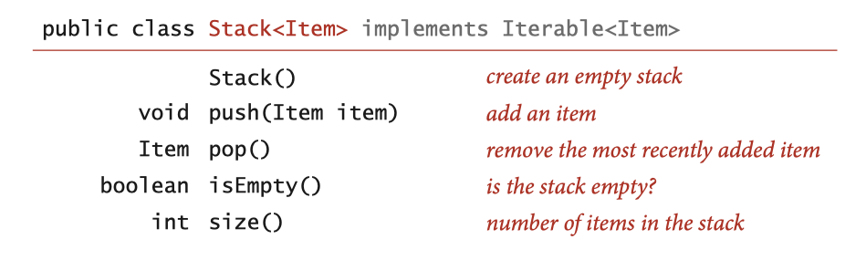

### Stacks and Queues

Bags, queues, and stacks are fundamental and broadly useful. They involve collections of objects. Specifically, the set of values is a collection of objects, and the operations revolve around adding, removing, or iterating objects in the collection.

### 1 stacks 

#### Stack API



#### Stack: linked-list representation

Maintain pointer to first node in a linked list; insert/remove from front.

```Java
```


### 2 resizing arrays
### 3 queues 
### 4 generics 
### 5 iterators 
### 6 applications
