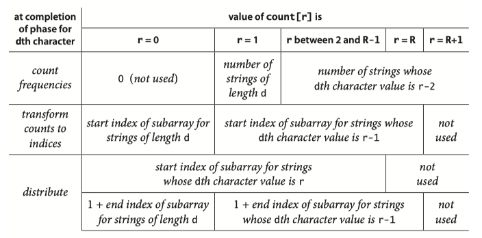
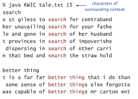

### **Topic 11: String Sort**

### strings in Java 

#### The char data type

C char data type. Typically an *8-bit* integer.

* Supports 7-bit ASCII.
* Can represent only 256 characters.

Java char data type. A *16-bit unsigned* integer.

* Support original 16-bit Unicode.

### key-indexed counting

Goal. Sort an array $a[]$ of $N$ integers between 0 and $R$ - 1.

* Count frequencies of each letter using key as index. 
* Compute frequency cumulates which specify destinations. 
* Access cumulates using key as index to move items. 
* Copy back into original array.

```Java
int N = a.length; 
int[] count = new int[R+1];
// Count frequencies of each letter using key as index. 
for (int i = 0; i < N; i++) count[a[i]+1]++;
// Compute frequency cumulates which specify destinations. 
for (int r = 0; r < R; r++) count[r+1] += count[r];
// Access cumulates using key as index to move items
for (int i = 0; i < N; i++) aux[count[a[i]]++] = a[i];
// Copy back into original array
for (int i = 0; i < N; i++) a[i] = aux[i];
```


### LSD radix sort

*least-significant-digit first* (LSD) string sort


* Consider characters from right to left.
* Stably sort using $d^{th}$ character as the key (using key-indexed counting).

Consider the following motivating application: Suppose that a highway engineer sets up a device that records the license plate number of all vehicles using a busy highway for a given period of time. License plates are a mixture of numbers of letters. 


If the strings are each of length $W$, we sort the strings $W$ times with key-indexed counting, using each of the positions as the key, proceeding from right to left. 


```Java
public static void lsdSort(String[] a, int w) {
    int n = a.length;
    int R = 256;   // extend ASCII alphabet size
    String[] aux = new String[n];

    for (int d = w-1; d >= 0; d--) {
        // sort by key-indexed counting on dth character
        // compute frequency counts
        int[] count = new int[R+1];
        for (int i = 0; i < n; i++) count[a[i].charAt(d) + 1]++;
        // compute cumulates
        for (int r = 0; r < R; r++) count[r+1] += count[r];
        // move data
        for (int i = 0; i < n; i++)
            aux[count[a[i].charAt(d)]++] = a[i];
        // copy back
        for (int i = 0; i < n; i++) a[i] = aux[i];
    }
}
```

#### Analysis

LSD string sort uses $\sim 7WN+ 3WR$ array accesses and extra space proportional to $N + R$ to sort $N$ items whose keys are $W$-character strings taken from an $R$-character alphabet.

For typical applications, $R$ is far smaller than $N$, so the total running time is proportional to $WN$.

!!! Question

    <hh>Sort one million 32-bit integers</hh> (Black Obama was asked for the question, [video](http://www.youtube.com/watch?v=k4RRi_ntQc8&amp;feature=related)), see discussion [here](https://www.quora.com/What-is-the-most-efficient-way-to-sort-a-million-32-bit-integers). Solution: LSD radix sort.


### MSD radix sort 

*most-significant-digit-first* (MSD) string sort:

* Partition array into $R$ pieces according to first character (use key-indexed counting).
* Recursively sort all strings that start with each character (key-indexed counts delineate subarrays to sort).


#### End-of-string-convection

For a proper sort, we need the subarray for strings whose characters have all been examined to appear as the first subarray, and we do not want to recursively sort this subarray. 

To facilitate these two parts of the computation we use a private two argument <C>toChar()</C> method to convert from an indexed string character to an array index that returns -1 if the specified character position is past the end of the string. Then, we just add 1 to each returned value, to get a nonnegative int that we can use to index <C>count[]</C>. 


```Java
// return dth character of s, -1 if d = length of string
private static int charAt(String s, int d) {
    if (d == s.length()) return -1;
    return s.charAt(d);
}
```

This convention means that we have $R+1$ different possible character values at each string position: 0 to signify end of string, 1 for the first alphabet character, 2 for the second alphabet character, and so forth.


Since key-indexed counting already needs one extra position, we use the code int <C>count[] = new int[R+2]</C>; to create the array of frequency counts (and set all of its values to 0).




#### Small subarrays

Small subarrays are of critical importance in the performance of MSD string sort.

* Each function call needs its own <C>count[]</C> array.
* ASCII (256 counts): 100x slower than copy pass for $N$ = 2. 
* Unicode (65,536 counts): 32,000x slower for $N$ = 2.
* Huge number of small subarrays because of recursion.

Solution: Cutoff to insertion sort for small subarrays.

```Java
private static int R = 256;         // radix
private static final int M = 15;    // cutoff for small subarrays
private static String[] aux;        // auxiliary array for distribution

public static void sort(String[] a) {
    int n = a.length;
    String[] aux = new String[n];
    sort(a, 0, n-1, 0, aux);
}

// sort from a[lo] to a[hi], starting at the dth character
private static void sort(String[] a, int lo, int hi, int d, String[] aux) {
    // cutoff to insertion sort for small subarrays
    if (hi <= lo + CUTOFF) {
        insertion(a, lo, hi, d);
        return;
    }
    // compute frequency counts
    int[] count = new int[R+2];
    for (int i = lo; i <= hi; i++) {
        int c = charAt(a[i], d);
        count[c+2]++;
    }
    // transform counts to indicies
    for (int r = 0; r < R+1; r++) count[r+1] += count[r];
    // distribute
    for (int i = lo; i <= hi; i++) {
        int c = charAt(a[i], d);
        aux[count[c+1]++] = a[i];
    }
    // copy back
    for (int i = lo; i <= hi; i++)  a[i] = aux[i - lo];
    // recursively sort for each character (excludes sentinel -1)
    for (int r = 0; r < R; r++)
        sort(a, lo + count[r], lo + count[r+1] - 1, d+1, aux);
}
```

#### Analysis

To sort $N$ random strings from an R-character alphabet, MSD string sort examines about $N\ log_ R N$ characters, on average.

Disadvantages MSD string sort.

* Extra space for aux[].
* Extra space for count[].
* Inner loop has a lot of instructions.
* Accesses memory "randomly" (cache inefficient).

### suffix arrays


<hh>Keyword-in-context search</hh> Given a text of $N$ characters, preprocess it to enable fast substring search (find all occurrences of query string context).



* Preprocess: suffix sort the text.
* Query: binary search for query; scan until mismatch.


#### Application: Longest repeated substring

Given a string of $N$ characters, find the longest repeated substring.

Brute-force algorithm.

* Try all indices $i$ and $j$ for start of possible match. 
* Compute longest common prefix (LCP) for each pair.
* Analysis. Running time $≤ D N^ 2$ , where $D$ is length of longest match.


```Java
public static String lrs(String text) {
    int n = text.length();
    String[] suffixes = new String[N];
    // create suffixes (linear time and space)
    for (int i = 0; i < N; i++)
        suffixes[i] = s.substring(i, N);
    // sort suffixes
    Arrays.sort(suffixes);
    
    // find LCP between adjacent suffixes in sorted order
    String lrs = "";
    for (int i = 0; i < N - 1; i++) {
        int len = lcp(suffixes[i], suffixes[i+1]);
        if (len > lrs.length()) lrs = suffixes[i].substring(0, len);
    return lrs;
}
```

Problem. Five scientists A, B, C, D, and E are looking for long repeated substring in a genome with over 1 billion nucleotides.

Solution:  Use suffix sorting solution with 3-way string quicksort.