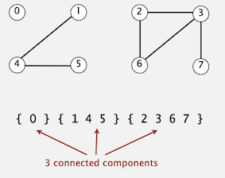
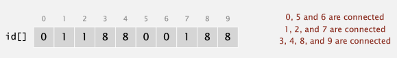
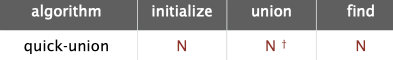
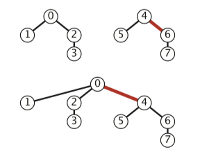
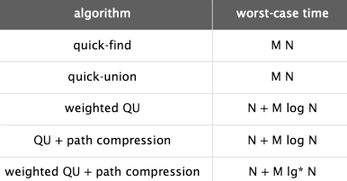

### **Chapter 1: Union Find**

### 1 Dynamic Connectivity

The graph connectivity problem is the following: Given an **undirected** graph G, preprocess the graph so that queries of the form “are nodes $u$ and $v$ connected?”

**Connected components**:  Maximal set of objects that are mutually connected.




#### Union-Find data type (API)

Union-Find(并查集) API:

* the <C>union()</C> operation merges two components if the two sites are in different components.
* the <C>find()</C> operation returns an integer component identifier for a given site.
* the <C>connected()</C> operation determines whether two sites are in the same component.
* the <C>count()</C> method returns the number of components.


### 2 Quick-Find

Quick-Find Idea: all sites in a component must have the same value in id[]. 



This method is called quick-find because <C>find(p)</C> just returns id[$p$], which immediately implies that <C>connected(p, q)</C> reduces to just the test id[$p$] == id[$q$] and returns true, if and only if $p$ and $q$ are in the same component.

<C>Union()</C>: To combine the two components into one, we have to make all of the id[] entries corresponding to both sets of sites the same value. To do so, we go through the array, changing all the entries with values equal to id[$p$] to the value id[$q$].

```Java
public class QuickFind {
    private int[] id;

    public QuickFind(int N) {
        id = new int[N];
        // set id of each object to itself
        for (int i = 0; i < N; i++) id[i] = i;
    }

    public boolean connected(int p, int q) {
        return id[p] == id[q];
    }
    
    public int find(int p) {
        return id[p];
    }
    
    public void union(int p, int q) {
        int pid = id[p];
        int qid = id[q];
        // change all entries with id[p] to id[q]
        for (int i = 0; i < id.length; i++) 
            if (id[i] == pid) id[i] = qid;
    }
}
```

#### Analysis

The Quick-Find algorithm uses one array access for each call to <C>find()</C> and between $N + 3$ and $2N + 1$ array accesses for each call to <C>union()</C> that combines two components.


WORST CASE: suppose we wind up with a single component. This requires at least $N-1$ calls to <C>union()</C>, and, consequently, at least $\sim N^2$ array accesses — we are led immediately to the hypothesis that dynamic connectivity with quick-find can be a quadratic-time process.


### 3 Quick-Union

Data structure:

* Interpretation: id[$i$] is parent of $i$. 
* Root of $i$ is id[id[id[...id[$i$]...]]] (keep going until it doesn’t change)


Specifically, the id[] entry, for each site is the name of another site in the same component (possibly itself) — we refer to this connection as a link. To implement <C>find()</C>, we start at the given site, follow its link to another site, follow that site’s link to yet another site, and so forth, following links until reaching a root, a site that has a link to itself. Two sites are in the same component if and only if this process leads them to the same root.


<C>union(p, q)</C>: we follow links to finds the roots associated with $p$ and $q$, then rename one of the components by linking one of these roots to the other; hence the name quick-union.


```Java
public class QuickUnion {
    private int[] id;
    private int count;

    public QuickUnion(int N) {
        count = N;
        id = new int[N];
        // set id of each object to itself (N array accesses)
        for (int i = 0; i < N; i++) id[i] = i;
    }

    private int find(int p) {
        // chase parent pointers until reach root
        while (p != id[p]) p = id[p];
        return p;
    }

    public boolean connected(int p, int q) {
        //check if p and q have same root
        return find(p) == find(q);
    }

    public void union(int p, int q) {
        // change root of p to point to root of q
        int i = find(p);
        int j = find(q);
        id[i] = j;
        count--;
    }
}
```

#### Analysis

The number of array accesses used by <C>find()</C> in quick-union is 1 plus the twice the depth of the node corresponding to the given site. The number of array accesses used by <C>union()</C> and <C>connected()</C> is the cost of the two <C>find()</C> operations (plus 1 for <C>union()</C> if the given sites are in different trees).

WORST CASE: suppose we wind up with a single component, the running time is quadratic.




### 4 Improvement 1: weighting

**Weighted quick-union**: Rather than arbitrarily connecting the second tree to the first for <C>union()</C>, we keep track of the size of each tree and always *connect the smaller tree to the larger*. This change needs another array to hold the node counts.


```Java
public class WeightedQuickUnion {

    private int[] id; // parent link (site indexed)
    private int[] sz; // size of component for roots (site indexed)
    private int count; // number of components

    public WeightedQuickUnion(int N) {
        count = N;
        id = new int[N];
        for (int i = 0; i < N; i++) id[i] = i;
        sz = new int[N];
        for (int i = 0; i < N; i++) sz[i] = 1;
    }

    public int count() {
        return count;
    }

    public boolean connected(int p, int q) {
        return find(p) == find(q);
    }

    private int find(int p) { // Follow links to find a root.

        while (p != id[p]) p = id[p];
        return p;
    }

    public void union(int p, int q) {
        int i = find(p);
        int j = find(q);
        if (i == j) return;
        // Make smaller root point to larger one.
        if (sz[i] < sz[j]) {
            id[i] = j; sz[j] += sz[i];
        } else {
            id[j] = i; sz[i] += sz[j];
        }
        count--;
    }
}
```

#### Analysis

The depth of any node in a forest built by weighted quick-union for $N$ sites is at most $\log N$.

The worst case for weighted quick union is when the sizes of the trees to be merged by <C>union()</C> are always equal (and a power of 2). And they have the simple property that the height of a tree of $2^n$ nodes is $n$.




For weighted quick-union with $N$ sites, the worst-case order of growth of the cost of <C>find()</C>, <C>connected()</C>, and <C>union()</C> is $\log N$.

Specifically, the weighted quick-union algorithm uses at most $cM\log N$ array accesses to process $M$ connections among $N$ sites for a small constant $c$.


### 5 Improvement 2: Path Compression

IDEA: Just after computing the root of $p$, set the id of each examined node to point to that root.

Two-pass implementation: add second loop to <C>find()</C> to set the id[] of each examined node to the root.

Simpler one-pass variant: Make every other node in path point to its grandparent (thereby halving path length).

```Java
private int find(int p) { // Follow links to find a root.
    while (p != id[p]) {
        // only one extra line of code !
        id[p] = id[id[p]];
        p = id[p];
    }
    return p;
}
```

#### Amortized Analysis

Starting from an empty data structure, any sequence of $M$ union-find ops on $N$ objects makes $\le c ( N + M \lg^*N )$ array accesses, where $lg^*$ is iterated logarithm[[wiki](https://en.wikipedia.org/wiki/Iterated_logarithm), 迭代对数]. ($lg^*N$表示将$N$变为小于1需要的$\log$迭代次数)


#### Summary

$M$ union-find operations on a set of $N$ objects:




