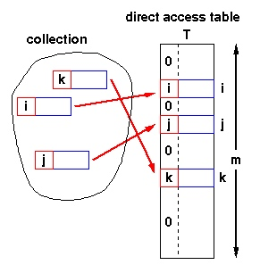

###  **Topic: Hash Table**


Hash table (哈希表) is a collection of items which are stored in such a way as to make it easy to find item. Each position of the hash table, often called a *slot*, can hold an item and is named by an integer value starting at 0. The mapping between an item and the slot where that item belongs in the hash table is called the *hash function*(哈希函数). A *perfect hash function* maps every items into a unique slot. When two items hash to the same slot, *collision* happens. And a systematic method, which called *collision resolution*, for placing the second item in the hash table must be put forward.

##### Direct-address tables

If the number of possible keys is small and they are unique, *direct-address tables*(直接寻址表) can be used. Each slot corresponds to a unique key.

```python
Insert(T,x):
    T[key(x)] = x   
Search(T,x):
    return(T[key(x)])
Delete(T,x):
    T[key(x)] = NIL
```



The range of the key determines the size of the direct address table and may be too large to be practical. For instance, it's not likely that you'll be able to use a direct address table to store elements which have arbitrary 32-but integers as their keys for a few years yet.

### Hash function

What is a good hash function? Hash functions should have the following properties:

* *Fast* computation of the hash value ($O(1)$).
* Hash values should be distributed (nearly) *uniformly*.

The goal of a hash function is

* disperse the keys in an apparently random way

**Remainder method** simply takes an item and divides it by the table size, returning the remainder as its hash value, i.e. $h(item)=item\%11$

**Folding method** begins by dividing the item into equal size pieces (the last piece may not be of equal size), and then added together to give the resulting hash value by extra step of dividing by the table size and keeping the remainder.

### Collision Resolution

Various techniques are used to manage collision:

* Separate Chaining (分离链接法)
* Open addressing (开放寻址法)
    * linear probing (线性探查)
    * quadratic probing (二次探查)

#### Separate chaining
 
Separate Chaining allows each slot to hold a reference to a collection of items. It allows many items to exist at the same location in the hash table.


#### Open addressing

In **open addressing**, all elements occupy the hash table itself. That is, each table entry contains either an element of the dynamic set or NIL. When searching for an element, we systematically examine table slots until either we find the desired element or we have ascertained that the element is not in the table. No lists and no elements are stored outside the table, unlike in chaining.

#### Linear probing


One of the simplest re-hashing functions is +1(or -1) on a collision, i.e. look in the neighboring slot in the table. It calculates new address extremely quickly.

A disadvantage to linear probing is the tendency for clustering: items become clustered in the table.

#### Quadratic probing

Instead of using a constant 'skip' value, quadratic probing using a rehash function that increments the hash value by 1, 3, 5, 7, 9 and so on. This means that if the first hash value is $h$, the successive values are $h+1$, $h+4$,$h+9$, $h+16$ and so on.

#### Load factor

*Load factor*(装载因子) is commonly denoted by $\lambda = \frac{number\_of\_items}{table\_size}$.

The most important piece of information we need to analyze the use of a hash table is the load factor, $\lambda$. Conceptually, if the load factor is small, then there is a lower chance of collisions.

For a successful search, using open addressing with linear probing, the average number of comparisons is approximately $\frac{1}{2}(1+\frac{1}{1-\lambda})$ and an unsuccessful search gives $\frac{1}{2}(1+(\frac{1}{1-\lambda})^2)$.

Using chaining, the average number of comparisons is $1+\lambda/2$ for the successful case, and simply $\lambda$ comparisons if the search is unsuccessful.

High load factor $\alpha \ge 0.85$ has negative effect on efficiency:

* lots of collisions
* efficiency due to collision overhead

### Universal Hashing

Let $H$ be a finite collection of hash functions that map a given universe $U$ of keys into the range $\{0,1,...,m-1\}$. Such a collection is said to be *universal* if for each pair of distinct keys $k,l \in U$, the number of hash function $h \in H$ for which $h(k) = h(l)$ is at most $\frac{|H|}{m}$, i.e.

$$ \forall k,l \in U, k\ne l: \Pr_{h\in H }[h(x)=h(y)]\le \frac{1}{m}  $$

#### Why Universal Hashing?

Some malicious adversary might chooses the keys which all hash to the same slot, yielding an average retrieval time of $\Theta(n)$. Instead of fixed hash functions, randomly chosen hash functions can yield good performance on average.

#### Designing a universal class of hash functions

In short, you can generate family of hash functions using following simple equation:

$$\text{h}_{a,b}(\text{key}) = ((a\times\text{key} + b) \text{mod } p) \text{mod } m$$

* $key$ is key you want to hash
* $a$ is any number you can choose between $1$ to $p-1$ inclusive.
* $b$ is any number you can choose between $0$ to $p-1$ inclusive.
* $p$ is a prime number that is greater than max possible value of $x$.
* $m$ is a max possible value you want for hash code + 1.

By selecting different values of $a$ and $b$ you can generate many hash codes that are independent of each other.

#### Implementation

```python
import random


class UniversalHash:
    """
    >>> h=UniversalHash()
    >>> h[54]="cat"
    >>> h[26]="dog"
    >>> h[93]="lion"
    >>> h[77]="bird"
    >>> h[31]="cow"
    >>> h[44]="goat"
    >>> 54 in h
    True
    """
    def __init__(self):
        self.size = 100
        self.slots = [None] * self.size
        self.data = [None] * self.size
        (self.p, self.a, self.b) = self.generate_hash_constants()


    def generate_hash_constants(self):
        """
        generate a, b, p for universal hashing
        """
        p = self._get_prime()  ### set p a  random prime number
        a = random.randint(1, p - 1)  ### A has a random value between 1 and p - 1.
        b = random.randint(1, p - 1)  ### B has a random value between 1 and p - 1
        return p, a, b

    def put(self, key, data):
        hash_value = self.hash_function(key)
        if self.slots[hash_value] is None:
            self.slots[hash_value] = key
            self.data[hash_value] = data
        elif self.slots[hash_value] == key:
            self.data[hash_value] = data
        else:
            ### rehash
            next_slot = self.rehash(hash_value, len(self.slots))
            while self.slots[next_slot] is not None and self.slots[next_slot] != key:
                next_slot = self.rehash(hash_value, len(self.slots))

            if self.slots[next_slot] is None:
                self.slots[next_slot] = key
                self.data[hash_value] = data
            else:
                self.data[hash_value] = data

    def hash_function(self, key):
        """
        hash_function implements the simple remainder method
        """
        return round(self.a * key + self.b) % self.p % self.size

    def rehash(self, old_hash, size):
        """
        linear probing with a plus 1
        """
        return (old_hash+1) % size

    def get(self, key):
        start_slot = self.hash_function(key)
        data = None
        stop = False
        found = False
        position = start_slot
        while self.slots[position] is not None and \
                not found and not stop:
            if self.slots[position] == key:
                found = True
                data = self.data[position]
            else:
                position = self.rehash(position, len(self.slots))
            if position == start_slot:
                stop = True
        return data

    def _is_prime(self,n):
        if n <= 2 or n%2 == 0:
            return False

        return not any((n%i == 0 for i in range(3, n-1)))

    def _get_prime(self, p=0):
        """
        get a prime number
        """
        if p == 0:
            p = random.randint(1000000,10000000)
        while not self._is_prime(p):
            p += 1

        return p

    def __getitem__(self, key):
        return self.get(key)

    def __setitem__(self, key, data):
        self.put(key, data)

    def __len__(self):
        """
        return length
        """
        count = 0
        for item in self.slots:
            if item is not None:
                count += 1

        return count

    def __contains__(self, item):
        """
        定义了使用in和not in进行成员测试时类的行为
        """
        return self.get(item) is not None

    def __iter__(self):
        """
        iterator
        """
        for item in self.slots:
            if item is not None:
                yield item

if __name__ == "__main__":
    import doctest
    doctest.testmod(verbose=True)
```


#### Resources

1. [Hash Functions and Hash Tables](https://www.cse.iitb.ac.in/~sri/cs213/lec-Hashing.pdf)
2. Cormen, Leiserson, Rivest, and Stein, Introduction to Algorithms (3rd edition)

