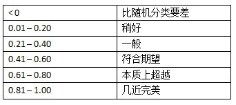
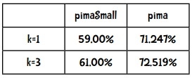

### **面向程序员的数据挖掘指南 - 4 进一步探索分类**

### 效果评估算法和kNN

当我们构建完一个分类器后，应该问以下问题：分类器的准确度如何？ 结果理想吗？ 如何与其它分类器做比较？


#### 训练集和测试集

数据集可以分为两个部分，第一部分用来构造分类器，称为**训练集**；另一部分用来评估分类器的结果，称为**测试集**。

#### k折交叉验证

不过，这种上面这种简单、直接的做法似乎有问题：如果分割的时候不凑巧，就会引发异常。比如，若测试集中的篮球运动员恰巧都很矮，她们就会被归为马拉松运动员。解决方法之一是将数据集按不同的方式拆分，测试多次，取结果的平均值。

如果将数据集分成$k$份，用$k-1$份来做训练集，另一份来做测试集，并迭代$k$次，叫做$k$**折交叉验证**($k$-fold cross validation)。在数据挖掘中，通常的做法是将数据集拆分成十份，称为**十折交叉验证**。

我们来看一个示例：假设有一个分类器能判断某个人是否是篮球运动员，数据集包含500个运动员和500个普通人。

* 第一步：将数据分成10份，每份包含50个篮球运动员，50个普通人
* 第二步：重复以下步骤10次
    * 每次迭代我们保留一份，比如第一次迭代保留第1份，第二次保留第2份。
    * 我们使用剩余的9份来训练分类器，比如第一次迭代使用第2至10份来训练。
    * 我们用刚才保留的一份来进行测试，并记录结果，比如：35个篮球运动员分类正确， 29个普通人分类正确。
* 第三步：合并结果

我们可以用一张表格来展示结果(就是马上要提到的混淆矩阵)：


通过十折交叉验证得到的评价结果肯定会比二折或者三折来得准确，因为使用了更多的训练数据。

#### 留一法

既然十折交叉验证效果那么好，我们为何不做一个$N$折交叉验证？$N$即数据集中的数据量。在数据挖掘领域，$N$折交叉验证又称为**留一法**。

* 优点：
    * 几乎所有的数据进行训练，然后用一个数据进行测试。
    * 确定性。
* 缺点：
    * 最大的缺点是计算时间很长。
    * 分层问题

在留一法中，所有的测试集都只包含一个数据(分层问题)。所以说，留一法对小数据集是合适的，但大多数情况下我们会选择十折交叉验证。

### 混淆矩阵

混淆矩阵(confusion matrix)可以展现更为详细的评价结果。混淆矩阵可以帮助我们快速识别出分类器到底在哪些类别上发生了混淆，因此得名。表格的行表示测试用例实际所属的类别，列则表示分类器的判断结果。


在这个示例中，我们的分类器可以很好地区分体操运动员和篮球运动员，而马拉松运动员则比较容易和其他两个类别发生混淆。


### Application: 每加仑燃油公里数

卡内基梅隆大学统计的汽车燃油消耗和公里数数据也是一个广泛使用的数据集。在[前面一章](../ch3/#example_2)中已经介绍过。

根据汽缸数、排气量、马力、重量、 加速度等数据预测每加仑燃油公里数(mpg)。392条数据都存放在mpgData.txt文件中，并用下面这段Python代码将这些数据按层次等分成十份：

```python
# divide data into 10 buckets
import random

def buckets(filename, bucket_name, separator, class_column):
	"""
	@param filename: file name of the original data.
	@param bucket_name: the prefix for all the bucket names.
	@param separator: the character that divides the columns.
	@param class_column: column that indicates the class, start from 0
	"""
	# put the data in 10 buckets


	number_of_buckets = 10
	data = {}
	# first read in the data and divide by category
	with open(filename) as f:
		lines = f.readlines()
	for line in lines:
		if separator != '\t':
			line = line.replace(separator, '\t')
		# first get the category
		category = line.split()[class_column]
		data.setdefault(category, [])
		data[category].append(line)
	# initialize the buckets
	buckets = []
	for i in range(number_of_buckets):
		buckets.append([])
	# now for each category put the data into the buckets
	for k in data.keys():
		# randomize order of instances for each class
		random.shuffle(data[k])
		bNum = 0
		# divide into buckets
		for item in data[k]:
			buckets[bNum].append(item)
			bNum = (bNum + 1) % number_of_buckets

	# write to file
	for bNum in range(number_of_buckets):
		f = open("%s-%02i" % (bucket_name, bNum + 1), 'w')
		for item in buckets[bNum]:
			f.write(item)
		f.close()

# example of how to use this code          
buckets("mpgTrainingSet", 'mpgData', '\t', 1)
```

执行这个程序后会生成10个文件：mpgData01、mpgData02等。然后需要修改上一章的近邻算法程序，让AthleteClassifier.test()函数能够执行十折交叉验证。


```Python
def ten_fold_cross_validation(self, bucket_name, separator, format, header=True):
	"""
	10-fold cross validation
	:param bucket_name: the prefix for all the bucket names.
	:param separator: the character that divides the columns.
	:param format: num, comment, class
	:param header: whether header line exist
	:return: accuracy
	"""
	self.format = format
	self.test_result = {}
	accuracy = []

	# repeat 10 times, select test bucket for test
	for test_bucket_number in range(10):
		# select remaining 9 bucket for training
		training_data = []
		for bucket_number in range(10):
			if test_bucket_number != bucket_number:
				training_filename = "%s%s%02i" % (bucket_name, separator, bucket_number + 1)
				training_data.extend(self.pre_processing(training_filename, header))
		self.data = training_data

		# normalize
		self.mean_absolute_deviation()
		self.normalizeColumn()

		# test
		test_filename = "%s%s%02i" % (bucket_name, separator, test_bucket_number + 1)
		accuracy.append(self.test(test_filename, header))

	# print output
	print("    ", end='')
	for actual in self.test_result.keys():
		print("%5s" % actual, end='')
	print("\n    ", "+----"*len(self.classes), "+")
	for actual, test_results in self.test_result.items():
		print("%3s" % actual, end='  |')
		for accuracy_count in test_results.values():
			print("%3s" % accuracy_count, end=' |')
		print('\n')
	print("    ", "+----"*len(self.classes), "+")

	avg_accuracy = np.average(accuracy)
	print("accuray is",  avg_accuracy)
	return avg_accuracy
```


### Kappa指标

Kappa指标可以用来评价分类器的效果比随机分类要好多少，公式为

$$\kappa = \frac{P(c)-P(r)}{1-P(r)}$$

$P(c)$表示分类器的准确率，$P(r)$表示随机分类器的准确率。可以参考下列经验结果：




### kNN算法

其实kNN算法已经在[第一章](../ch1#knn)里叙述并使用了。当时计算距离时，使用的是皮尔森相关系数。那么，如果是曼哈顿距离呢？首先，将距离取倒数，然后把所有的距离倒数除以距离倒数的和，从而得到评分的权重，最后加权平均得到评分。

其实把距离的倒数看成是相似度，就非常容易理解了。

### Example: 比马印第安人糖尿病

这一节分析由美国国家糖尿病、消化和肾脏疾病研究所提供的比马印第安人糖尿病数据集([下载](https://gist.githubusercontent.com/ktisha/c21e73a1bd1700294ef790c56c8aec1f/raw/819b69b5736821ccee93d05b51de0510bea00294/pima-indians-diabetes.csv))。数据集中的一条记录代表一名21岁以上的比马女性，她们分类两类：五年内查出患有糖尿病，以及没有得病。数据集中包含了8个特征，如怀孕次数，舒张压等。


 数据集前八列是特征，最后一列是分类（1-患病，0-健康）。


结果如下：


