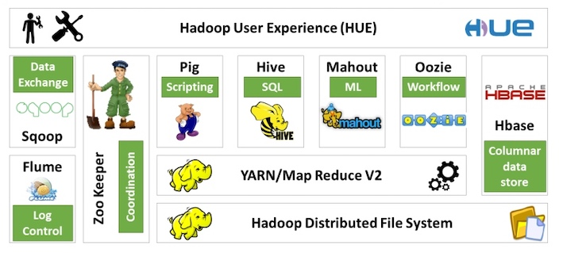

### **Hadoop: The Definitive Guide 1 - Meet Hadoop**

### 1 数据！数据！

现在是数据大爆炸时代，全球数据总量远远超过了全世界每人一块硬盘中所能保存的数据总量。

* 个人产生的数据正在快速增长
    * 个人信息档案将日益普及（电话、邮件、文件、照片）
* 物联网的机器设备产生的数据可能远远超过个人产生的数据 
    * 机器日志、传感器网络、零售交易数据等

### 1.2 数据的存储与分析

遇到的问题：硬盘存储容量不断提升，访问速度没有与时俱进

* 读写硬盘中的数据需要更长时间

解决方法： 同时从多个硬盘上读取数据，每个硬盘存储一部分数据

* 虽然浪费了硬盘容量，但是由于用户的分析工作都是在不同时间点进行的，所以彼此之间的干扰并不太大

新的问题：要对多个硬盘中的数据并行进行读写数据，还有更多问题要解决

* 硬件故障问题：最常见的做法是系统保存数据的副本(replica)
* 大多数分析任务需要以某种方式结合大部分数据来共同完成分析，保证其正确性是一个非常大的挑战：MapReduce

### 1.3 查询所有数据

MapReduce是一个**批量查询处理器**(batch processing system)，能够在合理的时间范围内处理针对整个数据集的动态查询。

### 1.4 不仅仅是批处理

MapReduce基本上是一个批处理系统，并不适合交互式分析:

* 你不可能执行一条查询并在几秒内或更短时间内得到结果；典型情况下，执行查询需要几分钟或更多时间。
* MapReduce更适合没有用户在现场等待查询结果的离线使用场景。

Hadoop的发展已经超越了批处理本身。

* Hadoop有时被用于指代一个更大的、多个项目组成的生态系统，而不仅仅是HDFS和MapReduce
    * HBase：使用HDFS做底层存储的键值存储模型。 
    * YARN: 集群资源管理系统

### 1.6 发展历史

* Hadoop是Doug Cutting创建的，起源于开源网络搜索引擎Apache Nutch.
* Apache Nutch是起始于2002年，并借鉴了“谷歌分布式文件系统(GFS)"和MapReduce。
* 2006年，Doug Cutting加入雅虎，雅虎为此组织了专门的团队和资源，将Hadoop发展成能够以Web规模运行的系统。 
* 2008年，Hadoop已经成为Apache的顶级项目，证明了它的成功、多样化和生命力。
* 目前，Hadoop被主流企业广泛使用。在工业界，Hadoop已经是 _*公认的大数据通用存储和分析平台*_ 。

### 1.7 Hadoop家族

