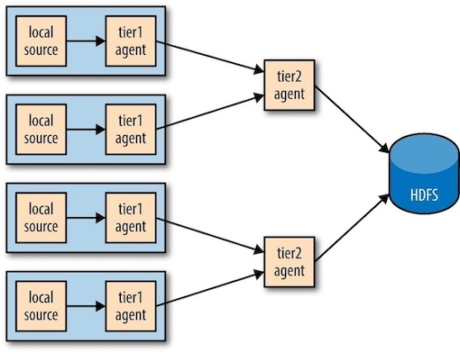

### **Hadoop: The Definitive Guide 14 - Flume**

Flume is designed for high-volume ingestion into Hadoop of event-based data. The canonical example is using Flume to collect logfiles from a bank of web servers, then moving the log events from those files into new aggregated files in HDFS for processing.


To use Flume, we need to run a Flume **agent**, which is a long-lived Java process that runs **source**s and **sink**s, connected by **channel**s. A source in Flume produces events and delivers them to the channel, which stores the events until they are forwarded to the sink.


### 1. An Example

To show how Flume works, let’s start with a setup that:

1. Watches a *local* directory for new text files
2. Sends each line of each file to the console as files are added

Flume configuration using a spooling directory source and a logger sink

```
agent1.sources = source1 
agent1.sinks = sink1 
agent1.channels = channel1
agent1.sources.source1.channels = channel1 
agent1.sinks.sink1.channel = channel1
agent1.sources.source1.type = spooldir
agent1.sources.source1.spoolDir = /tmp/spooldir
agent1.sinks.sink1.type = logger
agent1.channels.channel1.type = file
```

Here, a <C>spooldir</C> is a spooling directory source that monitors a spooling directory for new files; a <C>logger</C> sink is a sink for logging events to the console. Source and sink must be connected to channel(`agent1.sources.source1.channels = channel1`).


```bash
# create the spooling directory on the local filesystem:
$ mkdir /tmp/spooldir
# start the Flume agent using the flume-ng command:
$ flume-ng agent \
> --conf-file spool-to-logger.properties \
> --name agent1 \
> --conf $FLUME_HOME/conf \
> -Dflume.root.logger=INFO,console

# on another terminal, create a file in the spooling directory.
$ echo "Hello Flume" > /tmp/spooldir/.file1.txt
$  ~ mv /tmp/spooldir/.file1.txt /tmp/spooldir/file1.txt
```

### 2. Transactions and Reliability

Flume uses separate transactions to guarantee delivery from the source to the channel and from the channel to the sink. In the example in the previous section, the spooling directory source creates an event for each line in the file. The source will only mark the file as completed once the transactions encapsulating the delivery of the events to the channel have been successfully committed. 

Similarly, a transaction is used for the delivery of the events from the channel to the sink. If for some unlikely reason the events could not be logged, the transaction would be rolled back and the events would remain in the channel for later redelivery.


### 3. The HDFS Sink

Events may delivered to the HDFS sink and written to a file. Files in the process of being written to have a `.tmp` in-use suffix (default, set by <C>hdfs.inUsePrefix</C>, see below) added to their name to indicate that they are not yet complete.

Flume configuration using a spooling directory source and an HDFS sink:

```
agent1.sources = source1 
agent1.sinks = sink1 
agent1.channels = channel1
agent1.sources.source1.channels = channel1
agent1.sinks.sink1.channel = channel1
agent1.sources.source1.type = spooldir
agent1.sources.source1.spoolDir = /tmp/spooldir
agent1.sinks.sink1.type = hdfs
agent1.sinks.sink1.hdfs.path = /tmp/flume
agent1.sinks.sink1.hdfs.filePrefix = events
agent1.sinks.sink1.hdfs.fileSuffix = .log 
agent1.sinks.sink1.hdfs.inUsePrefix = _ 
agent1.sinks.sink1.hdfs.fileType = DataStream
agent1.channels.channel1.type = file
```

#### Partitioning and Interceptors


### 4 Fan Out

*Fan out* is the term for delivering events from one source to multiple channels, so they reach multiple sinks.

Flume configuration using a spooling directory source, fanning out to an HDFS sink and a logger sink:

```
agent1.sources = source1 
agent1.sinks = sink1a sink1b 
agent1.channels = channel1a channel1b
agent1.sources.source1.channels = channel1a channel1b 
agent1.sinks.sink1a.channel = channel1a 
agent1.sinks.sink1b.channel = channel1b
agent1.sources.source1.type = spooldir 
agent1.sources.source1.spoolDir = /tmp/spooldir
agent1.sinks.sink1a.type = hdfs 
agent1.sinks.sink1a.hdfs.path = /tmp/flume 
agent1.sinks.sink1a.hdfs.filePrefix = events 
agent1.sinks.sink1a.hdfs.fileSuffix = .log 
agent1.sinks.sink1a.hdfs.fileType = DataStream
agent1.sinks.sink1b.type = logger
agent1.channels.channel1a.type = file agent1.channels.channel1b.type = memory
```


#### Delivery Guarantees

Flume uses a separate transaction to deliver each batch of events from the spooling directory source to each channel. If either of these transactions fails (if a channel is full, for example), then the events will not be removed from the source, and will be retried later.


### 3 Distribution: Agent Tiers

Aggregating Flume events is achieved by having tiers of Flume agents. 

The first tier collects events from the original sources (such as web servers) and sends them to a smaller set of agents in the second tier, which aggregate events from the first tier before writing them to HDFS. Further tiers may be warranted for very large numbers of source nodes.




### 4 Sink Groups

A **sink group** allows multiple sinks to be treated as one, for failover(故障转移) or load-balancing purposes. If a second-tier agent is unavailable, then events will be delivered to another second-tier agent and on to HDFS without disruption.


### 5 Useful resources

* [Flume main page ](http://flume.apache.org/)
* [Flume user guide](http://flume.apache.org/FlumeUserGuide.html)
* [Flume Getting Started guide](https://cwiki.apache.org/confluence/display/FLUME/Getting+Started)