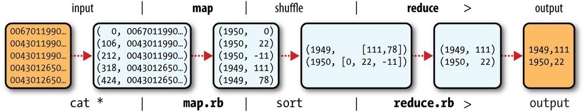
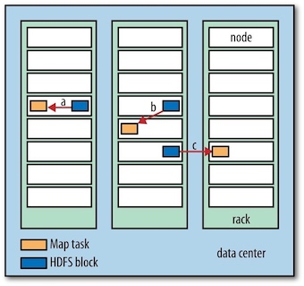

### **Hadoop: The Definitive Guide 2 - MapReduce**

MapReduce is a programming model for data processing. MapReduce programs are inherently parallel, thus putting very large-scale data analysis into the hands of anyone with enough machines at their disposal.

### 1 A Weather Dataset

For our example, we will write a program that mines weather data. The data we will use is from the National Climatic Data Center. It is stored using a line-oriented ASCII format, in which each line is a record.

#### Analyzing the Data with Hadoop

MapReduce works by breaking the processing into two phases: the map phase and the reduce phase. Each phase has key-value pairs as input and output, the types of which may be chosen by the programmer. The programmer also specifies two functions: the map function and the reduce function.


MAPINPUT:

* Key: the offset of the beginning of the line from the beginning of the file. (no need here, just ignore it)
* Value: raw NCDC data

```text
(0, 0067011990999991950051507004…9999999N9+00001+99999999999…) 
(106, 0043011990999991950051512004…9999999N9+00221+99999999999…) 
(212, 0043011990999991950051518004…9999999N9-00111+99999999999…) 
(318, 0043012650999991949032412004…0500001N9+01111+99999999999…) 
(424, 0043012650999991949032418004…0500001N9+00781+99999999999…)
```

MAPOUTPUT: 

* The map function merely extracts the year and the air temperature , and emits them as output.
* Key: year
* Calue: air temperature

```text
(1950, 0)
(1950, 22) 
(1950, −11) 
(1949, 111) 
(1949, 78)
```

The output from the map function is processed by the MapReduce framework *before* being sent to the reduce function. This processing ***sorts*** and ***groups*** the key-value pairs by key.

```text
(1949, [111, 78]) 
(1950, [0, 22, −11])
```

All the reduce function has to do now is iterate through the list and pick up the maximum reading:

```text
(1949, 111) 
(1950, 22)
```



#### Java MapReduce

We need three things: a map function, a reduce function, and some code to run the job. 


<hh>Map</hh>

The map function is represented by the <C>Mapper</C> class, which declares an abstract <C>map()</C> method.


The <C>Mapper</C> class is a generic type, with four formal type parameters that specify the input key, input value, output key, and output value types of the map function.

```Java
public class Mapper<KEYIN, VALUEIN, KEYOUT, VALUEOUT> {}
```


Rather than using built-in Java types, Hadoop provides its own set of basic types that are optimized for network serialization. These are found in the <C>org.apache.hadoop.io</C> package.

Here we use <C>LongWritable</C>, which corresponds to a Java <C>Long</C>, <C>Text</C> (like Java <C>String</C>), and <C>IntWritable</C> (like Java <C>Integer</C>).

```Java
import org.apache.hadoop.io.IntWritable;
import org.apache.hadoop.io.LongWritable;
import org.apache.hadoop.io.Text;
import org.apache.hadoop.mapreduce.Mapper;
import java.io.IOException;

public class MaxTemperatureMapper
        extends Mapper<LongWritable, Text, Text, IntWritable> {

    private static final int MISSING = 9999;

    @Override
    protected void map(LongWritable key, Text value, Context context)
            throws IOException, InterruptedException {
        String line = value.toString();
        String year = line.substring(15, 19);
        int airTemperature;
        if (line.charAt(87) == '+'){ //parseInt doesn't like leading plus signs
            airTemperature = Integer.parseInt(line.substring(88, 92));
        } else {
            airTemperature = Integer.parseInt(line.substring(87, 92));
        }

        String quality = line.substring(92, 93);
        if (airTemperature != MISSING && quality.matches("[01459]]")) {
            context.write(new Text(year), new IntWritable(airTemperature));
        }
    }
}
```

<hh>Reduce</hh>

The reduce function is similarly defined using a <C>Reducer</C>.

```Java
import org.apache.hadoop.io.IntWritable;
import org.apache.hadoop.io.Text;
import org.apache.hadoop.mapreduce.Reducer;

import java.io.IOException;

public class MaxTemperatureReducer
        extends Reducer<Text, IntWritable, Text, IntWritable> {

    @Override
    protected void reduce(Text key, Iterable<IntWritable> values, Context context) throws IOException, InterruptedException {
        int maxValue = Integer.MIN_VALUE;
        for (IntWritable value : values) {
            maxValue = Math.max(maxValue, value.get());
        }
        context.write(key, new IntWritable(maxValue));

    }
}
```

<hh>MapReduce Job</hh>


The third piece of code runs the MapReduce job

```Java
import org.apache.hadoop.fs.Path;
import org.apache.hadoop.io.IntWritable;
import org.apache.hadoop.io.Text;
import org.apache.hadoop.mapreduce.Job;
import org.apache.hadoop.mapreduce.lib.input.FileInputFormat;
import org.apache.hadoop.mapreduce.lib.output.FileOutputFormat;

public class MaxTemperature {

    public static void main(String[] args)
        throws Exception {
        if (args.length != 2) {
            System.err.println("Usage: MaxTempeature <intput path> <output path>");
            System.exit(-1);
        }

        Job job = new Job();
        job.setJarByClass(MaxTemperature.class);
        job.setJobName("Max Temperature");
        FileInputFormat.addInputPath(job, new Path(args[0]));
        FileOutputFormat.setOutputPath(job, new Path(args[1]));
        job.setMapperClass(MaxTemperatureMapper.class);
        job.setReducerClass(MaxTemperatureReducer.class);
        job.setOutputKeyClass(Text.class);
        job.setOutputValueClass(IntWritable.class);
        System.exit(job.waitForCompletion(true) ? 0 : 1);
    }
}
```
A <C>Job</C> object forms the specification of the job and gives you control over how the job is run.

Rather than explicitly specifying the name of the JAR file, we can pass a class in the Job’s <C>setJarByClass()</C> method, which Hadoop will use to locate the relevant JAR file by looking for the JAR file containing this class.


<hh>A test run</hh>

```bash
$ export HADOOP_CLASSPATH=/Users/larry/JavaProject/out/artifacts/MaxTemperature/MaxTemperature.jar 
$ hadoop com.definitivehadoop.weatherdata.MaxTemperature resources/HadoopBook/ncdc/sample.txt output
```

When the <C>hadoop</C> command is invoked with a classname as the first argument, it launches a Java virtual machine (JVM) to run the class. The <C>hadoop</C> command adds the Hadoop libraries (and their dependencies) to the classpath and picks up the Hadoop configuration, too. To add the application classes to the classpath, we’ve defined an environment variable called <C>HADOOP_CLASSPATH</C>, which the <C>hadoop</C> script picks up.

<font size=0.6em>
```text
//OUTPUT 
18:20:18,944 INFO mapreduce.Job: Counters: 30
        File System Counters
                FILE: Number of bytes read=148485300
                FILE: Number of bytes written=150614384
                FILE: Number of read operations=0
                FILE: Number of large read operations=0
                FILE: Number of write operations=0
        Map-Reduce Framework
                Map input records=5
                Map output records=0
                Map output bytes=0
                Map output materialized bytes=6
                Input split bytes=131
                Combine input records=0
                Combine output records=0
                Reduce input groups=0
                Reduce shuffle bytes=6
                Reduce input records=0
                Reduce output records=0
                Spilled Records=0
                Shuffled Maps =1
                Failed Shuffles=0
                Merged Map outputs=1
                GC time elapsed (ms)=5
                Total committed heap usage (bytes)=406847488
        Shuffle Errors
                BAD_ID=0
                CONNECTION=0
                IO_ERROR=0
                WRONG_LENGTH=0
                WRONG_MAP=0
                WRONG_REDUCE=0
        File Input Format Counters 
                Bytes Read=529
        File Output Format Counters 
                Bytes Written=8
```
</font>


The last section of the output, titled “Counters,” shows the statistics that Hadoop generates for each job it runs. These are very useful for checking whether the amount of data processed is what you expected.


### 2 Scaling Out

To scale out, we need to store the data in a distributed filesystem (typically HDFS). This allows Hadoop to move the MapReduce computation to each machine hosting a part of the data, using Hadoop’s resource management system, YARN.

#### Data Flow

A MapReduce ***job*** (作业) is a unit of work that the client wants to be performed: it consists of the input data, the MapReduce program, and configuration information. Hadoop runs the job by dividing it into ***tasks*** (任务), of which there are two types: ***map tasks*** and ***reduce tasks***. The tasks are scheduled using YARN and run on nodes in the cluster.

Hadoop divides the input to a MapReduce job into fixed-size pieces called ***input splits*** (输入分片), or just ***splits*** (分片). Hadoop creates one map task for each split, which runs the user-defined map function for each record in the split.

So if we are processing the splits in parallel, the processing is better load balanced when the splits are small. On the other hand, if splits are too small, the overhead of managing the splits and map task creation begins to dominate the total job execution time.

Hadoop does its best to run the map task on a node where the input data resides in HDFS, because it doesn’t use valuable cluster bandwidth. This is called the ***data locality optimization*** (数据本地优化).




Map tasks write their output to the local disk, not to HDFS. Why is this? ***Map output is intermediate output:*** it’s processed by reduce tasks to produce the final output, and once the job is complete, the map output can be thrown away. So, storing it in HDFS *with replication* would be overkill.

The data flow for the general case of multiple reduce tasks is illustrated in figure below. This diagram makes it clear why the data flow between map and reduce tasks is colloquially known as “the shuffle,” as each reduce task is fed by many map tasks.


#### Combiner Functions

Many MapReduce jobs are limited by the bandwidth available on the cluster, so it pays to minimize the data transferred between map and reduce tasks. Hadoop allows the user to specify a ***combiner*** function to be run on the map output, and the combiner function’s output forms the input to the reduce function.


For max temperature problem described above, the combiner function is the same implementation as the reduce function in <C>MaxTemperatureReducer</C>. The only change we need to make is to set the combiner class on the Job.

```Java
job.setMapperClass(MaxTemperatureMapper.class);
job.setCombinerClass(MaxTemperatureReducer.class);
job.setReducerClass(MaxTemperatureReducer.class);
```

A part of output information for running <C>MaxTemperatureReducer</C> is:

```text
Map input records=5
                Map output records=5
                Map output bytes=45
                Map output materialized bytes=28
                Input split bytes=131
                Combine input records=5
                Combine output records=2
                Reduce input groups=2
                Reduce shuffle bytes=28
                Reduce input records=2
                Reduce output records=2
```

### 3 Hadoop Streaming

Hadoop provides an API to MapReduce that allows you to write your map and reduce functions in languages other than Java. Hadoop Streaming uses Unix standard streams (Unix标准流) as the interface between Hadoop and your program, so you can use any language that can read standard input and write to standard output to write your MapReduce program.

Streaming is naturally suited for text processing. Map input data is passed over standard input to map function. A map output key-value pair is written as a single tab-delimited line. The reduce function reads lines from standard input, which the framework guarantees are sorted by key, and writes its results to standard output.

Here, We take Python as an example.

#### Python

```Python fct_label="map"
#!/Users/larry/anaconda3/bin/python
import re
import sys

for line in sys.stdin:
  val = line.strip()
  (year, temp, q) = (val[15:19], val[87:92], val[92:93])
  if (temp != "+9999" and re.match("[01459]", q)):
    print("%s\t%s"%(year, temp))
```

```Python fct_label="reduce"
#!/Users/larry/anaconda3/bin/python

import sys

(last_key, max_val) = (None, -sys.maxsize)
for line in sys.stdin:
  (key, val) = line.strip().split("\t")
  if last_key and last_key != key:
    print("%s\t%s"%(last_key, max_val))
    (last_key, max_val) = (key, int(val))
  else:
    (last_key, max_val) = (key, max(max_val, int(val)))

if last_key:
  print("%s\t%s"%(last_key, max_val))
```

For example, to run a test:

```bash
$ cat sample.txt | ./max_temperature_map.py | sort | ./max_temperature_reduce.py
1949 111 
1950 22
```

The <C>hadoop</C> command doesn’t support a Streaming option; instead, you specify the Streaming JAR file along with the <C>jar</C> option. Options to the Streaming program specify the input and output paths and the map and reduce scripts.

```bash
$hadoop jar $HADOOP_HOME/share/hadoop/tools/lib/hadoop-streaming-3.1.0.jar \
-input sample.txt \
-output output \
-mapper max_temperature_map.py \
-reducer max_temperature_reduce.py
```

