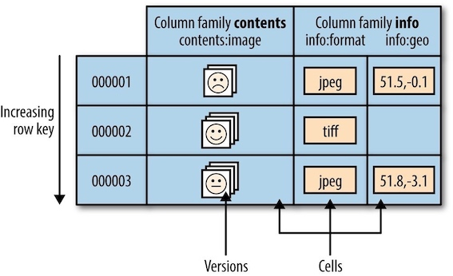

### **Hadoop: The Definitive Guide 20 - HBase**


> Use Apache HBase™ when you need **random**, **realtime** read/write access to your Big Data. It's goal is the hosting of **very large** tables -- billions of rows X millions of columns -- atop clusters of commodity hardware. Apache HBase is an open-source, distributed, versioned, non-relational database modeled after Google's Bigtable. [[Apache HBase](Use Apache HBase™ when you need random, realtime read/write access to your Big Data. This project's goal is the hosting of very large tables -- billions of rows X millions of columns -- atop clusters of commodity hardware. Apache HBase is an open-source, distributed, versioned, non-relational database modeled after Google's Bigtable:)]


### 0 Getting Started

From [Apache HBase ™ Reference Guide](http://hbase.apache.org/book.html#quickstart)

The `bin/start-hbase.sh` script is provided as a convenient way to start HBase. Before start, make sure to start Hadoop hdfs, yarn, and zookeeper.

```bash
start-all.sh #hdfs, yarn
zkServer.sh start # zookeeper
```

### 1 Concepts

#### Whirlwind Tour of the Data Model

Applications store data in labeled tables. Tables are made of rows and columns. Table cells — the intersection of row and column coordinates — are versioned. By default, their version is a timestamp auto-assigned by HBase at the time of cell insertion. A cell’s content is an uninterpreted array of bytes.



Table row keys are also byte arrays, so theoretically anything can serve as a row key, from strings to binary representations of long or even serialized data structures. Table rows are sorted by row key, aka the table’s primary key. The sort is byte-ordered. All table accesses are via the primary key.

Row columns are grouped into ***column families***. All column family members have a common prefix, so, for example, the columns info:format and info:geo are both members of the info column family, whereas contents:image belongs to the contents family.

In synopsis, HBase tables are like those in an RDBMS, only cells are versioned, rows are sorted, and columns can be added on the fly by the client as long as the column family they belong to preexists.

<hh>Regions</hh>

Tables are automatically partitioned horizontally by HBase into ***regions***. Each region comprises a subset of a table’s rows. A region is denoted by the table it belongs to, its first row (inclusive), and its last row (exclusive). Initially, a table comprises a single region, but as the region grows it eventually crosses a configurable size threshold, at which point it splits at a row boundary into two new regions of approximately equal size. Until this first split happens, all loading will be against the single server hosting the original region. As the table grows, the number of its regions grows. Regions are the units that get distributed over an HBase cluster.

<hh>Locking</hh>

Row updates are atomic, no matter how many row columns constitute the row-level transaction. This keeps the locking model simple.

#### Implementation

HBase made up of an HBase *master* node orchestrating a cluster of one or more *regionserver* workers. The HBase master is responsible for bootstrapping a virgin install, for assigning regions to registered regionservers, and for recovering regionserver failures. The regionservers carry zero or more regions and field client read/write requests.


### Clients

#### Java
