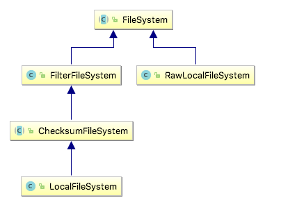
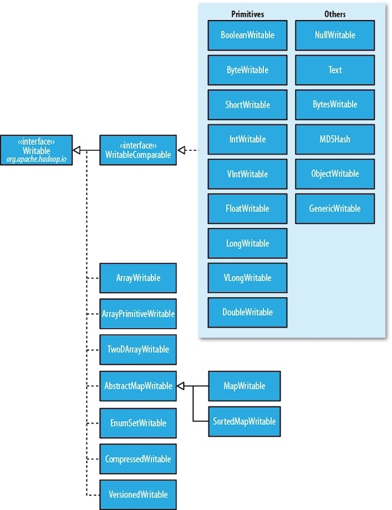
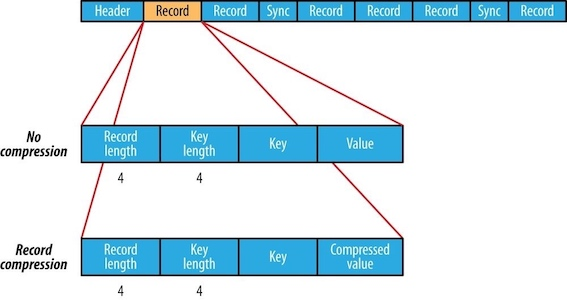

### **Hadoop: The Definitive Guide 5 - Hadoop I/O**

### 1 Data Integrity

The usual way of detecting corrupted data is by computing a *checksum*(校验和) for the data when it first enters the system, and again whenever it is transmitted across a channel that is unreliable and hence capable of corrupting the data.

A commonly used error-detecting code is CRC-32 (32-bit cyclic redundancy check, 循环冗余校验), which computes a 32-bit integer checksum for input of any size. CRC32 is used for checksumming in Hadoop's <C>checksumFileSystem</C>, while HDFS uses a more efficient variant called CRC-32C.


#### Data Integrity in HDFS

HDFS transparently checksums all data written to it and by default verifies checksums when reading data. A separate checksum is created for every <C>ChecksumFileSystem.bytesPerChecksum</C>(default 512) bytes of data.

Datanodes are responsible for verifying the data they receive before storing the data and its checksum. When clients read data from datanodes, they verify checksums as well.

In addition to block verification on client reads, each datanode runs a <C>DataBlockScanner</C> in a background thread that *periodically* verifies all the blocks stored on the datanode.

You can find a file’s checksum with <C>hadoop fs -checksum</C>.

#### LocalFileSystem

The Hadoop <C>LocalFileSystem</C> performs client-side checksumming. It is possible to disable checksums, by using <C>RawLocalFileSystem</C> in place of <C>LocalFileSystem</C>.


#### ChecksumFileSystem


<C>LocalFileSystem</C> extends <C>ChecksumFileSystem</C>, and <C>ChecksumFileSystem</C> is also a wrapper around <C>FileSystem</C> (uses [decorator pattern](http://larryim.cc/note-os/hfdp/ch3/#2-decorator-pattern) here). The general idiom is as follows:

```Java
FileSystem rawFs = ...
FileSystem checksummedFs = new ChecksumFileSystem(rawFs);
```





### 2 Compression

File compression brings two major benefits: it **reduces the space** needed to store files, and it **speeds up data transfer** across the network or to or from disk. When dealing with large volumes of data, both of these savings can be significant.

A summary of compression formats:


| Compression format | Tools | Algorithm | File Extension | CompressionCodec | Splittable? |
| --- | --- | --- | --- | --- | --- |
| DEFLATE | N/A | DEFLATE | .deflate | DefaultCodec | No |
| gzip | gzip | DEFLATE | .gz | GzipCodec | No |
| bzip2 | bzip2 | bzip2 | .bz2 | BZip2Codec | Yes |
| LZO | lzop | LZO | .lzo | LzoCodec | No |
| Snappy | N/A | Snappy | .snappy | SnappyCodec | No |

All compression algorithm exhibit a space/time trade-off. Splittable compression formats are especially suitable for MapReduce.

#### Codecs

A *codec* is the implementation of a compression-decompression algorithm. In Hadoop, a codec is represented by an implementation of the <C>CompressionCodec</C> interface. So, for example, <C>GzipCodec</C> encapsulates the compression and decompression algorithm for gzip.

<hh>Compressing and decompressing streams with CompressionCodec</hh>


<C>Interface CompressionCodec </C> has two methods that allow you to easily compress or decompress data. 

* To compress data being written to an output stream, use the <C>createOutputStream(OutputStream out)</C> method to create a <C>CompressionOutputStream</C>
* Conversely, to decompress data being read from an input stream, call <C>createInputStream(InputStream in)</C> to obtain a <C>CompressionInputStream</C>.


The code below illustrates how to use the API to compress data read from standard input and write it to standard output.


```Java
import org.apache.hadoop.conf.Configuration;
import org.apache.hadoop.io.IOUtils;
import org.apache.hadoop.io.compress.CompressionCodec;
import org.apache.hadoop.io.compress.CompressionOutputStream;
import org.apache.hadoop.util.ReflectionUtils;

// vv StreamCompressor
public class StreamCompressor {

    public static void main(String[] args) throws Exception {
        String codecClassname = args[0];
        Class<?> codecClass = Class.forName(codecClassname);
        Configuration conf = new Configuration();
        CompressionCodec codec = (CompressionCodec)
                ReflectionUtils.newInstance(codecClass, conf);

        CompressionOutputStream out = codec.createOutputStream(System.out);
        IOUtils.copyBytes(System.in, out, 4096, false);
        out.finish();
    }
}
```

We can try it out with the following command line, which compresses the string “Text” using the <C>StreamCompressor</C> program with the <C>GzipCodec</C>, then decompresses it from standard input using <C>gunzip</C>:

```bash
export HADOOP_CLASSPATH=/Users/larry/JavaProject/out/artifacts/StreamCompressor/StreamCompressor.jar
echo "Text" | hadoop com.definitivehadoop.compression.StreamCompressor org.apache.hadoop.io.compress.GzipCodec | gunzip 
```

<hh>Inferring CompressionCodecs using CompressionCodecFactory</hh>

<C>CompressionCodecFactory</C> provides a way of mapping a filename extension to a <C>CompressionCodec</C> using its <C>getCodec()</C> method, <C>CodecPool</C>.

If you are using a native library and you are doing a lot of compression or decompression in your application, consider using <C>CodecPool</C>, which allows you to reuse compressors and decompressors, thereby amortizing the cost of creating these objects.

#### Compression and Input Splits

If a compressed file using a format that does not support splitting, say gzip format, MapReduce will not try to split the gzipped file, at the expense of locality: a single map will process all blocks containing the file, most of which will not be local to the map.

For an LZO file, in spite of not supporting splitting, it is possible to preprocess LZO files using an indexer tool that comes with the Hadoop LZO libraries. 

#### Using Compression in MapReduce

In order to compress the output of a MapReduce, job you can use the static convenience methods on <C>FileOutputFormat</C> to set properties.

Application to run the maximum temperature job producing compressed output:

```Java fct_label="MaxTemperatureWithCompression"
public class MaxTemperatureWithCompression {
    public static void main(String[] args) throws Exception {
        if (args.length != 2) {
            System.err.println("Usage: MaxTemperatureWithCompression <input path> " +
                    "<output path>");
            System.exit(-1);
        }

        Job job =  Job.getInstance();
        job.setJarByClass(com.definitivehadoop.weatherdata.MaxTemperature.class);

        FileInputFormat.addInputPath(job, new Path(args[0]));
        FileOutputFormat.setOutputPath(job, new Path(args[1]));

        job.setOutputKeyClass(Text.class);
        job.setOutputValueClass(IntWritable.class);

        /*[*/
        FileOutputFormat.setCompressOutput(job, true);
        FileOutputFormat.setOutputCompressorClass(job, GzipCodec.class);/*]*/

job.setMapperClass(com.definitivehadoop.weatherdata.MaxTemperatureMapper.class);
job.setCombinerClass(com.definitivehadoop.weatherdata.MaxTemperatureReducer.class);
job.setReducerClass(com.definitivehadoop.weatherdata.MaxTemperatureReducer.class);

        System.exit(job.waitForCompletion(true) ? 0 : 1);
    }
}
//^^ MaxTemperatureWithCompression

```

```bash fct_label="usage"
$ export HADOOP_CLASSPATH=/Users/larry/JavaProject/out/artifacts/MaxTemperatureWithCompression/MaxTemperatureWithCompression.jar
$ hadoop com.definitivehadoop.compression.MaxTemperatureWithCompression /Users/larry/JavaProject/resources/HadoopBook/ncdc/sample.txt output
```

### 3 Serialization

See concepts of serialization and deserialization in Head First Java [Chapter 14](http://larryim.cc/note-os/hfj/ch14) .

*Serialization* is the process of turning structured objects into a byte stream for transmission over a network or for writing to persistent storage. *Deserialization* is the reverse process of turning a byte stream back into a series of structured objects.


Serialization is used in two quite distinct areas of distributed data processing: for **interprocess communication** and for **persistent storage**.


In Hadoop, interprocess communication between nodes in the system is implemented using remote procedure calls (RPCs). The RPC protocol uses serialization to render the message into a binary stream to be sent to the remote node, which then deserializes the binary stream into the original message. In general, four desirable properties are crucial for an RPC serialization and persistent storage:


| Properties | PRC Serialization | Persistent Storage |
| --- | --- | --- |
| Compact | makes the best use of network bandwidth | make efficient use of storage space |
| Fast | little performance overhead | little overhead in reading or writing |
| Extensible | meet new requirements | transparently read data of older formats |
| Interoperable | support clients written in different languages | read/write using different languages |


Hadoop uses its own serialization format, <C>Writables</C>, which is certainly compact and fast, but not so easy to extend or use from languages other than Java. Avro, a serialization system that was designed to overcome some of the limitations of <C>Writables</C>, is covered in [Chapter 12](ch12.md).

#### The Writable Interface

The <C>Writable</C> interface defines two methods — one for writing its state to a <C>DataOutput</C> binary stream and one for reading its state from a <C>DataInput</C> binary stream (note: <C>DataOutput</C> and <C>DataInput</C> are also inferfaces):

```Java
package org.apache.hadoop.io;

import java.io.DataOutput; 
import java.io.DataInput; 
import java.io.IOException;

public interface Writable { 
    void write(DataOutput out) throws IOException; 
    void readFields(DataInput in) throws IOException; 
}
```


#### Writable Classes

<hh>Writable wrappers for Java primitives</hh>

There are <C>Writable</C> wrappers for all the Java primitive types except <C>char</C> (which can be stored in an <C>IntWritable</C>). All have a <C>get()</C> and <C>set()</C> method for retrieving and storing the wrapped value.



When it comes to encoding integers, there is a choice between the fixed-length formats (<C>IntWritable</C> and <C>LongWritable</C>) and the variable-length formats (<C>VIntWritable</C> and <C>VLongWritable</C>). Fixed-length encodings are good when the distribution of values is fairly uniform across the whole value space, such as when using a (well-designed) hash function. Most numeric variables tend to have nonuniform distributions, though, and on average, the variable-length encoding will save space.

<hh>Text</hh>

<C>Text</C> is a Writable for UTF-8 sequences. It can be thought of as the Writable equivalent of <C>java.lang.String</C>.

Indexing for the <C>Text</C> class is in terms of position in the encoded byte sequence, not the Unicode character in the string or the Java <C>char</C> code unit (as it is for <C>String</C>). For ASCII strings, these three concepts of index position coincide.

Another difference from <C>String</C> is that <C>Text</C> is mutable. You can reuse a <C>Text</C> instance by calling one of the <C>set()</C> methods on it.

```Java
Text t = new Text("hadoop"); t.set("pig");
```

<C>Text</C> doesn’t have as rich an API for manipulating <C>java.lang.String</C>, so in many cases, you need to convert the <C>Text</C> object to a <C>String</C>: `:::Java Text("hadoop").toString()`

#### Implementing a Custom Writable

!!!tip
    If you are considering writing a custom <C>Writable</C>, it may be worth trying another serialization framework, like Avro, that allows you to define custom types declaratively.


#### Serialization Frameworks

Any type can be used to serialize, because Hadoop has an API for pluggable serialization frameworks, which is represented by an implementation of <C>Serialization</C>. For instance, <C>WritableSerialization</C>, is the implementation of <C>Serialization</C> for <C>Writable</C> types; <C>AvroSerialization</C>, is the implementation of <C>Serialization</C> for <C>Avro</C> types.


```Java
public class WritableSerialization extends Configured
	implements Serialization<Writable>
public abstract class AvroSerialization<T> extends Configured 
	implements Serialization<T>
```

A <C>Serialization</C> defines a mapping from types to <C>Serializer</C> instances (for turning an object into a byte stream) and <C>Deserializer</C> instances (for turning a byte stream into an object).


```Java
public interface Serialization<T> {
  // Allows clients to test whether this  Serialization
  // supports the given class.
  boolean accept(Class<?> c);
  // @return a {@link Serializer} for the given class.
  Serializer<T> getSerializer(Class<T> c);
  //return a {@link Deserializer} for the given class.
  Deserializer<T> getDeserializer(Class<T> c);
}
```

!!! note
    Although it makes it convenient to be able to use standard Java types such as <C>Integer</C> or <C>String</C> in <C>MapReduce</C> programs, Java Object Serialization is not as efficient as <C>Writables</C>, so it’s not worth making this trade-off.

<hh>Serialization IDL</hh>

Apache Thrift and Google Protocol Buffers are both popular serialization frameworks, and both are commonly used as a format for persistent binary data. Avro is an IDL-based serialization framework designed to work well with large-scale data processing in Hadoop.

### 4 File-Based Data Structures

For some applications, you need a specialized data structure to hold your data. For doing MapReduce-based processing, putting each blob of binary data into its own file doesn’t scale, so Hadoop developed a number of higher-level containers for these situations.


#### SequenceFile

Hadoop’s <C>SequenceFile</C> provides a persistent data structure for binary key-value pairs. It is suitable for a log file, where each log record is a new line of text. To use it as a logfile format, you would choose a key, such as timestamp represented by a <C>LongWritable</C>, and the value would be a <C>Writable</C> that represents the quantity being logged.

<hh>Writing a SequenceFile</hh>

To create a <C>SequenceFile</C>, use one of its <C>createWriter()</C> static methods, which return a <C>SequenceFile.Writer</C> instance. Then write key-value pairs using the <C>append()</C> method. When you’ve finished, you call the <C>close()</C> method.

<hh>Displaying a SequenceFile with the command-line interface</hh>

The hadoop <C>fs</C> command has a <C>-text</C> option to display sequence files in textual form.

```Java
% hadoop fs -text numbers.seq | head
```

<hh>The SequenceFile format</hh>

A sequence file(顺序文件) consists of a header followed by one or more records. The sync marker(同步标识) is used to allow a reader synchronize to a record boundary from any position in the file, which incurs less than a 1% storage overhead.





The internal format of the records depends on whether compression is enabled, and if it is, whether it is record compression(记录压缩) or block compression(块压缩).

The format for record compression is almost identical to that for no compression, except the value bytes are compressed using the codec defined in the header. Note that keys are not compressed.


Block compression compresses multiple records at once; it is therefore more compact than and should generally be preferred over record compression because it has the opportunity to take advantage of similarities between records. A sync marker is written before the start of every block. The format of a block is a field indicating the number of records in the block, followed by four compressed fields: the key lengths, the keys, the value lengths, and the values.

#### MapFile

A <C>MapFile</C> is a sorted <C>SequenceFile</C> with an index to permit lookups by key. The index is itself a <C>SequenceFile</C> that contains a fraction of the keys in the map.