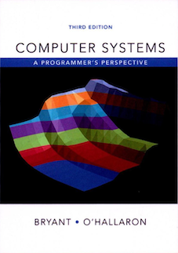
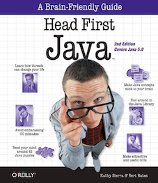
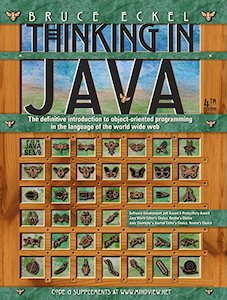

### **Books and Materials**

The following is the primary reading list of books. Each chapter is organized as a single page; the included sections are noted with major concepts, and summary.

### Operating System

#### [CSAPP](os/csapp/index.md)

Computer System: A Programmer's Perspective, 3rd Edition

<small>by Randal E. Bryant and David A. O'Hallaron</small>

#### [OSC](os/osc/index.md)

")

Operating System Concepts (10th Edition)

<small>by Silberschatz Abraham, Galvin, Peter B., Gagne, Greg</small>

### DataBase

#### [MySQL](mysql/index.md)

Learning MySQL and MariaDB

<small>by Russell Dyer</small>

### Java

#### [HFJ](java/hfj/index.md)

Head first java, 2nd Edition

<small>by Kathy Sierra and Bert Bates</small>

#### [TIJ](java/tij/index.md)

Thinking in Java, 4th Edition

<small>by Bruce Eckel</small>

#### [UJVM](java/ujvm/index.md)

深入理解Java虚拟机, 2nd Edition

<small>by 周志明</small>

### BigData

#### [Hadoop](bigdata/hadoop/index.md)

Hadoop: The Definitive Guide, 4th Edition

<small>by Tom White</small>

#### [Spark](bigdata/spark/index.md)

Learning Spark: Lighting-Fast Data Analysis

<small>by Tom White</small>

#### [GDM](bigdata/datamining/index.md)

A Programmer's Guide to Data Mining

<small>by Ron Zacharski</small>

### Algorithm

#### [Algorithm, Princeton](algorithm/algorithmPrinceton/index.md)

Algorithm, 4th Edition

<small>by Robert Sedgewick and Kevin Wayne</small>

### Materials

#### [CS61B](algoritm/cs61b/index.md)

CS61B Data Structures, Berkeley

<small>Instructor: Josh Hug</small>