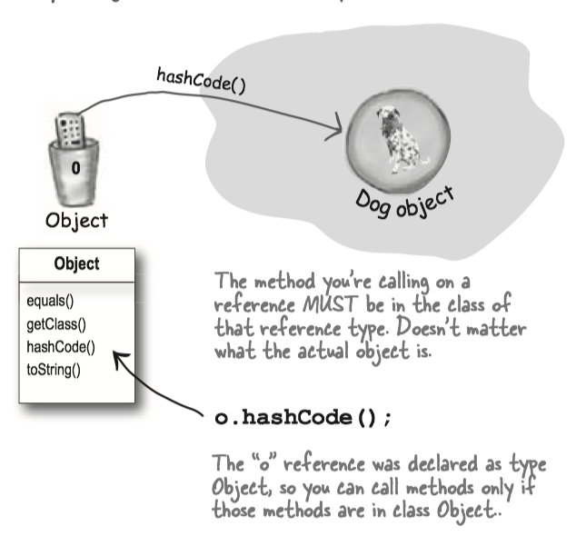
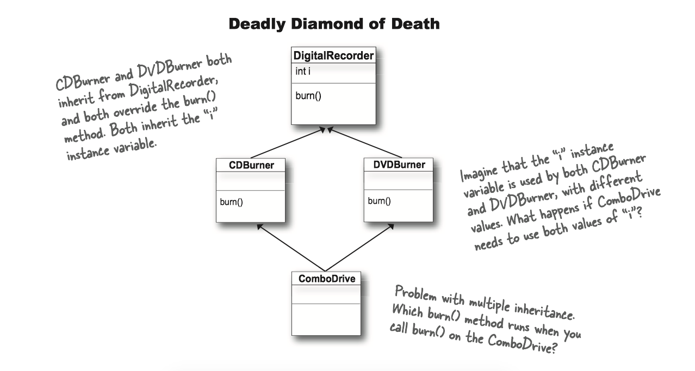

### **Chapter 8 Interfaces and Abstract Classes**

<big>

* What's an interface? it's a 100% abstract class. 
* What's an abstract class? it's a class that can't be instantiated.

</big>

### 1 Abstract classes

Here's where it gets weird:

```Java
Animal anim = new Animal(); 
```
There two are the same type, but what the heck does an Animal object look like?

**Some classes just should not be instantiated!**
How?  By marking the class as **abstract**, the compiler will stop any code, anywhere, from ever creating an instance of that type. i.e. prevent a class from ever being instantiated.

Making a class abstract before the class declaration:

```Java
abstract class Caine extends Animal {
    public void roam() {}
}
```

When you're designing your class inheritance structure, you have to decide which classes are *abstract* and which are *concrete*. 

* **Concrete** classes are those that are specific enough to be instantiated. 
* A **concrete** class just means that it's OK to make objects of that type.
* An **abstract class** has virtually no use, no value, no purpose in life, unless it is extended.

### 2 Abstract methods

An **abstract method** means the method must be **overriden**, whereas an abstract class means the class must be extended.

* There isn't any code that would make sense in the abstract method, you won't put in a method body. e.g. `:::Java  public abstract void eat()`.
* If you declare an abstract method, you must mark the class abstract as well. You can't have an abstract method in a non-abstract class.
* You must implement all abstract methods.

### 3 The ultimate superclass: `Object`

Every class in Java extends class `Object`. Class `Object` is the mother of all classes; it's the superclass of everything. 

* Any class that doesn't *explicitly* extend another class, *implicitly* extends `Object`.

Methods of `Object` class:

* `:::Java equals()`: tell you if two objects are considered equal.
* `:::Java getClass()`: Gives you back the class that object was instantiated from.
* `:::Java hashCode()`: Prints out a hashcode for the object
* `:::Java toString()`: Prints out a String message with the name of the class and some other number we rarely care about.

`Object` is a **non-abstract** class because it's got method implementation code that all classes can inherit and use out-of-box, without having to override the methods.

The `Object` class serves two main purpose:

* To act as a polymorphic type for methods that need to work on any class that you or anyone else makes 作为方法的多态类型
* To provide real method code that all objects in Java need at runtime (and putting them in class Object means all other classes inherit them).提供Java在执行期堆任何对象都有需要的实现方法代码。

### 4 Using polymorphic references of type Object has a price

When you put an object into an `:::Java ArrayList<Dog>`, it goes in as a Dog, and comes out as a Dog:

```Java
// Make an ArrayList declared to hold Dog objects.
ArrayList<Dog> myDogArrayList = new ArrayList<Dog>();
// Make a Dog
Dog aDog = new Dog();
// Add the Dog to the list
myDogArrayList.add(aDog);
//Assign the Dog from the list to a new Dog reference variable
Dog d = myDogArrayList.get(0);
```
**Everything comes out of an `ArrayList<Object>` as a reference of type Object, regardless of what the actual object is.** 任何从`:::Java ArrayList<Object>`取出的东西都会被当作Object类型的引用，而不管它原来是什么。

```Java
// make an ArrayList declared to hold any type of Object
ArrayList<Object> myDogArrayList = new ArrayList<object>()
// make a Dog
Dog aDog = new Dog();
// Add the Dog to the list
myDogArrayList.add(aDog);
// No!! Won't compile!! the get() method returns type Object.
// The compiler knows only that the object inherits from Object,
// but it doesn't know it's a Dog!!
Dog d = myDogArrayList.get(0)
```


**The compiler decides whether you can call a method based on the _reference type_ , not the actual object type.**

```Java
Object o = al.get(index);
// Class Object has a hashCode() method
// so you can call that method on any object in Java
int i = o.hashCode();
// Can't do this!! the Object class  has no idea what it means to bark().
o.bark();
```



If you're sure the object is really a Dog, you can make a new Dog reference to it by copying the Object reference, and forcing that copy to go into a Dog reference variable, using a `cast (Dog)`.

```Java
Object o = al.get(index);
// cast the Object back to a Dog we know is there.
Dog d = (Dog) o; 
d.roam();
```

If you're not sure it's a Dog, you can use the `instanceof` operator to check.

```Java
if (o instanceof Dog) {
    Dog d = (Dog) o;
}
``` 

!!! note
    Java中的instanceof 算符是用来在运行时指出对象是否是特定类的一个实例。instanceof通过返回一个布尔值来指出，这个对象是否是这个特定类或者是它的子类的一个实例。`:::Java result = object instanceof class`


### 5 Interface

Questions: What if you want to add Dog some Pet behaviors?

* Option one: We take the easy path, and put pet method in class Animal.
    * Pros: All the Animals will instantly inherit the pet behaviors. We won't have to touch the existing Animal subclasses at all.
    * Cons: Some animals like lion, wolf are not a pet. Non-pet Animals running around with pet methods.

* Option two: We start with option one, putting the pet methods in class Animal, but we make the methods abstract.
    * Pros: All classes must override the methods, but they can make the methods "do-nothings".
    * Cons: Waste a lot of time to implement every concrete Animal subclasses.
* Options three: Put the pet methods Only in the classes where they belong.
    * Pros: The methods are where they belong, and only where they belong.
    * Cons: Firstly, you'd have to agree to a protocol, and all programmers of pet Animal classes now and in the future would have to know about the protocol. Secondly, you don't get to use polymorphism for the pet methods 

It looks like we need two superclasses at the top.


It’s called "**multiple inheritance**"(多重继承) and it can be a Really Bad Thing. Because multiple inheritance has a problem known as **The Deadly Diamond of Death**(致命的死亡砖石)



Java的方案: Interface!!!

* A Java **interface**(接口) solves multiple inheritance problem by giving you much of the polymorphic benefits of multiple inheritance without the pain and suffering from the Deadly Diamond of Death.

How?

* Surprisingly simple: <big><b><i>make all the methods abstract</i></b></big>
* A Java interface is like a 100% pure abstract class.

To define an interface, use the keyword `interface` instead of `class.`

```java
//use the keyword "interface" instead of "class"
public interface Pet {}
```

To implement an interface, use the keyword `implements` followed by the interface name:

```java
// Use the keyword "implements" followed by the interface name.
public class Dog extends Canine implements Pet {}
```

A class can implement *multiple* interfaces!

```java
public class Dog extends Animal implements Pet, Saveable, Paintable {}
```


Classes from *different* inheritance trees can implement the *same* interface.


How do you know whether to make a class, subclass, an abstract class, or an interface?

* Make a class that doesn’t extend anything (other than Object) when your new class doesn’t pass the IS-A test for any other type.
* Make a subclass (in other words, extend a class) only when you need to make a ***more specific*** version of a class and need to override or add new behaviors.
* Use an abstract class when you want to define a ***template*** for a group of subclasses, and you have at least some implementation code that all subclasses could use. Make the class abstract when you want to guarantee that nobody can make objects of that type.
* Use an interface when you want to define a ***role*** that other classes can play, regardless of where those classes are in the inheritance tree.

!!! note
    Abstract class vs Interface

    * **Type of methods**: Interface can have only abstract methods. Abstract class can have abstract and non-abstract methods. 
    * **Final Variables**: Variables declared in a Java interface are by default final. An abstract class may contain non-final variables.
    * **Type of variables**: Abstract class can have final, non-final, static and non-static variables. Interface has only static and final variables.
    * **Implementation**: Abstract class can provide the implementation of interface.	Interface can’t provide the implementation of abstract class.
    * **Inheritance vs Abstraction**: A Java interface can be implemented using keyword <C>implements<C> and abstract class can be extended using keyword <C>extends</C>.
    * **Multiple implementation**: An interface can extend another Java interface only, an abstract class can extend another Java class and implement multiple Java interfaces.
    * **Accessibility of Data Members**: Members of a Java interface are public by default. A Java abstract class can have class members like private, protected, etc.

!!! note
    You can never instantiate an interface in java. However, you can refer to an object that implements an interface by the type of the interface.
    
    ```:::Java
    public interface A {};
    class B implements A {};
    public void functionC { 
        A test = new B(); 
    }
    ```
    
    Another example, commonly used as an anonymous implementation class, is as follows:
    
    ```:::Java
    Runnable r = new Runnable() { 
        public void run(){ }
    };
    ```


!!! note
    To have a wider picture, an array of interface:
    
    ```Java
    Animal [] Zoo = new Animal[10] ; // is also correct
    ```
    
    You would need to fill the array with instances of a class(es) that implement that interface.


### 6 Using `super`

What if you don't want to *replace* the method with an override in a concrete subclass, but you just want to *add* to it with some additional specific code?


```java
abstract class Report { 
    void runReport() { 
        // set-up report 
    } 
    void printReport() { 
    // generic printing 
    } 
}

class BuzzwordsReport extends Report {
    void runReport() {
        // call superclass version, then come back and do some      
        // subclass-specific stuff
        super.runReport();
        buzzwordCompliance(); 
        printReport();
    }
    void buzzwordCompliance() {...}
}
```


