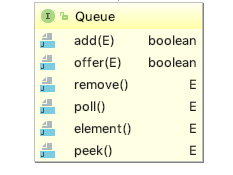

### **Thinking in Java 12 - Holding Your Objects**

The <C>java.util</C> library has a reasonably complete set of container classes, the basic types of which are <C>List</C>, <C>Set</C>, <C>Queue</C>, and <C>Map</C>.

#### Generics and type-safe containers

One of the problems of using pre-Java SE5 containers was that the compiler allowed you to insert an incorrect type into a container.

```Java
public class ApplesAndOrangesWithoutGenerics {
  @SuppressWarnings("unchecked")
  public static void main(String[] args) {
    ArrayList apples = new ArrayList();
    for(int i = 0; i < 3; i++)
      apples.add(new Apple());
    // Not prevented from adding an Orange to apples:
    apples.add(new Orange());
    for(int i = 0; i < apples.size(); i++)
      ((Apple)apples.get(i)).id();
      // Orange is detected only at run time
  }
}

//output: Exception in thread "main" 
java.lang.ClassCastException: holding.Orange cannot be cast to holding.Apple
```

With generics, you're prevented, at **compile** time, from putting the wrong type of object into a container. Now the compiler will prevent you from putting an Orange into apples, so it becomes a compile-time error rather than a runtime error.


#### Basic concepts

The Java container library takes the idea of "holding your objects" and divides it into two distinct concepts, expressed as the basic interfaces of the library:

* <C>Collection</C>: a sequence of individual elements with one or more rules applied to them.
    * <C>List</C>, <C>Set</C>, <C>Queue</C>
    * The <C>Collection</C> interface generalizes the idea of a *sequence*—a way of holding a group of objects. 
* <C>Map</C>: a group of key-value object pairs, allowing you to look up a value using a key.


#### Adding groups of elements

* <C>Arrays.asList()</C> takes either an array or a comma-separated list of elements (using varargs) and turns it into a <C>List</C> object. 
* <C>Collections.addAll()</C> takes a <C>Collection</C> object and either an array or a comma-separated list and adds the elements to the <C>Collection</C>.


```Java
public class Arrays { 
...
    public static <T> List<T> asList(T... a) {
        return new ArrayList<>(a);
    }
...
```

#### Printing containers

You must use <C>Arrays.toString()</C> to produce a printable representation of an array, but the containers print nicely without any help.

#### List

Lists promise to maintain elements in a particular sequence. The <C>List</C> interface adds a number of methods to <C>Collection</C> that allow insertion and removal of elements in the middle of a <C>List</C>.

There are two types of <C>List</C>:

* The basic <C>ArrayList</C>, which excels at randomly accessing elements, but is slower when inserting and removing elements in the middle of a List.
* The <C>LinkedList</C>, which provides optimal sequential access, with inexpensive insertions and deletions from the middle of the List. A <C>LinkedList</C> is relatively slow for random access, but it has a larger feature set than the <C>ArrayList</C>.


#### ListIterator

The <C>ListIterator</C> is a more powerful subtype of <C>Iterator</C> that is produced only by <C>List</C> classes. While <C>Iterator</C> can only move forward, <C>ListIterator</C> is bidirectional.


A <C>ListIterator</C> has no current element; its <I>cursor position</I> always lies between the element that would be returned by a call to <C>previous()</C> and the element that would be returned by a call to <C>next()</C>. An iterator for a list of length n has n+1 possible
cursor positions, as illustrated by the carets (^ ) below:

```
                     Element(0)   Element(1)   Element(2)   ... Element(n-1)
cursor positions:  ^            ^            ^            ^      
```


An example:

```Java
public class ListIteration {
  public static void main(String[] args) {
    List<Pet> pets = Pets.arrayList(8);
    ListIterator<Pet> it = pets.listIterator();
    while(it.hasNext())
      System.out.print(it.next() + ", " + it.nextIndex() +
        ", " + it.previousIndex() + "; ");
    }
  }
} 
// Output:
// Rat, 1, 0; Manx, 2, 1; Cymric, 3, 2; Mutt, 4, 3; Pug, 5, 4; 
// Cymric, 6, 5; Pug, 7, 6; Manx, 8, 7;
```

#### Set

* <C>TreeSet</C> keeps elements sorted into a red-black tree data structure.
* <C>HashSet</C> uses the hashing function.
* <C>LinkedHashSet</C> also uses hashing for lookup speed, but appears to maintain elements in insertion order using a linked list.

If you want the results to be sorted, one approach is to use a <C>TreeSet</C> instead of a <C>HashSet</C>.

#### Map

The <C>HashMap</C> class is roughly equivalent to <C>Hashtable</C>, except:

* <C>HashMap</C> is **unsynchronized**, <C>HashTable</C> is **synchronized**.
* <C>HashMap</C> **permits** nulls, <C>HashTable</C> does **NOT** permite nulls.


1. 继承不同。
    * public class Hashtable extends Dictionary implements Map 
    * public class HashMap extends AbstractMap implements Map
2. Hashtable中的方法是同步的，而HashMap中的方法在缺省情况下是非同步的。在多线程并发的环境下，可以直接使用Hashtable，但是要使用HashMap的话就要自己增加同步处理了。
3. Hashtable中，key和value都不允许出现null值。在HashMap中，null可以作为键，这样的键只有一个；可以有一个或多个键所对应的值为null。当get()方法返回null值时，即可以表示 HashMap中没有该键，也可以表示该键所对应的值为null。因此，在HashMap中不能由get()方法来判断HashMap中是否存在某个键， 而应该用containsKey()方法来判断。
4. 两个遍历方式的内部实现上不同。Hashtable、HashMap都使用了 Iterator。而由于历史原因，Hashtable还使用了Enumeration的方式 。
5. 哈希值的使用不同，HashTable直接使用对象的hashCode。而HashMap重新计算hash值。
6. Hashtable和HashMap它们两个内部实现方式的数组的初始大小和扩容的方式。HashTable中hash数组默认大小是11，增加的方式是 old*2+1。HashMap中hash数组的默认大小是16，而且一定是2的指数 

#### Queue

<C>LinkedList</C> has methods to support queue behavior and it implements the <C>Queue</C> interface, so a <C>LinkedList</C> can be used as a <C>Queue</C> implementation by upcasting a <C>LinkedList</C> to a <C>Queue</C>.

```Java
public class LinkedList<E>
    extends AbstractSequentialList<E>
    implements List<E>, Deque<E>, Cloneable, java.io.Serializable
```

Interface <C>Queue</C>:




<C>offer()</C> inserts an element at the tail of the queue if it can, or returns false. Both <C>peek()</C> and <C>element()</C> return the head of the queue without removing it, but <C>peek()</C> returns null if the queue is empty and <C>element()</C> throws <C>NoSuchElementException</C>. Both <C>poll()</C> and <C>remove()</C> remove and return the head of the queue, but <C>poll()</C> returns null if the queue is empty, while <C>remove()</C>throws<C>NoSuchElementException</C>.

```Java
public class QueueDemo {
  public static void printQ(Queue queue) {
    while(queue.peek() != null)
      System.out.print(queue.remove() + " ");
    System.out.println();
  }
  public static void main(String[] args) {
    Queue<Integer> queue = new LinkedList<Integer>();
    Random rand = new Random(47);
    for(int i = 0; i < 10; i++)
      queue.offer(rand.nextInt(i + 10));
    printQ(queue);
    Queue<Character> qc = new LinkedList<Character>();
    for(char c : "Brontosaurus".toCharArray())
      qc.offer(c);
    printQ(qc);
  }
} /* Output:
8 1 1 1 5 14 3 1 0 1
B r o n t o s a u r u s
*///:~
```

#### PriorityQueue

The elements of the priority queue are ordered according to their <C>Comparable</C> natural ordering, or by a <C>Comparator</C> provided at queue construction time, depending on which constructor is used. 

```Java
// natural order
PriorityQueue<Integer> priorityQueue = new PriorityQueue<Integer>();
// reverse natural order
priorityQueue = new PriorityQueue<Integer>(ints.size(), Collections.reverseOrder());
```

#### Foreach and iterators

Java SE5 introduced a new interface called <C>Iterable</C> which contains an <C>iterator()</C> method to produce an <C>Iterator</C>, and the <C>Iterable</C> interface is what foreach uses to move through a sequence. So if you create any class that implements <C>Iterable</C>, you can use it in a foreach statement.

From Java SE5, a number of classes have been made <C>Iterable</C>, primarily all <C>Collection</C> classes (but not <C>Maps</C>).


<C>Map.entrySet()</C> produces a <C>Set</C> of <C>Map.Entry</C> elements, and a <C>Set</C> is <C>Iterable</C> so it can be used in a foreach loop.

```Java
HashMap<String, HashMap> selects = new HashMap<String, HashMap>();
for(Map.Entry<String, HashMap> entry : selects.entrySet()) {
    String key = entry.getKey();
    HashMap value = entry.getValue();

    // do what you have to do here
    // In your case, another loop.
}
```