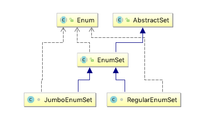

### **Thinking in Java 20 - Enumerated Types**


When you create an <C>enum</C>, an associated class is produced for you by the compiler. This class is automatically **inherited** from <C>java.lang.Enum</C>.

```Java
public abstract class Enum<E extends Enum<E>>
        implements Comparable<E>, Serializable 
```

The definition means that the type argument for <C>enum</C> has to derive from an <C>enum</C> which itself has the same type argument.  So if I've got an <C>enum</C> called StatusCode, it would be equivalent to [[ref](https://stackoverflow.com/questions/211143/java-enum-definition)]:

```Java
public class StatusCode extends Enum<StatusCode>
```


#### Using static imports with enums

The <C>static</C> import brings all the <C>enum</C> instance identifiers into the local namespace, so they don’t need to be qualified.

```Java
// Spiciness.java
public enum Spiciness {
  NOT, MILD, MEDIUM, HOT, FLAMING
}
// Burrito.java
import static Spiciness.*;
public class Burrito {
  Spiciness degree;
  public Burrito(Spiciness degree) { this.degree = degree;}
  public String toString() { return "Burrito is "+ degree;}
  public static void main(String[] args) {
    System.out.println(new Burrito(NOT));
    System.out.println(new Burrito(HOT));
  }
}
```

#### Adding methods to an enum

Except for the fact that you can’t inherit from it, an <C>enum</C> can be treated much like a regular class. This means that you can add methods to an  <C>enum</C> . It’s even possible for an  <C>enum</C>  to have a <C>main()</C>. Notice that if you are going to define methods you must end the sequence of  <C>enum</C> instances with a semicolon.

```Java
public enum OzWitch {
  // Instances must be defined first, before methods:
  WEST("Miss Gulch, aka the Wicked Witch of the West"),
  SOUTH("Good by inference, but missing");
  private String description;
  // Constructor must be package or private access:
  private OzWitch(String description) {
    this.description = description;
  }
  public String getDescription() { return description; }
  public static void main(String[] args) {
    for(OzWitch witch : OzWitch.values())
      print(witch + ": " + witch.getDescription());
  }
}
```

Also you can overriding <C>enum</C> methods.


#### The mystery of values()


The method <C>values()</C> is a static method that is added by the compiler.

> The compiler automatically adds some special methods when it creates an enum. For example, they have a static values method that returns an array containing all of the values of the enum in the order they are declared. This method is commonly used in combination with the for-each construct to iterate over the values of an enum type. [[Java Tutorials - Enum Type](https://docs.oracle.com/javase/tutorial/java/javaOO/enum.html)]


#### Implements, not inherits

All <C>enum</C>s extend <C>java.lang.Enum</C>. Since Java does not support multiple inheritance, this means that you cannot create an <C>enum</C> via inheritance. However, it is possible to create an <C>enum</C> that implements one or more interfaces.


#### Using EnumSet instead of flags

The <C>EnumSet</C> was added to Java SE5 to work in concert with <C>enum</C>s to create a replacement for traditional int-based "bit flags." The <C>EnumSet</C> is designed for speed, because it must compete effectively with bit flags. Internally, it is represented by (if possible) a **single** <C>long</C> that is treated as a bit-vector, so it’s extremely fast and efficient.


```Java
package java.util;
public abstract class EnumSet<E extends Enum<E>> extends AbstractSet<E>
    implements Cloneable, java.io.Serializable
```

<C>EnumSet</C>s are built on top of <C>long</C>s, a <C>long</C> is 64 bits, and each <C>enum</C> instance requires one bit to indicate presence or absence. This means you can have an <C>EnumSet</C>  for an <C>enum</C> of up to 64 elements without going beyond the use of a single <C>long</C>.


<C>EnumSet</C>是一个抽象类，不能直接通过<C>new</C>新建，不过提供了若干静态工厂方法(<C>noneof</C>, <C>allof</C>等)。


当<C>EnumSet</C>大于64个时，采用<C>JumboEnumSet</C>，否则采用<C>RegularEnumSet</C>:


```Java
// The class of all the elements of this set.
final Class<E> elementType;
// All of the values comprising T.  (Cached for performance.)
final Enum<?>[] universe;
// Creates an empty enum set with the specified element type.
public static <E extends Enum<E>> EnumSet<E> noneOf(Class<E> elementType) {
    Enum<?>[] universe = getUniverse(elementType);
    if (universe == null)
        throw new ClassCastException(elementType + " not an enum");

    if (universe.length <= 64)
        return new RegularEnumSet<>(elementType, universe);
    else
        return new JumboEnumSet<>(elementType, universe);
}
```



对于<C>RegularEnumSet</C>，它用一个<C>long</C>类型表示位向量;对于<C>JumboEnumSet</C>，它用一个<C>long</C>数组表示。


```Java
// RegularEnumSet.java
// Bit vector representation of this set.  
// The 2^k bit indicates the presence of universe[k] in this set.
private long elements = 0L;


// JumboEnumSet.java
// Bit vector representation of this set.  The ith bit of the jth
// element of this array represents the  presence of universe[64*j +i]
// in this set.
private long elements[];
```


#### Using EnumMap

An <C>EnumMap</C> is a specialized <C>Map</C> that requires that its keys be from a single <C>enum</C>. Because of the constraints on an <C>enum</C>, an <C>EnumMap</C> can be implemented internally as an array. Thus they are extremely fast, so you can freely use <C>EnumMaps</C> for enum-based lookups.

```Java
public class EnumMap<K extends Enum<K>, V> extends AbstractMap<K, V>
    implements java.io.Serializable, Cloneable
private final Class<K> keyType;
// Array representation of this map.
private transient Object[] vals;
```

<C>key</C>其实就是<C>Enum.ordinal()</C>，所以实际上<C>EnumMaps</C>就是一个数组，如果要查询某个<C>key</C>是否存在：

```Java
public boolean containsKey(Object key) {
    return isValidKey(key) && vals[((Enum<?>)key).ordinal()] != null;
}
```

再来看看<C>put()</C>方法：

```Java
public V put(K key, V value) {
    typeCheck(key);

    int index = key.ordinal();
    Object oldValue = vals[index];
    vals[index] = maskNull(value);
    if (oldValue == null)
        size++;
    return unmaskNull(oldValue);
}
```