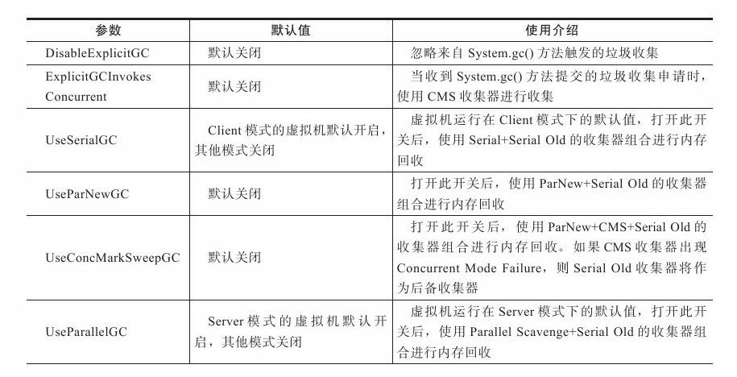
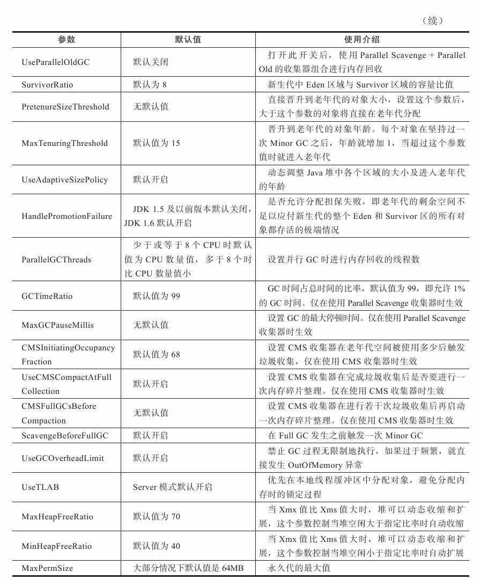
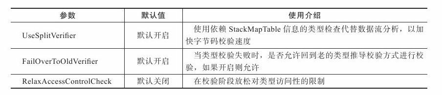
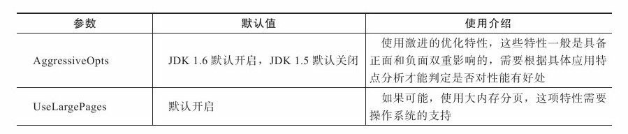
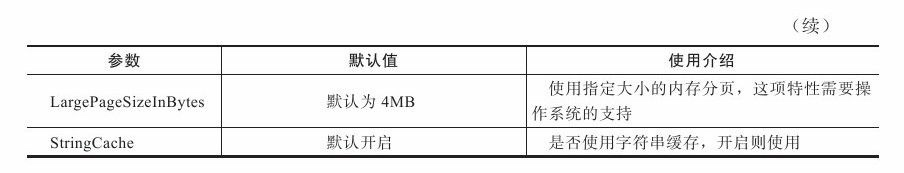
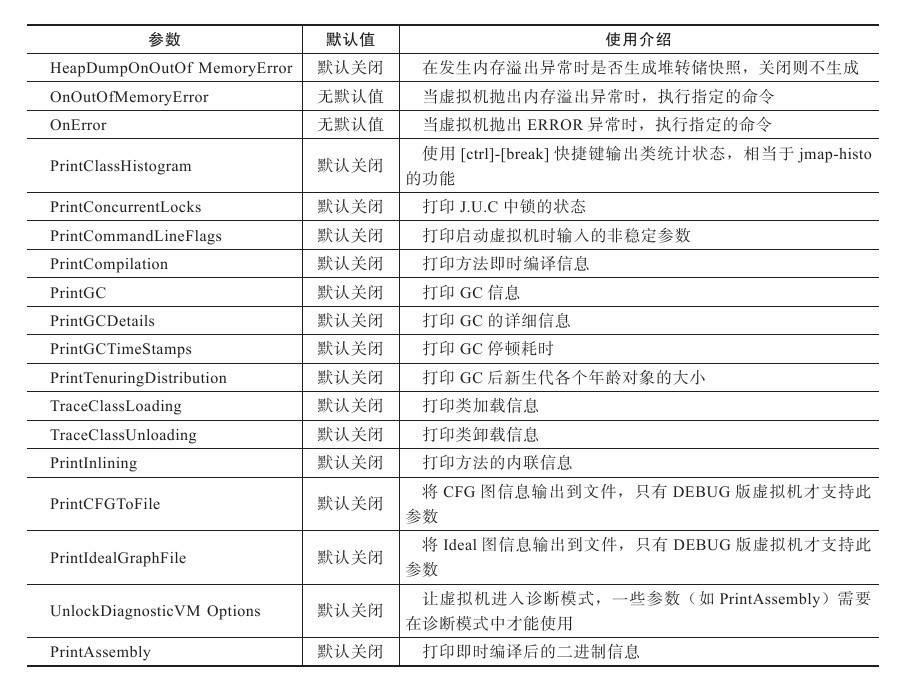

### **HotSpot虚拟机主要参数列表**

[Java HotSpot VM Options](https://www.oracle.com/technetwork/articles/java/vmoptions-jsp-140102.html)

本参数表以JDK 1.6为基础编写，JDK 1.6的HotSpot虚拟机有很多非稳定参数（Unstable Options，即以-XX：开头的参数，JDK 1.6的虚拟机中大概有660多个），使用`-XX：+PrintFlagsFinal`参数可以输出所有参数的名称及默认值（默认不包括Diagnostic和Experimental的参数，如果需要，可以配合`-XX：+UnlockDiagnosticVMOptions`/`-XX：+UnlockExperimentalVMOptions`一起使用），下面的各个表格只包含了其中最常用的部分。参数使用的方式有如下3种：

* `-XX:+<option>`:   开启option参数。
* `-XX:-<option>`:  关闭option参数。
* `-XX:<option>=<value>`: 将option参数的值设置为value。

#### 内存管理参数

#### 即时编译参数

#### 类型加载参数

#### 多线程相关参数

#### 性能参数
 

##### 调试参数

