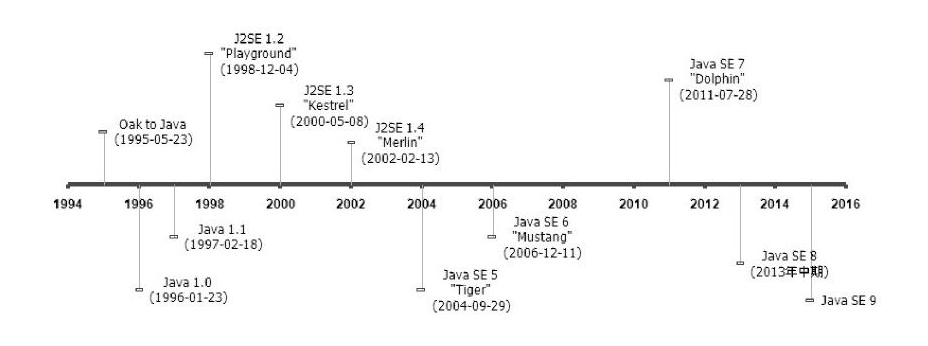

### **深入理解Java虚拟机 1 - 走进Java **

Java不仅仅是一门编程语言，它还是一个由一系列计算机软件和规范形成的技术体系，这个技术体系提供了完整的用于软件开发和跨平台部署的支持环境。

**按照技术所服务的领域**来划分，Java技术体系可以分为4个平台，分别为：

* Java Card：支持一些Java小程序（Applets）运行在小内存设备（如智能卡）上的平台。
* Java ME（Micro Edition）：支持Java程序运行在移动终端（手机、PDA）上的平台，对Java API有所精简，并加入了针对移动终端的支持，这个版本以前称为J2ME。
* **Java SE**（Standard Edition）：支持面向桌面级应用（如Windows下的应用程序）的Java平台，提供了完整的Java核心API，这个版本以前称为J2SE。
* **Java EE**（Enterprise Edition）：支持使用多层架构的企业应用（如ERP、CRM应用）的Java平台，除了提供Java SE API外，还对其做了大量的扩充并提供了相关的部署支持，这个版本以前称为J2EE。

### Java发展史

* JDK 1.0: Java虚拟机、Applet、AWT等；
* JDK 1.1：JAR文件格式、JDBC、JavaBeans、RMI、内部类、反射；
* JDK 1.2：拆分为J2SE/J2EE/J2ME、内置JIT编译器、一系列Collections集合类；
* JDK 1.3：JNDI服务、使用CORBA IIOP实现RMI通信协议、Java 2D改进；
* JDK 1.4：正则表达式、异常链、NIO、日志类、XML解析器和XSLT转换器；
* JDK 1.5：自动装箱、泛型、动态注解、枚举、可变参数、遍历循环、改进了Java内存模型、提供了java.util.concurrent并发包；
* JDK 1.6：提供动态语言支持、提供编译API和微型HTTP服务器API、虚拟机优化（锁与同步、垃圾收集、类加载等）；
* JDK 1.7：G1收集器、加强对Java语言的调用支持、升级类加载架构；
* JDK 1.8：Lambda表达式等；

### Java虚拟机发展史
#### Sun Classic/Exact VM

Sun Classic/Exact VM是世界上第一款商用Java虚拟机。这款虚拟机只能使用纯解释器方式来执行Java代码，如果要使用 JIT 编译器，就必须进行外挂。但是假如外挂了JIT编译器， JIT编译器就完全接管了虚拟机的执行系统，解释器便不再工作了。Class VM在JDK 1.2之前是 Sun JDK中唯一的虚拟机，在JDK 1.2时，它与HotSpot VM并存，但默认使用的是Classic VM。

#### Sun HotSpot VM

HotSpot VM是Sun JDK和OpenJDK中所带的虚拟机，也是⽬前使⽤范围最⼴的Java虚拟机。
HotSpot VM最初由⼀家名为“Longview Technologies”的⼩公司设计的，后来被Sun收购。

HotSpot VM既继承了Sun之前两款商用虚拟机的优点(准确式内存管理)，也有许多自己新的技术优势。HotSpot VM的热点代码探测能力(这是为什么叫hotspot的原因)可以通过执行计数器找出最具有编译价值的代码，然后通知JIT编译器以方法为单位进行编译。如果⼀个⽅法被频繁调⽤，或⽅法中有效循环次数很多，将会分别触发标准编译和OSR(栈上替换)编译动作。通过编译器与解释器恰当地协同⼯作，可以在最优化的程序响应时间与最佳执⾏性能中取得平衡，⽽且⽆须等待本地代码输出才能执⾏程序，即时编译的时间压⼒也相对减⼩，这样有助于引⼊更多的代码优化技术，输出质量更⾼的本地代码。

#### Sun Mobile-Embedded VM/Meta-Circular VM

Sun公司所研发的虚拟机可不仅有前⾯介绍的服务器、桌⾯领域的商 ⽤虚拟机，除此之外，Sun公司⾯对移动和嵌⼊式市场，也发布过虚拟机产品。常见的有KVM，CDC/CLDC HotSpot Implementation等。

#### BEA JRockit/IBM J9 VM

除了Sun公司以外，其他组织、公 司也研发过不少虚拟机实现，其中规模最⼤、最著名的就是BEA和IBM公司了。

JRockit VM曾经号称“世界上速度最快的Java虚拟机”。它是⼀款专门为服务器硬件和服务器端应⽤场景⾼度优化的虚拟机，专注于服务器端应用，不太关注程序启动速度，因此JRockit内部不包含解析器实现，全部代码都靠即时编译器编译后执行。除此之外， JRockit的垃圾收集器和 MissionControl服务套件等部分的实现，在众多Java虚拟机中也一直处于领先水平。

IBM J9的市场定位与Sun HotSpot比较接近，它是一款设计上从服务器端到桌面应用再到嵌入式都全面考虑的多用途虚拟机。

#### Azul VM/BEA Liquid VM

Azul VM 和 BEA Liquid VM是特定硬件平台专有的虚拟机，它们往往有更高的性能。

Azul VM是在HotSpot基础上进⾏⼤量改进，运⾏于 Azul Systems公司的专有硬件Vega系统上的Java虚拟机，每个Azul VM实例都可以管理⾄少数⼗个CPU和数百GB内存的硬件资源，并提供在巨⼤内存范围内实现可控的GC时间的垃圾收集器、为专有硬件优化的线程调度等优秀特性。

Liquid VM可以直接运⾏在⾃家Hypervisor系统上的JRockit VM的虚拟化版本， Liquid VM不需要操作系统的⽀持，或者说它⾃⼰本⾝实现了⼀个专⽤操作系统的必要功能，如⽂件系统、⽹络⽀持等。由虚拟机越过通⽤操作系 统直接控制硬件可以获得很多好处，如在线程调度时，不需要再进⾏内核态/⽤户态的切换等，这样可以最⼤限度地发挥硬件的能⼒，提升Java程序 的执⾏性能。