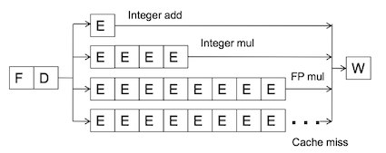
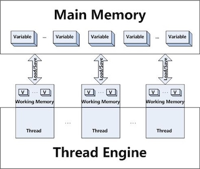

### **深入理解Java虚拟机 12 - Java内存模型与线程 **

并发处理的广泛应用是使得Amdahl定律代替摩尔定律成为计算机性能发展源动力的根本原因，也是人类“压榨”计算机运算能力的最有力武器。

### 1 概述
多任务处理在现代计算机操作系统中几乎已是一项必备的功能了； 除了充分利用计算机处理器的能力外，一个服务端同时对多个客户端提供服务则是另一个更具体的并发应用场景；服务端是Java语言最擅长的领域之一，不过如何写好并发应用程序却又是服务端程序开发的难点之一，处理好并发方面的问题通常需要更多的编码经验来支持，幸好Java语言和虚拟机提供了许多工具，把并发编码的门槛降低了不少；

### 2 硬件的效率与一致性

#### 缓存一致性

基于高速缓存的存储交互很好地解决了处理器与内存的速度矛盾，但是也为计算机系统带来更高的复杂度，因为它引入了一个新的问题：<big><b>缓存一致性</b></big>(Cache Coherence)。在多处理系统中，每个处理器都有自己的高速缓存，而它们有共享同一主内存(Main memory)。

> Cache coherence is the uniformity of shared resource data that ends up stored in multiple local caches. 缓存一致性是存储在多个局部缓存中的共享资源的一致性。


为了解决一致性的问题，需要各个处理器访问缓存时都遵循一些协议，在读写时要根据协议来进行操作，这类协议有MSI、MESI、MOSI、Synapse、Firefly及Dragon Protocol等；Java虚拟机内存模型中定义的内存访问操作与硬件的缓存访问操作是具有可比性的。

#### 乱序执行

除了增加高速缓存之外，为了使得处理器内部的运算单元能尽量被充分利用，处理器可能会对输入代码进行**乱序执行**(Out-Of-Order Execution)优化，处理器会在计算之后将乱序执行的结果重组，保证该结果与顺序执行的结果是一致的；与处理器的乱序执行优化类似，Java虚拟机的即时编译器中也有类似的**指令重排序**(Instruction Reorder)优化。


**In-order v.s. Out-of-order Execution**

[ CSE P 548: Computer Architecture, University of Washington](https://courses.cs.washington.edu/courses/csep548/06au/lectures/introOOO.pdf)


* In-order execution 顺序执行
    * instructions are fetched, executed and completed in compiler-generated order
    * one stalls, they all stall
    * instructions are **statically scheduled**
* Out-Of-Order execution 乱序执行
    * instructions are fetched in compiler-generated order
    * instruction completion is in-oder.
    * instructions are **dynamically scheduled**

    Dynamic Scheduling:
    
    


[CMU Computer Architecture](https://www.archive.ece.cmu.edu/~ece740/f11/lib/exe/fetch.php?media=wiki:lectures:onur-740-fall11-lecture10-ooo-afterlecture.pdf)

In-order pipeline




* **Problem**: A true data dependency stalls dispatch of younger
instructions into functional (execution) units
* Dispatch: Act of sending an instruction to a functional unit
 
Out-of-order Execution (Dynamic Scheduling)

* Idea: Move the dependent instructions out of the way of
independent ones
    * Rest areas for dependent instructions: Reservation stations 

### 3 Java内存模型

Java虚拟机规范中视图定义一种**Java内存模型**(Java Memory Model, JMM）来屏蔽掉各种硬件和操作系统的内存访问差异，以实现让Java程序在各种平台下都能达到一致的内存访问效果。


[Princeton COS 597C](https://www.cs.princeton.edu/courses/archive/fall10/cos597C/docs/memory-models.pdf)

> Memory model is a formal specification of how the memory system will appear to the programmer, **eliminating the gap between the behavior expected by the programmer and the actual behavior supported by a system**. [Adve's 1995]


Memory model specifies:

* How Threads interact through memory 
* What value a read can return
* When does a value update become visible to other Threads 
* What assumptions are allowed to make about memory when writing a program or applying some program optimization


#### 主内存与工作内存

Java内存模型的一个主要目标是定义程序中*各个变量的访问规则*，即在虚拟机中将变量存储到内存和从内存中取出变量这样的底层细节.此处的变量与Java编程中所说的变量有所区别，它包括了实例字段、静态字段和构成数组对象的元素，但不包括局部变量与方法参数，因为后者是线程私有的，不会被共享；

Java内存模型规定了所有的变量都存储在**主内存**(Main Meory)中(此处的主内存与介绍物理硬件时的主内存名字一样，两者也可以相互类比，但此处仅是虚拟机内存的一部分)，每个线程还有自己的**工作内存**(Working Memory, 可与前面所讲的处理器高速缓存类比)，线程的工作内存中保存了被该线程使用到的变量的主内存副本拷贝，线程对变量的所有操作都必须在工作内存中进行，而不能直接读写主内存中的变量。




#### 内存间交互操作

关于主内存与工作内存之间具体的交互协议，即一个变量如何从主内存拷贝到工作内存、如何从工作内存同步回主内存之类的实现细节，Java内存模型中定义了以下八种操作来完成，虚拟机实现时必须保证下面提及的每一种操作都是原子的、不可再分的（对于<C>double</C>和<C>long</C>类型的变量的某些操作在某些平台允许有例外）：

* <C>lock</C>(锁定)：作用于主内存变量，它把一个变量标识为一条线程独占的状态。
* <C>unlock</C>(解锁)：作用于主内存变量，它把一个处理锁定的状态的变量释放出来,释放后的变量才可以被其它线程锁定，<C>unlock</C>之前必须将变量值同步回主内存。
* <C>read</C>(读取)：作用于主内存变量，它把一个变量的值从主内存传输到线程的工作内存中，以便随后的<C>load</C>动作使用。
* <C>load</C>(载入)：作用于工作内存变量，它把<C>read</C>操作从主内存中得到的值放入工作内存的变量副本中。
* <C>use</C>(使用)：作用于工作内存中的变量，它把工作内存中一个变量的值传递给执行引擎，每当虚拟机遇到一个需要使用到变量的字节码指令时将会执行这个操作。
* <C>assign</C>(赋值)：作用于工作内存变量，它把一个从执行引擎接到的值赋值给工作内存的变量，每当虚拟机遇到一个给变量赋值的字节码指令时执行这个操作。
* <C>store</C>(存储)：作用于工作内存的变量，它把工作内存中一个变量的值传送到主内存中，以便随后的<C>write</C>操作使用。
* <C>write</C>(写入)：作用于主内存的变量，它把<C>store</C>操作从工作内存中得到的值放入主内存的变量中。

如果要把一个变量从主内存复制到工作内存，那就要顺序地执行<C>read</C>和<C>load</C>操作，如果要把变量从工作内存同步回主内存，就要顺序地执行<C>store</C>和<C>write</C>操作。Java内存模型只是要求上述两个操作必须按顺序执行，而没有保证必须是连续执行。也就是说<C>read</C>与<C>load</C>之间、<C>store</C>与<C>write</C>之间是可以插入其它指令的，如果对主在内中的变量a,b进行访问时，一种可能出现的顺序是<C>read</C> a、<C>read</C> b、<C>load</C> b、<C>load</C> a。除此之外，Java内存模型还规定了执行上述八种基础操作时必须满足如下规则：

* 不允许<C>read</C>和<C>load</C>、<C>store</C>和<C>write</C>操作之一单独出现，即不允许一个变量从主内存读取了但工作内存不接受，或者从工作内存发起回写但主内存不接受的情况出现。
* 不允许一个线程丢弃它的最近的<C>assign</C>操作，即变量在工作内存中改变(为工作内存变量赋值)了之后必须把该变化同步回主内存。
* 一个新变量只能在主内存中“诞生”，不允许在工作内存中直接使用一个未被初始化(<C>load</C>和<C>assign</C>)的变量，换话说就是一个变量在实施<C>use</C>和<C>store</C>操作之前，必须先执行过了<C>assign</C>和<C>load</C>操作。
* 如果一个变量事先没有被<C>load</C>操作锁定，则不允许对它执行<C>unlock</C>操作：也不允许去<C>unlock</C>一个被其它线程锁定的变量。
* 对一个变量执行<C>unlock</C>之前，必须把此变量同步回主内存中(执行<C>store</C>和<C>write</C>操作)。


####  对于volatile型变量的特殊规则

关键字<C>volatile</C>可以说是Java虚拟机提供的最轻量级的同步机制；当一个变量定义为<C>volatile</C>之后，它将具备两种特性：第一是保证此变量对所有线程的**可见性**，这里的可见性是指当一个线程修改了这个变量的值，新的值对于其他线程来说是可以立即得知的，而普通的变量的值在线程间传递均需要通过主内存来完成；另外一个是**禁止指令重排序优化**，普通的变量仅仅会保证在该方法的执行过程中所有依赖赋值结果的地方都能获取到正确的结果，而不能保证变量赋值操作的顺序与程序代码中的执行顺序一致；

<C>volatile</C>变量在各个线程的工作内存中不存在一致性问题。但不能说“基于volatile变量的运算在并发下时安全的”。

由于<C>volatile</C>变量只能保证可见性，在不符合以下两条规则的运算场景中，我们仍然要通过加锁来保证原子性：

* 运算结果并不依赖变量的当前值或者能够确保只有单一的线程修改变量的值
* 变量不需要与其他的状态变量共同参与不变约束；

以下场景很适合用<C>volatile</C>变量来控制并发，当<C>shutdown()</C>方法被调用时，能保证所有线程的<C>doWork()</C>方法都立刻停下来。

```Java

volatile boolean shutdownRequested;

public void shutdown() {
    shutdownRequested = true;
}

public void doWork() {
    while (!shutdownRequested) {
        // do stuff
    }
}
```

<C>volatile</C>变量读操作的性能消耗与普通变量几乎没有任何差别，但是写操作则可能会慢一些，因为它需要在本地代码中插入许多内存屏障(Memory Barrier)指令来保证处理器不发生乱序执行；不过大多数场景下<C>volatile</C>的总开销仍然要比锁低，我们在<C>volatile</C>与锁之中选择的唯一依据仅仅是<C>volatile</C>的语义能否满足使用场景的需求；


Java内存模型中对<C>volatile</C>变量定义的特殊规则(假设V表示<C>volatile</C>行变量)：

* 在工作内存中，每次使用V前都必须先从主内存刷新最新的值，用于保证能看到其他线程对变量V所做的修改后的值
* 在工作内存中，每次修改V之后都必须立刻同步回主内存中，用于保证其他线程可以看到自己对变量V所做的修改
* 要求V不会被指令重排序优化，保证代码的执行顺序和程序的顺序相同。


#### 对于long和double型变量的特殊规则

Java内存模型要求<C>lock</C>、<C>unlock</C>、<C>read</C>、<C>load</C>、<C>assign</C>、<C>use</C>、<C>store</C>、<C>write</C>这八个操作都具有原子性。

但是对于64位的数据类型(long和double): 允许虚拟机将没有被<C>volatile</C>修饰的64位数据的读写操作划分为两次32位的操作来进行，即允许虚拟机实现选择可以不保证64位数据类型的<C>read</C>、<C>load</C>、<C>store</C>、<C>write</C>这4个操作的原子性，这点就是所谓的**long和double的非原子性协定**(Nonatomic Treatment of double and long Variables)；

但允许虚拟机选择把这些操作实现为具有原子性的操作，目前各种平台下的商用虚拟机几乎都选择把64位数据的读写操作作为原子操作来对待。

#### 原子性、可见性与有序性

**原子性**(Atomicity): 由Java内存模型来直接保证的原子性变量操作包括<C>read</C>、<C>load</C>、<C>assign</C>、<C>use</C>、<C>store</C>和C>write</C>这六个。<C>lock</C>、<C>unlock</C>操作未直接开放给用户使用, 而反映在同步块中 ——<C>synchronized</C>块之间的操作也具备原子性；

**可见性**(Visibility)：是指当一个线程修改了共享变量的值，其他线程能够立即得知这个修改。<C>volatile</C>、<C>synchronized</C>和<C>final</C>关键字能实现可见性。
<C>synchronized</C>同步块的可见性是由“对一个变量执行un<C>lock</C>操作之前，必须把此变量同步回主内存中“这条规则获得的。<C>final</C>关键字的可见性是指，被<C>final</C>修饰的字段在构造器中一旦被初始化完成，并且构造器没有把"this"的引用传递出去，那么在其他线程中就能看见<C>final</C>字段的值。

**有序性**(Ordering)：如果在本线程内观察，所有的操作都是有序的；如果在一个线程中观察另一个线程，所有的操作都是无序的。Java语言提供了<C>volatile</C>和<C>synchronized</C>两个关键字来保证线程之间操作的有序性, <C>volatile</C>关键字本身就包含了禁止指令重排序的语意，而<C>synchronized</C>是由“一个变量在同一时刻只允许一条线程对其进行<C>lock</C>操作”这条规则获得的，这个规则决定了持有同一个锁的两个同步块只能串行的进入。


#### 先行发生原则

**先行发生**(happens-before)原则是判断数据是否存在竞争、线程是否安全的主要依据。

先行发生(happens-before)是Java内存模型中定义的两项操作之间的偏序关系，如果说操作A先行发生于操作B，其实就是说在发生操作B之前，操作A产生的影响能被操作B观察到，影响包括了修改了内存中共享变量的值、发送了消息、调用了方法等.


下面是Java内存模型下一些天然的**先行发生关系**。这些先行发生关系无需任何同步器协助就可以存在。如果两个操作之间的关系不在此列，并且无法从以下规则推导出来的话，它们就没有顺序性保障，虚拟机可以对它们进行随意的重排序：

* **程序次序规则**(Pragram Order Rule)：*在一个线程内*，按照程序代码顺序，书写在前面的操作先行发生于书写在后面的操作。准确地说应该是控制流顺序而不是程序代码顺序，因为要考虑分支、循环结构。
* **管程锁定规则**(Monitor lock Rule)：一个<C>unlock</C>操作先行发生于后面对同一个锁的<C>lock</C>操作。这里必须强调的是同一个锁，而”后面“是指时间上的先后顺序。
* <C>volatile</C>**变量规则**(Volatile Variable Rule)：对一个<C>volatile</C>变量的写操作先行发生于后面对这个变量的读取操作，这里的”后面“同样指时间上的先后顺序。
* **线程启动规则**(Thread Start Rule)：<C>Thread对象的<C>start()</C>方法先行发生于此线程的每一个动作。
* **线程终止规则**(Thread Termination Rule)：线程中的所有操作都先行发生于对此线程的终止检测，我们可以通过<C>Thread.join()</C>方法结束，<C>Thread.isAlive()</C>的返回值等作段检测到线程已经终止执行。
* **线程中断规**则(Thread Interruption Rule)：对线程<C>interrupt()</C>方法的调用先行发生于被中断线程的代码检测到中断事件的发生，可以通过<C>Thread.interrupted()</C>方法检测是否有中断发生。
* **对象终结规则**(Finalizer Rule)：一个对象初始化完成(构造方法执行完成)先行发生于它的<C>finalize()</C>方法的开始。
* **传递性**(Transitivity)：如果操作A先行发生于操作B，操作B先行发生于操作C，那就可以得出操作A先行发生于操作C的结论。


时间先后顺序与先行发生原则之间基本没有太大的关系，所以我们衡量并发安全问题的时候不要受到时间顺序的干扰，一切必须以先行发生原则为准；

### 4 Java与线程
####  线程的实现

线程是比进程更轻量级的调度执行单位，线程的引入可以把一个进程的资源分配和执行调度分开，各个线程既可以共享进程资源又可以独立调度。

Thread类与大部分的Java API有显著的差别，它的所有关键方法都是声明为<C>native</C>的。Java线程是基于操作系统原生线程模型来实现的。

!!! note
    <C>native</C>修饰词说明，该方法的实现是用其他语言(C/C++)实现的，该方法通过Java Native Interface (JNI, Java本地接口)调用本地代码。


#### Java线程调度

Java语言一共设置了10个级别的线程优先级(<C>Thread.MIN_PRIORITY</C>-<C>Thread.MAX_PRIORITY</C>)。

```Java
/* The minimum priority that a Thread can have.*/
public static final int MIN_PRIORITY = 1;
/* The default priority that is <C>assign</C>ed to a Thread.*/
public static final int NORM_PRIORITY = 5;
/* The maximum priority that a Thread can have. */
public static final int MAX_PRIORITY = 10;
```

#### 状态转换

Java语言定义了五种线程状态，在任意一个时间点，一个线程只能有且只有其中一种状态，分别是

* 新建(New): Thread state for a Thread which has not yet started.
* 运行(Runnable): Thread state for a runnable Thread.  A Thread in the runnable state is executing in the Java virtual machine but it may be waiting for other resources from the operating system such as processor.
* 阻塞(Blocked):  Thread state for a Thread blocked waiting for a monitor <C>lock</C>. A Thread in the blocked state is waiting for a monitor <C>lock</C> to enter a synchronized block/method or reenter a synchronized block/method after calling <C>Object.wait</C>.
* 等待(Waiting): A Thread that is waiting indefinitely for another Thread to perform a particular action is in this state.
    * <C>wait()</C>
    * <C>join()</C>
    * <C><C>lock</C>Support.park() </C>
* 限期等待(Timed Waiting): A Thread that is waiting for another Thread to perform an action for up to a specified waiting time is in this state.
    * <C> sleep()</C>
    * <C>wait(long)</C>
    * <C>join(long)</C>
    * <C><C>lock</C>Support.parkNanos(long)</C>
    * <C><C>lock</C>Support.parkUntil()</C>
 
* 结束(Terminated): A Thread that has exited is in this state.