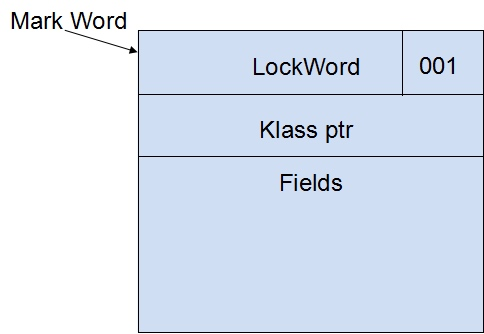

### **深入理解Java虚拟机 13 - 线程安全与锁优化 **

### 1概述

对于高效并发来讲，首先需要保证并发的正确性，然后在此基础上实现高效。本章就先从如何保证并发的正确性，如何实现线程安全说起。

### 2 线程安全

> A class is **thread-safe** if it behaves correctly when accessed from multiple threads, regardless of the scheduling or interleaving of the execution of those threads by the runtime environment, and with no additional synchronization or other coordination on the part of the calling code. <small>[Java Concurrency in Practice]</small>

> 当多个线程访问一个类时，不管这些线程在运行时环境下的调度和交替执行，并且不需要进行额外的同步，或者在调用方进行其他的协调操作，它的行为表现正确，那这个类是**线程安全**的。

> Thread-safe classes encapsulates any needed synchronization so that clients need not provide their own.


#### Java语言中的线程安全

按照线程安全的“安全程度”由强至弱来排序，我们可以将Java语言中各个操作共享的数据分为以下五类：不可变、绝对线程安全、相对线程安全、线程兼容和线程对立。

<big><b>不可变</b></big>

**不可变**(Immutable)对象一定是线程安全的，无论是对象的方法实现还是方法的调用者，都不需要再进行任何的线程安全措施。

Java语言中，如果共享数据是一个基本数据类型，那么只要在定义时使用<C>final</C>关键字修饰它就可以保证它时不变的。如果共享数据是一个对象，那就需要保证对象的行为不会对其状态产生任何影响才行，比如<C>String</C>类的对象，它是一个典型的不可变对象，我们调用它的<C>substring()</C>、<C>replace()</C>这些方法都不会影响它原来的值，只会返回一个新构造的字符串对象。

除此之外，常用的不可变类型还有枚举类型，以及<C>java.lang.Number</C>的部分子类，如<C>Long</C>和<C>double</C>等Wrapper类型。

<big><b>线程绝对安全</b></big>


在Java API中标注自己是线程安全的类，大多数都不是绝对的线程安全。


<big><b>相对线程安全</b></big>

**线程相对安全**就是我们通常意义上所讲的线程安全，它需要保证对这个对象单独的操作是线程安全的，我们在调用的时候不需要做额外的保障措施，但是对于一些特定的顺序的连续调用，就可能需要在调用端使用额外的同步手段来保证调用的正确性。

在Java语言中，大部分的线程安全类都属于这种类型。

<big><b>线程兼容</b></big>

**线程兼容**指对象本身并不是线程安全的，但是可以通过在调用端正确地使用同步手段来保证对象在并发环境中可以安全地使用；我们说一个类不是线程安全的，绝大多数时候指的是这一种情况；

<big><b>线程对立</b></big>

**线程对立**是指无论调用端是否采取了同步措施，都无法在多线程环境中并发使用的代码，Java语言中很少出现。常见的线程对立操作还有`System.setIn()`, `System.setOut()`, `System.runFinalizersOnExit()`等等。


#### 线程安全的实现方法


**Synchronized**

在Java里面，最基本的互斥同步手段就是<C>synchronized</C>关键字，<C>synchronized</C>关键字经过编译以后，会在同步块的前后分别形成<C>monitorenter</C>和<C>monitorexit</C>这两个字节码指令，这两个字节码都需要一个<C>reference</C>类型的参数来指明要锁定和解锁的对象。如果Java程序中的<C>synchronized</C>明确制定了对象参数，那就是这个对象的<C>reference</C>；如果没有明确指定，那就根据<C>synchronized</C>修饰的是实例方法还是类方法，去取对应的对象作为锁对象。


[Java Synchronized](https://cs.au.dk/~mis/dOvs/jvmspec/ref--44.html)

The <C>monitorenter/monitorexit</C> mechanism is used by the Java <C>synchronized</C> statement to coordinate access to an object among multiple threads. For example, when you write in Java code:

```Java

static void Sort(int [] array) {
    // synchronize this operation so that some other thread can't
    // manipulate the array while we are sorting it. This assumes that other
    // threads also synchronize their accesses to the array.
    synchronized(array) {
        // now sort elements in array
    }
}
```

then JVM code like the following is generated:


```
.method static Sort([I)V
    aload_0
    monitorenter    ; lock object in local variable 0 

    ; now sort elements in array

    aload_0
    monitorexit      ; finished with object in local variable 0
    return
.end method
```

还有两点需要特别注意的。首先<C>synchronized</C>同步块对同一个线程来说是可重入，不会出现自己把自己锁死的问题。其次，同步块在已进入的线程执行完之前，会阻塞后面其他线程的进入。

**ReentrantLock**


另外还可以使用<C>java.util.concurrent</C>包中的重入锁（<C>ReentrantLock</C>）来实现同步。在基本用法上，<C>ReentrantLock</C>与<C>synchronized</C>很相似，它们都具备一样的线程重入特性，只是代码写法上有点区别。

不过<C>ReentrantLock</C>比<C>synchronized</C>增加了一些高级功能：等待可中断、可实现公平锁以及锁可以绑定多个条件；

* 等待可中断: 是指当持有锁的线程长期不释放锁的时候，正在等待的线程可以选择放弃等待，改为处理其他事情，可中断特性对处理执行时间非常长的同步块很有帮助。
* 公平锁: 是指多个线程在等待一个同一个锁时，必须按照申请的时间顺序来一次获得锁；<C>synchronzied</C>中的锁是非公平的，<C>ReentrantLock</C>默认情况下也是非公平的，但可以通过带布尔值的构造函数要求使用公平锁(`:::Java ReentrantLock​(boolean fair)`)。
* 绑定多个条件: 是指一个<C>ReentrantLock</C>对象可以同时绑定多个<C>Condition</C>对象(`:::Java ReentrantLock.newCondition()`)。[[Example](../osc/ch7.md/#condition-variables)]

**可重入**

> 若一个程序或子程序"在任何时刻被中断，然后被调度执行另外一段代码，这段代码又调用了该子程序不会出错", 则称其为**可重入**(Reentrant)的。<small>[wikipedia](https://zh.wikipedia.org/wiki/%E5%8F%AF%E9%87%8D%E5%85%A5)</small>

若一个方法是可重入的，则该方法应当满足下述条件：

* 不能含有静态（全局）非常量数据。
* 不能返回静态（全局）非常量数据的地址。
* 只能处理由调用者提供的数据。
* 不能依赖于单例模式资源的锁。
* 调用的函数也必需是可重入的。

上述条件就是要求可重入函数使用的所有变量都保存在调用栈的当前函数栈（frame）上，因此同一执行线程重入执行该函数时加载了新的函数帧，与前一次执行该函数时使用的函数帧不冲突、不互相覆盖，从而保证了可重入执行安全。


例如以下两个C函数都是可重入的：

```C
int f(int i){
  return i + 2;
}

int g(int i){
  return f(i) + 2;
}
```

**线程本地存储**

如果一段代码中所需要的数据必须与其他代码共享，那就看看这些共享数据的代码是否能保证在同一个线程中执行？如果能保证，我们就可以把共享数据的可见范围限制在同一个线程之内，实现了**线程本地存储**(Thread Local Storage, TLS)。这样，无须同步也能保证线程之间不出现数据争用的问题。

也可以理解为每个变量在每个线程中都有一份独立的拷贝。通过使用线程局部存储技术，可以避免线程间的同步问题。

可以通过<C>java.lang.ThreadLocal</C>类来实现线程本地存储的功能。

### 3 锁优化

#### 自旋锁与自适应自旋

**自旋锁**: 让线程执行一个循环(忙等待, busy wait)。

**自适应的自旋锁**: 自旋的时间不再固定，而是由前一次在同一个锁上的自旋时间及锁的拥有者的状态来决定；

#### 锁消除

**锁消除**(Lock Elimination)是指虚拟机即时编译器在运行时，对一些代码上要求同步，但是被检测到不可能存在共享数据竞争的锁进行消除。锁消除的主要判断依据来源于逃逸分析的数据支持。


#### 锁粗化

**锁粗化**(Lock Coarsening)是指减少不必要的紧连在一起的<C>unlock</C>，<C>lock</C>操作，将多个连续的锁扩展成一个范围更大的锁。


#### 轻量级锁

**轻量级锁**(Lightweight Locking)基于这样一种假设，即在真实的情况下我们程序中的大部分同步代码一般都处于无锁竞争状态（即单线程执行环境），在无锁竞争的情况下完全可以避免调用操作系统层面的重量级互斥锁，取而代之的是在<C>monitorenter</C>和<C>monitorexit</C>中只需要依靠一条CAS原子指令就可以完成锁的获取及释放。当存在锁竞争的情况下，执行CAS指令失败的线程将调用操作系统互斥锁进入到阻塞状态，当锁被释放的时候被唤醒。

对于绝大部分的锁，在整个同步周期内都是不存在竞争的。

**对象头**



在JVM中创建对象时会在对象前面加上两个字大小的对象头(Object Header)，在64位虚拟机上为64位。根据不同的状态位对象头中存放不同的内容，如上图所示在轻量级锁中，对象头被分成两部分，刚开始时对象头为被设置为HashCode、最低三位表示LockWord所处的状态，初始状态为001表示无锁状态。Klass ptr指向Class字节码在虚拟机内部的对象表示的地址。Fields表示连续的对象实例字段。


。。。待续


#### 偏向锁

**偏向锁**(Biased Locking)是为了在无锁竞争的情况下避免在锁获取过程中执行不必要的CAS原子指令，因为CAS原子指令虽然相对于重量级锁来说开销比较小但还是存在非常可观的本地延迟。
