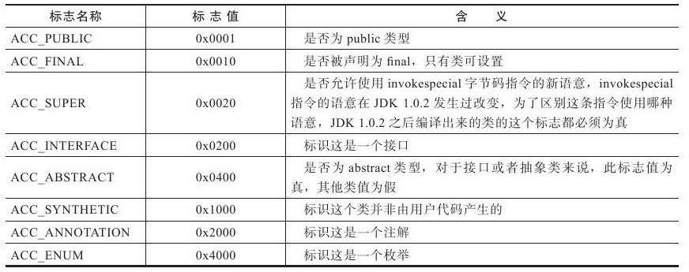
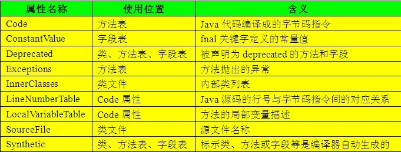

### **深入理解Java虚拟机 6 - 类文件结构**

### 1 概述

代码编译的结果从本地机器码转变为字节码，是存储格式发展的⼀⼩步，却是编程语⾔发展的⼀⼤步。由于虚拟机以及⼤量建⽴在虚拟机之上的程序语⾔如⾬后春笋般出现并蓬勃发展，将我们编写的程序编译成⼆进制本地机器码(Native Code)已不再是唯⼀的选择，越来越多的程序语⾔选择了与操作系统和机器指令集⽆关的、平台中⽴的格式作为程序编译后的存储格式。

### 2 无关性的基石

Java在刚刚诞⽣之时曾经提出过⼀个⾮常著名的宣传口号：“⼀次编写，到处运⾏”(Write Once,Run Anywhere)。Sun公司以及其他虚拟机提供商发布了许多可以运⾏在各种不同平台上的虚拟机，这些虚拟机都可以载⼊和执⾏同⼀种平台⽆关的字节码，从⽽实现了程序的“⼀次编写，到处运⾏”。字节码(ByteCode)是构成**平台⽆关性**的基⽯。

**语言无关性**是指其他语言也运行在Java虚拟机之上，例如Clojure, Jython, Scala等。实现语⾔⽆关性的基础仍然是虚拟机和字节码存储格式。Java虚拟机不和包括Java在内的任何语⾔绑定，它只与“Class⽂件”这种特定的⼆进制⽂件格式所关联，Class⽂件中包含了Java虚拟机指令集和符号表以及若⼲其他辅助信息。

### 3 Class类文件的结构

Class文件是一组以8位字节为基础单位的二进制流。当遇到需要占⽤8位字节以上空间的数据项时，以Big-Endian方式存储。Class文件采用一种类似于C语言结构体的伪结构来存储数据，这种伪结构中只有两种数据类型：无符号数和表。

⽆符号数属于基本的数据类型，以u1、u2、u4、u8来分别代表1、2、4和8个字节的⽆符号数，⽆符号数可以⽤来描述数字、索引引⽤、数量值或者按照UTF-8编码构成字符串值。

表是由多个⽆符号数或者其他表作为数据项构成的复合数据类型，所有表都习惯性地以“_info”结尾。


Class文件格式：

```C
ClassFile {
    u4			magic; 
    u2			minor_version;
    u2			major_version;
    u2			constant_pool_count;
    cp_info		contant_pool[constant_pool_count – 1];
    u2			access_flags;
    u2			this_class;
    u2			super_class;
    u2			interfaces_count;
    u2			interfaces[interfaces_count];
    u2			fields_count;
    field_info		fields[fields_count];
    u2			methods_count;
    method_info		methods[methods_count];
    u2			attributes_count;
    attribute_info	attributes[attributes_count];
}
```


#### magic number and version

每个Class⽂件的头4个字节称为**魔数**(Magic Number)，它的唯⼀作⽤是确定这个⽂件是否为⼀个能被虚拟机接受的Class⽂件，[可参考[Magic Number in OSC](../csapp/ch13.md/#file-types)]。Class⽂件的魔数的获得很有“浪漫⽓息”，值为：0xCAFEBABE(咖啡宝贝？)。

紧接着魔数的4个字节存储的是Class⽂件的版本号：第5和第6个字节是次版本号(Minor Version)，第7和第8个字节是主版本号(Major Version)。

以下面简短的Java代码为例，

```Java
public class TestClass{
    private int m;
    public int inc() {
        return m+1;
    }
}
```

编译后，使用[Classpy](http://ginobefunny.com/post/deep_in_jvm_notes_part4/)打开，


也可以直接用JDK工具javap分析Class文件字节码。

```java
$ unstandingJVM /usr/bin/javap -c -verbose TestClass.class 

  MD5 checksum ce62ee2f47f2ff81598bbcb156358747
  Compiled from "TestClass.java"
public class com.unstandingJVM.TestClass
  minor version: 0
  major version: 53
  flags: (0x0021) ACC_PUBLIC, ACC_SUPER
  this_class: #3                          // com/unstandingJVM/TestClass
  super_class: #4                         // java/lang/Object
  interfaces: 0, fields: 1, methods: 2, attributes: 1
Constant pool:
   #1 = Methodref          #4.#18         // java/lang/Object."<init>":()V
   #2 = Fieldref           #3.#19         // com/unstandingJVM/TestClass.m:I
   #3 = Class              #20            // com/unstandingJVM/TestClass
   #4 = Class              #21            // java/lang/Object
   #5 = Utf8               m
   #6 = Utf8               I
   #7 = Utf8               <init>
   #8 = Utf8               ()V
   #9 = Utf8               Code
  #10 = Utf8               LineNumberTable
  #11 = Utf8               LocalVariableTable
  #12 = Utf8               this
  #13 = Utf8               Lcom/unstandingJVM/TestClass;
  #14 = Utf8               inc
  #15 = Utf8               ()I
  #16 = Utf8               SourceFile
  #17 = Utf8               TestClass.java
  #18 = NameAndType        #7:#8          // "<init>":()V
  #19 = NameAndType        #5:#6          // m:I
  #20 = Utf8               com/unstandingJVM/TestClass
  #21 = Utf8               java/lang/Object
{
  public com.unstandingJVM.TestClass();
    descriptor: ()V
    flags: (0x0001) ACC_PUBLIC
    Code:
      stack=1, locals=1, args_size=1
         0: aload_0
         1: invokespecial #1                  // Method java/lang/Object."<init>":()V
         4: return
      LineNumberTable:
        line 3: 0
      LocalVariableTable:
        Start  Length  Slot  Name   Signature
            0       5     0  this   Lcom/unstandingJVM/TestClass;

  public int inc();
    descriptor: ()I
    flags: (0x0001) ACC_PUBLIC
    Code:
      stack=2, locals=1, args_size=1
         0: aload_0
         1: getfield      #2                  // Field m:I
         4: iconst_1
         5: iadd
         6: ireturn
      LineNumberTable:
        line 6: 0
      LocalVariableTable:
        Start  Length  Slot  Name   Signature
            0       7     0  this   Lcom/unstandingJVM/TestClass;
}
SourceFile: "TestClass.java"
```

#### constant pool

由于常量池(constant pool)中常量的数量是不固定的，所以在常量池的入口需要放置项u2类型的数据，代表常量池容量计数值(constant_pool_count)。常量池中主要存放两⼤类常量：字⾯量(Literal)和符号引⽤(Symbolic References)。字⾯量⽐较接近于Java语⾔层⾯的常量概念，如⽂本字符串、声明为final的常量值等。⽽符号引⽤则属于编译原理⽅⾯的概念，包括了下⾯三类常量：类和接口的全限定名(Fully Qualified Name)、字段的名称和描述符(Descriptor)，⽅法的名称和描述符。


#### access_flags

在常量池结束之后，紧接着的两个字节代表access_flags(访问标志)，这个标志⽤于识别⼀些类或者接⼜层次的访问信息，包括：这个Class是类还是接口；是否定义为public类型；是否定义为abstract类型；如果是类的话，是否被声明为final等。    





#### 类索引、⽗类索引与接口索引集合

类索引(this_class)和⽗类索引(super_class)都是⼀个u2类型的数据，⽽接口索引集合(interfaces)是⼀组u2类型的数据的集合，Class⽂件中由这三项数据来确定这个类的继承关系。

#### field_info

field_info(字段表)⽤于描述接口或者类中声明的变量。


字段修饰符放在access_flags中，包含ACC_PUBLIC(字段是否public)、ACC_PRIVATE(字段是否private)、ACC_PROTECTED(字段是否protected)、ACC_STATIC(字段是否static) 、ACC_VOLATILE(字段是否volatile)等。

<C>name_index</C>和<C>descriptor_index</C>都是对常量池的引⽤，分别代表着字段的简单名称以及字段和⽅法的描述符。

描述符的作用则是用来描述字段的数据类型、方法的参数列表（包括数量、类型以及顺序等）和返回值的。根据描述符规则，详细的描述符标示字的含义如下表所示：


TestClass的filed_info:


#### method_info

Class⽂件存储格式中对⽅法的描述与对字段的描述⼏乎采⽤了完全⼀致的⽅式，method_info(⽅法表)的结构如同字段表⼀样，依次包括了访问标志(access_flags)、名称索引(name_index)、描述符索引(descriptor_index)、属性表集合（attributes）⼏项。

⽅法⾥的Java代码，经过编译器编译成字节码指令后，存放在⽅法attribute_info(属性表集合)中⼀个名为“Code”的属性⾥⾯。

#### attribute_info

Java虚拟机规范中预定义了9项虚拟机应当能识别的属性（JDK1.5后又增加了一些新的特性，因此不止下面9项，但下面9项是最基本也是必要，出现频率最高的），如下表所示：




### 4 字节码指令简介
Java虚拟机的指令由⼀个字节长度的、代表着某种特定操作含义的数字(称为**操作码**，Opcode)以及跟随其后的零⾄多个代表此操作所需参数(称为**操作数**，Operands)⽽构成。

### 5 共有设计和私有设计

理解公有设计与私有实现之间的分界线是⾮常有必要的，Java虚拟机实现必须能够读取Class⽂件并精确实现包含在其中的Java虚拟机代码的语义。拿着Java虚拟机规范⼀成不变地逐字实现其中要求的内容当然是⼀种可⾏的途径，但⼀个优秀的虚拟机实现，在满⾜虚拟机规范的约束下对具 体实现做出修改和优化也是完全可⾏的，并且虚拟机规范中明确⿎励实现者这样做。

虚拟机实现的⽅式主要有以下两种：

* 将输⼊的Java虚拟机代码在加载或执⾏时翻译成另外⼀种虚拟机的指令集。
* 将输⼊的Java虚拟机代码在加载或执⾏时翻译成宿主机CPU的本地指令集（即JIT代码⽣成技术）。

### 6 Class文件结构的发展

相对于语⾔、API以及Java技术体系中其他⽅⾯的变化，Class⽂件结构⼀直处于⽐较稳定的状态，Class⽂件的主体结构、字节码指令的语义和数量⼏乎没有出现过变动，所有对Class⽂件格式的改进，都集中在向访问标志、属性表这些在设计上就可扩展的数据结构中添加内容。