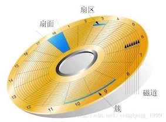
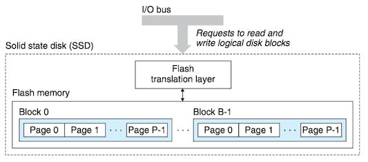
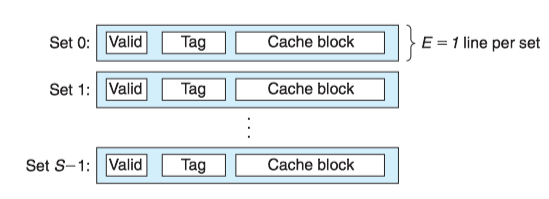
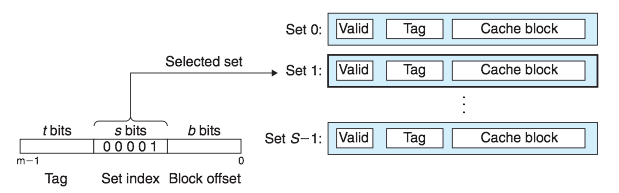
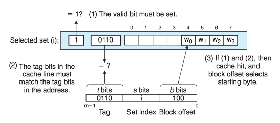
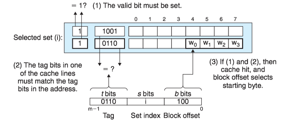
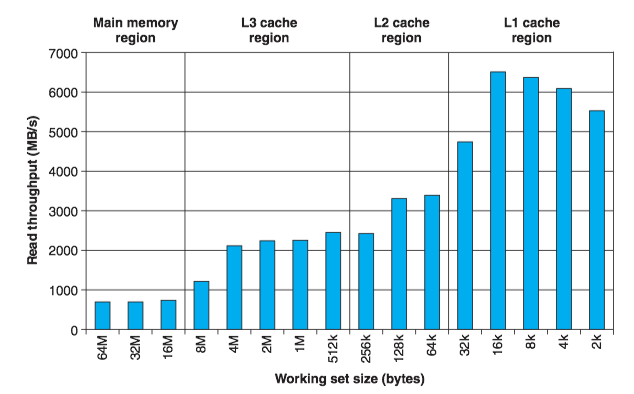

### **Chapter 6 存储器层次结构**

**存储器系统**(memory system)是一个具有不同 _容量_ 、 _成本_ 和 _访问时间_ 的存储设备的层次结构。

**局部性**(locality)：具有良好局部性的程序倾向于一次又一次地访问相同的数据项集合，或是倾向于访问邻近的数据项集合。

### 1 存储技术


#### 随机访问存储器

**随机访问存储器**(Random-Access Memory, RAM)分为两类：**静态**(SRAM)和**动态**(DRAM)的。

* SRAM比DRAM更快，但也贵得多。
* SRAM用来作为高速缓存存储器。
* DRAM用来作为主存以及图形系统的桢缓冲区。
* SRAM一般不会超过几兆字节。
* DRAM有几百或几千兆字节。


#### 磁盘存储

磁盘是由**盘片**(platter)构成的。每个盘片如同切西瓜一样被“切”成一块一块的扇面，同时沿着半径的方向被划分成了一组同心圆(**磁道**, track)，每条磁道被扇面切成很多的扇形区域叫做**扇区**（sector, 扇区是从磁盘读出和写入信息的最小单位，包含相等数量的数据位，通常为512字节），不同盘片上的同半径磁道组成了柱面。



磁盘的容量： 磁头数 × 磁道数 × 每道扇区数 × 每扇区字节数

#### 固态硬盘

**固态硬盘**(Solid State Disk, SSD)，由一个或多个闪存芯片和闪存翻译层(flash translation layer)组成。

* 闪存芯片存储内容。
* 闪存翻译层对逻辑块的请求翻译成对底层物理设备的访问。





### 2 局部性

一个编写良好的计算机程序常常具有良好的**局部性**(locality)。也就是，它们倾向于引用*邻近于*其他最近引用过的数据项的数据项(**空间局部性**)，或者*最近*引用过的数据项本身(**时间局部性**)。 这种倾向性，被称为**局部性原理**(principle of locality)或访**问局部性**(locality of reference)。

有良好局部性的程序比局部性差的程序运行得更快。现代计算机系统的各个层次，从硬件到操作系统、再到应用程序，它们的设计都利用了局部性。

* 在硬件层，通过引入高速缓存来保存最近被引用的指令和数据项，从而提高贮存的访问速度。
* 在操作系统级，系统使用主存作为虚拟地址空间最近被引用块的高速缓存。
* Web浏览器将最近被引用的文档放在本地磁盘上。


量化评价程序中局部性的一些简单原则：

* 重复引用相同变量的程序具有良好的时间局部性。
* 对于具有步长为$k$的引用模式的程序，步长越好，空间局部性越好。
* 对于取指令来说，循环有好的时间和空间局部性。

``` C
// for循环体里的指令是按照连续的顺序执行的，因此循环具有良好的空间局部性。因为循环体会被执行多次，因此也有良好的时间局部性。
int sumvec(int v[N]){
    int i, sum = 0;
    for (i=0; i< N; i++)
        sum += v[i];
    return sum;
}
```


### 3 存储器层次结构 Memory Hierarchy

一般而言，从高层往低层走，存储设备变得更慢、更便宜和更大。

* 在最高层(L0)，是少量快速的CPU寄存器，CPU可以在一个时钟周期内访问它们。
* 接下来是一个或多个小型到中型的基于SRAM的高速缓存存储器，可以在几个CPU时钟周期内访问它们。
* 然后是一个大的基于DRAM的贮存，可以在几十到几百个时钟周期内访问它们。
* 接下来是慢速但容量很大的本地磁盘。
* 最后，有些系统包括了远程服务器上的磁盘，要通过网络来访问它们。


#### 存储器层次结构中的缓存
存储器层次结构的中心思想是，对于每个$k$，位于$k$层的更快更小的存储设备作为位于$k+1$层的更大更慢的存储设备的缓存。换句话说，层次结构中的每一层都缓存来自较低一层的数据对象。

* 第$k+1$层的存储器被划分为连续的数据对象组块(chunk)，称为块(block)。
* 每个块都有一个唯一的地址。
* 块的大小可以是固定的(通常)，也可以是可变的(例如存储在Web服务器上的HMTL文件).
* 数据总是以块大小为传送单元在第$k$层和第$k+1$层之间来回复制。在层次结构中任何一对相邻的层次之间块大小是固定的(第$k$层和第$k+1$层块大小一致)，但是其他的层次对之间可以有不同的块大小。


当程序需要第$k+1$层的某个数据对象$d$时，它首先在当前存储在第$k$层的一个块中查找$d$。如果$d$刚好缓存在第$k$层中，即**缓存命中**(cache hit)，否则**缓存不命中**(cache miss)。


现代系统中到处都使用了缓存。


### 4 高速缓存存储器

#### 通用的高速缓存存储器组织结构

考虑一个计算机系统，其中每个存储器地址有$m$位，形成$M=2^m $个不同的地址。这样一个机器的高速缓存被组织成一个有$S=2^s $个**高速缓存组**(cache set)的数组。

* 每个组包含$E$个**高速缓存行**(cache line)。
* 每个行是由一个$B=2^b $字节的数据块(block)组成的。
* 一个**有效位**(valid bit)指明这个行是否包含有意义的信息。
* 有$t=m-(b+s)$个**标记位**(tag bit)唯一地标识存储在这个高速缓存行中的块。


高速缓存的大小$C$是指所有块的大小的和，$C=S\times E\times B$.

* 每个组只有一行($E=1$)的高速缓存称为**直接映射高速缓存**；
* 每个组有多行($E>1$)的高速缓存称为**组相联高速缓存**；
* 一个包含所有高速缓存行的组($E=C/B$)，称为**全相联高速缓存**。

#### 直接映射高速缓存

每个组只有一行($E=1$)的高速缓存称为**直接映射高速缓存**(Direct-Mapped Caches)。



假设我们有这样一个系统，它有一个CPU、一个寄存器文件、一个L1高速缓存和一个主存。当CPU执行一条读内存字$w$的指令，它向L1高速缓存请求这个字。

* 如果L1高速缓存有$w$的一个缓存的副本，那么就得到L1高速缓存命中。高速缓存会很快抽取出$w$，并将它返回给CPU。
* 否则就是缓存不命中，CPU必须等待被请求的块最终从内存达到时，L1高速缓存将这个块房子它的一个高速缓存行里，从被存储的块中抽取出字$w$，然后将它返回给CPU。


高速缓存确定一个请求是否命中，然后抽取出被请求的字的过程，分为三步：

* 组选择(set selection)
* 行匹配(line matching)
* 字抽取(word extraction)

**1.直接映射高速缓存中的组选择**

高速缓存从$w$的地址中间抽取出$s$个**组索引**(Set index)位。



**2.直接映射高速缓存中的行匹配**

由于直接映射高速缓存中的每个组只有一行，因此当且仅当设置了有效位(valid bit)，而且高速缓存行中的标记(tag)与$w$的地址中的标记相匹配时，这一行中包含$w$的一个副本。



**3.直接映射高速缓存中的字选择**

一旦命中，我们知道$w$就在这个块中的某个地方。最后一步确定所需要的字在块中是从哪里开始的。块偏移(block offset)提供了所需要的字的第一个字节的偏移。


**4.接映射高速缓存中不命中时的行替换**

如果缓存不命中，那么它需要从存储器层次结构的下一层去除被请求的块，然后将新的块存储在组索引位指示的组中的一个高速缓存行中。

* 如果组中都是有效高速缓存行，则必须要驱除出一个现存的行。
* 对于直接映射高速缓存来说，每个组只包含一行，用新取出的行替换当前的行。

**5.直接映射高速缓存中的冲突不命中**
 
 当程序访问大小为2的幂的数组时，直接映射高速缓存通常会发生**冲突不命中**(conflit miss)。例如，考虑一个计算两个向量点积的函数：
 
```C
float dotprod(float x[8], float y[8]) { 
    float sum = 0.0; int i;
    for (i = 0; i < 8; i++) 
        sum += x[i] * y[i];
    return sum;
}
```

假设高速混存由两个组组成，每个组容纳4个浮点数。浮点数是4个字节，$x$被加载到从地址0开始的32字节连续内存中，而$y$紧跟在$x$之后，从地址32开始。 每个$x[i]$和$y[i]$会映射到相同的高速缓存组：


* 在运行时，循环的第一次迭代引用$x[0]$，缓存不命中会导致包含$x[0]-x[3]$的块被加载到组0.
* 接下来，引用$y[0]$，缓存不命中会导致包含$y[0]-y[3]$的块被加载到组0，覆盖前一次引用复制进来的x的值。
* 在下一次迭代中，对$x[1]$的引用不命中，导致$x[0]-x[3]$的块被重新加载到组0，覆盖掉$y[0]-y[3]$的块。


这种现象，*高速缓存反复地加载和驱逐相同的高速缓存组*，叫做<b><big>抖动</big></b>(thrashing)。


 
#### 组相联高速缓存

**组相联高速缓存**(set associative cache)的每个组都保存有多于一个的高速缓存行。一个$1<E<C/B$的高速缓存通常称为**E路组相联高速缓存**(E-way set associative cache)。


**1. 组相联高速缓存中的组选择**

它的组选择和直接映射高速缓存的组选择一样，组索引(set index)位标识组。


**2. 组相联高速缓存中的行匹配和字选择**

它必须检查多个行的标记位和有效位，以确定所请求的字是否在组中。

**相联存储器**(associative memory)是一个(key, value)对的数组，以key为输入，返回与输入的key相匹配的(key, value）对中的value值。我们可以把相联高速缓存的每个组看成一个小的相联存储器，key是标记和有效位，而value就是块的内容。

组中的任何一行都可以包含任何映射到这个组的内存块。所以高速缓存必须搜索组中的每一行，寻找一个有效的行，其标记与地址中的标记相匹配。如果找到了这样一行，那么块偏移就从这个块中选择一个字。



**3. 组相联高速缓存中不命中时的行替换**

如果CPU请求的字不在组的任何一行中，那么就是缓存不命中，高速缓存必须从内存中取出包含这个字的块，然后进行替换。该替换哪个行呢？

* 如果组中有一个空行，那么它就是个很好的候选。
* 如果组中没有空行，必须从中选择一个非空的行。有如下几个替换策略：
    * **最不常使用**(Least-Frequently-Used, LFU)策略会替换在过去某个时间窗口内引用次数最少的那一行。
    * **最近最少使用**(Least-Recently-Used, LRU)策略会替换最后一个访问时间最久远的那一行。 


#### 全相联高速缓存

一个包含所有高速缓存行的组($E=C/B$)，称为**全相联高速缓存**。 因为高速缓存电路必须并行地搜索许多相匹配的标记，构造一个又大又快的全相联高速缓存很困难，并且很昂贵。因此，全相联高速缓存只适合做小的高速缓存(例如MMC中的TLB)。


### 5 编写高速缓存友好的代码
### 6 高速缓存对程序性能的影响

#### 存储器山

一个程序从存储系统中读数据的速率称为 **读吞吐量**(read throughput)。**存储器山**(memory mountain)是一个读吞吐量的时间和空间局部性的二维函数。

* 通过不同的size(对应时间局部性)和stride(对应空间局部性)的值产生存储器山。
* size值越小，得到的工作集越小，时间局部性越好。
* stride值越小，空间局部性越好。

Intel Core i7的存储器山：


Core i7的存储器山展现了一个很丰富的结构：

* 垂直于size轴的是四条山脊，分别对应于完全在L1高速缓存、L2高速缓存、L3高速缓存和主存内的时间局部性区域。
* 在L2、L3和主存山脊上，随着步长的增加，有一个空间局部性的斜坡，空间局部性下降。




