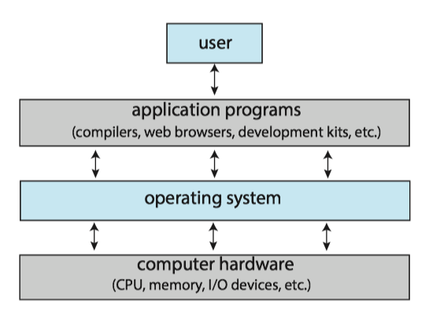
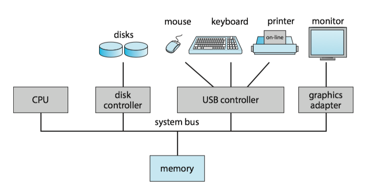
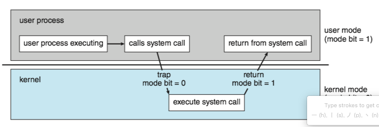
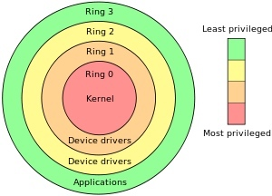

### **Operating System Concepts 1 - Introduction**
### 1. What operating system do 

There is no completely adequate definition of operating system. A simple viewpoint is that it includes everything a vendor ships. A more common definition is that the _operating system is the one program running at all times on computer - usually  called **kernel**_ . 

Three main **purposes** of an operating system are,

* manages a computer's hardware
* provides a basis for application programs
* acts as an intermediary between the user and hardware

The operating system includes the always running **kernel**, **middleware** frameworks that ease application development and provide features, and **system programs** that aid in managing the system while it is running.

Anything between the kernel and user applications is considered **middleware**(中间件) [[1](https://en.wikipedia.org/wiki/Middleware)].

### 2 Computer-system organisation

A computer system can be divided roughly into four components: the **hardware**, the **operating system**, the **application programs**, and a **user**.

A **computer system**(计算机系统) consists of one or more **CPUs** and a number of **device controllers**(设备控制器) connected through a common **bus**(总线) that provides access between components and shared **memory**.

A **device controller** maintains some **local buffer storage**(局部缓冲存储) and a set of special-purpose **registers**.
****
Typically, operating systems have a **device driver**(设备驱动) for each device controller. This device driver understands the device controller and provides the rest of the operating system with a uniform interface to the device

#### Interrupt

When the CPU is **interrupted**, it stops what it is doing and immediately transfers execution to a fixed location. The fixed location usually contains the starting address where the service routine for the interrupt is located.

The **interrupt routine**(中断程序) is called indirectly through the interrupt vector table（中断向量表).

* Generally, the table of pointers is stored in low memory (the first hundred or so locations).
* These locations hold the addresses of the interrupt service routines for the various devices.
* Interrupt vector is then indexed by a unique number(interrupt vector number, 中断向量号)
* interrupt priority levels(中断优先级)

Some **services** are provided outside of the kernel by system programs that are loaded into memory at boot time to become system **daemons**, which run the entire time the kernel is running.

#### interrupt, exception, trap

Unfortunately, there is no clear consensus as to the exact meaning of these terms(exceptions, faults, aborts, traps, and interrupts). Different authors adopt different terms to their own use [[ref](http://www.plantation-productions.com/Webster/www.artofasm.com/DOS/pdf/ch17.pdf)].

**trap**(陷阱) or **exception**(异常): a software-generated interrupt either by an error（e.g. division by zero, or invalid memory access or by a system call.
* usual way to invoke a kernel routine (a system call) 

**interrupt**(中断):  generated by the hardware (devices like the hard disk, graphics card, I/O ports, etc).

####  multiprogramming and multitasking

**Multiprogramming**(多道程序) explained:

* The operating system **keeps several processes in memory** simultaneously. 
* The operating system picks and begins to execute one of these processes.
* Eventually, the process may have to wait for some task, such as an I/O operation, to complete.
* When that process needs to wait, the CPU **switches** to another process, and so on.
*  Eventually, the first process finishes waiting and gets the CPU back. As long as at least one process needs to execute, the **CPU is never idle**.
 
**Multitasking**(多任务) is a logical **extension** of multiprogramming. In multitasking systems, the CPU executes multiple processes by switching among them, but the switches occur **frequently**, providing the user with a **fast** response time.
####  dual-mode

In order to ensure the proper execution of the system, we must be able to distinguish between the execution of operating-system code（**kernel mode**）and user-defined code (**user mode**).

**Mode bit**(模式位), is added to the hardware of the computer to indicate the current mode: kernel (0) or user (1).

The concept of modes can be **extended** beyond two modes.
 
* **protection rings**（保护环) are mechanisms to protect data and functionality from faults (by improving fault tolerance) and malicious behavior (by providing computer security). 

* For intel processors, ring 0 is kernel mode and ring 3 is user mode

####  timer

A timer (定时器) can  be set to interrupt the computer after a specified period( usually, 100s hz)

* A variable timer is generally implemented by a fixed-rate clock and a counter. 
* The operating system sets the counter. Every time the clock ticks, the counter is decremented. 
* When the counter reaches 0, an interrupt occurs.

### 7 virtualization

**virtualization**(虚拟化) is a technology that allows us to abstract the hardware of a single computer into several different execution environments, thereby creating the illusion that _*each separate environment is running on its own private computer*_ .
* v.s. [different] Emulation involves simulating computer handware in software.

### 8 Free and Open-Source OS
 
Open-source OS

* source code available
* opposite: closed-source OS

Free OS

* source code available
* allow no-cost use, redistribution, and modification

Arguably, open-source code is **more secure** than closed-source code because many more eyes are viewing the code.
 
 e.g. OS
 
 *  GNU/Linux
 *  FreeBSD
 *  Solaris