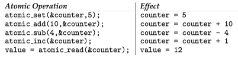
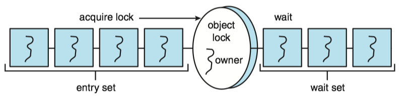

### **Operating System Concepts 7 - Synchronization Examples**

### 1 Classic Problems of Synchronization
#### The Bounded Buffer Problem

We consider the producer-consumer problem with [bounded buffer](ch3/#5-ipc-in-shared-memory-system). The producer and consumer processes share the following data structures:

```c
int n;
semaphore mutex = 1;
semaphore empty = n;
semaphore full = 0;
```

* We assume that the pool consists of \(n\) buffers, each capable of holding one item.
* The `mutex` binary semaphore provides mutual exclusion for accesses to the buffer pool and is initialized to the value 1.
* The `empty` and `full` semaphores count the number of empty and full buffers.


```C
// The code for the producer process:
while (true) {
    . . .
    /* produce an item in next produced */ 
    . . . 
    wait(empty); 
    wait(mutex); 
    . . .
    /* add next produced to the buffer */ 
    . . . 
    signal(mutex); 
    signal(full);
}


//The code for the consumer process:
while (true) {
    wait(full); 
    wait(mutex);
    . . .
    /* remove an item from buffer to next consumed */
    . . . 
    signal(mutex); 
    signal(empty);
    . . .
    /* consume the item in next consumed */
    . . .
}
```

#### The Readers–Writers Problem

Suppose that a database is to be shared among several concurrent processes. 

* Some of these processes may want only to read the database, whereas others may want to update(that is, read and write) the database.
* If two readers access the shared data simultaneously, no adverse effects will result.
* If a writer and some other processes (either a reader or a writer) access the database simultaneously, chaos may ensue.

Three variables are used: **`mutex`**, **`rw_mutex`**, **`readcnt`** to implement solution.

```c
semaphore rw_mutex = 1; 
semaphore mutex = 1; 
int read count = 0;
```

* semaphore **`mutex`**:  used to ensure mutual exclusion when `readcnt` is updated i.e. when any reader enters or exit from the critical section.
* semaphore **`rw_mutex`**: used by both readers and writers.
* int **`readcnt`**: the number of processes performing read in the critical section, initially 0.

Writer processes:

1. Writer requests the entry to critical section.
2. If allowed i.e. `wait()` gives a true value, it enters and performs the write. If not allowed, it keeps on waiting.
3. It exits the critical section.

```c
do {
    // writer requests for critical section
    wait(rw_mutex);  
   
    // performs the write

    // leaves the critical section
    signal(rw_mutex);

} while(true);
```

Reader process:

1. Reader requests the entry to critical section.
2. If allowed:
    * It increments the count of number of readers inside the critical section. If this reader is the first reader entering, it locks the `rw_mutex` semaphore to restrict the entry of writers if any reader is inside.
    * It then, signals `mutex` as any other reader is allowed to enter while others are already reading.
    * After performing reading, it exits the critical section. When exiting, it checks if no more reader is inside, it signals the semaphore `rw_mutex` as now, writer can enter the critical section.
3. If not allowed, it keeps on waiting.

```c
do {
   // Reader wants to enter the critical section
   wait(mutex);

   // The number of readers has now increased by 1
   readcnt++;                          

   // there is at least one reader in the critical section
   // this ensure no writer can enter if there is even one reader
   // thus we give preference to readers here
   if (readcnt==1)     
      wait(rw_mutex);                    

   // other readers can enter while this current reader is inside 
   
   // the critical section
   signal(mutex);                   

        ...
   /* current reader performs reading here */
        ...
   
   wait(mutex);   // a reader wants to leave

   readcnt--;

   // that is, no reader is left in the critical section,
   if (readcnt == 0) 
       signal(rw_mutex);         // writers can enter

   signal(mutex); // reader leaves

} while(true);
```

#### The Dining-Philosophers Problem

The dining-philosophers problem is an example of a large class of concurrency-control problems. It is a simple representation of the need to allocate several resources among several processes in a deadlock-free and starvation-free manner.

Consider five philosophers who spend their lives thinking and eating. 

* The philosophers share a circular table surrounded by five chairs, each belonging to one philosopher. 
* In the center of the table is a bowl of rice, and the table is laid with five single chopsticks.
* When a philosopher thinks, she does not interact with her colleagues.
* From time to time, a philosopher gets hungry and tries to pick up the two chopsticks that are closest to her (the chopsticks that are between her and her left and right neighbors). 
* A philosopher may pick up only one chopstick at a time. Obviously, she cannot pick up a chopstick that is already in the hand of a neighbor.
*  When a hungry philosopher has both her chopsticks at the same time, she eats without releasing the chopsticks. 
*  When she is finished eating, she puts down both chopsticks and starts thinking again


[Java solution of Dining Philosophers Problem](../cpj/ch1.md/#dining-philosophers)


### 2 Synchronization within the Linux Kernel

Linux provides several different mechanisms for synchronization in the kernel. 

The synchronization methods discussed here to synchronization within the kernel and are therefore available only to kernel developers.

#### Atomic integer

The simplest synchronization technique within the Linux kernel is an atomic integer, which is represented using the *[opaque data type](https://en.wikipedia.org/wiki/Opaque_data_type)* `atomic_t`. All math operations using atomic integers are performed without interruption.


Atomic integers are particularly efficient in situations where an integer variable—such as a counter—needs to be updated, since atomic operations do not require the overhead of locking mechanisms:



#### Locks

In situations where there are several variables contributing to a possible race condition, more sophisticated locking tools must be used. Mutex locks are available in Linux for protecting critical sections within the kernel. Here, a task must invoke the `mutex_lock()` function prior to entering a critical section and the` mutex_unlock()` function after exiting the critical section.

Linux also provides spinlocks and semaphores (as well as reader–writer versions of these two locks) for locking in the kernel. 

Both spinlocks and mutex locks in the Linux kernel are ***nonrecursive***, which means that if a thread has acquired one of these locks, it cannot acquire the same lock a second time without first releasing the lock. Otherwise, the second attempt at acquiring the lock will block.

Linux provides two simple system calls — `preempt_disable()` and `preempt_enable()` —for disabling and enabling kernel preemption.

### 3 POSIX Synchronization

The POSIX API is available for programmers at the user level and is not part of any particular operating-system kernel.

#### POSIX Mutex Locks

Pthreads uses the `pthread_mutex_t` data type for mutex locks.

* A mutex is created with the pthread `mutex_init()` function.
* The mutex is acquired and released with the pthread `mutex_lock()` and pthread `mutex_unlock()` functions.

```C
#include <pthread.h>
pthread_mutex_t mutex; 

/* create and initialize the mutex lock */ 
pthread_mutex_init(&mutex, NULL);

/* acquire the mutex lock */
 pthread mutex_lock(&mutex); 

/* critical section */ 

/* release the mutex lock */ 
pthread mutex_unlock(&mutex);
```

#### POSIX Spinlocks

```c
// 初始化自旋锁： 用来申请使用自旋锁所需要的资源并且将它初始化为非锁定状态
int pthread_spin_init(pthread_spinlock_t *, int);
// 获得一个自旋锁：如果该自旋锁当前没有被其它线程所持有，则调用该函数的线程获得该自旋锁.
// 否则该函数在获得自旋锁之前不会返回。
int pthread_spin_lock(pthread_spinlock_t *);
//释放指定的自旋锁
int pthread_spin_unlock(pthread_spinlock_t *);
// 销毁一个自旋锁
int pthread_spin_destroy(pthread_spinlock_t *);
```


#### POSIX Semaphores

Semaphores are not part of the POSIX standard and instead belong to the POSIX SEM extension. POSIX specifies two types of semaphores - **named** and **unnamed** semaphores.

The advantage of named semaphores is that multiple unrelated processes can easily use a common semaphore as a synchronization mechanism by simply referring to the semaphore’s name.

Both Linux and macOS systems provide POSIX named semaphores.

```C
#include <semaphore.h>
sem_t *sem;

/* Create the semaphore and initialize it to 1 * Here, we are naming the semaphore SEM.
* The O_CREAT flag indicates that the semaphore will be created if it does not already exist.
* The parameter 0666 indicates that the semaphore has read/write access for other processes.
* The parameter 1 indicates that the semaphore is initialized to 1.
*/

sem = sem_open("SEM", O_CREAT, 0666, 1);

/* acquire the semaphore */
sem_wait(sem);

/* critical section */

/* release the semaphore */
sem_post(sem);
```

#### POSIX Condition Variables


### 4 Synchronization in Java

The Java language and its API have provided rich support for thread synchronization.


#### Java Monitors


> Entities possessing both locks and wait sets are generally called ***monitors*** (although almost every language defines details somewhat differently). Since every <C>Object</C> in Java has a lock and a wait set that is manipulated only by methods wait, notify, notifyAll. Any  <C>Object</C> can be serve as a monitor. <small>[Concurrent Programming in Java 3.2.2 Monitor Mechanics]</small>


Every object in Java has associated it with a single lock. When a method is declared to be <C>synchronized</C>, calling the method requires owning the lock for the object.

* Invoking a <C>synchronized</C> method requires owning the lock on an object instance. 
* If the lock is already owned by another thread, the thread calling the <C>synchronized</C> method blocks and is placed in the **entry set** for the object's lock. 
* The entry set represents the set of threads waiting for the lock to become available.
* If the lock is available when a <C>synchronized</C> method is called, the calling thread becomes the owner of the object's lock and can enter the method.
* The lock is released when the thread exits the method.
* If the entry set for the lock is not empty when the lock is released, the JVM arbitrarily selects a thread from this set to be the owner of the lock.

In addition to having a lock, every object also has associated with it a **wait set** consisting of a set of threads.
 
* This wait set is initially empty. 
* When a thread enters a <C>synchronized</C> method, it owns the lock for the object.
* However, this thread may determine that it is unable to continue because a certain condition has not been met. (e.g. if the producer calls the <C>insert()</C> method and the buffer is full)
* The thread then will release the lock and wait until the condition that will allow it to continue is met.


When a thread calls the <C>wait()</C> method, the following happens:

1. The thread releases the lock for the object.
2. The state of the thread is set to blocked.
3. The thread is placed in the wait set for the object.




#### Reentrant Locks

Perhaps the simplest locking mechanism available in the API is the <C>ReentrantLock</C>. A <C>ReentrantLock</C> is owned by a single thread and is used to provide mutually exclusive access to a shared resource. It provides several additional features, such as setting a *fairness* parameter, which favors granting the lock to the longest-waiting thread.


A thread acquires a <C>ReentrantLock</C> lock by invoking its <C>lock()</C> method. If the lock is available - or if the thread invoking <C>lock()</C> already owns it, <C>lock()</C> assigns the invoking thread lock ownership and return control.


```Java
Lock key = new ReentrantLock();
key.lock(); 
try {
    /* critical section */ 
} finally {
    key.unlock(); 
}
```

#### Semaphores

The Java API also provides a counting semaphore. The constructor for the semaphore appears as

```Java
Semaphore(int value);
```

where <C>value</C> specifies the initial value of the semaphore ( a negative value is allowed). The <C>acquire</C> method throws an <C>InterruptedException</C> if the acquiring thread is interrupted.


The following example illustrates using a semaphore for mutual exclusion:

```Java
Semaphore sem = new Semaphore(1);

try { 
    sem.acquire();
     /* critical section */ 
} catch (InterruptedException ex) { 
} finally {
    sem.release(); 
}
```

> Class <C>Semaphore</C> is a counting semaphore. Conceptually, a semaphore maintains a set of permits. Each <i>acquire()</i> blocks if necessary until a permit is available, and then takes it. Each <i>release()</i> adds a permit, potentially releasing a blocking acquirer. However, no actual permit objects are used; the <C>Semaphore</C> just keeps a count of the number available and acts accordingly. <small>[Java DOC - Semaphore](http://docs.oracle.com/javase/9/docs/api/java/util/concurrent/Semaphore.html)</small>


#### Condition Variables

**Condition variables** provide functionality similar to the <C>wait()</C> and <C>notify()</C> methods. To provide mutual exclusion, a condition variable must be associated with a <C>ReentrantLock</C>.

We create a condition variable by first creating a <C>ReentrantLock</C> and invoking its <C>newCondition()</C> method, which returns a <C>Condition</C> object representing the condition variable for the associated <C>ReentrantLock</C>.


```Java
Lock lock = new ReentrantLock();
Condition condVar = lock.newCondition();
```

Once the condition variable has been obtained, we can invoke its `await()` and `signal()` methods.


**Java Solution of Buffered Buffer Using condition variables**

[JAVA DOC - Interface Condition](http://docs.oracle.com/javase/9/docs/api/java/util/concurrent/locks/Condition.html)

Suppose we have a bounded buffer which supports <C>put</C> and <C>take</C> methods. If a <C>take</C> is attempted on an empty buffer, then the thread will block until an item becomes available; if a <C>put</C> is attempted on a full buffer, then the thread will block until a space becomes available. We would like to keep waiting <C>put</C> threads and <C>take</C> threads in separate wait-sets so that we can use the optimization of only notifying a single thread at a time when items or spaces become available in the buffer. This can be achieved using two Condition instances.


```Java
class BoundedBuffer {
   final Lock lock = new ReentrantLock();
   final Condition notFull  = lock.newCondition(); 
   final Condition notEmpty = lock.newCondition(); 

   final Object[] items = new Object[100];
   int putptr, takeptr, count;

   public void put(Object x) throws InterruptedException {
     lock.lock();
     try {
       while (count == items.length)
         notFull.await();
       items[putptr] = x;
       if (++putptr == items.length) putptr = 0;
       ++count;
       notEmpty.signal();
     } finally {
       lock.unlock();
     }
   }

   public Object take() throws InterruptedException {
     lock.lock();
     try {
       while (count == 0)
         notEmpty.await();
       Object x = items[takeptr];
       if (++takeptr == items.length) takeptr = 0;
       --count;
       notFull.signal();
       return x;
     } finally {
       lock.unlock();
     }
   }
}
```


#### Atomic Variables
[Java Tutorial - Atomic Variables](https://docs.oracle.com/javase/tutorial/essential/concurrency/atomicvars.html)

The <C>java.util.concurrent.atomic</C> package defines classes that support atomic operations on single variables:

* <C>AtomicBoolean</C>: A <C>boolean</C> value that may be updated atomically.
* <C>AtomicInteger</C>: An <C>int</C> value that may be updated atomically
* <C>AtomicReference</C>: An object reference that may be updated atomically.

All classes have <C>get</C> and <C>set</C> methods that works like reads and writes on <C>volatile</C> variables. That is, a <C>set</C> has a happens-before relationship with any subsequent <C>get</C> on the same variable. The atomic <C>compareAndSet</C> method also has these memory consistency features, as do the simple atomic arithmetic methods that apply to integer atomic variables.

Suppose we have a <C>Counter</C> class:

```Java
class Counter {
    private int c = 0;
    public void increment() {
        c++;
    }
    public void decrement() {
        c--;
    }
    public int value() {
        return c;
    }
}
```

One way to keep <C>Counter</C> free from race condition, is to make its methods as <C>synchronized<C> methods. Another way is to replace the <C>int</C> filed with an <C>AtomicInteger</C>:

```
import import java.util.concurrent.atomic.AtomicInteger;

class AtomicCounter {
    private AtomicInteger c = new AtomicInteger(0);

    public void increment() {
        c.incrementAndGet();
    }

    public void decrement() {
        c.decrementAndGet();
    }

    public int value() {
        return c.get();
    }
}
```