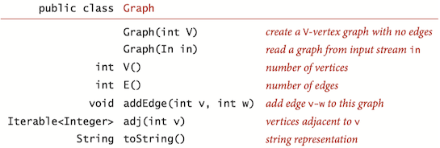
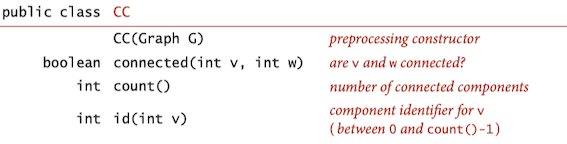
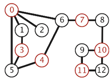
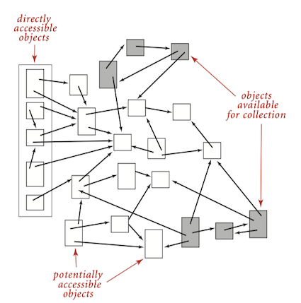
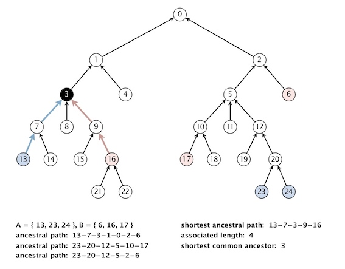

### UnDirected Graph


> A *graph* is a set of *vertices* and a collection of *edges* that each connect a pair of vertices.

#### Glossary

* A *path* in a graph is a sequence of vertices connected by edges.
* A *simple path* is one with no repeated vertices. 
* A *cycle* is a path with at least one edge whose first and last vertices are the same. 
* A *simple cycle* is a cycle with no repeated edges or vertices (except the requisite repetition of the first and last vertices). The length of a path or a cycle is its number of edges.
* A *self-loop* is an edge that connects a vertex to itself.
* A graph is *connected* if there is a path from every vertex to every other vertex in the graph. A graph that is not connected consists of a set of *connected components*, which are maximal connected subgraphs.
* An *acyclic* graph is a graph with no cycles. A tree is an *acyclic* connected graph.
* A disjoint set of trees is called a *forest*. A *spanning tree* of a connected graph is a subgraph that contains all of that graph’s vertices and is a single tree. A *spanning forest* of a graph is the union of spanning trees of its connected components.

#### API



Use the adjacency-lists representation, where we maintain a vertex-indexed array of lists of the vertices connected by an edge to each vertex.


```Java
public class Graph {
    private final int V;
    private int E;
    private LinkedList<Integer>[] adj;

    // Initializes an empty graph with V vertices and 0 edges.
    public Graph(int V) {
        this.V = V;
        this.E = 0;
        adj =  (LinkedList<Integer>[]) new LinkedList<?>[V];
        for (int v = 0; v < V; v++)
            adj[v] = new LinkedList<>();
    }
    
    // Returns the number of vertices in this graph.
    public int V() {
        return V;
    }

    // Returns the number of edges in this graph.
    public int E() {
        return E;
    }

    // Adds the undirected edge v-w to this graph.
    public void addEdge(int v, int w) {
        E++;
        adj[v].add(w);
        adj[w].add(v);
    }


    // Returns the vertices adjacent to vertex v.
    public Iterable<Integer> adj(int v) {
        return adj[v];
    }

    // Returns the degree of vertex v.
    public int degree(int v) {
        return adj[v].size();
    }
}
```
#### DFS

DFS (to visit a vertex $v$)

* Mark $v$ as visited.
* Recursively visit all unmarked vertices $w$ adjacent to $v$.

DFS marks all the vertices connected to a given source in time proportional to the sum of their degrees.


```Java
public class DepthFirstSearch {
    private boolean[] marked;    // marked[v] = is there an s-v path?
    private int count;           // number of vertices connected to s

    // Computes the vertices in graph G that are
    // connected to the source vertex s.
    public DepthFirstSearch(Graph G, int s) {
        marked = new boolean[G.V()];
        dfs(G, s);
    }

    // depth first search from v
    private void dfs(Graph G, int v) {
        count++;
        marked[v] = true;
        for (int w : G.adj(v)) {
            if (!marked[w]) dfs(G, w); 
    }
}
```

Typical applications.

* Find all vertices connected to a given source vertex. 
* Find a path between two vertices.

#### Finding Paths

***Single-source paths***. Given a graph and a source vertex $s$, support queries of the form: Is there a path from $s$ to a given target vertex $v$? If so, find such a path.


```Java
public class Paths {
    private boolean[] marked;    // marked[v] = is there a s-v path?
    private int[] edgeTo;        // edgeTo[v] = last edge on s-v path
    private final int s;         // source vertex

    // Computes a path between s and every other vertex in graph G.
    public Paths(Graph G, int s) {
        this.s = s;
        edgeTo = new int[G.V()];
        marked = new boolean[G.V()];
        dfs(G, s);
    }

    // depth first search from v
    private void dfs(Graph G, int v) {
        marked[v] = true;
        for (int w : G.adj(v))
            if (!marked[w]) {
                edgeTo[w] = v;
                dfs(G, w);
            }
    }

    // Is there a path between the source vertex s and vertex v?
    boolean hasPathTo(int v) {
        return marked[v];
    }

   // Returns a path between the source vertex s and vertex v, 
   // or null if no such path.
    public Iterable<Integer> pathTo(int v) {
        if (!hasPathTo(v)) return null;
        Stack<Integer> path = new Stack<Integer>();
        for (int x = v; x != s; x = edgeTo[x]) path.push(x);
        path.push(s);
        return path;
    }
}
```

#### BFS

***Single-source shortest paths*** Given a graph and a source vertex $s$, support queries of the form: Is there a path from $s$ to a given target vertex $v$? If so, find a *shortest* such path (one with a minimal number of edges).

```Java
public class BreadthFirstPaths {
    private boolean[] marked;  // marked[v] = is there an s-v path
    private int[] edgeTo;      // edgeTo[v] = previous edge on shortest s-v path
    private int[] distTo;      // distTo[v] = number of edges shortest s-v path

    // Computes the shortest path between the source vertex s
    // and every other vertex in the graph {@code G}.
    public BreadthFirstPaths(Graph G, int s) {
        marked = new boolean[G.V()];
        distTo = new int[G.V()];
        edgeTo = new int[G.V()];
        bfs(G, s);
    }


    // breadth-first search from a single source
    private void bfs(Graph G, int s) {
        Queue<Integer> q = new LinkedList<>();
        distTo[s] = 0;
        marked[s] = true;
        q.offer(s);

        while (!q.isEmpty()) {
            int v = q.poll();
            for (int w : G.adj(v))
                if (!marked[w]) {
                    edgeTo[w] = v;
                    distTo[w] = distTo[v] + 1;
                    marked[w] = true;
                    q.offer(w);
                }// end if
        } // end while
    }

    // Is there a path between the source vertex s and vertex v?
    public boolean hasPathTo(int v) {
        return marked[v];
    }

    // Returns the number of edges in a shortest path between 
    // the source vertex s and vertex v, or -1 if no such path.
    public int distTo(int v) {
        if (!hasPathTo(v)) return -1;
        return distTo[v];
    }

    // Returns a shortest path between the source vertex s 
    // and v, or null if no such path.
    public Iterable<Integer> pathTo(int v) {
        if (!hasPathTo(v)) return null;
        Stack<Integer> path = new Stack<>();
        int x;
        for (x = v; distTo[x] != 0; x = edgeTo[x])
            path.push(x);
        path.push(x);
        return path;
    }
```

#### Connected components

Next direct application of depth-first search is to find the connected components of a graph.



Depth-first search to find connected components in a graph:

```Java
public class CC {
    private boolean[] marked;   // marked[v] = has vertex v been marked?
    private int[] id;           // id[v] = id of connected component containing v
    private int[] size;         // size[id] = number of vertices in given component
    private int count;          // number of connected components

    // Computes the connected components of the undirected graph G.
    public CC(Graph G) {
        marked = new boolean[G.V()];
        id = new int[G.V()];
        size = new int[G.V()];
        for (int v = 0; v < G.V(); v++)
            if (!marked[v]) {
                dfs(G, v);
                count++;
            }
    }

    // depth-first search for a Graph
    private void dfs(Graph G, int v) {
        marked[v] = true;
        id[v] = count;
        size[count]++;
        for (int w : G.adj(v))
            if (!marked[w])  dfs(G, w);
    }

   // Returns the component id of the connected component containing vertex v.
    public int id(int v) {
        return id[v];
    }
}
```

#### Cycle

[UnionFind](unionfind.md) and dfs can be used to check whether an undirected graph contains cycle or not. 


<hh>DFS</hh>: For every visited vertex $v$, if there is an adjacent $w$ such that $w$ is already visited and $w$ is not parent of $v$, then there is a cycle in graph.

```Java
public class Cycle {

    private boolean[] marked; 
    private boolean hasCycle;
    public Cycle(Graph G) {
        marked = new boolean[G.V()];
        for (int s = 0; s < G.V(); s++)
            if (!hasCycle && !marked[s]) dfs(G, s, s); 
    }
    
    // u is parent of v, try to visit v's adjcent
    private void dfs(Graph G, int v, int u) {
        marked[v] = true;
        for (int w : G.adj(v))
            if (!marked[w]) dfs(G, w, v);
            else if (w != u) hasCycle = true; 
     }

    public boolean hasCycle() { 
        return hasCycle; 
    }
}
```

<hh>UnionFind</hh>: For each edge, make subsets using both the vertices of the edge. If both the vertices are in the same subset, a cycle is found.

```Java
boolean hasCycle(Graph graph) { 
    // union find
    WeightedQuickUnion union = new WeightedQuickUnion(graph.V()); 
      
    // Iterate through all edges of graph, find subset of both 
    // vertices of every edge, if both subsets are same, then 
    // there is cycle in graph. 
    for (Edge edge : graph.edges()) { 
        int v = edge.either(), w = edge.other(v);
        int i = union.find(v); 
        int j = union.find(j); 
        if (i == j) return true; 
        union.union(i, j); 
    } 
    return false; 
} 
```

#### Bipartite Graph

> A *bipartite graph*(<font size=2>二分图</font>) is a graph whose vertices we can divide into two sets such that all edges connect a vertex in one set with a vertex in the other set. 

The figure below gives an example of a bipartite graph, where one set of vertices is colored red and the other set of vertices is colored black.



***Two-colorability*** Support this query: Can the vertices of a given graph be assigned one of two colors in such a way that no edge connects vertices of the same color? which is equivalent to this question: *Is the graph bipartite*?


```Java
public class Bipartite {
    private boolean isBipartite;   // is the graph bipartite?
    private boolean[] color;       // color[v] gives vertices on one side of bipartition
    private boolean[] marked;      // marked[v] = true if v has been visited in DFS

    // Determines whether an undirected graph is bipartite and finds either a
    // bipartition or an odd-length cycle.
    public Bipartite(Graph G) {
        isBipartite = true;
        color  = new boolean[G.V()];
        marked = new boolean[G.V()];

        for (int v = 0; v < G.V(); v++)
            if (isBipartite && !marked[v]) dfs(G, v);
    }

    private void dfs(Graph G, int v) { 
        marked[v] = true;
        for (int w : G.adj(v)) {
            // if not bipartite
            if (!isBipartite) return;

            // found uncolored vertex, so recur
            else if (!marked[w]) {
                color[w] = !color[v];
                dfs(G, w);
            } 
            // if v, w have same color, not bipartitable
            else if (color[w] == color[v]) isBipartite = false;
        }
    }

    // Returns true if the graph is bipartite.
    public boolean isBipartite() {
        return isBipartite;
    }
}
```

### Directed Graph

> Definition. A **directed graph** (or *digraph*) is a set of vertices and a collection of *directed edges*. Each directed edge connects an ordered pair of vertices.

#### Glossary

* The *outdegree*(出度) of a vertex in a digraph is the number of edges going *from* it. The *indegree*(入度) of a vertex is the number of edges going to it.
* A *directed path* in a digraph is a sequence of vertices in which there is a (directed) edge pointing from each vertex in the sequence to its successor in the sequence.
* A *directed cycle* is a directed path with at least one edge whose first and last vertices are the same.
* The *length* of a path or a cycle is its number of edges.
* A vertex $w$ is *reachable* from a vertex $v$ if there is a directed path from $v$ to $w$. Each vertex is reachable from itself.


#### API

The API below and the class <C>Digraph</C> are virtually identical to those for <C>Graph</C>.


The <C>Digraph</C> data type is identical to <C>Graph</C> except that <C>addEdge</C> only calls <C>add()</C> once, and it has an instance method <C>reverse()</C> that returns a copy with all its edges reversed.


```Java
public class Digraph {
    private final int V;
    private int E;
    private Bag<Integer>[] adj;

    public Digraph(int V){
        this.V = V;
        this.E = 0;
        adj = (Bag<Integer>[]) new Bag[V];
        for (int v = 0; v < V; v++)
            adj[v] = new Bag<>();
    }

    public int V() { return V; }
    public int E() { return E; }

    public void addEdge(int v, int w) {
        adj[v].add(w);
        E++;
    }

    public Iterable<Integer> adj(int v) {
        return adj[v];
    }

    public Digraph reverse() {
        Digraph R = new Digraph(V);
        for (int v = 0; v < V; v++)
            for (int w : adj(v))
                R.addEdge(w, v);
        return R;
    }
}
```


#### Reachability in digraphs

<hh>DFS</hh>

* Single source reachability. Given a digraph and a source vertex $s$, support queries of the form, *Is there a directed path from $s$ to a given target vertex $v$*?
* Multiple-source reachability. Given a digraph and a set of source vertices, support queries of the form, *Is there a directed path from any vertex in the set to a given target vertex $v$*?


DFS marks all the vertices in a digraph reachable from a given set of sources in time proportional to the sum of the outdegrees of the vertices marked.


```Java
public class DirectedDFS {
    // marked[v] = true if v is reachable from source(s)
    private boolean[] marked;         

    // Computes the vertices in digraph G that are
    // reachable from the source vertex s.
    public DirectedDFS(Digraph G, int s) {
        marked = new boolean[G.V()];
        dfs(G, s);
    }

    // Computes the vertices in digraph {@code G} that are
    // connected to any of the source vertices  sources.
    public DirectedDFS(Digraph G, Iterable<Integer> sources) {
        marked = new boolean[G.V()];
        for (int v : sources) {
            if (!marked[v]) dfs(G, v);
        }
    }

    private void dfs(Digraph G, int v) { 
        marked[v] = true;
        for (int w : G.adj(v))
            if (!marked[w]) dfs(G, w);
    }

    // Is there a directed path from the source vertex (or any
    // of the source vertices) and vertex v?
    public boolean marked(int v) {
        return marked[v];
    }
}
```

<hh>Application: Mark-and-sweep garbage collection</hh>

An important application of multiple-source reachability is found in typical memory-management systems, including many implementations of Java. A digraph where each vertex represents an object and each edge represents a reference to an object is an appropriate model for the memory usage of a running Java program. A mark-and-sweep garbage collection strategy reserves one bit per object for the purpose of garbage collection, then periodically marks the set of potentially accessible objects by running a digraph reachability algorithm like <C>DirectedDFS</C> and sweeps through all objects, collecting the unmarked ones for use for new objects.



#### DFS Edge Classification

[MIT 6.006 Introduction to Algorithms](https://courses.csail.mit.edu/6.006/fall11/rec/rec14.pdf)

The edges which dfs traverse can be classified into four edge types. During a DFS execution, the classification of edge ($u$, $v$), the edge from vertex $u$ to vertex $v$, depends on whether we have visited $v$ before in the DFS and if so, the relationship between $u$ and $v$.

1. If $v$ is visited for the first time as we traverse the edge ($u, v$), then the edge is a tree edge. 
2. Else, $v$ has already been visited:
    * If $v$ is an ancestor of $u$, then edge ($u, v$) is a *back edge*.
    * Else, if $v$ is a descendant of $u$, then edge ($u$, $v$) is a *forward edge*.
    * Else, if $v$ is neither an ancestor or descendant of $u$, then edge ($u$, $v$) is a *cross edge*.


#### Cycles and DAGs

Directed cycle detection: Does a given digraph have a directed cycle? If so, find the vertices on some such cycle, in order from some vertex back to itself.

> Definition. A **directed acyclic graph** (DAG, 有向无环图) is a digraph with no directed cycles.

Developing a dfs-based solution to this problem is not difficult, based on the fact that the recursive call stack maintained by the system represents the “current” directed path under consideration. If we ever find a directed edge $v\rightarrow w$ to a vertex $w$ that is on that stack, we have found a cycle, since the stack is evidence of a directed path from $w$ to $v$, and the edge $v\rightarrow w$(*back edge*) completes the cycle.

```Java
public class DirectedCycle {
    private boolean[] marked;        // marked[v] = has vertex v been marked?
    private int[] edgeTo;            // edgeTo[v] = previous vertex on path to v
    private boolean[] onStack;       // onStack[v] = is vertex on the stack?
    private Stack<Integer> cycle;    // directed cycle (or null if no such cycle)

    // Determines whether the digraph G has a directed cycle and, 
    // if so, finds such a cycle.
    public DirectedCycle(Digraph G) {
        marked = new boolean[G.V()];
        onStack = new boolean[G.V()];
        edgeTo = new int[G.V()];
        for (int v = 0; v < G.V(); v++)
            if (!marked[v] && cycle == null) dfs(G, v);
    }

    // check that algorithm computes either the topological order or finds a directed cycle
    private void dfs(Digraph G, int v) {
        onStack[v] = true;
        marked[v] = true;
        for (int w : G.adj(v)) {
            // short circuit if directed cycle found
            if (cycle != null) return;
            // found new vertex, so recur
            else if (!marked[w]) {
                edgeTo[w] = v;
                dfs(G, w);
            }
            // trace back directed cycle
            else if (onStack[w]) {
                cycle = new Stack<Integer>();
                for (int x = v; x != w; x = edgeTo[x])
                    cycle.push(x);
                cycle.push(w);
                cycle.push(v);
            }
        }
        onStack[v] = false;
    }
}
```

When executing <C>dfs(G, v)</C>, we have followed a directed path from the source to $v$. To keep track of this path, <C>DirectedCycle</C> maintains a vertex-indexed array <C>onStack[]</C> that marks the vertices on the recursive call stack (by setting <C>onStack[v]</C> to true on entry to <C>dfs(G, v)</C> and to false on exit). <C>DirectedCycle</C> also maintains an <C>edgeTo[]</C> array so that it can return the cycle when it is detected.


#### Topological Sort

> Topological sort. Given a digraph, put the vertices in order such that all its directed edges point from a vertex earlier in the order to a vertex later in the order (or report that doing so is not possible).

Example: All edges point down, so it clearly represents a solution to the precedence-constrained scheduling problem that this digraph models: the student can satisfy all course prerequisites by taking the courses in this order.


A digraph has a topological order if and only if it is a DAG. To get the topological order:

* Run depth-first search.
* Return vertices in reverse postorder.


<hh>DFS Order</hh>

Three vertex orderings of dfs are of interest in typical applications:

* Preorder: Put the vertex on a queue before the recursive calls.
    * for course schedule, [0, 5, 4, 1, 6, 9, 12, 11, 10, 2, 3, 7, 8] 
* Postorder: Put the vertex on a queue after the recursive calls.
    * for course schedule, [4, 5, 1, 12, 11, 10, 9, 6, 0, 3, 2, 7, 8]
* Reverse postorder: Put the vertex on a stack after the recursive calls.
    * for course schedule, [8, 7, 2, 3, 0, 6, 9, 10, 11, 12, 1, 5, 4]


```Java
/**
 *  The DFSOrder class represents a data type for
 *  determining depth-first search ordering of the vertices in a digraph
 *  or edge-weighted digraph, including preorder, postorder, and reverse postorder.
 */
public class DFSOrder {
    private boolean[] marked;          // marked[v] = has v been marked in dfs?
    private Queue<Integer> preorder;   // vertices in preorder
    private Queue<Integer> postorder;  // vertices in postorder

    /**
     * Determines a depth-first order for the digraph {@code G}.
     */
    public DFSOrder(Digraph G) {
        postorder = new LinkedList<>();
        preorder  = new LinkedList<>();
        marked    = new boolean[G.V()];
        for (int v = 0; v < G.V(); v++)
            if (!marked[v]) dfs(G, v);
    }

    // run DFS in digraph G from vertex v and compute preorder/postorder
    private void dfs(Digraph G, int v) {
        marked[v] = true;
        preorder.offer(v);
        for (int w : G.adj(v))
            if (!marked[w]) dfs(G, w);
        postorder.offer(v);
    }

    // Returns the vertices in postorder.
    public Iterable<Integer> post() {
        return postorder;
    }

    // Returns the vertices in preorder.
    public Iterable<Integer> pre() {
        return preorder;
    }

    // Returns the vertices in reverse postorder.
    public Iterable<Integer> reversePost() {
        List<Integer> reverse = new ArrayList<>(postorder);
        Collections.reverse(reverse);
        return reverse;
    }

}
```


!!! Proposition
    Reverse postorder in a DAG is a topological sort.
    
    Proof: Consider any edge $v\rightarrow w$. One of the following three cases must hold when <C>dfs(v)</C> is called:
    
    * <C>dfs(w)</C> has already been called and has returned ($w$ is marked). 
    * <C>dfs(w)</C> has not yet been called ($w$ is unmarked), so $v\rightarrow w$ will cause <C>dfs(w)</C> to be called (and return), either directly or indirectly, before <C>dfs(v)</C> returns.
    
    * <C>dfs(w)</C> has been called and has not yet returned when <C>dfs(v)</C> is called. The key to the proof is that this case is impossible in a DAG, because the recursive call chain implies a path from $w$ to $v$ and $v\rightarrow w$ would complete a directed cycle.


With DFS, we can topologically sort a DAG in time proportional to $|V|+|E|$.

#### DFS Edge Classification

[MIT 6.006 Introduction to Algorithms](https://courses.csail.mit.edu/6.006/fall11/rec/rec14.pdf)

The edges which dfs traverse can be classified into four edge types. During a DFS execution, the classification of edge ($u$, $w$), the edge from vertex $u$ to vertex $w$ is classified as:

1. If $v$ is visited for the first time as we traverse the edge ($u, w$), then the edge is a *tree edge*. 
2. Else, $w$ has already been visited:

    * If $w$ is an ancestor of $u$, then edge ($u, w$) is a *back edge*.
    * Else, if $w$ is a descendant of $u$, then edge ($u$, $w$) is a *forward edge*.
    * Else, if $w$ is neither an ancestor or descendant of $u$, then edge ($u$, $w$) is a *cross edge*.


```Java
public class EdgeClassification {
    private boolean[] marked; // marked[v] = v has been marked in dfs?
    private boolean[] finish; // finish[v] = v has been finished visit in dfs?
    private int[] start;      // start[v] = start time of visit v.
    private int order;       // visit order of dfs
    private Map<List<Integer>, String> edges; // edge classification of graph

    // Classify edges of the given graph.
    public EdgeClassification(Digraph G) {
        // initialize
        marked    = new boolean[G.V()];
        finish  = new boolean[G.V()];
        start   = new int[G.V()];
        edges = new HashMap<>();

        // dfs
        for (int v = 0; v < G.V(); v++)
            if (!marked[v]) dfs(G, v);
    }

    // run DFS in digraph G
    private void dfs(Digraph G, int v) {
        start[v] = order++;
        marked[v] = true;
        for (int w : G.adj(v))
            if (!marked[w]) { edges.put(Arrays.asList(v, w), "tree edge");  dfs(G, w); }
            else if (!finish[w]) edges.put(Arrays.asList(v, w), "back edge");
            else if (start[v] < start[w]) edges.put(Arrays.asList(v, w), "forward edge");
            else edges.put(Arrays.asList(v, w), "cross edge");
        finish[v] = true;
    }

    public Map<List<Integer>, String> getEdgesClass() {
        return edges;
    }
}
```


#### Strong connectivity in digraphs

> Definition. Two vertices $v$ and $w$ are *strongly connected* if they are mutually reachable: that is, if there is a directed path from $v$ to $w$ and a directed path from $w$ to $v$. A digraph is *strongly connected* if all its vertices are strongly connected to one another.


### Application: WordNet


[WordNet](http://wordnet.princeton.edu/) is a semantic lexicon for the English language that computational linguists and cognitive scientists use extensively. WordNet groups words into sets of synonyms called *synsets*. For example, { AND circuit, AND gate } is a synset that represent a logical gate that fires only when all of its inputs fire. WordNet also describes semantic relationships between synsets. One such relationship is the is-a relationship, which connects a *hyponym* (more specific synset, 下位词) to a *hypernym* (more general synset, 上位词). For example, the synset { gate, logic gate } is a hypernym of { AND circuit, AND gate } because an AND gate is a kind of logic gate.


#### The WordNet digraph

WordNet digraph: each vertex $v$ is an integer that represents a synset, and each directed edge $v\rightarrow w$ represents that $w$ is a hypernym of $v$. The WordNet digraph is a rooted DAG: it is acyclic and has one vertex—the root—that is an ancestor of every other vertex. However, it is not necessarily a tree because a synset can have more than one hypernym. A small subgraph of the WordNet digraph appears below.


<hh>The WordNet input file formats</hh>

WordNet digraph files are in comma-separated values (CSV) format: each line contains a sequence of fields, separated by commas.

* List of synsets. Synsets file contains all noun synsets in WordNet, one per line.
* List of hypernyms. Hypernyms file contains the hypernym relationships.

<details><summary>Click Here to View Code</summary>
```Java
/**
 * WordNet digraph.
 * Each vertex v is an integer that represents a synset,
 * and each directed edge v->w represents that w is a hypernym of v.
 *
 */
public class WordNet {
    private Digraph digraph;
    private HashMap<String, List<Integer>> wordsMap;
    private List<String> wordsList;
    private SAP sap;


    /**
     * constructor takes the name of the two input files
     * @param synsets: synset file
     * @param hypernyms: hypernym file,
     *   Line i of the file (counting from 0) contains the hypernyms of synset i.
     *   The first field is the synset id, which is always the integer i;
     *   subsequent fields are the id numbers of the synset’s hypernyms.
     * @throws IllegalArgumentException if argument is null,
     *  or the input does not correspond to a rooted DAG.
     */
    public WordNet(String synsets, String hypernyms) {
        if (synsets == null || hypernyms == null)
            throw new IllegalArgumentException();
        In in = new In(synsets);
        Integer id;
        String line;
        String[] line_seg, words;

        // read synsets
        wordsMap = new HashMap<>();
        wordsList = new ArrayList<>();
        while (in.hasNextLine()) {
            line = in.readLine();
            line_seg = line.split(",");
            id = Integer.parseInt(line_seg[0]);
            words = line_seg[1].split("\\s");
            // put every word into wordsMap
            for (String word : words) {
                List<Integer> list = wordsMap.getOrDefault(word, new ArrayList<>());
                list.add(id);
                wordsMap.put(word, list);
            }
            // put entire word into a list
            wordsList.add(line_seg[1]);
        }

        // read hypernyms
        digraph = new Digraph(wordsList.size());
        in = new In(hypernyms);
        while (in.hasNextLine()) {
            line = in.readLine();
            line_seg = line.split(",");
            for (int i = 1; i < line_seg.length; i++)
                digraph.addEdge(Integer.parseInt(line_seg[0]), Integer.parseInt(line_seg[i]));
        }

        assertRootedDag();
        assertNoCycle();
        sap = new SAP(digraph);
    }

    /**
     * assert digraph has no cycle
     * @throws IllegalArgumentException if it has a cycle.
     */
    private void assertNoCycle() {
        // assert the graph NOT contain a cycle
        DirectedCycle directedCycle = new DirectedCycle(digraph);
        if (directedCycle.hasCycle())
            throw new IllegalArgumentException("The input graph has a cycle!");
    }

    /**
     * assert digraph is a rooted dag.
     * @throws IllegalArgumentException if it is NOT.
     */
    private void assertRootedDag() {
        int numOfRoot = 0; // the number of the root, which has no parent
        for (int vertex = 0; vertex < digraph.V(); vertex++)
            // a rooted dag has zero outdegree.
            if (digraph.outdegree(vertex) == 0) {
                if (numOfRoot == 0) numOfRoot++;
                else throw new IllegalArgumentException("The digraph is NOT a rooted DAG! It has more than one root.");
            }
    }

    /**
     * returns all WordNet nouns
     * @return a list of wordnet nouns
     */
    public Iterable<String> nouns() {
        return wordsMap.keySet();
    }

    /**
     * Is the word a WordNet noun?
     * @param word: a string represent a word
     * @return: true if the word is a WordNet noun, otherwise false
     * @throws IllegalArgumentException if word is null.
     *
     */
    public boolean isNoun(String word) {
        if (word == null)
            throw new IllegalArgumentException();
        return wordsMap.containsKey(word);
    }

    /**
     * Distance between nounA and nounB.
     *
     * Defined as the length of shortest ancestral path of subsets A and B,
     * where A/B denotes sets of synsets in which nounA/nounB appears.
     *
     * @param nounA : a noun
     * @param nounB: a noun
     * @return an integer, which denotes the distance between nounA and nounB
     * @throws IllegalArgumentException if any of nouns is null,
     *      or any of nouns is NOT a WordNet noun.
     *
     */
    public int distance(String nounA, String nounB) {
        if (!isNoun(nounA) || !isNoun(nounB))
            throw new IllegalArgumentException();
        int minlength = Integer.MAX_VALUE, length;
        for (int vertexA : wordsMap.get(nounA))
            for (int vertexB : wordsMap.get(nounB)) {
                length = sap.length(vertexA, vertexB);
                if (length < minlength) minlength = length;
            }
        return minlength;
    }

    /**
     *  A synset (second field of synsets.txt) that is the common ancestor of nounA and nounB
     *     in a shortest ancestral path.
     * @param nounA: a noun
     * @param nounB: a noun
     * @return a synset
     * @throws IllegalArgumentException if any of nouns is null,
     *      or any of nouns is NOT a WordNet noun.
     */
    public String sap(String nounA, String nounB) {
        if (!isNoun(nounA) || !isNoun(nounB))
            throw new IllegalArgumentException();
        int minlength = Integer.MAX_VALUE, length;
        int minVertexA = 0, minVertexB = 0;
        for (int vertexA : wordsMap.get(nounA))
            for (int vertexB : wordsMap.get(nounB)) {
                length = sap.length(vertexA, vertexB);
                if (length < minlength) {
                    minlength = length;
                    minVertexA = vertexA;
                    minVertexB = vertexB;
                }
            }

        return wordsList.get(sap.ancestor(minVertexA, minVertexB));
    }
}
```
</details>


#### Shortest ancestral path

An *ancestral path* between two vertices $v$ and $w$ in a digraph is a directed path from $v$ to a common ancestor $x$, together with a directed path from $w$ to the same ancestor $x$. A *shortest ancestral path* is an ancestral path of minimum total length. We refer to the common ancestor in a shortest ancestral path as a *shortest common ancestor*.


We could generalize the notion of shortest common ancestor to *subsets* of vertices. A shortest ancestral path of two subsets of vertices A and B is a shortest ancestral path over all pairs of vertices $v$ and $w$, with $v$ in A and $w$ in B. The figure below shows an example in which, for two subsets, red and blue, there are several (but not all) ancestral paths, including the shortest one.



In order to find shortest common ancestor, run the two breadth-first searches from $v$ and $w$ in *lockstep* (alternating back and forth between exploring vertices in each of the two searches), then terminate the BFS from $v$ (or $w$) as soon as the distance exceeds the length of the best ancestral path found so far. 

In order to speed up the query, we could implement a software cache of recently computed <C>length()</C> and <C>ancestor()</C> queries.

<details><summary>Click Here to View Code</summary>

```Java
/**
 * Shortest ancestral path.
 */
public class SAP {
    private Digraph digraph;
    private LRUCache cache;

    /**
     * constructor takes a digraph (not necessarily a DAG)
     * @param G: an digraph
     */
    public SAP(Digraph G) {
        //make a deep copy of G
        digraph = new Digraph(G);
        cache = new LRUCache(100);
    }

    /**
     *  length of shortest ancestral path between v and w;
     *  -1 if no such path
     * @param v: a vertex
     * @param w: a vertex
     * @throws IllegalArgumentException if any of the vertex is out of range
     */
    // -1 if no such path
    public int length(int v, int w) {
        // validate vertex
        validateVertex(v);
        validateVertex(w);

        // already calculated?
        int[] p = new int[]{v, w};
        if (cache.containsKey(p))
            return cache.get(p)[1];

        // bfs search for ancestor
        int[] res = bfs(Arrays.asList(v), Arrays.asList(w));
        if (res[1] != -1) {
            cache.put(p, res);
            cache.put(new int[]{w, v}, res);
        }
        return res[1];
    }

    /**
     * a common ancestor of v and w that participates in a shortest ancestral path;
     * -1 if no such path
     * @param v: a vertex
     * @param w: a vertex
     * @throws IllegalArgumentException if any of the vertex is out of range
     *
     */
    public int ancestor(int v, int w) {
        // validate vertex
        validateVertex(v);
        validateVertex(w);

        // already calculated?
        int[] p = new int[]{v, w};
        if (cache.containsKey(p))
            return cache.get(p)[0];

        // bfs search for ancestor
        int[] res = bfs(Arrays.asList(v), Arrays.asList(w));
        if (res[0] != -1) {
            cache.put(p, res);
            cache.put(new int[]{w, v}, res);
        }
        return res[0];
    }

    /**
     * length of shortest ancestral path between any vertex in v and any vertex in w;
     * -1 if no such path
     * @param v: a vertex
     * @param w: a vertex
     * @throws IllegalArgumentException if any of the vertex is out of range
     */
    public int length(Iterable<Integer> v, Iterable<Integer> w) {
        if (v == null || w == null)
            throw new IllegalArgumentException();
        // validate vertex
        for (Integer vertex : v)
            if (vertex == null) throw new IllegalArgumentException();
            else  validateVertex(vertex);
        for (Integer vertex : w)
            if (vertex == null) throw new IllegalArgumentException();
            else  validateVertex(vertex);

        // bfs search for ancestor
        int[] res = bfs(v, w);
        return res[1];
    }

    /**
     *  a common ancestor that participates in shortest ancestral path;
     *  -1 if no such path
     * @param v: a vertex
     * @param w: a vertex
     * @throws IllegalArgumentException if any of the vertex is out of range
     */
    public int ancestor(Iterable<Integer> v, Iterable<Integer> w) {
        if (v == null || w == null)
            throw new IllegalArgumentException();
        // validate vertex
        for (Integer vertex : v)
            if (vertex == null) throw new IllegalArgumentException();
            else  validateVertex(vertex);
        for (Integer vertex : w)
            if (vertex == null) throw new IllegalArgumentException();
            else  validateVertex(vertex);

        // bfs search for ancestor
        int[] res = bfs(v, w);
        return res[0];
    }


    /**
     * Initialize BFS.
     * @param queueListv: a list of queue
     * @param v : a list of vertex to add
     * @param visitedThis : a set of visisted vertex
     * @param visitedOther : a set of visisted vertex
     * @return -1 if all vertexes are unvisited,
     *      otherwise return the visited vertex;
     */
     private int initializeBFS(List<Queue<Integer>> queueListv, Iterable<Integer> v,
                               Map<Integer, Integer> visitedThis, Map<Integer, Integer> visitedOther) {
         for (Integer i : v) {
             Queue<Integer> queue = new LinkedList<>();
             queue.offer(i);
             queueListv.add(queue);
             if (visitedThis.containsKey(i)) return i;
             if (visitedOther.containsKey(i)) return i;
             visitedThis.put(i, 0);
         }
         return -1;
    }

    /**
     * Search for the shortest Common Ancestor by bfs.
     * search from v(start) to w(end)
     * @param v: a list of vertex
     * @param w: a list of vertex
     * @return: a common ancestor ( -1 if not found),
     *      and corresponding length of path (-1 if not found).
     */
    private int[] bfs(Iterable<Integer> v, Iterable<Integer> w) {
        ArrayList<Queue<Integer>> queueListv = new ArrayList<>(),
                queueListw = new ArrayList<>();
        // viisted vertex
        HashMap<Integer, Integer> visitedV = new HashMap<>(),
                visitedW = new HashMap<>();
        // initialize bfs, if vertexes are repeated,
        // which means their shortest Common Ancestor is repeated vertex,
        // return {repeated vertex, 0}
        int state;
        state = initializeBFS(queueListv, v, visitedV, visitedW);
        if (state != -1) return new int[]{state, 0};
        state = initializeBFS(queueListw, w, visitedW, visitedV);
        if (state != -1) return new int[]{state, 0};

        // number of bfs steps
        int numOfSteps = 0;

        // commonAncestor
        int commonAncestor, shortestCommonAncestor = -1;
        int sap = Integer.MAX_VALUE;
        while (true) {
            // bfs for v
            commonAncestor = bfsOneStep(queueListv, visitedV, visitedW, numOfSteps);
            if (commonAncestor != -1 && visitedV.get(commonAncestor) < sap) {
                shortestCommonAncestor = commonAncestor;
                sap = visitedV.get(commonAncestor);
            }

            // bfs for w
            commonAncestor = bfsOneStep(queueListw, visitedW, visitedV, numOfSteps);
            if (commonAncestor != -1 && visitedW.get(commonAncestor) < sap) {
                shortestCommonAncestor = commonAncestor;
                sap = visitedW.get(commonAncestor);
            }

            // number of step plus one
            numOfSteps++;

            // break if all queues are empty
            boolean allEmpty = true;
            for (Queue<Integer> q : queueListv)
                allEmpty &= q.isEmpty();
            for (Queue<Integer> q : queueListw)
                allEmpty &= q.isEmpty();
            if (allEmpty) break;
        }
        if (shortestCommonAncestor == -1)
            return new int[]{-1, -1};
        return new int[]{shortestCommonAncestor, sap};
    }


    /**
     * A step of Binary First Search.
     * @param queueList: a list of queues maintains the vertexes to visit
     * @param visitedThis: a set of vertexes that has been visited
     * @param visitedOther: a set of vertexes that has been visited
     * @param length: the length of path bfs already visited
     * @return: a common ancestor, or -1 if not found.
     */
    private int bfsOneStep(Iterable<Queue<Integer>> queueList,
                           Map<Integer, Integer> visitedThis, Map<Integer, Integer> visitedOther,  int length) {
        int commonAncestor = -1;
        for (Queue<Integer> q : queueList) {
            // queue is emtpy
            if (q.isEmpty()) continue;

            // visit all unvisited neighbors
            int lenOfQueue = q.size();
            for (int i = 0; i < lenOfQueue; i++) {
                for (int neighbor : digraph.adj(q.poll())) {
                    // another set is already visted this vertex!!
                    // the neighbor is the common ancestor we try to find.
                    if (visitedOther.containsKey(neighbor)) {
                        if (!visitedThis.containsKey(neighbor))  q.offer(neighbor);
                        visitedThis.put(neighbor, visitedOther.get(neighbor) + length + 1);
                        if (commonAncestor == -1)
                            commonAncestor = neighbor;
                        else if (visitedThis.get(neighbor)  < visitedThis.get(commonAncestor))
                            commonAncestor = neighbor;
                    }

                    // visit vertex
                    if (!visitedThis.containsKey(neighbor)) {
                        visitedThis.put(neighbor, length + 1);
                        q.offer(neighbor);
                    }
                }
            }

        }
        return commonAncestor;
    }


    /**
     * validate vertex
     * @throws IllegalArgumentException unless {@code 0 <= v < V}
     */
    private void validateVertex(int v) {
        if (v < 0 || v >= digraph.V())
            throw new IllegalArgumentException("vertex " + v + " is not between 0 and " + (digraph.V() - 1));
    }

    /**
     * LRU cache.
     */
    private static class LRUCache extends LinkedHashMap<int[], int[]> {
        private final int CAPACITY;
        LRUCache(int capacity) {
            super(capacity, 0.75f, true);
            this.CAPACITY = capacity;
        }

        public int[] put(int[] key, int[] value) {
            return super.put(key, value);
        }

        public int[] get(int[] key) {
            return super.get(key);
        }

        @Override
        protected boolean removeEldestEntry(Map.Entry<int[], int[]> eldest) {
            return size() > this.CAPACITY;
        }
    }
}
```
</details>

<hh>Analysis</hh>

All methods (and the constructor) take time proportional to $|E| + |V|$ in the worst case, where $|E|$ and $|V|$ are the number of edges and vertices in the digraph, respectively. And data type uses space proportional to $|E| + |V|$.


#### Outcast detection

Given a list of WordNet nouns $x_1, x_2, ..., x_n$ , which noun is the least related to the others? To identify an outcast, compute the sum of the distances between each noun and every other one:

$d_i = distance(x_i, x_1) + distance(x_i, x_2) + ... + distance(x_i, x_n)$ and return a noun $x_t$ for which $d_t$ is maximum. Note that $distance(x_i , x_i ) = 0$, so it will not contribute to the sum.

*Semantic relatedness* refers to the degree to which two concepts are related. Define the semantic relatedness of two WordNet nouns $x$ and $y$ as follows:

* A = set of synsets in which x appears
* B = set of synsets in which y appears
* $distance(x, y)$ = length of shortest ancestral path of subsets A and B
* $sca(x, y)$ = a shortest common ancestor of subsets A and B

<details><summary>Click Here to View Code</summary>

```Java
/**
 * Identify an outcast from a list of words.
 */
public class Outcast {
    private WordNet wordNet;
    /**
     * constructor takes a WordNet object
     * @param wordnet: a wordnet
     */
    public Outcast(WordNet wordnet) {
        this.wordNet = wordnet;
    }

    /**
     * given an array of WordNet nouns, return an outcast
     * @param nouns: a list of nouns
     * @return: an outcast
     * @throws IllegalArgumentException if nouns is null,
     *      or any of the noun is not part of the wordNet.
     */
    public String outcast(String[] nouns) {
        if (nouns == null)
            throw new IllegalArgumentException("nouns is null!");
        for (String noun : nouns)
            if (!wordNet.isNoun(noun))
                throw new IllegalArgumentException("nouns are not part of wordNet!");

        int maxDistance = -1;
        String outcastNoun = null;
        int distance;
        for (String nounA : nouns) {
            distance = 0;
            for (String nounB : nouns) {
                int tmp = wordNet.distance(nounA, nounB);
                distance += tmp;
            }
            if (distance > maxDistance) {
                maxDistance = distance;
                outcastNoun = nounA;
            }
        }
        return outcastNoun;
    }
}
```
</details>