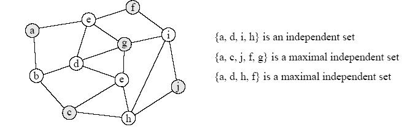

### 1. Introduction

**Dynamic programming** is a method for solving a complex problem by breaking it down into a collection of simpler subproblems, solving each of those subproblems just once, and storing their solutions. It stores solutions to subproblems instead of recomputing them(called **memoization** technique).


#### Dynamic programming v.s. Divide-and-conquer algorithm

**Divide-and-conquer** algorithms partition the problem into disjoint subproblems, solve the subproblems recursively, and then combine their solutions to solve the original problem. In contrast, **dynamic programming** partition the problem into subproblems that overlaps, that is, subproblems share subproblems.

#### Approach

There are usually two equivalent ways to implement a dynamic-programming approach.

#### Top-down with memoization

自顶向下法

We write the procedure recursively in a natural manner, but modified to save the result of each subproblem in the hash table. The procedure first checks to see whether it has previously solved this subproblem. If so, it returns the saved value, saving further computation at this level; if not, the procedure computes the value in the usual manner. 

#### Bottom-up method

自底向上法
We sort the subproblems by size and solve them in size order, smallest first. When solving a particular subproblem, we have already solved all of the smaller subproblems its solution depends upon, and we have saved their solutions. We solve each subproblem only once, and when we first see it, we have already solved all of its prerequisite subproblems.

#### Which Method?

* Top-down approach often results in slightly simpler and clearer code.
* Top-down approach only computes the partial results that are needed for the particular problem instance, whereas the bottom-up approach computes all partial results even if some of them go unused.


### 2 Application: Maximum weight independent set of path graph

**Input**: A path graph $G=(V,E)$ with nonnegative weights on vertices.

**Desired Output**: subset of nonadjacent vertices - an **independent set**(独立集) of maximum total weight.

**Background**:

* A **path graph** [[wiki](https://en.wikipedia.org/wiki/Path_graph)] is a graph whose vertices can be listed in the order $v_1, v_2, …, v_n$ such that the edges are {$v_i, v_{i+1}$} . A path graph is therefore a graph that can be drawn so that all of its vertices and edges lie on a single straight line.


* A **Independent set** is a set of vertices in a graph, no two of which are adjacent.




#### Basis

An optimal solution can have one of two properties:

* Case 1: Either the last element in the path is not part of the maximum weighted independent set (in which case we know that the solution is equally valid for the subgraph G' formed by popping the last vertex off the path)
* Case 2: Or the last element is part of the set (in which case we know that the predecessor cannot be part of the set, and the solution minus the last vertex is equally valid for the subgraph G'' formed by popping off the last two vertices of the path)


#### Proposed algorithm

A dynamic programming approach can solve the problem in linear time:

* The first time solving a subproblem, cache its solution in a global table for O(1)-time lookup later on.
    * Plan: Populate array $A$ left to right with $A[i]$ = value of max-weight Independent Set of $G_i$ .
    * Initialization: $A[0] = 0, A[1] = w_1$
    * Main loop: For $i = 2, 3, . . . , n$:
    $A[i] = \max\{ A[i − 1] , A[i − 2] + w_i \}$
* A Reconstruction: the algorithm above computes the *value* of a max-weight IS, not such an IS itself. So trace back through filled-in array to reconstruct optimal solution.
    - While i ≥ 1 [scan through array from right to left]
        - If $A[i − 1] ≥ A[i − 2] + w_i$ [i.e. case 1 wins]
            - Decrease $i$ by 1
        - Else [i.e., case 2 wins]
            - Add $i$ to S, decrease $i$ by 2
    - Return S

#### Implementation

Java代码：

```Java
public static int[] getMaximumWeightIndependentSet(int[] weights) {
    // setWeights: for ith item, it holds maximum weights of previous i weights.
    int[] setWeights =  new int[weights.length + 1];

    // Base conditions.
    setWeights[0] = 0;
    setWeights[1] = weights[0];

    // The max weight will be the max of:
    // Case 1: the last element in the path is not part of the maximum weighted IS.
    // then max weight will be previous max weight.
    // Case 2: the last element in the path is not part of the maximum weighted IS,
    // then max weight will be, previous vertex + weight of current vertex.
    for (int i = 1; i < weights.length; i++)
        setWeights[i + 1] = Math.max(setWeights[i], setWeights[i - 1] + weights[i]);

    // list to hold each index of the max weight independent set
    List<Integer> maxWeightIndependentSet = new ArrayList<>();

    // Reconstruct the max weight independent set.
    for (int i = setWeights.length - 1; i >= 1; )
        if (setWeights[i] > setWeights[i - 1]) {
            maxWeightIndependentSet.add(i);
            i -= 2;
        } else i -= 1;

    return Ints.toArray(maxWeightIndependentSet);
}
```

<details><summary>Python代码</summary>

```Python
def maximum_weight_independent_set(weights):
    """
    Compute Maximum weight independent set for a path graph.
    Weights of vertexes in the path graph are given.
    Return maximum weight independent set.
    """
    num = len(weights)
    a = [0] * (num + 1)
    in_set = []  # independent set
    a[0], a[1] = 0, weights[0]

    for i in range(2, num + 1):
        a[i] = max(a[i - 1], a[i - 2] + weights[i - 1])

    i = num + 1;
    while i >= 1: # start i: # last element
        if a[i - 1] >= a[i - 2] + weights[i - 1]: # last vertex not in set
            i -= 1
        else: # last vertex is in set
            in_set.append(i - 1)
            i -= 2
    in_set.reverse()
    return in_set
```
</details>

### 3. Application: 0-1 Knapsack Problem

The most common problem being solved is the **0-1 knapsack problem**(0-1背包问题), which restricts the number of copies of each kind of item to *zero or one*. Given a set of $n$ items numbered from 1 up to $n$, each with a weight $w_i$ and a value $v_i$, along with a maximum weight capacity $W$,

$$\begin{equation}
\begin{split}
&\text{maximize} \sum_{i=1}^nv_ix_i\\
&\text{subject to} \sum_{i=1}^n w_ix_i \le W \quad \text{and} \quad x_i \in \{0,1\}\\
\end{split}
\end{equation}$$

Informally, the problem is to maximize the sum of the values of the items in the knapsack so that the sum of the weights is less than or equal to the knapsack's capacity.


#### Bottom-up method
<hh> Solving</hh>

Assume $w_i, w_2,..., w_n, W$ are strictly positive integers. Define $m[i, w]$ to be the maximum value that can be attained with weight less than or equal to $w$ using items up to $i$ (first $i$ items).

We can define $m[i,w]$ recursively as follows:

* $m[0, w]=0$
* $m[i,w]=m[i-1, w], \text{if}\quad w_i > w$ ( the new item is more than the current weight limit)
* $m[i,w]= \max(m[i-1,w],m[i-1,w-w_i]+v_i), \text{if}\quad w_i \le w$

<pre>m(i, w) = max( m(i-1, w), m(i-1, w-weight[i]) + cost[i] )
               ^^^^^^^^^  ^^^^^^^^^^^^^^^^^^^^^^^^^^^^^
               不放 -&gt; 0            有放 -&gt; 1
</pre>

The following is pseudo code for the dynamic program:

```python
// Input:
// Values (stored in array v)
// Weights (stored in array w)
// Number of distinct items (n)
// Knapsack capacity (W)
  
for j from 0 to W do:
     m[0, j] := 0
  
for i = 1,2,..,n:
    for j = 0,1,...,W:
        if w[i] > j then:
            m[i, j] := m[i-1, j]
        else:
            m[i, j] := max(m[i-1, j], m[i-1, j-w[i]] + v[i])
```

<hh>Implementation</hh>


```Java
/**
 * 0/1 knapsack problem
 * @param values: values of items to put in the knapsack
 * @param weights: weights of items to put in the knapsack
 * @param maxWeight: a maximum weight capacity of the knapsack
 * @return
 *
 */
public static List<Integer> knapsack(int[] values, 
                                int[] weights,  int maxWeight) {
    // m[i][j] to be the maximum value 
    // that can be attained with weight less than or equal to j,
    // using first i items
    int[][] m = new int[values.length + 1][maxWeight + 1];

    // initialze: using first i=0 items, obviously, their maximum value is zero.
    for (int j = 0; j <= maxWeight; j++)
        m[0][j] = 0;

    // cal m
    for (int i = 1; i < m.length; i++)
        for (int j = 1; j <= maxWeight; j++) {
            int curWeight = weights[i - 1];
            if (curWeight > j) m[i][j] = m[i - 1][j];
                // max(either not put , or put)
            else
                m[i][j] = Math.max(m[i - 1][j], 
                    values[i - 1] + m[i - 1][j - curWeight]);
        }


    // trace back to get items
    int max_val = m[values.length][maxWeight];
    List<Integer> items = new ArrayList<>();

    int i = values.length;
    while (max_val > 0 && i > 0) {
        if (Ints.contains(m[i - 1], max_val - values[i - 1])) {
            max_val = max_val - values[i - 1];
            items.add(i - 1);
        }
        i--;
    }
    return items;
}
```


<details><summary>Python代码</summary>

```python
def knapsack01(value, weight, w_size):
	"""
	kanapsack01 solves a 0-1 knapsack problem,
	input: values(value) and weights(W) of items to put into knapsack of size(w_size)
	output: the index of items that maximize the value of items putted in the knapsack
	the index of items counts from 0, and corresponding value
	"""
	n = len(value)  # the number of items
	# maximum value that can be attained with weight <= weight using first i items
	m = np.zeros(shape=(n+1, w_size+1), dtype=int)
	for i in range(w_size+1):
		m[0, i] = 0

	if not isinstance(w_size, int):
		raise ValueError('knapsack_size should be an integer')

	for i in range(1, n+1):  # items
		for j in range(1, w_size+1):  # sizes
			if weight[i-1] > j:
				m[i, j] = m[i - 1, j]
			else:
				m[i, j] = max(m[i - 1, j], m[i - 1, j - weight[i-1]] + value[i-1])

	max_val = m[-1, -1]
	items = set()

	while max_val > 0 and i > 0:
		if max_val - value[i-1] in m[i - 1, :]:
			max_val = max_val - value[i-1]
			items.add(i-1)
			i -= 1
		else:
			i -= 1
	return items, m[-1, -1]
```
</details>

#### top-down with memoization

```python
def knapsack01_recursive(hash_table, value, weight, i, j):
	# base case: when 1 items here
	if i == 1:
		if weight[i - 1] < j:
			hash_table[(i, j)] = value[i - 1]
			return value[i - 1]
		else:
			hash_table[(i, j)] = 0
		return 0

	# sub-problem computed
	if (i, j) in hash_table:
		return hash_table[(i, j)]
	else:
		if weight[i - 1] > j:
			# only case 1
			hash_table[(i, j)] = knapsack01_recursive(hash_table, value, weight, i - 1, j)
		else:
			#  case 1, item i-1 excluded
			case1 = knapsack01_recursive(hash_table, value, weight, i - 1, j)
			# case 2, item i-1 included
			case2 = knapsack01_recursive(hash_table, value, 
                                weight, i - 1, j - weight[i - 1]) + value[i - 1]
			hash_table[(i, j)] = max(case1, case2)

	return hash_table[(i, j)]
```

#### Analysis 
The running time of this algorithm is $Θ(nW)$.

#### Reference
* [Knapsack Problem WIKIPEDIA](https://en.wikipedia.org/wiki/Knapsack_problem#cite_ref-plateau85_15-0)
* [Knapsack problem Stack Overflow](https://stackoverflow.com/questions/5683066/knapsack-problem-classic)
* [The knapsack Problem PPT](http://www.es.ele.tue.nl/education/5MC10/Solutions/knapsack.pdf)


### 4. Application: Optimal Binary Search Tree

An **Optimal Binary Search Tree (Optimal BST)** is a binary search tree which provides the smallest possible search time for a given sequence of access probabilities. The cost of a BST node is the level of that node plus one multiplied by its frequency.

**Problem Statement**: Given a sorted array `keys[0.. n-1]` of search keys and an array `freq[0.. n-1]` of frequency counts, where `freq[i]` is the number of searches to `keys[i]`. Construct a binary search tree of all keys such that the total cost of all the searches is as small as possible.

#### Optimal Substructure

The optimal cost of node $i,...,j$ can be recursively calculated using the following formula.

$Cost(i,j) = \sum \limits^{j}_{k=i}freq[k] + \min \limits_{r=i}^j[Cost(i,r-1)+Cost(r+1,j)]$

We try all nodes one by one as root ($r$ varies from $i$ to $j$). When we make $r$th node as root, we recursively calculate optimal cost from $i$ to $r-1$ and $r+1$ to $j$. 

#### Implementation: top-down with memoization

```python
def optimal_bst(freq):
	def opt_cost(hash_table, freq, i, j):
		"""
		Optimal Binary Search Tree
		Recursive Method used here
		"""

		# base case: only 0~1 element
		if j < i:
			return 0
		if j == i:
			return freq[i]

		# if already exists
		if (i, j) in hash_table:
			return hash_table[(i, j)]

		min_cost = sys.maxsize
		for r in range(i, j + 1):
			cost = opt_cost(hash_table, freq, i, r - 1) 
                        + opt_cost(hash_table, freq, r + 1, j)
			if cost < min_cost:
				min_cost = cost

		hash_table[(i, j)] = sum(freq[i:j + 1]) + min_cost
		return hash_table[(i, j)]

	return opt_cost({}, freq, 0, len(freq) - 1)
```

#### Reference


* [Optimal Binary Search Tree](http://ac.els-cdn.com/S0304397596003209/1-s2.0-S0304397596003209-main.pdf?_tid=1505980e-7cd4-11e7-83de-00000aacb361&acdnat=1502263778_53b76d131a06906e9fe3adfadc778677)
* [Optimal Binary Search Tree GeeksforGeeks](http://www.geeksforgeeks.org/dynamic-programming-set-24-optimal-binary-search-tree/)

