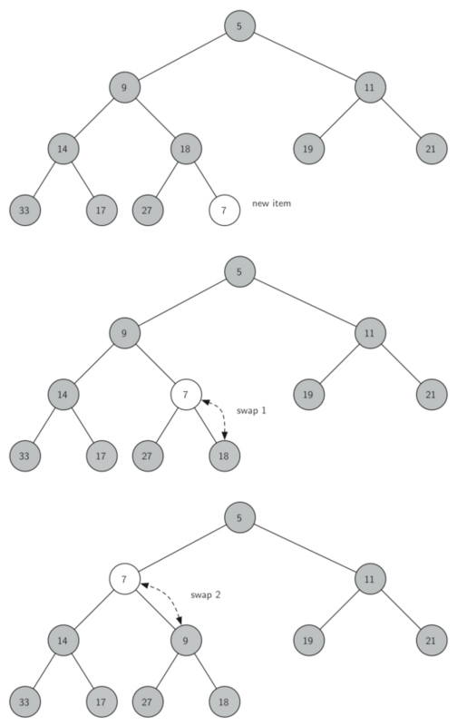

### Introduction and Implementation

A **heap** (堆)is a specialized tree-based data structure。 A **heap** can be classified as either a **max heap** or a **min heap**. 

* In a **max heap**(最大堆), the keys of parent nodes are always greater than or equal to those of the children and the highest key is in the root node. 
* In a **min heap**(最小堆), the keys of parent nodes are less than or equal to those of the children and the lowest key is in the root node.

**Heap** is one maximally efficient implementation of an abstract data type called a **priority queue** (see [here](https://techlarry.github.io/priority_queue.html)), and in fact priority queues are often referred to as **heaps**, regardless of how they may be implemented. 

#### Implementation

Priority queues typically use a heap as backbone, giving $O(\log n)$ performance for pushs and pops, and **$O(n)$** to build initially.


#### Binary Heap

 A common implementation of a heap is the **binary heap**(二叉堆), in which the tree is a **complete binary tree**(完全二叉树). 
 
 
二叉堆的操作与实现

* `BinaryHeap()`：创建一个新的、空的二叉堆对象
* `push(k)`：把新元素加入到堆中
* `findMin()`：返回堆中的最小项，最小项仍保留在堆中
* `pop()`：返回堆中的最小项，同时从堆中删除
* `isEmpty()`：返回堆是否为空
* `size()`：返回堆中元素的个数
* `heapify(list)`：从一个包含元素的列表创建新堆

有两个关键的操作：
1. `insert`方法。首先，为了满足“完全二叉树”的性质，新键值应该添加到列表的末尾。然而新键值简单地添加在列表末尾，显然无法满足堆次序。所以要通过比较父节点和新加入的元素的方法来重新满足堆次序。如果新加入的元素比父节点要小，可以与父节点互换位置；不断交换，直到到达树的顶端。下图所示一系列交换操作来使新加入元素“上浮”到正确的位置。




2.`pop`方法 移走根节点的元素后如何保持堆结构和堆次序: 首先，用最后一个节点来代替根节点, 移走最后一个节点保持了堆结构的性质。这么简单的替换，还是会破坏堆次序。第二步，将新节点“下沉”来恢复堆次序。下图所示的是一系列交换操作来使新节点“下沉”到正确的位置。

为了保持堆次序，我们需将新的根节点沿着一条路径“下沉”，直到比两个子节点都小。在选择下沉路径时，如果新根节点比子节点大，那么选择较小的子节点与之交换。


```python
class BinHeap(object):
    """
    创建一个新的、空的二叉堆对象
    """
    def __init__(self):
        self.list = [0]
        self.size = 0

    def perc_up(self,i):
        """
        Percolate the new node into proper position
        """
        while i: 
            if self.list[i] < self.list[i//2]:
                self.list[i], self.list[i//2] = self.list[i//2], self.list[i]
            i = i//2
    
    def push(self, item):
        """把新元素加入到堆中"""
        self.list.append(item)
        self.size += 1
        self.perc_up(self.size)

    def findMin(self):
        """返回堆中的最小项，最小项仍保留在堆中"""
        return self.list[1]

    def pop(self):
        """返回堆中的最小项，同时从堆中删除"""
        retval = self.list[1]
        self.list[1] = self.list[-1]
        self.size -=1
        self.list.pop()
        self.perc_down(1)

        return retval


    def percDown(self,i):
        """
        将新节点“下沉”来恢复堆次序
        """
        while (i * 2) <= self.size:
            mc = self.minChild(i)
            if self.list[i] > self.list[mc]:
                tmp = self.list[i]
                self.list[i] = self.list[mc]
                self.list[mc] = tmp
            i = mc

    def minChild(self,i):
        """
        返回较小的子节点
        """
        if i * 2 + 1 > size:
            return i * 2
        else:
            if self.list[i*2] < self.list[i*2+1]:
                return i * 2
            else:
                return i * 2 + 1

    def isEmpty(self):
        """返回堆是否为空"""
        return self.size == 0

    def __len__(self):
        """返回堆中元素的个数"""
        return self.size

    def heapify(self,alist):
        """从一个包含元素的列表创建新堆"""
        self.size = len(alist)
        self.list.extend(alist)
        i = self.size //2
        while i > 0:
        	self.perc_down(i)
        	i -= 1
```


#### 建堆的复杂度


建堆过程的时间复杂度是堆的一个难点。一般会误认为建堆的时间复杂度是$O(nlog n)$，因为每一次堆调整的时间复杂度为$O(log n)$，那么$n$个节点的时间复杂度为$O(nlog n)$，这其实是错的。

首先对于二叉树，它必须保证每一层填满之后才能去填充下一层。而且，如果从根结点开始计数(根结点为第0层)，往下第$i$层的元素如果不是最后一层的话，这一层的元素数量为$2^i$。这样，对于一棵高为$h$的完全二叉树，它的元素个数为$n=1+2+4+...+2^i, i\in(0,h)$.

然后理解函数`heapify`中的循环范围是$i=\text{size}//2\sim 0$，也就是说这是一个从下往上的建堆。对于第$h-1$层的每个节点来说，它需要和它的2个子节点比较一次，共计$2^{(h-1)}\times 2$。对于第$h-2$层的每个节点来说，最坏情况下，它需要和它的2个子节点比较一次，然后和子节点交换，子节点再和该子节点的子节点比较，所以共计$2^{(h-2)}\times 4$。以此类推，对于第$i$层的每个节点来说，最坏情况下，共需比较$2^i\times 2(h-i)$。

总共需要比较:
$$ S= \sum\limits^{i=0}_{i=h-1} 2^{i+1}(h-i) =2^h+2^{h-1}\times 2 + 2^{h-2}\times 3+... \quad .......(a)$$

$$ 2*S= \sum\limits^{i=0}_{i=h-1} 2^{i+2}(h-i) = 2^{h+1} + 2^h\times 2 + 2^{h-1}\times 3 + ... \quad .......(b)$$

$$ \text{(b-a)}\quad S = 2^h+2^{h-1}+2^{h-2}+... = n = O(n) $$


### Application: Median Maintenance

**Problem Statement**: The goal of the problem is to implement the **Median Maintenance** algorithm. The text file contains a list of the integers; you should treat this as a stream of numbers, arriving one by one. Letting $x_i$ denote the $i$th number of the file, the $k$th median $m_k$ is defined as the median of the numbers $x_1,…,x_k$. (So, if $k$ is odd, then $m_k$ is $((k+1)/2)$th smallest number among $x_1,…,x_k$; if $k$ is even, then $m_k$ is the $(k/2)$th smallest number among $x_1,…,x_k$.)

#### Solution

We might use a max heap to represent elements that are less than the median, and a min heap to represent elements that are greater than the median.


```
........maxHeap....max of maxHeap....min of minHeap ......minHeap.....
```

After balancing the heaps, the number of elements in two heaps differs at most by 1. 


```python
Step 1: Add next item to one of the heaps

   if next item < maxHeap root:
        add it to maxHeap
   else:
        add it to minHeap

Step 2: Balance the heaps (after this step heaps will be either balanced or
   one of them will contain 1 more item)

   if number of elements in one of the heaps > the other by
   more than 1:
        remove the root element from the one containing more elements 
        and add to the other one

Step 3: Calculate the median:

   if the heaps contain equal amount of elements:
        median = root of maxHeap
   else:
        median = root of the heap with more elements
```

#### Implementation

<C>MinHeap</C> and <C>MaxHeap</C> defined:

<details><summary><font color='red'>Click here to View</font> </summary>
``` python
import doctest
import sys

class MinHeap(object):
    """
    Min Heap
    >>> bh = MinHeap()
    >>> bh.buildHeap([9,5,14,18,-17,27,33,19,11,21])
    >>> bh.findMin()
    -17
    >>> bh.delMin()
    -17
    >>> bh.list[1:]
    [5, 9, 14, 11, 21, 27, 33, 19, 18]
    >>> bh.insert(-100)
    >>> bh.delMin()
    -100
    """

    def __init__(self):
        """
        add self.list 0 with initialization in order to divide
        """
        self.list = [-sys.maxsize]
        self.size = 0


    def insert(self, k):
        """
        Insert element to the MinBinaryHeap
        """
        self.list.append(k)
        self.size += 1
        self.perc_up(self.size)


    def findMin(self):
        """
        Find the min element and return it
        """
        return self.list[1]


    def delMin(self):
        """
        Delete the min element
        and return it
        """
        retrival = self.list[1]
        self.size -= 1
        self.list[1] = self.list[-1]
        self.list.pop()
        self.perc_down(1)

        return retrival


    def isEmpty(self):
        """
        Return if the MinBinaryHeap is empty
        """
        return self.size == 0

    def __len__(self):
        """
        Magic Method: return the length of MinBinaryHeap
        """
        return self.size


    def buildHeap(self, alist):
        """
        Build a MinBinaryHeap from alist which is a collection of data
        """
        self.list.extend(alist)
        self.size = len(alist)

        i = self.size//2
        while i > 0:
            self.perc_down(i)
            i -= 1

    def perc_up(self, i):
        """"
        perc_up i
        """
        while i//2>0:
            if self.list[i] < self.list[i // 2]:
                self.list[i], self.list[i // 2] = self.list[i // 2], self.list[i]
            i = i // 2

    def perc_down(self, i):
        """
        perc down i
        """
        while (i * 2) <= self.size:
            mc = self.minChild(i)
            if self.list[i] > self.list[mc]:
                self.list[i], self.list[mc] = self.list[mc], self.list[i]
            i = mc

    def minChild(self, i):
        """
        find the min child
        """
        if i * 2 + 1 > self.size:
            return i * 2
        else:
            if self.list[i * 2] < self.list[i * 2 + 1]:
                return i * 2
            else:
                return i * 2 + 1

    def __iter__(self):
        return iter(self.list[1:])


class MaxHeap(object):
    """
    Max Heap
    >>> bh = MaxHeap()
    >>> bh.buildHeap([9,5,14,18,-17,27,33,19,11,21])
    >>> bh.delMax()
    33
    >>> bh.insert(100)
    >>> bh.delMax()
    100
    >>> len(bh)
    9
    """

    def __init__(self):
        self.heap = MinHeap()

    def insert(self, k):
        self.heap.insert(-k)

    def delMax(self):
        return -self.heap.delMin()

    def buildHeap(self, alist):
        for i in range(len(alist)):
            alist[i] = -alist[i]
        self.heap.buildHeap(alist)

    def findMax(self):
        return -self.heap.findMin()

    def __len__(self):
        return self.heap.size

    def __iter__(self):
        for i in range(1, self.heap.size+1):
            yield -self.heap.list[i]
```
</details>

<C>median maintenance<C> algorithm:

```Python
def median_maintenance(textfile):

    min_heap = MinHeap()  # > medium
    max_heap = MaxHeap()  # < medium

    medians = []
    count = 0

    with open(textfile) as infile:
        for line in infile:
            item = int(line)
            count += 1

            # Step 1: Add next item to one of the hepas
            # special case: initialize
            if count == 1:
                max_heap.insert(item)
            else:
                if item < max_heap.findMax():
                    max_heap.insert(item)
                else:
                    min_heap.insert(item)

            # Step2: Balance the heap
            if abs(len(max_heap) - len(min_heap)) > 1:
                if len(max_heap) > len(min_heap):
                    min_heap.insert(max_heap.delMax())
                else:
                    max_heap.insert(min_heap.delMin())

            # Step3: calculate median
            if len(max_heap) == len(min_heap):
                median = max_heap.findMax()
            else:
                if len(max_heap) > len(min_heap):
                    median = max_heap.findMax()
                else:
                    median = min_heap.findMin()

            medians.append(median)

            # test
            #for element in max_heap:
            #    print(element, end=' ')
            #for element in min_heap:
            #    print(element, end=' ')
            #print('total elem:',len(max_heap)+len(min_heap))


    return medians

if __name__ == '__main__':
    # doctest.testmod(verbose=True)
    #textfile = 'SmallTest.txt'
    textfile = 'Median.txt'
    medians = median_maintenance(textfile)
    answer = sum(medians)%10000
    print(answer)
```

#### Resources

1. [max heap implementation](https://stackoverflow.com/questions/14189540/python-topn-max-heap-use-heapq-or-self-implement)
2. [median maintenance](https://stackoverflow.com/questions/10657503/find-running-median-from-a-stream-of-integers)

