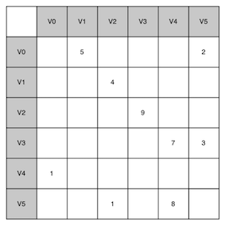
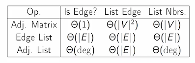
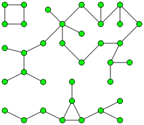

> Definition: A **graph** can be represented by $G$ where $G=(V,E)$. For the graph $G$, $V$ is a set of vertices and $E$ is a set of edges. Each edge is a tuple $(v,w)$ where $w, v \in V$. 

### Vocabulary and Definitions

* <C>vertex</C>: also a <C>node</C>, is a fundamental part of a graph. It can have a name <C>key</C>. A vertex may also have additional information called <C>payload</C>.
* <C>Edge</C>: also an <C>arc</C>, connects two vertices, and may be one-way(**directed graph**) or two-way(**undirected graph**).
* Weight: Edges may be weighted to show that there is a cost (<C>weight</C>)to go from one vertex to another. E.g. the distance between the two cities.
* <C>path</C>: a sequence of vertices that are connected by edges. Formally we could define a path as $w_1, w_2,...,w_n$ such that $(w_i,w_{i+1}) \in E$ for all $1 \le i \le  n-1$. The weighted path length is the sum of the weights of the edges in the path. 
* <C>cycle</C>: a path in a directed graph, which starts and ends at the same vertex. A graph with no cycles is called an **acyclic graph**. A directed graph with no cycles is called a **directed acyclic graph** or a **DAG**.

### Representation

#### Adjacency Matrix

 * Each of the rows and columns represent a vertex in the graph.
 * The value that is stored in the cell at the intersection of row $v$
 and column $w$ indicates if there is an edge from vertex $v$ to vertex $w$. 
 * simple, but inefficient if the graph is too large and the matrix is sparse.
 * Space Complexity: $O(|V|^2)$, where $|V|$ is the number of vertices.
 
 


#### Adjacency List

A more *space-efficient* way to implement a sparsely connected graph is to use an adjacency list. We keep a master list of all the vertices in the <C>Graph</C> object and then each vertex object in the graph maintains a list of the other vertices that it is connected to.  Space Complexity is $O(|V| + |E|)$.


#### Edge List

A list of edges. Edge lists are simple, but if we want to find whether the graph contains a particular edge, we have to search through the edge list. Space Complexity is $O(|E|)$, where $|E|$ is the number of edges.

#### Summary




### API

The graph abstract data type (ADT) is defined as follows:

* <C>Graph()</C>: Creates a new, empty graph.
* <C>addVertex(vert)</C>: Adds an instance of <C>Vertex</C> to the graph.
* <C>addEdge(fromVert, toVert)</C>: Adds a new, directed edge to the graph that connects two vertices.
* <C>addEdge(fromVert, toVert, weight)</C>: Adds a new, weighted, directed edge to the graph that connects two vertices.
* <C>getVertex(vertKey)</C>: Finds the vertex in the graph named vertKey.
* <C>getVertices()</C> returns the list of all vertices in the graph.
* <C>in</C>: Returns <C>True</C> for a statement of the form vertex in graph, if the given vertex is in the graph,<C>False</C> otherwise.

### Implementation

We will create two classes, <C>Graph</C>, which holds the master list of vertices, and <C>Vertex</C>, which will represent each vertex in the graph.

Each <C>Vertex</C> uses a *dictionary* to keep track of the vertices to which it is connected, and the weight of each edge. This dictionary is called <C>connectedTo</C>. The listing below shows the code for the <C>Vertex</C> class. The constructor simply initializes the <C>id</C>, which will typically be a string, and the <C>connectedTo</C> dictionary. The <C>addNeighbor()</C> method is used to add a connection from this vertex to another. The <C>getConnections()</C> method returns all of the vertices in the adjacency list, as represented by the <C>connectedTo()</C> instance variable. The <C>getWeight()</C> method returns the weight of the edge from this vertex to the vertex passed as a parameter.


``` python
class Vertex:
    def __init__(self, key):
        self.id = key
        self.connectedTo = {}

    def addNeighbor(self, nbr, weight=0):
        self.connectedTo[nbr] = weight

    def __str__(self):
        return str(self.id) + ' connectedTo: ' + str([x.id for x in self.connectedTo])

    def getConnections(self):
        return self.connectedTo.keys()

    def getId(self):
        return self.id

    def getWeight(self, nbr):
        return self.connectedTo[nbr]
```

The <C>Graph</C> class, shown in the next listing, contains a dictionary that maps vertex names to vertex objects. <C>Graph</C> also provides methods for adding vertices to a graph and connecting one vertex to another. The <C>getVertices()</C> method returns the names of all of the vertices in the graph. In addition, the <C>\_\_iter\_\_</C> method makes it easy to iterate over all the vertex objects in a particular graph. Together, the two methods allow to iterate over the vertices in a graph by name, or by the objects themselves.

```python
class Graph:
    def __init__(self):
        self.vertList = {}
        self.numVertices = 0

    def addVertex(self, key):
        self.numVertices = self.numVertices + 1
        newVertex = Vertex(key)
        self.vertList[key] = newVertex
        return newVertex

    def getVertex(self, n):
        if n in self.vertList:
            return self.vertList[n]
        else:
            return None

    def __contains__(self, vertex):
        return vertex in self.vertList

    def addEdge(self, fromVert, toVert, cost=0):
        if fromVert not in self.vertList:
            nv = self.addVertex(fromVert)
        if toVert not in self.vertList:
            nv = self.addVertex(toVert)
        self.vertList[toVert].addNeighbor(self.vertList[toVert], cost)

    def getVertices(self):
        return self.vertList.keys()

    def __iter__(self):
        return iter(self.vertList.values())
```

### Search

深度优先搜索(Depth First Search, DFS)和广度优先搜索(Breath First Search, BFS)是常用的图的搜索算法。

DFS和BFS主要差别是搜索的优先级不同，一个广度优先，一个深度优先。


#### BFS Implementation

Breadth-First Search (BFS)

* explored nodes in "layers" 
* can compute shortest paths  (FIFO)
* can compute connected components of an undirected graph 
* $O(E+V)$ time using a queue 


```Python
BFS (graph G, start vertex s)
-- mark s as explored
-- let Q = queue, initialized with s
-- while Q is not empty:
    -- remove the first node of Q, call it v
    -- for each edge (v, w):
        -- if w unexplored
            -- mark w as explored
            -- add w to Q(at the end)
```

#### Connected Components via BFS

> A **connected component** of an undirected graph is a subgraph in which any two vertices are connected to each other by paths, and which is connected to no additional vertices in the supergraph. [[wiki](https://en.wikipedia.org/wiki/Connected_component_(graph_theory))]

 

 
To compute all components for undirected graph:

```Python tab="PseudoCode"
-- initialize all nodes as unexplored
[assume labelled 1 to n]
-- for i = 1 to n
    -- if i not yet explored
        //discovers precisely i’s connected component
        -- BFS(G, i) 
```

```Python tab="Python"
def bfs(graph, start):
    visited, queue = set(), [start]
    while queue:
        vertex = queue.pop(0)
        if vertex not in visited:
            visited.add(vertex)
            queue.extend(graph[vertex] - visited)
    return visited
```

Running time is $O(|E| + |V|)$.


#### DFS Implementation

Depth-First Search

* explore aggressively like a maze, backtrack only necessary
* compute topological ordering of a directed acyclic graph
* compute connected components in directed graphs
* $O(E+V)$ time using a stack (LIFO) or via recursion


Recursive Version

```Python tab="PseudoCode"
DFS(graph G, start vertex s)
    -- mark s as explored
    -- for every edge (s, v):
        -- if v unexplored
        -- DFS(G, v)
```

```Python tab="Python"
def dfs(graph, start, visited=None):
    if visited is None:
        visited = set()
    visited.add(start)
    for next in graph[start] - visited:
        dfs(graph, next, visited)
    return visited
```
 

Iterative Version

```Python tab="PseudoCode"
DFS(graph G, start vertex s):
-- let S be a stack, and initialized with s
    -- while S is not empty
        -- u = S.pop()
        -- for each edge (u, v)
            -- if v is not yet explored:
                -- label v as explored
                -- S.push(v)
```


#### Topological Sort

>  A **topological sort** of a directed graph is a linear ordering of its vertices such that for every directed edge $uv$ from vertex $u$ to vertex $v$, $u$ comes before $v$ in the ordering. [[wiki](https://en.wikipedia.org/wiki/Topological_sorting)]


Note: G has directed cycle => no topological ordering


```text
-- mark all vertexes unexplored
-- L ← Empty stack that will contain the sorted nodes
-- for each vertex
    -- if v not yet explored
        -- DFS(G, v)

-- DFS(G, start vertex s)
    -- for every edge (s, v)
        -- if v not yet explored
            -- mark v explored
            -- DFS(G, v)
    -- add s to L
```


### Reference

* Problems Solving with Algorithms and Data Structures, Chapter 7
* [Depth-First Search and Breadth-First Search in Python](https://eddmann.com/posts/depth-first-search-and-breadth-first-search-in-python/) 