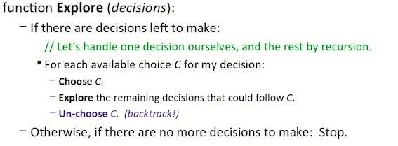
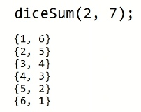
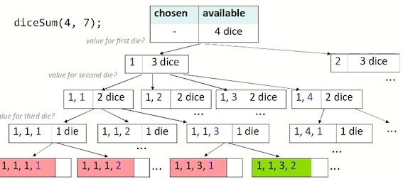
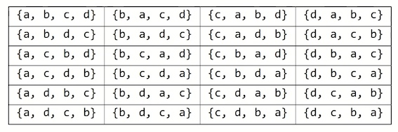
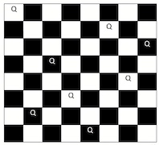

来自Stanford CS106B Lecture 9/10/11 -  Exhaustive Search and Backtracking (winter 2018)的学习笔记。

[视频地址](https://www.youtube.com/watch?v=Frr8U5_TTtg&t=296s)


### 1. Exhaustive search 

**exhaustive search**(穷举搜索): Exploring every possible combination from a set of choices or values.

* often implemented recursively

Applications

* producing all permutations of a set of values
* enumerating all possible names, passwords, etc.
* combinatorics and logic programming.

Often the search space consists of many **decisions**, each has several available **choices**.

* Example: When enumerating all 5-letter strings, each of the 5 letters is a *decision*, and each of those decisions has 26 possible *choice*.

A general pseudo-code algorithm for exhaustive search:


#### Example - printAllBinary

Write a recursive function printAllBinary that accepts an integer number of digits and prints all binary numbers that have exactly that many digits, in ascending order, one per line.


打印出所有n位二进制数字。使用递归法，注意basecase。

```c++
#include <iostream>
#include <string>
using namespace std;
void printAllBinaryHelper(int digits, string s){
	if (digits == 0) {
		// base case: print the string we have built
		cout << s << endl;
	}
	else{
		printAllBinaryHelper(digits -1, s+"0");
		printAllBinaryHelper(digits -1, s+"1");
	}
}

void printAllBinary(int digits) {
	printAllBinaryHelper(digits, "");
}


int main(){
	int digits = 3;
	printAllBinary(digits);
}
```

类似的，对于10进制数字，有

```cpp
#include <iostream>
#include <string>
using namespace std;

void printDecimalHelper(int digits, string s){
    if (digits == 0) {
        // base case
        cout << s << endl;
    } else{
        for (int i = 0; i< 10; i++)
            printDecimalHelper(digits-1, s+to_string(i));
    }
}


void printDecimal(int digits){
    printDecimalHelper(digits, "");
}

int main(){
    printDecimal(2);
}
```


### 2. Backtracking

**backtracking**: Finding solution(s) by trying partial solutions and then **abandoning** them if they are not suitable.

* a "brute force" algorithmic technique (tries all paths)
* often implemented recursively

Applications:

* producing all permutations of a set of values
* parsing languages
* games: anagrams, crosswords, word jumbles
* combinatorics and logic programming
* escaping from a maze

A general pseudo-code algorithm for backtracking




* Key tasks:
    
    * Figure out appropriate smallest unit of work (decision)
    * Figure out how to enumerate all possible choices/options for it.


#### Example- Dice Roll Sum

**Dice Roll Sum**: Write a function `diceSum` that accepts two integer parameters: a number of dice to roll, and a desired sum of all die values. Output all combinations of die values that add up to exactly that sum.




```cpp
#include <iostream>
#include <string>
#include <vector>

/*
  * prints all possible outcomes of rolling the given
  * number of six-sided dice that add up to exactly the given
  * desired sum, in {#, #, #} format.
  */
using namespace std;
void diceSumHelper(int dice, int desiredSum, vector<int> & chosen){
    if (dice == 0) {
        if (desiredSum == 0) {
            // base case
            cout << "{";
            for (int i = 0; i < chosen.size() - 1; i++)
                    cout << chosen[i] << ",";
            cout << chosen[chosen.size()-1] <<  "}" << endl;
        }
    } else{
        for (int i = 1; i < 7; i++){
            // choose i
            chosen.push_back(i);
            // explore what could follow that
            diceSumHelper(dice - 1, desiredSum - i, chosen);
            // un-choose i
            chosen.pop_back();
        }
    }
}

void diceSum(int dice, int desiredSum){
    vector<int> v;
    diceSumHelper(dice, desiredSum, v);
}

int main(){
    cout << "diceSum:" << endl;
    diceSum(3, 7);
    return 0;
}
```





但这并不是非常好的一个解决方案。It checks every possibility. 所以可以加上一些限制条件。

```cpp
    else if (desiredSum >= dice*1 && desiredSum <= dice*6){
        ...todo something
    }
```


#### Example - Escape Maze

Write a function escapeMaze(maze, row, col) that searches for a path out of a given 2-dimensional maze.

- Return true if able to escape, or false if not.
- "Escaping" means exiting the maze boundaries.
- You can move 1 square at a time in any of the 4 directions
- "Mark" your path along the way.
- "Taint" bad paths that do not work.
- Do not explore the same path twice.


```cpp
bool escapeMaze(Maze& maze, int row, int col) {
    //base case
    if(!maze.inBounds(row, col)){
        return true;
    } else if(maze.isWall(row, col)){
        return false;
    } else if (maze.isOpen(row, col)){
        //choose
        maze.mark(row, col);
        bool result = escapeMaze(maze, row + 1, col)
            || escapeMaze(maze, row, col + 1) 
            || escapeMaze(maze, row, col - 1) 
            || escapeMaze(maze, row - 1, col)){
        }
        //un-choose
        if (!result) maze.taint(row, col);
        return result;
    }
    return false;
}
```


#### Example - Permute Vector

Write a function **permute** that accepts a Vector of strings as a parameter and outputs all possible rearrangements of the strings in that vector. The arrangements may be output in any order.

* Example: if $v$ contains { "a", "b", "c", "d"}, you function outputs these permutations:




```cpp
#include <iostream>
#include <string>
#include <vector>

using namespace std;

// {a, b, c, d}
void permuateHelper(vector<string> &v, vector<string>& chosen){
    // base_case
    if (v.size() == 0) {
        cout << "{ ";
        for (vector<string>::iterator iter = chosen.begin(); 
                    iter != chosen.end(); iter++)
            cout << *iter;
        cout << " }" << endl;
    }
    
    
    // for each choice:
    for (vector<string>::iterator iter = v.begin(); 
                iter != v.end(); iter++} {
        //-choose
        string s = *iter;
        chosen.push_back(*iter);
        v.erase(iter);
        
        //-explore
        permuateHelper(v, chosen);

        //-unchoose
        chosen.pop_back();
        v.insert(iter, s);
    }   
}

void permuate(vector<string> &v){
    vector<string> chosen;
    permuateHelper(v, chosen);
}

int main(){
    string str[] = {"M", "A", "R", "T", "Y"};
    vector<string> v(str, str+5);
    permuate(v);
}
```

#### Example: Sublists

Write a function `sublists` that finds every possible sub-list of a given vector. A sub-list of a vector $V$ contains $\ge 0$ of $V^\prime$ elements.

* Example: if $V$ is {Jane, Bob, Matt, Sara}, then the call of `sublists(V)`; prints:


* You can print the sub-lists out in any order, one per line.


```cpp
#include <iostream>
#include <string>
#include <vector>

using namespace std;

//{"Jane","Bob", "Matt", "Sara"}
void sublistsHelper(vector<string>& v, vector<string>& chosen){
    if (v.size()==0){
    // base case
    cout << "{";
    for (vector<string>::iterator iter= chosen.begin(); 
                iter!= chosen.end(); iter++){
        cout << *iter << " "; 
    }
    cout << "}" << endl;

    }else{
        // recursive case
        // for each possible choice:
        string s = v[0];
        v.erase(v.begin());
        // - choose/explore (without s)
        sublistsHelper(v, chosen);
        // - choose/explore (with s)
        chosen.push_back(s);
        sublistsHelper(v, chosen);
        // - unchoose
        v.insert(v.begin(), s);
        chosen.pop_back();
    }
}

/*
 * Prints all subsets of the given vector
 */
void sublists(vector<string> &v){
    vector<string> chosen;
    sublistsHelper(v, chosen);
}


int main(){
    string _names[]= {"Jane","Bob", "Matt", "Sara"};
    vector<string> names(_names, _names+4);
    cout << "sublists of ";
    for ( vector<string>::iterator iter= names.begin();
                 iter!= names.end(); iter++){
        cout << *iter << " ";
    }
    cout << ":" <<  endl << endl;

    sublists(names);

    return 0;
}
```

#### Example: 8 Queens

The 8 Queens problem: Consider the problem of trying to place 8 queens on a chess board such that no queen can attack another queen.




经典的八皇后问题：在8×8格的国际象棋上摆放八个皇后，使其不能互相攻击，即任意两个皇后都不能处于同一行、同一列或同一斜线上，问有多少种摆法。
 
[讲解视频](https://www.youtube.com/watch?v=5v6zdfkImms)


```cpp
#include <iostream>
#include <string>

bool solveQueensHelper(Board &board, int column){
    if (column >= 8){
        // check valid
        cout << board.toString() << endl;
        return true;
    } else {
        for (int row = 0; row < 8; row ++){
            if (board.isSafe(row, column)){
                //choose
                board.place(row, column);
                //explore
                bool finished = solveQueensHelper(board, column + 1);
                if (finished) return true;
                //unchoose
                board.remove(row, column);
            }
        }
        return false
    }
}

void solveQueens(Board & board){
    solveQueensHelper(board, 0);
}
```


