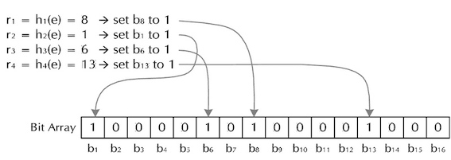

### 1 Introduction

> A Bloom filter(布隆过滤器) is a space-efficient probabilistic data structure, conceived by Burton Howard Bloom in 1970, that is used to test whether an element is a member of a set.

Comparison to Hash Tables: 

* Pros: more space efficient. 
* Cons:
    * can’t store an associated object
    * No deletions
    * Small false positive probability

#### Operations

The basic bloom filter supports two operations: querying and insertion.

* *Querying* is used to check whether a given element is in the set or not. If it returns:
    * *false*: the element is *definitely not* in the set.
    * *true*: the element is *probably* in the set. The *false positive rate* is a function of the bloom filter's size and the number and independence of the hash functions used.
* *Insertion* simply adds an element to the set.    
    
#### Applications

The classic example is using bloom filters to reduce expensive disk (or network) lookups for non-existent keys.

If the element is not in the bloom filter, then we know for sure we don't need to perform the expensive lookup. On the other hand, if it is in the bloom filter, we perform the lookup, and we can expect it to fail some proportion of the time (the false positive rate).

### 2 Algorithms

A Bloom filter is remarkably simple. It consists of a bit array and a handful of hash functions. We'll use $k$ for the number of hash functions. If we want to insert a value into the Bloom filter, we compute $k$ hashes of the value, and turn on those bits in the bit array. If we want to see whether a value is present, we compute $k$ hashes, and check all of those bits in the array to see if they are turned on.

!!! Example

    To see how this works, let's say we want to insert the strings "foobar" into a Bloom filter that is 16 bits wide, and we have four hash functions.
    
    * Compute the two hashes of "foo", and get the values 8, 1, 6, 13.
    * Set bits 8, 1, 6 and 13 in the bit array. 
    
    If we want to query the Bloom filter, to see whether the values "quux" are present.
    
    * Compute the two hashes of "quux", and get the values 4, 3, 5 and 0.
    * Check bit 4 in the bit array. It is not set, so "quux" cannot be present. We do not need to check bit 3.

    
