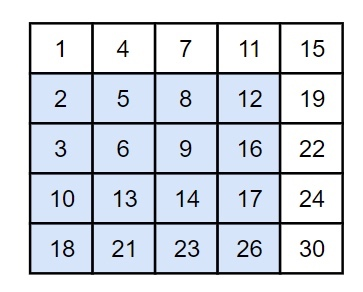
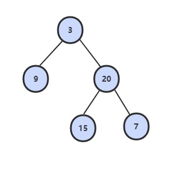
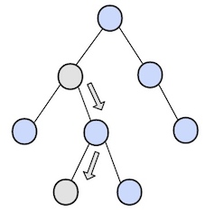
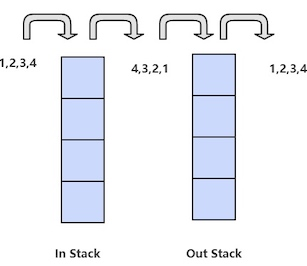
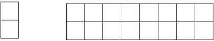

### 2. 实现 Singleton

[Singleton Pattern](https://techlarry.github.io/note-os/java/hfdp/ch5/index.html)

### 3. 数组中重复的数字

[NowCoder](https://www.nowcoder.com/practice/623a5ac0ea5b4e5f95552655361ae0a8?tpId=13&tqId=11203&tPage=1&rp=1&ru=/ta/coding-interviews&qru=/ta/coding-interviews/question-ranking)

在一个长度为$n$的数组里的所有数字都在0到$n-1$的范围内。数组中某些数字是重复的，但不知道有几个数字是重复的，也不知道每个数字重复几次。请找出数组中任意一个重复的数字。例如，如果输入长度为7的数组$[2,3,1,0,2,5,3]$，那么对应的输出是第一个重复的数字2。

<hh>解题思路</hh>


解决这个问题的一个简单的方法是先把输入的数组排序。然后从头到尾扫描数组，找出重复的数字。或者利用哈希表，每扫到一个数字的时候，都可以用$O(1)$的时间来判断哈希表里是否已经包含了该数字。如果哈希表里还没有这个数字，就把它加入哈希表，否则，就找到一个重复的数字。


有没有更好的方法呢？要求时间复杂度$O(N)$，空间复杂度$O(1)$。因此不能使用排序的方法，也不能使用额外的标记数组。

注意到数组中的数字都在$0\sim n-1$的范围内。如果这个数组中没有重复的数字，那么当数组排序之后数字$i$将出现在下标为$i$的位置。所以可以将值为$i$的元素调整到第$i$个位置上。

以 (2, 3, 1, 0, 2, 5) 为例：

```text
position-0 : (2,3,1,0,2,5) // 2 <-> 1
             (1,3,2,0,2,5) // 1 <-> 3
             (3,1,2,0,2,5) // 3 <-> 0
             (0,1,2,3,2,5) // already in position
position-1 : (0,1,2,3,2,5) // already in position
position-2 : (0,1,2,3,2,5) // already in position
position-3 : (0,1,2,3,2,5) // already in position
position-4 : (0,1,2,3,2,5) // nums[i] == nums[nums[i]], exit
```

遍历到位置4时，该位置上的数为2，但是第2个位置上已经有一个2的值了，因此可以知道2重复。

```java
public boolean duplicate(int[] nums, int length, int[] duplication) {
    if (nums == null || length <= 0) return false;
    for (int i = 0; i < length; i++) {
        while (nums[i] != i) {
            if (nums[i] == nums[nums[i]]) {
                duplication[0] = nums[i];
                return true;
            }
            swap(nums, i, nums[i]);
        }
    }
    return false;
}

private void swap(int[] nums, int i, int j) {
    int t = nums[i];
    nums[i] = nums[j];
    nums[j] = t;
}
```

### 3. 二维数组中的查找

[NowCoder](https://www.nowcoder.com/practice/abc3fe2ce8e146608e868a70efebf62e?tpId=13&tqId=11154&tPage=1&rp=1&ru=/ta/coding-interviews&qru=/ta/coding-interviews/question-ranking)

<hh>题目描述</hh>


在一个二维数组中，每一行都按照从左到右递增的顺序排序，每一列都按照从上到下递增的顺序排序。请完成一个函数，输入这样的一个二维数组和一个整数，判断数组中是否含有该整数。

```html
Consider the following matrix:
[
  [1,   4,  7, 11, 15],
  [2,   5,  8, 12, 19],
  [3,   6,  9, 16, 22],
  [10, 13, 14, 17, 24],
  [18, 21, 23, 26, 30]
]

Given target = 5, return true.
Given target = 20, return false.
```

<hh>解题思路</hh>

首先选取数组中右上角的数字。

* 如果该数字等于要查找的数字，查找过程结束：
* 如果该数字大于要查找的数字，剔除这个数字所在的列; 如果该数字小于要查找的数字，剔除这个数字所在的行。也就是说如果要查找的数字不在数组的右上角，则每－次都在数组的查找范围中剔除）行或者一列，这样每一步都可以缩小.
* 查找的范围，直到找到要查找的数字，或者查找范围为空。
    
时间复杂度：$O(M + N) + O(1)$

当前元素的查找区间为左下角的所有元素，例如元素12的查找区间如下：



```java
public boolean Find(int target, int [][] array) {
    if (array == null || array.length == 0 || array[0].length == 0) return false;
    int row = 0, col = array[0].length - 1;
    while (row < array.length && col >= 0) {
        int cmp = array[row][col] - target;
        if (cmp > 0) col--;
        else if (cmp < 0) row++;
        else return true;
    }
    return false;
}
```

### 4. 替换空格

[NowCoder](https://www.nowcoder.com/practice/4060ac7e3e404ad1a894ef3e17650423?tpId=13&tqId=11155&tPage=1&rp=1&ru=/ta/coding-interviews&qru=/ta/coding-interviews/question-ranking)

<hh>题目描述</hh>


请实现一个函数，将一个字符串中的每个空格替换成“%20”。例如，当字符串为"We Are Happy". 则经过替换之后的字符串"为We%20Are%20Happy"。

!!! note
    
    在⽹络编程中，如果URL参数中含有特殊字符，如空格、'#'等，可能导致服务器端⽆法获得正确的参数值。我们需要将这些特殊符号转换成服务器可以识别的字符。转换的规则是在'%'后⾯跟上ASCII码的两位⼗六进制的表⽰。⽐如空格的ASCII码是32，即⼗六进制的0x20，因此空格被替换成"%20"。再⽐如'#'的ASCII码为35，即⼗六进制的0x23，它在URL中被替换为"%23"。
    
<hh>解题思路</hh>

最直观的做法是从头到尾扫描字符串，每次碰到空格字符的时候进行替换。由于是把1个字符替换成3个字符，我们必须要把空格后面的字符都后移2个字节，否则就有两个字符被覆盖了。

从前往后把字符串"We are happy."中的空格替换成"%20"的过程。灰色背景表示需要移动的字符。


```Java
public String replaceSpace(StringBuffer str) {
    if (str == null || str.length() == 0) return "";
    for (int i = 0; i < str.length(); i++)
        if (str.charAt(i) == ' ') {
            str.setCharAt(i, '%');
            str.insert(i + 1, "20");
            i += 2;
        }
    return str.toString();
}
```

假设字符串的长度是$n$。对每个空格字符，需要移动后面$O(n)$个字符，因此对于含有$n$个字符的字符串而言，最坏时间复杂度是$O(n^2)$。

能不能减少移动次数呢？答案是肯定的，把从前向后替换改成从后向前替换。可以先遍历一次字符串，统计出字符串中空格的综述，计算出替换之后的字符串长度 = $n + 2 \times$ 空格数。

在字符串尾部填充任意字符，使得字符串的长度等于替换之后的长度。因为一个空格要替换成三个字符（%20），因此当遍历到一个空格时，需要在尾部填充两个任意字符。准备两个指针，P1和P2，P1指向原始字符串的末尾，而P2指向替换之后的字符串的末尾.接下来我们向前移动指针P1，逐个把它指向的字符复制到P2指向的位置，直到碰到空格为止，此时把P1向前移动1格，并在P2之前插入字符串"%20",然后向前移动3格。重复此过程，直到P1和P2指向同一位置，表明所有空格都已经替换完毕。


由于所有的字符都指复制/移动一次，因此时间复杂度是$O(n)$。

```java
public String replaceSpace(StringBuffer str) {
    if (str == null || str.length() == 0) return "";
    // 获取空格的数量
    int n = str.length();
    int numOfSpace = 0;
    for (int i = 0; i < n; i++)
        if (str.charAt(i) == ' ') numOfSpace++;
    
    // 插入空格
    int newStringLength = n + 2 * numOfSpace; // 新字符串长度
    str.setLength(newStringLength);    // 扩充字符串
    int p1 = n - 1, p2 = str.length() - 1;    // p1指向旧字符串，p2指向新字符串
    while (p1 != p2) {
        if (str.charAt(p1) != ' ') str.setCharAt(p2--, str.charAt(p1));
        else {
            str.setCharAt(p2--, '0');
            str.setCharAt(p2--, '2');
            str.setCharAt(p2--, '%');
        }
        p1--;
    }
    return str.toString();
}
```

### 5. 从尾到头打印链表

[NowCoder](https://www.nowcoder.com/practice/d0267f7f55b3412ba93bd35cfa8e8035?tpId=13&tqId=11156&tPage=1&rp=1&ru=/ta/coding-interviews&qru=/ta/coding-interviews/question-ranking)

<hh>题目描述</hh>


输入链表的第一个节点，从尾到头反过来打印出每个结点的值。链表结点定义如下：

```Java
public class ListNode {
    int val;
    ListNode next = null;
    ListNode(int val) {
         this.val = val;
    }
}
```

<hh>解题思路</hh>

我们想到解决这个问题肯定要遍历链表。遍历的顺序是从头到尾的顺序，可输出的顺序却是从尾到头。也就是说第⼀个遍历到的结点最后⼀个输出，⽽最后⼀个遍历到的结点第⼀个输出。这就是典型的“后进先出”，我们可以⽤栈实现这种顺序。每经过⼀个结点的时候，把该结点放到⼀个栈中。当遍历完整个链表后，再从栈顶开始逐个输出结点的值，此时输出的结点的顺序已经反转过来了。


<hh>使用栈</hh>

```java
public ArrayList<Integer> printListFromTailToHead(ListNode listNode) {
    if (listNode == null) return new ArrayList
    Stack<Integer> stack = new Stack<>();
    while (listNode != null) {
        stack.add(listNode.val);
        listNode = listNode.next;
    }
    // 不能直接返回: return new ArrayList<>(stack);
    ArrayList<Integer> ret = new ArrayList<>();
    while (!stack.isEmpty())
        res.add(stack.pop());
    return res;
}
```

<hh>使用递归</hh>

既然想到了⽤栈来实现这个函数，⽽递归在本质上就是⼀个栈结构， 于是很⾃然地又想到了⽤递归来实现。要实现反过来输出链表，我们每访问到⼀个结点的时候，先递归输出它后⾯的结点，再输出该结点⾃⾝，这样链表的输出结果就反过来了。

```Java
public ArrayList<Integer> printListFromTailToHead(ListNode listNode) {
    ArrayList<Integer> list = new ArrayList<>();
    printListFromTailToHead(list, listNode);
   return list;
}
    
private void printListFromTailToHead(ArrayList<Integer> list, ListNode listNode) {
    if (listNode == null) return;
    printListFromTailToHead(list, listNode.next);
    list.add(listNode.val);
}
```

也可以使用`ArrayList.addAll()`，从而省去辅助函数，当然效率比较低：

```java
public ArrayList<Integer> printListFromTailToHead(ListNode listNode) {
    ArrayList<Integer> list = new ArrayList<>();
    if (listNode == null) return list;
    list.addAll(printListFromTailToHead(listNode.next));
    list.add(listNode.val);
    return list;
}
```

虽然上⾯的基于递归的代码看起来很简洁，但有个问题：当链表⾮常长的时候，就会导致函数调⽤的层级很深，从⽽有可能导致*函数调⽤栈溢出*。显式⽤栈基于循环实现的代码的鲁棒性要好⼀些。


<hh>使用Collections.reverse()</hh>

顺序遍历链表，获取链表节点的值，然后反转。

```java
public ArrayList<Integer> printListFromTailToHead(ListNode listNode) {
    ArrayList<Integer> res = new ArrayList<>();
    while (listNode != null) {
        res.add(listNode.val);
        listNode = listNode.next;
    }
    Collections.reverse(res);
    return res;
}
```

### 6. 重建二叉树

[NowCoder](https://www.nowcoder.com/practice/8a19cbe657394eeaac2f6ea9b0f6fcf6?tpId=13&tqId=11157&tPage=1&rp=1&ru=/ta/coding-interviews&qru=/ta/coding-interviews/question-ranking)

<hh>题目描述</hh>


根据二叉树的前序遍历和中序遍历的结果，重建出该二叉树。假设输入的前序遍历和中序遍历的结果中都不含重复的数字。

```html
preorder = [3,9,20,15,7]
inorder =  [9,3,15,20,7]
```




<hh>解题思路</hh>见[LeetCode 105](http://localhost/wiki/2017/10/30/Leetcode-105-Construct-Binary-Tree-from-Preorder-and-Inorder-Traversal/).

### 8. 二叉树的下一个结点

[NowCoder](https://www.nowcoder.com/practice/9023a0c988684a53960365b889ceaf5e?tpId=13&tqId=11210&tPage=1&rp=1&ru=/ta/coding-interviews&qru=/ta/coding-interviews/question-ranking)

<hh>题目描述</hh>


给定一个二叉树和其中的一个结点，请找出中序遍历顺序的下一个结点并且返回。注意，树中的结点不仅包含左右子结点，同时包含指向父结点的指针。

<C>TreeLinkNode</C>定义：

```java
public class TreeLinkNode {

    int val;
    TreeLinkNode left = null;
    TreeLinkNode right = null;
    TreeLinkNode next = null;

    TreeLinkNode(int val) {
        this.val = val;
    }
}
```

<hh>解题思路</hh>


① 如果一个节点的右子树不为空，那么该节点的下一个节点是右子树的最左节点；



② 否则，向上找第一个左链接指向的树包含该节点的祖先节点。


```java
public TreeLinkNode GetNext(TreeLinkNode root){
    if (root == null) return null;
    // 右子树的最左节点
    if (root.right != null) {
        root = root.right;
        while (root.left != null) root = root.left;
        return root;
    }
    // 第一个左链接指向的树包含左子树
    TreeLinkNode parent = root.next;
    while(parent != null && root != parent.left) {
        root = parent;
        parent = root.next;
    }
    return parent;
}
```

### 7. 用两个栈实现队列

[NowCoder](https://www.nowcoder.com/practice/54275ddae22f475981afa2244dd448c6?tpId=13&tqId=11158&tPage=1&rp=1&ru=/ta/coding-interviews&qru=/ta/coding-interviews/question-ranking)

<hh>题目描述</hh>


用两个栈来实现一个队列，完成队列的Push和Pop操作。

<hh>解题思路</hh>


in栈用来处理入栈(push)操作，out栈用来处理出栈(pop)操作。一个元素进入in栈之后，出栈的顺序被反转。当元素要出栈时，需要先进入out栈，此时元素出栈顺序再一次被反转，因此出栈顺序就和最开始入栈顺序是相同的，先进入的元素先退出，这就是队列的顺序。

当out栈中不为空时，在out栈中的栈顶元素是最先进⼊队列的元素，可以弹出。当out栈为空时，我们把in栈中的元素逐个弹出并压⼊out栈。由于先进⼊队列的元素被压到in栈的底端，经过弹出和压⼊之后就处于out栈的顶端了，又可以直接弹出。

例如，1,2,3,4的入栈和出栈：



```java
public class Queue {
    Stack<Integer> in = new Stack<Integer>();
    Stack<Integer> out = new Stack<Integer>();
    
    public void push(int node) {
        in.push(node);
    }
    
    public int pop() throws Exception {
        if (out.isEmpty())
            while (!in.isEmpty())
                out.push(in.pop());
        if (out.isEmpty()) throw new Exception("Queue is Empty!");
        return out.pop();
    }
}
```

### 8. 旋转数组的最小数字

[NowCoder](https://www.nowcoder.com/practice/9f3231a991af4f55b95579b44b7a01ba?tpId=13&tqId=11159&tPage=1&rp=1&ru=/ta/coding-interviews&qru=/ta/coding-interviews/question-ranking)

<hh>题目描述</hh>


把一个数组最开始的若干个元素搬到数组的末尾，我们称之为数组的旋转。 输入一个非减排序的数组的一个旋转，输出旋转数组的最小元素。 例如数组{3,4,5,1,2}为{1,2,3,4,5}的一个旋转，该数组的最小值为1。 NOTE：给出的所有元素都大于0，若数组大小为0，请返回0。

<hh>解题思路</hh>
如果数字不重复，见[LeetCode 153 Find Minimum in Rotated Sorted Array](https://techlarry.github.io/wiki/2017/10/30/Leetcode-153-Find-Minimum-in-Rotated-Sorted-Array/).

如果数组元素允许重复的话，那么就会出现一个特殊的情况：nums$[lo]$ = nums$[mid]$ = nums$[hi]$，那么此时无法确定解在哪个区间，需要切换到顺序查找。例如对于数组 {1,1,1,0,1}，$lo、mid$和$hi$指向的数都为1，此时无法知道最小数字0在哪个区间。

```java
public int minNumberInRotateArray(int [] nums) {
    if (nums == null || nums.length == 0) return 0;
    int lo = 0, hi = nums.length - 1, mid;
    while (lo < hi) {
        // 取中间的位置
        mid = lo + (hi - lo) / 2;
        // 如果三个数都相等，则需要进行顺序处理，从头到尾找最小的值
        if (nums[mid] == nums[hi] && nums[mid] == nums[lo]) 
            return findMin(nums, lo , hi);
        // 如果中间位置对应的值在后一个排好序的部分，将hi设置为新的处理位置
        else if (nums[mid] > nums[hi]) lo = mid + 1;
        else hi = mid; // 不是 hi = mid - 1;
    }
    return nums[lo];
}
// 找数组中的最小值
private int findMin(int[] nums, int lo, int hi) {
    int min = nums[lo];
    for (int i = lo + 1; i <= hi; i++)
        if (nums[i] < min) min = nums[i];
    return min;
}
```


### 9 斐波那契数列

#### 斐波那契数列
[NowCoder](https://www.nowcoder.com/practice/c6c7742f5ba7442aada113136ddea0c3?tpId=13&tqId=11160&tPage=1&rp=1&ru=/ta/coding-interviews&qru=/ta/coding-interviews/question-ranking)

<hh>题目描述</hh>


求斐波那契数列的第$n$项，$n <= 39$。

<div align="center">1}\end{array}\right."/></div>

<hh>解题思路</hh>

由于斐波那契数列可以用递归函数表示，最直接的方法是用递归来解决。

```Java
public int Fibonacci(int n) {
    if (n <= 0) return 0;
    if (n == 1) return 1;
    return Fibonacci(n - 1) + Fibonacci(n - 2);
}
```

但是如果使用递归求解，会重复计算一些子问题。例如，计算$f(10)$需要计算 $f(9)$和$f(8)$，计算$f(9)$需要计算$f(8)$和$f(7)$，可以看到$f(8)$被重复计算了。事实上，⽤递归⽅法计算的时间复杂度是以$n$的指数的⽅式递增的。

使用动态规划的思想把子问题的解缓存起来，从而避免重复求解子问题。

```java
public int Fibonacci(int n) {
    if (n <= 1) return n;
    int[] fib = new int[n + 1];
    fib[1] = 1;
    for (int i = 2; i <= n; i++)
        fib[i] = fib[i - 1] + fib[i - 2];
    return fib[n];
}
```

考虑到第$i$项只与第$i-1$和第$i-2$项有关，因此只需要存储前两项的值就能求解第$i$项，从而将空间复杂度由$O(N)$降低为$O(1)$。

```java
public int Fibonacci(int n) {
    if (n < 0) throw new IllegalArgumentException("n must be a non-negative integer");
    if (n < 2) return n == 0 ? 0 : 1;
    int prev = 1, before_prev = 0, cur = 0;
    for (int i = 2; i <= n; i++) {
        cur = prev + before_prev;
        before_prev = prev;
        prev = cur;
    }
    return cur;
}
```

由于待求解的$n$小于40，因此也可以将前40项的结果先进行计算，之后就能以 $O(1)$时间复杂度得到第$n$项的值了。

```java
public class Solution {

    private int[] fib = new int[40];

    public Solution() {
        fib[1] = 1;
        fib[2] = 2;
        for (int i = 2; i < fib.length; i++)
            fib[i] = fib[i - 1] + fib[i - 2];
    }

    public int Fibonacci(int n) {
        return fib[n];
    }
}
```

#### 跳台阶

[NowCoder](https://www.nowcoder.com/practice/8c82a5b80378478f9484d87d1c5f12a4?tpId=13&tqId=11161&tPage=1&rp=1&ru=/ta/coding-interviews&qru=/ta/coding-interviews/question-ranking)

<hh>题目描述</hh>


一只青蛙一次可以跳上 1 级台阶，也可以跳上 2 级。求该青蛙跳上一个 n 级的台阶总共有多少种跳法。

<hh>解题思路</hh>

题目类似于[LeetCode 70 climbing stairs](https://techlarry.github.io/wiki/2017/10/30/Leetcode-70-Climbing-Stairs/)。

```java
public int JumpFloor(int n) {
    if (n <= 2) return n;
    int last = 1, secondLast = 2;
    int result = 1;
    for (int i = 2; i < n; i++) {
        result = secondLast + last;
        secondLast = last;
        last = result;
    }
    return result;
}
```

#### 矩形覆盖

[NowCoder](https://www.nowcoder.com/practice/72a5a919508a4251859fb2cfb987a0e6?tpId=13&tqId=11163&tPage=1&rp=1&ru=/ta/coding-interviews&qru=/ta/coding-interviews/question-ranking)

<hh>题目描述</hh>


我们可以用$2\times 1$的小矩形横着或者竖着去覆盖更大的矩形。请问用$n$个$2\times 1$的小矩形无重叠地覆盖一个$2\times n$的大矩形，总共有多少种方法？





<hh>解题思路</hh>

我们先把$2×8$的覆盖⽅法记为$f(8$。⽤第⼀个$1×2$⼩矩形去覆盖⼤矩形的最左边时有两个选择，竖着放或者横着放。当竖着放的时候，右边还剩下$2×7$的区域，这种情形下的覆盖⽅法记为$f(7)$。接下来考虑横着放的情况。当$1×2$的⼩矩形横着放在左上⾓的时候，左下⾓必须和横着放⼀个$1×2$的⼩矩形，⽽在右边还还剩下$2×6$的区域，这种情形下的覆盖⽅法记为 $f(6)$，因此$f(8)$=$f(7)＋f(6)$。此时我们可以看出，这仍然是斐波那契数列。

#### 变态跳台阶

[NowCoder](https://www.nowcoder.com/practice/22243d016f6b47f2a6928b4313c85387?tpId=13&tqId=11162&tPage=1&rp=1&ru=/ta/coding-interviews&qru=/ta/coding-interviews/question-ranking)

<hh>题目描述</hh>


一只青蛙一次可以跳上1级台阶，也可以跳上2级... 它也可以跳上$n$级。求该青蛙跳上一个$n$级的台阶总共有多少种跳法。

$n$个台阶总共有$2^{n-1}$种跳法。分析如下:

* $f(1) = 1$
* $f(2) = f(2-1) + f(2-2)$
* $f(3) = f(3-1) + f(3-2) + f(3-3)$
* ...
* $f(n) = f(n-1) + f(n-2) + f(n-3) + ... + f(n-(n-1)) + f(n-n)$


```java
public int JumpFloorII(int target) {
    if (target <= 0) return 0;
    int[] dp = new int[target + 1];
    dp[0] = 0;
    for (int i = 1; i <= target; i++) {
        for (int j = 0; j < i; j++)
            dp[i] += dp[j];
        dp[i] += 1;
    }
    return dp[target];
}
```

### 10. 二进制中1的个数

[NowCoder](https://www.nowcoder.com/practice/8ee967e43c2c4ec193b040ea7fbb10b8?tpId=13&tqId=11164&tPage=1&rp=1&ru=/ta/coding-interviews&qru=/ta/coding-interviews/question-ranking)

<hh>题目描述</hh>


输入一个整数，输出该数二进制表示中1的个数。其中负数用补码表示。

<hh>解题思路</hh>

见[LeetCode 191 Number of 1 bits](https://techlarry.github.io/wiki/2017/10/30/Leetcode-191-Number-of-1-Bits/)。

