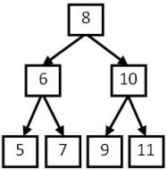
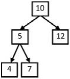
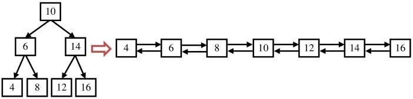

#### 画图让抽象问题形象化
很多⾯试题很抽象，不是很容易找到解决办法。这时不妨画出⼀些与题⽬相关的图形，借以辅助⾃⼰观察和思考。图形能使抽象的问题具体化、形象化，应聘者说不定通过⼏个图形就能找到规律，从⽽找到问题的解决⽅案。如⼆叉树、⼆维数组、链表等问 题，都可以采⽤画图的⽅法来分析。

### 19 二叉树的镜像

[NowCoder](https://www.nowcoder.com/practice/564f4c26aa584921bc75623e48ca3011?tpId=13&tqId=11171&tPage=1&rp=1&ru=/ta/coding-interviews&qru=/ta/coding-interviews/question-ranking)

<hh>题目描述</hh>

操作给定的二叉树，将其变换为源二叉树的镜像。

```text
源二叉树:
    	    8
    	   /  \
    	  6   10
    	 / \  / \
    	5  7  9  11
镜像二叉树:
    	    8
    	   /  \
    	  10   6
    	 / \  / \
    	11  9 7  5
```


<hh>解题思路</hh>

递归的交换根节点的两个子节点


```java
public void Mirror(TreeNode root) {
    if (root == null) return;
    TreeNode left = root.left;
    root.left = root.right;
    root.right = left;
    Mirror(root.left);
    Mirror(root.right);
}
```

### 20 顺时针打印矩阵

[NowCoder](https://www.nowcoder.com/practice/9b4c81a02cd34f76be2659fa0d54342a?tpId=13&tqId=11172&tPage=1&rp=1&ru=/ta/coding-interviews&qru=/ta/coding-interviews/question-ranking)

<hh>题目描述</hh>

输入一个矩阵，按照从外向里以顺时针的顺序依次打印出每一个数字，例如，如果输入如下4X4矩阵：1 2 3 4 5 6 7 8 9 10 11 12 13 14 15 16， 则依次打印出数字1,2,3,4,8,12,16,15,14,13,9,5,6,7,11,10.


<hh>解题思路</hh>


```java
public ArrayList<Integer> printMatrix(int [][] matrix) {
    ArrayList<Integer> list = new ArrayList<>();
    int row = matrix.length;
    if (row == 0) return list;
    int col = matrix[0].length;
    // 短的边/2，向上取整
    int circle = ((row > col ? col : row) + 1) / 2;
    for (int i = 0; i < circle; i++) {

        // 从左向右打印，j=i; j < col-i,
        // 这一行的前i个已经在第i圈从下往上被打印，故j=i
        // 倒数i个都已经在第i圈从上往下被打印，故j=col-i-1<col-i
        for (int j = i; j < col - i; j++) list.add(matrix[i][j]);

        // 从上往下打印，j=i+1;j<row-i,
        // 这一列的前i+1个已经在从左向右打印时被打印,故j=i+1
        // 倒数i个已经在第i圈从右往左被打印,故j=row-i-1<row-i
        for (int j = i + 1; j < row - i; j++)  list.add(matrix[j][col - i - 1]);

        // 从右往左打印，j=col-i-2;j>=i&&row-i-1!=i;，
        // 这一行倒数i个已经在第i圈从上往下被打印
        // 这一行倒数第i+1个已经在从上往下时被打印，故j=col-1-(i+1)=col-i-2
        // 这一行的前i个已经在从下往上时被打印，故j=i>=i
        // 当第i圈为0时即从未由上往下打印时，col有多列时，会造成重复打印，故判断row-i-1!=i以避免
        for (int j = col - i - 2; j >= i && row - i - 1 != i; j--)  list.add(matrix[row - i - 1][j]);

        // 从下往上打印，j=row-i-2;j>i&&col-i-1!=i，
        // 这一列倒数i个已经在第i圈从右往作被打印
        // 这一列倒数第i+1个已经在从右往左时被打印，故j=row-1-(i+1)=row-i-2
        // 这一列的前i个已经在第i圈从左往右时被打印，
        // 这一列的第i+1个已经在本圈从左往右被打印，故j=i+1>i
        // 当第i圈为0时即从未由右向左打印时，row有多行时，会造成重复打印，故判断col-i-1!=i以避免
        for (int j = row - i - 2; j > i && col - i - 1 != i; j--)  list.add(matrix[j][i]);
    }
    return list;
}
```

### 21 包含min函数的栈

[NowCoder](https://www.nowcoder.com/practice/4c776177d2c04c2494f2555c9fcc1e49?tpId=13&tqId=11173&tPage=1&rp=1&ru=/ta/coding-interviews&qru=/ta/coding-interviews/question-ranking)

<hh>题目描述</hh>


定义栈的数据结构，请在该类型中实现⼀个能够得到栈的最⼩元素的min函数。在该栈中，调⽤<C>min</C>、<C>push</C>及<C>pop</C>的时间复杂度都是$O(1)$。

<hh>解题思路</hh>

参见[LeetCode 155 Min Stack](https://techlarry.github.io/wiki/2017/10/10/Leetcode-155-Min-Stack/)

### 22 栈的压⼊、弹出序列

[NowCoder](https://www.nowcoder.com/practice/d77d11405cc7470d82554cb392585106?tpId=13&tqId=11174&tPage=1&rp=1&ru=/ta/coding-interviews&qru=/ta/coding-interviews/question-ranking)

<hh>题目描述</hh>


输⼊两个整数序列，第⼀个序列表⽰栈的压⼊顺序， 请判断第⼆个序列是否为该栈的弹出顺序。假设压⼊栈的所有数 字均不相等。例如序列1、2、3、4、5是某栈的压栈序列，序列 4、5、3、2、1是该压栈序列对应的⼀个弹出序列，但4、3、5、 1、2就不可能是该压栈序列的弹出序列。

<hh>解题思路</hh>


解决这个问题很直观的想法就是建⽴⼀个辅助栈，把输⼊的第⼀个序列中的数字依次压⼊该辅助栈，并按照第⼆个序列的顺序依次从该栈中弹出数字。

判断⼀个序列是不是栈的弹出序列的规律：如果下⼀个弹出的数字刚好是栈顶数字，那么直接弹出。如果下⼀个弹出的数字不在栈顶，我们把压栈序列中还没有⼊栈的数字压⼊辅助栈，直到把下⼀个需要弹出的数字压⼊栈顶为⽌。如果所有的数字都压⼊栈了仍然没有找到下⼀个弹出的数字，那么该序列不可能是⼀个弹出序列。


```Java
public boolean IsPopOrder(int [] pushA, int [] popA) {
    if (pushA == null) return popA == null;
    if (pushA.length != popA.length) return false;
    int i = 0, j = 0;
    Stack<Integer> stack = new Stack<>();
    while ( i < pushA.length && j < popA.length) {
        // 入栈
        stack.push(pushA[i++]);
        while (i < pushA.length && stack.peek() != popA[j])
            stack.push(pushA[i++]);
        // 全部元素入栈
        if (i == pushA.length) break;

        // 出栈
        stack.pop();
        j++;
    }

    // 确认栈内的剩余元素与出栈顺序相符合
    while (!stack.isEmpty())
        if (stack.pop() != popA[j++]) return false;

    return true;
}
```

### 23 从上往下打印二叉树

[NowCoder](https://www.nowcoder.com/practice/7fe2212963db4790b57431d9ed259701?tpId=13&tqId=11175&tPage=1&rp=1&ru=/ta/coding-interviews&qru=/ta/coding-interviews/question-ranking)

<hh>题目描述</hh>


从上往下打印出⼆叉树的每个结点，同⼀层的结点按 照从左到右的顺序打印。例如输⼊下图中的⼆叉树，则依次打印出8、6、10、5、7、9、11。


<hh>解题思路</hh>

树的广度优先搜索。类似于[LeetCode 102 Binary Tree Level Order Traversal](https://techlarry.github.io/wiki/2017/10/30/Leetcode-102-Binary-Tree-Level-Order-Traversal/)。


```java
public ArrayList<Integer> PrintFromTopToBottom(TreeNode root){
    ArrayList<Integer> list = new ArrayList<>();
    if (root == null) return list;
    Queue<TreeNode> queue = new LinkedList<>();
    queue.offer(root);
    while (!queue.isEmpty()) {
        int size = queue.size();
        for (int i = 0; i < size; i++) {
            TreeNode cur = queue.poll();
            list.add(cur.val);
            if (cur.left != null) queue.offer(cur.left);
            if (cur.right != null) queue.offer(cur.right);
        }
    }
    return list;
}
```

### 24 ⼆叉搜索树的后序遍历序列

[NowCoder](https://www.nowcoder.com/practice/a861533d45854474ac791d90e447bafd?tpId=13&tqId=11176&rp=1&ru=/ta/coding-interviews&qru=/ta/coding-interviews/question-ranking)

<hh>题目描述</hh>

题⽬：输⼊⼀个整数数组，判断该数组是不是某⼆叉搜索树的后序遍历的结果。如果是则返回true，否则返回false。假设输⼊的数组的任意两个数字都互不相同。

例如输⼊数组{5,7,6,9,11,10,8}，则返回true，因为这个整数序列是下图⼆叉搜索树的后序遍历结果。如果输⼊的数组是{7,4,6,5}，由于没有哪棵⼆叉搜索树的后序遍历的结果是这个序列，因此返回false。



在后序遍历得到的序列中，最后⼀个数字是树的根结点的值。数组中前⾯的数字可以分为两部分：第⼀部分是左⼦树结点的值，它们都⽐根结点的值⼩；第⼆部分是右⼦树结点的值，它们都⽐根结点的值⼤。


```Java
public boolean VerifySquenceOfBST(int[] sequence) {
    if (sequence == null || sequence.length == 0) return false;
    return VerifySquenceOfBST(sequence, 0, sequence.length - 1);
}

private boolean VerifySquenceOfBST(int[] nums, int lo, int hi) {
    // 有且只有一个节点
    if (lo >= hi) return true;

    // 根节点
    int root = nums[hi];
    // 找寻左子树
    int left = lo;
    while (left < hi && nums[left] <= root)
        left++;
    // 找寻右子树
    int right = left;
    while (right < hi)
        if (nums[right++] < root) return false;
    return VerifySquenceOfBST(nums, lo, left - 1) && VerifySquenceOfBST(nums, left, hi - 1);
}
```

### 25 二叉树中和为某一值的路径

[NowCoder](https://www.nowcoder.com/practice/b736e784e3e34731af99065031301bca?tpId=13&tqId=11177&tPage=1&rp=1&ru=/ta/coding-interviews&qru=/ta/coding-interviews/question-ranking)

<hh>题目描述</hh>


输入一颗二叉树和一个整数，打印出二叉树中结点值的和为输入整数的所有路径。路径定义为从树的根结点开始往下一直到叶结点所经过的结点形成一条路径。

例如输⼊下图中⼆叉树和整数22，则打印出两条路径，第⼀条路径包含结点10、12，第⼆条路径包含结点10、5和7。



<hh>解题思路</hh>

见[LeetCode 113. Path Sum II](https://techlarry.github.io/wiki/2017/10/30/Leetcode-113-Path-Sum-II/)


### 26 复杂链表的复制

[NowCoder](https://www.nowcoder.com/practice/f836b2c43afc4b35ad6adc41ec941dba?tpId=13&tqId=11178&tPage=1&rp=1&ru=/ta/coding-interviews&qru=/ta/coding-interviews/question-ranking)

<hh>题目描述</hh>


输入一个复杂链表(每个节点中有节点值，以及两个指针，一个指向下一个节点，另一个特殊指针指向任意一个节点)，返回结果为复制后复杂链表的head。

```java
public class RandomListNode {
    int label;
    RandomListNode next = null;
    RandomListNode random = null;

    RandomListNode(int label) {
        this.label = label;
    }
}
```


<hh>解题思路</hh>

见[LeetCode 138. Copy List with Random Pointer](https://techlarry.github.io/wiki/2017/10/30/Leetcode-133-Clone-Graph/)


### 27 二叉搜索树与双向链表

[NowCoder](https://www.nowcoder.com/practice/947f6eb80d944a84850b0538bf0ec3a5?tpId=13&tqId=11179&tPage=1&rp=1&ru=/ta/coding-interviews&qru=/ta/coding-interviews/question-ranking)

<hh>题目描述</hh>


输⼊⼀棵⼆叉搜索树，将该⼆叉搜索树转换成⼀个排序的双向链表。要求不能创建任何新的结点，只能调整树中结点指针的指向。⽐如输⼊下图中左边的⼆叉搜索树，则输出转换之后的排序双向链表。



<hh>解题思路</hh>


这道题目非常类似于[LeetCode 114. Flatten Binary Tree to Linked List](https://techlarry.github.io/wiki/2017/10/30/Leetcode-114-Flatten-Binary-Tree-to-Linked-List/)，只不过LeetCode要求用先序遍历，这里要求是排序的，也就是中序遍历。本质是一样的。

最直接的方法：获取中序遍历结果，然后将先后的节点一一串联起来。

```Java
public TreeNode Convert(TreeNode root) {
    if (root == null) return null;
    List<TreeNode> list = new ArrayList<>();
    inorder(list, root);
    for (int i = 1; i < list.size(); i++) {
        list.get(i).left = list.get(i - 1);
        list.get(i - 1).right = list.get(i);
    }
    return list.get(0);
}
    
private void inorder(List<TreeNode> list, TreeNode root) {
    if (root == null) return;
    inorder(list, root.left);
    list.add(root);
    inorder(list, root.right);
}
```

比较好的办法是在遍历二叉树的同时，操作节点：


```Java
private TreeNode prevNode, head;
public TreeNode Convert(TreeNode root) {
    if (root == null) return null;
    inorder(root);
    return head;
}
    
private void inorder(TreeNode root) {
    if (root == null) return;
    inorder(root.left);
    if (prevNode == null) {
        head = root;
    } else {
        prevNode.right = root;
        root.left = prevNode;
    }
    prevNode = root;
    inorder(root.right);
}
```


### 28 字符串的排列

[NowCoder](https://www.nowcoder.com/practice/fe6b651b66ae47d7acce78ffdd9a96c7?tpId=13&tqId=11180&tPage=1&rp=1&ru=/ta/coding-interviews&qru=/ta/coding-interviews/question-ranking)

<hh>题目描述</hh>


输入一个字符串，按字典序打印出该字符串中字符的所有排列。例如输入字符串abc，则打印出由字符a, b, c所能排列出来的所有字符串abc, acb, bac, bca, cab和cba。

<hh>解题思路</hh>

典型的回溯法，见[](https://techlarry.github.io/wiki/2017/10/30/Algorithm-Backtracking/#Example-Permute-Vector)。与[LeetCode 47 Permutations II](https://techlarry.github.io/wiki/Leetcode/47.%20Permutations%20II%20/)非常类似，只不过把数字换成子字符而已。

由于字符可能出现重复，所以需要预先排序。


```Java
public ArrayList<String> Permutation(String str) {
   ArrayList<String> list = new ArrayList<>();
   if (str == null || str.length() == 0) return list;
   char[] c = str.toCharArray();
   Arrays.sort(c);
   Permutation(list, new StringBuilder(new String(c)), 
                new StringBuilder());
   return list;
}
private void Permutation(List<String> list, StringBuilder str, 
            StringBuilder chosen) {
    if (str.length() == 0) {
        list.add(chosen.toString());
        return;
    }
    for (int i = 0; i < str.length(); i++) {
        char c = str.charAt(i);
        if (i > 0 && c == str.charAt(i - 1)) continue;
        str.deleteCharAt(i);
        chosen.append(c);
        Permutation(list, str, chosen);
        str.insert(i, c);
        chosen.deleteCharAt(chosen.length() - 1);
    }
}
```

