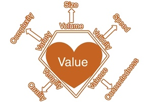
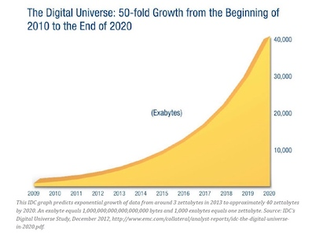
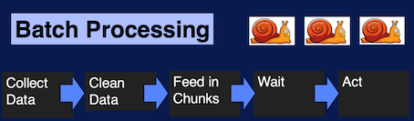
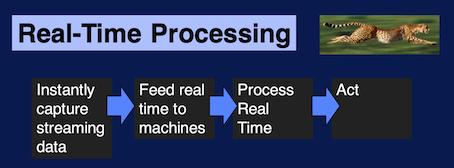
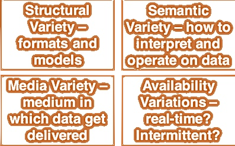
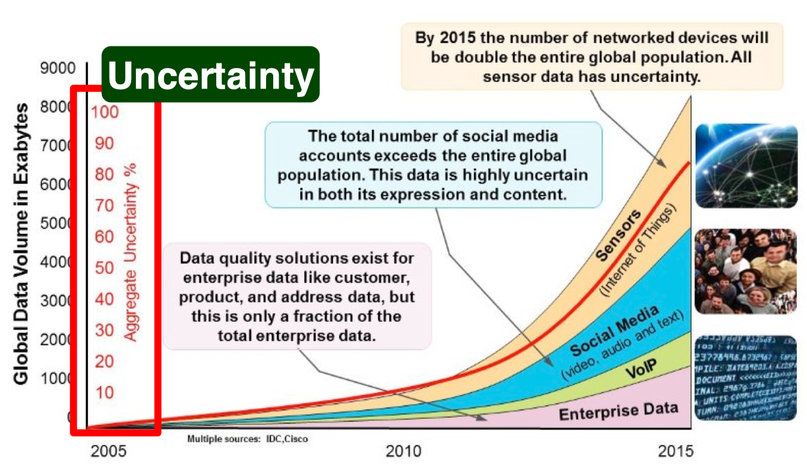
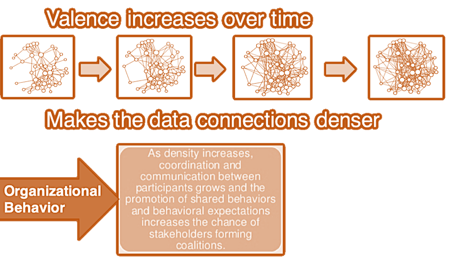

[Big Data Specialization](https://www.coursera.org/specializations/big-data)笔记。

### 1 Big data why and where

40% projected growth in global data generated per year vs 5% growth in global IT spending.

Cloud computing = computing anywhere and any time + dynamic and scalable data analysis

Applications: which makes big data valuable.

Big data -> better models -> higher precision

### 2 Characteristics of Big Data and Dimensions of Scalability

The Four V's of Big Data: 

* **Volume**: This refers to the vast amounts of data that is generated every second/minute/hour/day in our digitized world.

* **Velocity**: This refers to the speed at which data is being generated and the pace at which data moves from one point to the next.

* **Variety**: This refers to the ever-increasing different forms that data can come in, e.g., text, images, voice, geospatial.

A fourth V is now also sometimes added:

* **Veracity**: This refers to the quality of the data, which can vary greatly.

There are many other V's that gets added to these depending on the context. For our specialization, we will add:

* **Valence**: This refers to how big data can bond with each other, forming connections between otherwise disparate datasets.

In fact, many consider value as the sixth V of big data:

* **Value**: Processing big data must bring about value from insights gained.

#### volume 

Volume == Size

#### velocity

velocity == speed

speed of creating data
speed of analyzing data
speed of analyzing data

Big data -> real-time processing, late decisions leads to missing opportunities.

Batch Processing:

Real-Time Processing:

#### variety

Axes of Data Variety

Think of an email collection

* Sender, receiver, date…    Well-structured
* Body of the email.         Text
* Attachments                 Multi-media
* Who-sends-to-whom           Network
* A current email cannot reference a past email   Semantics
* Real-time?  Availability

#### veracity
Veracity == Quality

Veracity is very important for making big data operational. Because big data can be noisy and uncertain. Data is of no value if it's not accurate, the results of big data analysis are only as good as the data being analyzed. This is often described in analytics as *junk in equals junk out*.

#### valence

Valence == Connectedness

#### value

#### 3 Data Science: Getting Value out of Big Data
#### 4 Foundations for Big Data Systems and Programming
#### 5 Systems: Getting Started with Hadoop