[Big Data Specialization](https://www.coursera.org/specializations/big-data)笔记。

## I Big Data Intruction

### 1 Big data why and where

40% projected growth in global data generated per year vs 5% growth in global IT spending.

Cloud computing = computing anywhere and any time + dynamic and scalable data analysis

Applications: which makes big data valuable.

Big data -> better models -> higher precision

The combination of a growing torrent of data and on-demand (e.g.cloud) computing has launched the data field.

### 2 Characteristics of Big Data and Dimensions of Scalability

The Four V's of Big Data: 

* **Volume**: This refers to the vast amounts of data that is generated every second/minute/hour/day in our digitized world.

* **Velocity**: This refers to the speed at which data is being generated and the pace at which data moves from one point to the next.

* **Variety**: This refers to the ever-increasing different forms that data can come in, e.g., text, images, voice, geospatial.

* **Veracity**: This refers to the quality of the data, which can vary greatly.

There are many other V's that gets added to these depending on the context. 

* **Valence**: This refers to how big data can bond with each other, forming connections between otherwise disparate datasets.
* **Value**: Processing big data must bring about value from insights gained.

#### volume 

Volume == Size

#### velocity

velocity == speed

speed of creating data
speed of analyzing data
speed of analyzing data

Big data -> real-time processing, late decisions leads to missing opportunities.

Batch Processing:

Real-Time Processing:

#### variety

Axes of Data Variety

Think of an email collection

* Sender, receiver, date…    Well-structured
* Body of the email.         Text
* Attachments                 Multi-media
* Who-sends-to-whom           Network
* A current email cannot reference a past email   Semantics
* Real-time?  Availability

#### veracity
Veracity == Quality

Veracity is very important for making big data operational. Because big data can be noisy and uncertain. Data is of no value if it's not accurate, the results of big data analysis are only as good as the data being analyzed. This is often described in analytics as *junk in equals junk out*.

#### valence

Valence == Connectedness

#### value

### 3 Data Science: Getting Value out of Big Data

Data science can be thought of as a basis for empirical research where data is used to induce information for observations. 

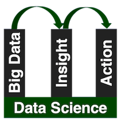

Insights often refer to the data products of data science.

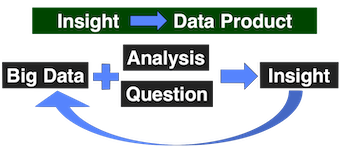

#### five P's 

five P's of data science:

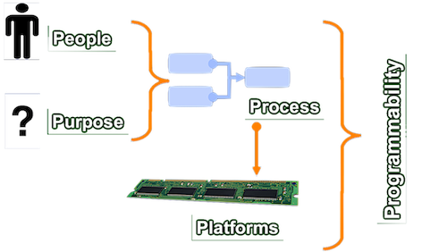

### 4 Foundations for Big Data Systems and Programming

...

### 5 Systems: Getting Started with Hadoop

#### hdfs

HDFS splits files across nodes for parallel access:

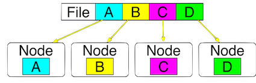

HDFS is designed for fault tolerance. By default, HDFS maintains three copies of each block.

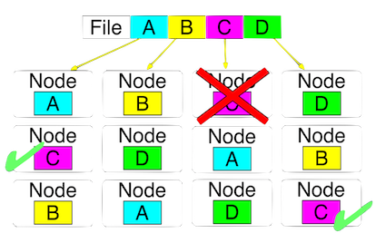

HDFS is also designed for variety of file types: text, pics....

Two key components of HDFS

1. **NameNode** for metadata: Usually one per cluster
    
    * coordinates operations
    * keeps track of file name, location in directory, etc.
    * mapping of contents on DataNode.    
2. **DataNode** for block storage: Usually one per machine
    
    * Listens to NameNode for block creation, deletion,

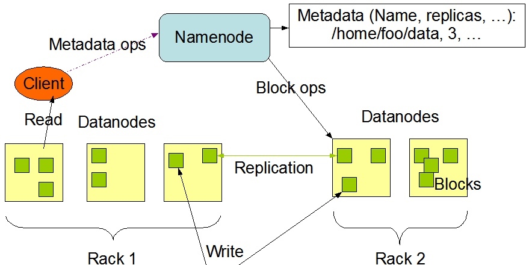

[View in Detail](Hadoop权威指南/3 The Hadoop Distributed FileSystem.md)

#### yarn

YARN - The resource manager for hadoop

Hadoop 1.0 only  support, mapreduce jobs, other applications are not supported, which has *poor resource utilization*.

Hadoop 2.0: One dataset -> many applications

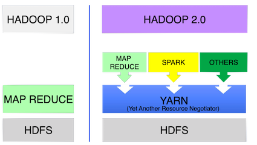

#### mapreduce

map and reduce are two concepts based on functional programming.

* map = apply operation to all elements
* reduce = summarize operation on elements

!!! example "WordCount"

    Step 1: Map on each node - map generates key-value pairs

    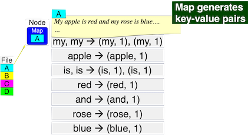
    
    Step2: sort and shuffle - pairs with same key moved to same node
    
    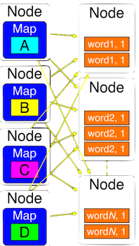
    
    Step3: reduce - add values for same keys
    
    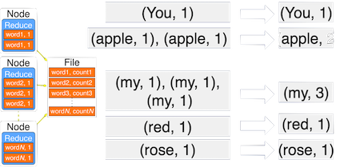

MapReduce is bad for:

* frequently changing data
* dependent tasks
* interactive analysis

#### When to reconsider Hadoop

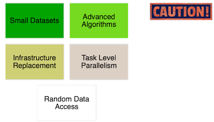

#### cloud computing 

If you decide to build your own hardware:

* Hardware estimation is hard -> over estimation/under estimation
* Software Stacks are complex
* High Capital Investments: maintenance, procurement, disposal...

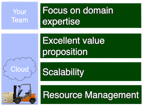

#### cloud service models

IaaS = Get the Hardware only

* YOU: Install and maintain OS Application Software
* e.g. Amazon EC2

PaaS = Get the Computing Environment

* YOU: Application Software
* e.g. Microsoft Azure

SaaS = Get full software on-demand

* YOU: Domain Goals
* e.g. Dropbox

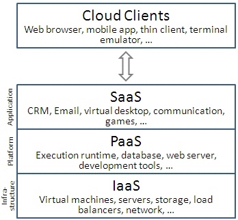
