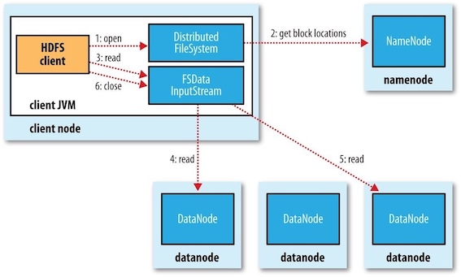

Filesystems that manage the storage across a network of machines are called ***distributed filesystems*** . Hadoop comes with a distributed filesystem called HDFS, which stands for ***Hadoop Distributed Filesystem*** .


### 1 The Design of HDFS

HDFS is a filesystem designed for storing very large files with streaming data access patterns, running on clusters of commodity hardware.

* Very large files: files that are hundreds of megabytes, gigabytes, or terabytes in size.
* Streaming data access: HDFS is built around the idea that the most efficient data processing pattern is a ***write-once, read-many-times*** pattern.
* Commodity hardware: It’s designed to run on clusters of commodity hardware.

These are areas where HDFS is not a good fit today:

* Low-latency data access
* Lots of small files
* Multiple writers, arbitrary file modifications


### 2 HDFS Concepts

#### Blocks

A disk has a block size, which is the minimum amount of data that it can read or write. Filesystems for a single disk build on this by dealing with data in blocks, which are an integral multiple of the disk block size.

HDFS, too, has the concept of a ***block***, but it is a much larger unit — 128 MB by default (typically a few kilobytes for ordinary file system). Unlike a filesystem for a single disk, a file in HDFS that is smaller than a single block does not occupy a full block’s worth of underlying storage. (For example, a 1 MB file stored with a block size of 128 MB uses 1 MB of disk space, not 128 MB.)

!!! Question
    WHY IS A BLOCK IN HDFS SO LARGE? To minimize the cost of seeks.
    
Having a block abstraction for a distributed filesystem brings several benefits.

* A file can be larger than any single disk in the network.
* Making the unit of abstraction a block rather than a file simplifies the storage subsystem.
    * storage management: because blocks are a fixed size, it is easy to calculate how many can be stored on a given disk.
    * metadata concerns: because blocks are just chunks of data to be stored, file metadata such as permissions information does not need to be stored with the blocks.
* Blocks fit well with replication for providing fault tolerance and availability.
    * To insure against corrupted blocks and disk and machine failure, each block is replicated to a small number of physically separate machines (typically three).

#### Namenodes and Datanodes

An HDFS cluster has two types of nodes: a ***namenode*** (the master) and a number of ***datanodes*** (workers). 

* The namenode manages the filesystem namespace. It maintains the filesystem tree and the metadata for all the files and directories in the tree. This information is stored persistently on the local disk in the form of two files: the namespace image and the edit log.
* The namenode also knows the datanodes on which all the blocks for a given file are located;
* Datanodes are the workhorses of the filesystem. They store and retrieve blocks when they are told to (by clients or the namenode), and they report back to the namenode periodically with lists of blocks that they are storing.

If the machine running the namenode were obliterated, all the files on the filesystem would be lost since there would be no way of knowing how to reconstruct the files from the blocks on the datanodes. Possible solution:

* to back up the files that make up the persistent state of the filesystem metadata.
* to run a secondary namenode, which keeps a copy of the merged namespace image.

#### Block Caching

For frequently accessed files, the blocks may be *explicitly* cached in the datanode’s memory, in an off-heap block cache. Users or applications instruct the namenode which files to cache (and for how long) by adding a *cache directive* to a *cache pool*.

#### HDFS Federation

Problem: On very large clusters with many files, memory becomes the limiting factor for scaling, since namenode keeps a reference to every file and block in the filesystem in memory.

For example, a 200-node cluster with 24 TB of disk space per node, a block size of 128 MB, and a replication factor of 3 has room for about 2 million blocks (or more): $200\times 24TB⁄(128MB×3)$, So in this case, setting the namenode memory to 12,000 MB would be a good starting point.

Solution: HDFS federation, allows a cluster to scale by adding namenodes, each of which manages a portion of the filesystem namespace.

#### HDFS High Availability

To remedy a failed namenode, a pair of namenodes in an ***active-standby*** configuration is introduced in Hadoop 2. In the event of the failure of the active namenode, the standby takes over its duties to continue servicing client requests *without* a significant interruption.

### 3 The Command-Line Interface

#### Basic Filesystem Operations

Hadoop’s filesystem shell command is <C>fs</C>, which supports a number of subcommands (type <c>hadoop fs -help</C> to get detailed help).

Copying a file from the local filesystem to HDFS:

```bash
#The local file is copied tothe HDFS instance running on localhost.
$ hadoop fs -copyFromLocal test.copy /test.copy
# works as the same
$ hadoop fs -copyFromLocal test.copy hdfs://localhost:9000/test2.copy
```

Copying the file from the HDFS to the local filesystem:

```bash
$ hadoop fs -copyToLocal /test.copy test.copy.txt
```

### 4 Hadoop Filesystems

Hadoop has an abstract notion of filesystems, of which HDFS is just one implementation. The Java abstract class <C>org.apache.hadoop.fs.FileSystem</C> represents the client interface to a filesystem in Hadoop, and there are several concrete implementations.


| Filesystem | URI scheme | Java implementation | Description |
| --- | --- | --- | --- |
| Local | file | fs.LocalFileSystem | A filesystem for a locally connected disk with client-side checksums |
| HDFS | hfs | hdfs.DistributedFileSystem | Hadoop’s distributed filesystem |
| WebHDFS | webhdfs | hdfs.web.WebHdfsFileSystem | Providing authenticated read/write access to HDFS over HTTP. |
| Secure WebHDFS | swebhdfs | hdfs.web.SWebHdfsFileSystem | The HTTPS version of WebHDFS. |

When you are processing large volumes of data you should choose a distributed filesystem that has the data locality optimization, notably HDFS.

#### HTTP

The HTTP REST API exposed by the WebHDFS protocol makes it easier for other languages to interact with HDFS. Note that the HTTP interface is slower than the native Java client, so should be avoided for very large data transfers if possible.

There are two ways of accessing HDFS over HTTP:

* Directly, where the HDFS daemons serve HTTP requests to clients;
* Via a proxy (or proxies), which accesses HDFS on the client’s behalf using the usual DistributedFileSystem API.


HDFS proxy allows for stricter firewall and bandwidth-limiting policies to be put in place. It’s common to use a proxy for transfers between Hadoop clusters located in different data centers, or when accessing a Hadoop cluster running in the cloud from an external network.

### 5 The Java Interface

Hadoop <C>FileSystem</C> class is the API for interacting with one of Hadoop’s filesystems. In general you should strive to ***write your code against the <C>FileSystem</C> abstract class*** , to retain portability across filesystems. This is very useful when testing your program, for example, because you can rapidly run tests using data stored on the local filesystem.

#### Reading Data from a Hadoop URL

NOT recommended, because <C>setURLStreamHandlerFactory()</C> method can be called only once per JVM, which means that if some other part of your program sets it, you won't be able to use.

#### Reading Data Using the FileSystem API

A file in a Hadoop filesystem is represented by a Hadoop <C>Path</C> object(<C>org.apache.hadoop.fs.Path</C>, not <C>java.io.File</C>). You can think of a <C>Path</C>  as a Hadoop filesystem URI, such as `hdfs://localhost/user/tom/test.copy`


Since <C>FileSystem</C> is a general filesystem API, so the first step is to retrieve an instance for the filesystem we want. There are several static factory methods for getting a <C>FileSystem</C> instance:

```Java
// Returns the default filesystem
public static FileSystem get(Configuration conf) throws IOException 
// Uses the given URI’s scheme and authority to determine the filesystem to use
public static FileSystem get(URI uri, Configuration conf) throws IOException 
// Retrieves the filesystem as the given user
public static FileSystem get(URI uri, Configuration conf, String user) throws IOException
// Retrieves a local filesystem instance
public static LocalFileSystem getLocal(Configuration conf) throws IOException
```

A <C>Configuration</C> object encapsulates a client or server's configuration, which is set using configuration files read from the classpath, such as `etc/hadoop/core-site.xml`.


With a <C>FileSystem</C> instance in hand, we invoke an <C>open()</C> method to get the input stream for a file:

```Java
// Uses a default buffer size of 4 KB
public FSDataInputStream open(Path f) throws IOException
// Uses a buffer size of bufferSize
public abstract FSDataInputStream open(Path f, int bufferSize) throws IOException
```

Displaying files from a Hadoop filesystem on standard output by using the FileSystem directly:

```Java
// $ hdfs://localhost:9000/test2.copy
import org.apache.hadoop.conf.Configuration;
import org.apache.hadoop.fs.FileSystem;
import org.apache.hadoop.fs.Path;
import org.apache.hadoop.io.IOUtils;

import java.io.InputStream;
import java.net.URI;

public class FileSystemCat {
    public static void main(String[] args) throws Exception {
        String uri = args[0];
        Configuration conf = new Configuration();
        FileSystem fs = FileSystem.get(URI.create(uri), conf);
        InputStream in = null;
        try {
            in = fs.open(new Path(uri));
            IOUtils.copyBytes(in, System.out, 4096, false);
        } finally {
            IOUtils.closeStream(in);
        }
    }
}
```

#### FSDataInputStream

The <C>open()</C> method on <C>FileSystem</C> actually returns an <C>FSDataInputStream</C> rather than a standard java.io class. This class is a specialization of <C>java.io.DataInputStream</C> with support for random access, so you can read from any part of the stream:


The <C>Seekable</C> interface permits seeking to a position in the file and provides a query method for the *current* offset from the start of the file (<C>getPos()</C>):

```Java
public interface Seekable { 
    void seek(long pos) throws IOException; 
    long getPos() throws IOException; }
```

Displaying files from a Hadoop filesystem on standard output twice, by using <C>seek()</C>:

```Java
// hdfs://localhost:9000/test2.copy

import org.apache.hadoop.conf.Configuration;
import org.apache.hadoop.fs.FSDataInputStream;
import org.apache.hadoop.fs.FileSystem;
import org.apache.hadoop.fs.Path;
import org.apache.hadoop.io.IOUtils;
import java.net.URI;

public class FileSystemDoubleCat {
    public static void main(String[] args) throws Exception {
        String uri = args[0];
        Configuration conf = new Configuration();
        FileSystem fs = FileSystem.get(URI.create(uri), conf);
        FSDataInputStream in = null;
        try {
            in = fs.open(new Path(uri));
            IOUtils.copyBytes(in, System.out, 4096, false);
            in.seek(0); // go back to the start of the file
            IOUtils.copyBytes(in, System.out, 4096, false);
        } catch (Exception ex) {
            ex.printStackTrace();
        } finally {
            IOUtils.closeStream(in);
        }
    }
}
```
#### Writing Data

The <C>FileSystem class</C> has a number of methods for creating a file. 

```Java
// takes a Path object for the file to be created and returns an output stream to write to
public FSDataOutputStream create(Path f) throws IOException
// appends to an existing file
public FSDataOutputStream append(Path f) throws IOException
```

!!! Warning
    The <C>create()</C> methods create any parent directories of the file to be written that don’t already exist.
    
    
There’s an overloaded method of <create()> for passing a callback interface, <C>Progressable<>/C, so your application can be notified of the progress of the data being written to the datanodes:

```
public interface Progressable { 
    public void progress(); 
}
```

Here, we illustrate progress by printing a period every time the <C>progress()</C> method is called by Hadoop, which is after each 64 KB packet of data is written to the datanode pipeline.

```Java
// args: /Users/larry/test.copy hdfs://localhost:9000/test4.copy
import org.apache.hadoop.conf.Configuration;
import org.apache.hadoop.fs.FileSystem;
import org.apache.hadoop.fs.Path;
import org.apache.hadoop.io.IOUtils;
import org.apache.hadoop.util.Progressable;

import java.io.*;
import java.net.URI;

// Copying a local file to a Hadoop filesystem
public class FileCopyWithProgress {

    public static void main(String[] args) throws Exception {
        String localsrc = args[0];
        String dstsrc = args[1];
        BufferedInputStream in = new BufferedInputStream(new FileInputStream(localsrc));

        Configuration conf = new Configuration();
        FileSystem fs = FileSystem.get(URI.create(dstsrc), conf);
        try {
            OutputStream out = fs.create(new Path(dstsrc), new Progressable() {
                @Override
                public void progress() {
                    System.out.println(".");
                }
            });
            IOUtils.copyBytes(in, out, 4096, true);

        } finally {
            IOUtils.closeStream(in);
        } //end try
    }// end main
}
```


#### FSDataOutputStream

The <C>create()</C> method on <C>FileSystem</C> returns an <C>FSDataOutputStream</C>, which, like <C>FSDataInputStream</C>, has a method for querying the current position in the file:

```Java
public class FSDataOutputStream extends DataOutputStream implements Syncable {
    public long getPos() throws IOException { 
        // implementation elided 
    }// implementation elided
}
```

However, because HDFS allows only sequential writes to an open file or appends to an already written file, <C>FSDataOutputStream</C> does not permit seeking.

#### Directories

<C>FileSystem</C> provides a method to create a directory:

```Java
public boolean mkdirs(Path f) throws IOException
```

This method creates all of the necessary parent directories if they don’t already exist.

#### Querying the Filesystem

<hh>File metadata: FileStatus</hh>
<hh>Listing files</hh>
<hh>File patterns</hh>


#### Deleting Data

Use the <C>delete()</C> method on <C>FileSystem</C> to permanently remove files or directories:

```Java
public boolean delete(Path f, boolean recursive) throws IOException
```

If <C>f</C> is a file or an empty directory, the value of <C>recursive</C> is ignored.


### 6 Data Flow

#### Anatomy of a File Read

The figure below shows the main sequence of events when reading a file.




* step 1: The client opens the file it wishes to read by calling <C>open()</C> on the <C>FileSystem</C> object, which for HDFS is an instance of <C>DistributedFileSystem</C>. 
* step 2: <C>DistributedFileSystem</C> calls the namenode, using remote procedure calls (RPCs), to determine the locations of the first few blocks in the file. 
* step 3: For each block, the namenode returns the addresses of the datanodes that have a copy of that block. Furthermore, the datanodes are sorted according to their proximity to the client. 
    * If the client is itself a datanode, the client will read from the local datanode if that datanode hosts a copy of the block.
    * The <C>DistributedFileSystem</C> returns an <C>FSDataInputStream</C> to the client for it to read data from. <C>FSDataInputStream</C> in turn wraps a <C>DFSInputStream</C>, which manages the datanode and namenode I/O.
    * The client then calls <C>read()</C> on the stream. 
* step 4: <C>DFSInputStream</C>, which has stored the datanode addresses for the first few blocks in the file, then connects to the first (closest) datanode for the first block in the file. Data is streamed from the datanode back to the client, which calls <C>read()</C> repeatedly on the stream. 
* step 5: When the end of the block is reached, <C>DFSInputStream</C> will close the connection to the datanode, then find the best datanode for the next block. 
* step 6: This happens transparently to the client, which from its point of view is just reading a continuous stream.
    * Blocks are read in order, with the <C>DFSInputStream</C> opening new connections to datanodes as the client reads through the stream. 
    * It will also call the namenode to retrieve the datanode locations for the next batch of blocks as needed. When the client has finished reading, it calls <C>close()</C> on the <C>FSDataInputStream</C>.

#### Anatomy of a File Write

The figure below illustrates the case of creating a new file, writing data to it, then closing the file.


* step 1: The client creates the file by calling <C>create()</C> on <C>DistributedFileSystem</C>. 
* step 2: <C>DistributedFileSystem</C> makes an RPC call to the namenode to create a new file in the filesystem’s namespace, with no blocks associated with it. 
    * The namenode performs various checks to make sure the file doesn’t already exist and that the client has the right permissions to create the file. 
    * If these checks pass, the namenode makes a record of the new file; otherwise, file creation fails and the client is thrown an <C>IOException</C>. 
    * The <C>DistributedFileSystem</C> returns an <C>FSDataOutputStream</C> for the client to start writing data to. Just as in the read case, <C>FSDataOutputStream</C> wraps a <C>DFSOutputStream</C>, which handles communication with the datanodes and namenode.
* step 3: As the client writes data, the <C>DFSOutputStream</C> splits it into packets, which it writes to an internal queue called the ***data queue*** . The data queue is consumed by the <C>DataStreamer</C>, which is responsible for asking the namenode to allocate new blocks by picking a list of suitable datanodes to store the replicas. 
* step 4: The list of datanodes forms a pipeline, and here we’ll assume the replication level is three, so there are three nodes in the pipeline. The <C>DataStreamer</C> streams the packets to the first datanode in the pipeline, which stores each packet and forwards it to the second datanode in the pipeline. Similarly, the second datanode stores the packet and forwards it to the third (and last) datanode in the pipeline .
* step 5: The <C>DFSOutputStream</C> also maintains an internal queue of packets that are waiting to be acknowledged by datanodes, called the ***ack queue***. A packet is removed from the ack queue only when it has been acknowledged by all the datanodes in the pipeline.
* step 6: When the client has finished writing data, it calls <C>close()</C> on the stream. This action flushes all the remaining packets to the datanode pipeline.
* step 7:  It waits for acknowledgments before contacting the namenode to signal that the file is complete. 

#### Coherency Model

A coherency model for a filesystem describes the data visibility of reads and writes for a file.

* Any content written to the file is not guaranteed to be visible, even if the stream is flushed.
* Once more than a block’s worth of data has been written, the first block will be visible to new readers.
* The <C>FSDataOutputStream.hflush()</C> method force all buffers to be flushed to the datanodes.
    * The <C>hflush()</T> guarantees that the data written up to that point in the file has reached all the datanodes in the write pipeline and is visible to all new readers.
    * But it does not guarantee that the datanodes have written the data to disk, only that it’s in the datanodes’ memory.
    * Closing a file in HDFS performs an implicit <C>hflush()</C>.
* The <C>hsync()</C> method syncs to disk for a file descriptor.

```Java
FileOutputStream out = new FileOutputStream(localFile); out.write("content".getBytes("UTF-8")); 
out.flush(); // flush to operating system 
out.getFD().sync(); // sync to disk 
assertThat(localFile.length(), is(((long) "content".length())));
```

<hh>Consequences for application design</hh>

You should call <C>hflush()</C> at suitable points, such as after writing a certain number of records or number of bytes.


### 7 Parallel Copying with distcp

The program <C>distcp</C> copys data to and from Hadoop filesystems in parallel.

```bash
$ hadoop distcp file1 file2
```

<C>distcp</C> is implemented as a MapReduce job where the work of copying is done by the maps that run in parallel across the cluster, with no reducers.