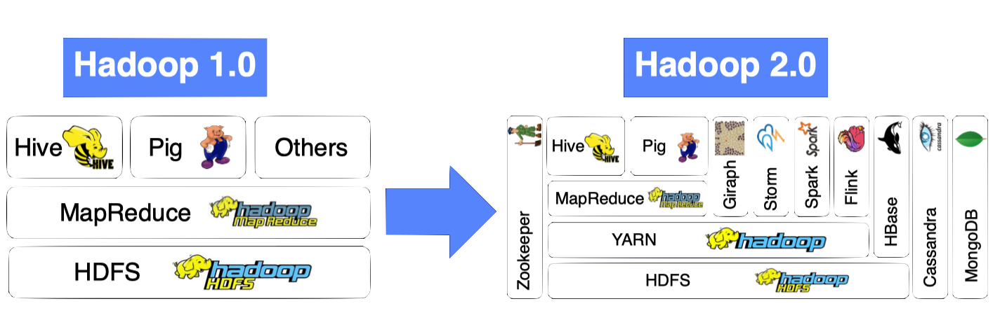
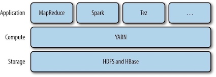
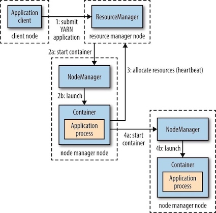

Apache YARN(Yet Another Resource Negotiator)是Hadoop的集群资源管理系统(**cluster resource management system**). YARN被引入Hadoop2，最初是为了改善MapReduce的实现，但它具有足够的通用性，同样可以支持其他的分布式计算模式。

YARN provides APIs for requesting and working with cluster resources, but these APIs are not typically used directly by user code. Distributed computing frameworks (MapReduce, Spark, and so on) running as YARN applications on the cluster compute layer (YARN) and the cluster storage layer (HDFS and HBase).

### 1 Anatomy of a YARN Application Run

YARN provides its core services via two types of long-running daemon:

* a ***resource manager*** (资源管理器，one per cluster) to manage the use of resources across the cluster,
* ***node managers***(节点管理器) running on all the nodes in the cluster to launch and monitor ***containers***.

YARN是如何运行一个应用的：

* step1 : To run an application on YARN, a client contacts the *resource manager* and asks it to run an ***application master*** process.
* steps 2a and 2b: The resource manager then finds a *node manager* that can launch the application master in a *container*. It could simply run a computation in the container it is running in and return the result to the client.
* step 3: Or it could request more containers from the resource managers
* steps 4a and 4b: use them to run a distributed computation.

> The ApplicationMaster is an instance of a framework-specific library that negotiates resources from the ResourceManager and works with the NodeManager to execute and monitor the granted resources (bundled as containers) for a given application. The ApplicationMaster runs in a container like any other application.

#### Resource Requests

A YARN application can make resource requests at any time while it is running. 

* Spark starts a fixed number of executors on the cluster (i.e. make all of requests up front). 
* MapReduce, has two phases: the map task containers are requested up front, but the reduce task containers are not started until later. (i.e. take a more dynamic approach whereby it requests more resources dynamically to meet the changing needs of the application).

#### Application Lifespan

The lifespan of a YARN application can vary dramatically. Rather than look at how long the application runs for, it’s useful to categorize applications in terms of how they map to the jobs that users run. 

* The simplest case is one application per user job, which is the approach that MapReduce takes.
* The second model is to run one application per workflow or user session of (possibly unrelated) jobs, which is the approach that Spark takes. This approach can be more efficient than the first, since containers can be reused between jobs, and there is also the potential to cache intermediate data between jobs.
* The third model is a long-running application that is shared by different users, which is the approach that Apache Slider takes.

#### Building YARN Applications

Writing a YARN application from scratch is fairly involved, but in many cases is not necessary, as it is often possible to use an existing application that fits the bill.

### 2 YARN Compared to MapReduce 1

The distributed implementation of MapReduce in the original version of Hadoop is sometimes referred to as “MapReduce 1” to distinguish it from MapReduce 2, the implementation that uses YARN.

A comparison of MapReduce 1 and YARN components:

| MapReduce1 |  YARN |
| --- | --- |
| Jobtracker | Resource manager, application master, timeline server |
| TaskTracker | Node manager |
| Slot | Container |

The Timeline Server addresses the problem of the storage and retrieval of application’s current and historic information in a generic fashion.

### 3 Scheduling in YARN

The job of the YARN scheduler to allocate resources to applications according to some defined policy. Scheduling in general is a difficult problem and there is ***no one "best" policy***, which is why YARN provides a choice of schedulers and configurable policies.

#### Scheduler Options

Three schedulers are available in YARN: the FIFO, Capacity, and Fair Schedulers.

* The FIFO: places applications in a queue and runs them in the order of submission (first in, first out)
    * Not suitable for shared clusters, because large applications will use all the resources in a cluster, so each application has to wait its turn. 
* Capacity Scheduler: a separate dedicated queue allows the small job to start as soon as it is submitted, since the queue capacity is reserved for jobs in that queue.
* Fair Scheduler: dynamically balance resources between all running jobs, each job is using its fair share of resources.
    * There is a lag between the time the second job starts and when it receives its fair share, since it has to wait for resources to free up as containers used by the first job complete. After the small job completes and no longer requires resources, the large job goes back to using the full cluster capacity again.

