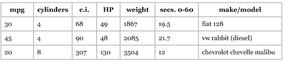

试想一个极端的例子：一个新乐队发布了专辑，这张专辑还没有被任何用户评价或购买过，如果是用协同过滤的话，那它将永远不会出现在推荐列表中。

这时我们可以**根据物品特征进行分类**。

来看一下[潘多拉音乐盒](http://www.pandora.com/newpandora)的例子。在这个站点上你可以设立各种音乐频道，只需为这个频道添加一个歌手，潘多拉就会播放和这个歌手风格相类似的歌曲。原因在于潘多拉网站的推荐系统是基于一个名为音乐基因的项目。 他们雇佣了专业的音乐家对歌曲进行分类（提取它们的“基因”）；这些专家要甄别400多种音乐特征。

具体方法是将每种歌曲类型拆分成单独的特征，并对此进行打分。每个特征都是1到5分的尺度，0.5分为一档。1分表示完全不符合，5分则表示很相符。


下表使用一些音乐特征(使用钢琴的程度、使用美声的程度、节奏等)对歌曲进行评分：


可以将上表存成二维HashTable的形式，可以直接利用第一章中的各种距离计算公式计算歌曲之间的距离来进行推荐。按我的理解，可以这么看待问题，或许更加容易理解：把这些特征(piano, vocals, driving beat)看成是用户，各个特征上的评分可以看成是用户评分，把基于用户的协同过滤看成是基于特征的协同过滤。


### 评分标准

假如我想增加一种音乐特征——每分钟的鼓点数（bpm），用来判断这是一首快歌还是慢歌。由于bpm取值范围(100~200左右)与前面(1~5)的不一致，导致bpm基本决定了两首歌的距离。

评分标准不一是所有推荐系统的大敌！让数据变得可用我们可以对其进行**标准化**(normalization)。 

#### Rescaling/Min-max normalization

最常用的方法是将所有数据都转化为0到1之间的值： 将每个值减去最小值，并除以范围：

$$\frac{x_i-\min}{\max-\min}$$

#### z-score normalization/Standardization


还可以使用**标准分**(z-score or standard score)：分值偏离均值的程度，

$$\text{standard score} = \frac{x_i-\bar x}{\sigma}$$

#### Modified Z-Score

标准分的问题在于它会受异常值的影响。 比如说一家公司有100名员工，普通员工每小时赚10美元，而CEO一年能赚600万，那全公司的平均时薪为38美元。在修正的标准分(Modified Z-Score)中，将标准分公式中的均值改为中位数(median)，将标准差改为**平均绝对偏差**(MAD, Mean Absolute Deviation[[wiki](https://en.wikipedia.org/wiki/Average_absolute_deviation)])。

$$\text{modified z-score}= \frac{x_i-\text{median}}{\text{MAD}}$$

$$\text{mean absolute deviation(MAD)} = \frac{\sum_i |x_i-\text{median}|}{\text{card}(x)}$$

#### 是否需要标准化？

需要进行标准化的情形：

* 我们需要通过物品特性来计算距离；
* 不同特性之间的尺度相差很大。

### Python数据格式

上面我们用二维HashTable的形式来存储歌曲的特征数据，这样做虽然可行，但却比较繁琐，piano、vocals这样的键名需要重复很多次。我们可以将其简化为向量，即Python中的数组类型：

```Python
# 物品向量中的特征依次为：piano, vocals, beat, blues, guitar, backup vocals, rap
items = {"Dr Dog/Fate": [2.5, 4, 3.5, 3, 5, 4, 1],
"Phoenix/Lisztomania": [2, 5, 5, 3, 2, 1, 1],
"Heartless Bastards/Out": [1, 5, 4, 2, 4, 1, 1],
"Black Eyed Peas/Rock That Body": [2, 5, 5, 1, 2, 2, 4],
"Lady Gaga/Alejandro": [1, 5, 3, 2, 1, 2, 1]
}
```

那么用户“赞”和“踩”的数据用什么表示呢？由于用户并不会对所有的歌曲都做这些操作，所以用嵌套的字典来表示比较方便：

```python
users = {"Angelica": {"Dr Dog/Fate": "L",
    "Phoenix/Lisztomania": "L",
    "Mike Posner": "D",
    "Black Eyed Peas/Rock That Body": "D",
    "Lady Gaga/Alejandro": "L"},
"Bill": {"Dr Dog/Fate": "L",
    "Phoenix/Lisztomania": "L",
    "Heartless Bastards/Out at Sea": "L",
    "Black Eyed Peas/Rock That Body": "D",
    "Lady Gaga/Alejandro": "D"}}
```

这里使用L和D两个字母来表示喜欢和不喜欢。


### 分类器

分类器是指通过物品特征来判断它应该属于哪个组或类别的程序。分类器程序会基于一组已经做过分类的物品进行学习，从而判断新物品的所属类别。


建立一个分类函数，用来预测用户对一个新物品的喜好;这个函数会先计算出与这个物品距离最近的物品，然后找到用户对这个最近物品的评价，以此作为新物品的预测值。

```Python
class simple_classifier:
	def __init__(self, users, items):
		self.users = users
		self.items = items


	def computeNearestNeighbor(self, itemName, itemVector, items):
		"""
		按照距离排序，返回邻近物品列表
		:param itemName
		:param itemVector
		:param items
		"""
		distances = []
		for otherItem in items:
			if otherItem != itemName:
				distance = DistanceVector.manhattan(itemVector, items[otherItem])
				distances.append((distance, otherItem))
		# 最近的排在前面
		distances.sort()
		return distances

	def classify(self, user, itemName, itemVector):
		nearest = self.computeNearestNeighbor(itemName, itemVector, self.items)[0][1]
		rating = self.users[user][nearest]
		return rating
```

让我们试用一下：

```python
>>> classify('Angelica', 'Chris Cagle/I Breathe In. I Breathe Out', [1, 5, 2.5, 1, 1, 5
, 1])
'L'
```

其实我们做的是一个分类器，将歌曲分为了用户喜欢和不喜欢两个类别。


### Example:运动项目

先看一个较为简单的例子——根据女运动员的身高和体重来判断她们是从事什么运动项目的。训练数据和测试数据分别来自athletesTrainingSet.txt和athletesTestSet.txt。文件格式如下：

```
comment	class	num	num
Asuka Teramoto	Gymnastics	54	66
Brittainey Raven	Basketball	72 162
```


#### 数据格式

在Python中应该如何合适的表示这些数据呢？由于分类器程序根本不会使用到姓名，所以用姓名作为键值的字典是不合适的。由于我们需要遍历文件的数据，所以使用list类型是合理的。如下是最合理的：

```python
[('Gymnastics', [54, 66], ['Asuka Termoto']),
    ('Basketball', [72, 162], ['Brittainey Raven']), ...]
```

它将不同类型的数据区别开来了，依次是分类、特征、备注。

#### Python代码

```python
class AthleteClassifier:
	def __init__(self, filename=None, format=None, header=True):
		"""
		initialize
		:param format: num, comment, class
		:param filename: filename for training data
		:param header: whether header line exist
		"""
		# format
		self.format = format
		# self.data format: class, fields, comments
		self.data = None
		# a list of median
		self.medians = []
		# mean absolute deviation
		self.mad = []
		# test result
		self.test_result = None
		# classes
		self.classes = set()

		# training data if a file is provided
		if filename and format:
			# data
			self.data = self.pre_processing(filename, header)
			# mad
			self.mean_absolute_deviation()
			# normalize
			self.normalizeColumn()


	def pre_processing(self, filename, header=True):
		"""
		read file and transform to data format
		:param filename: filename for training data
		:param header: whether header line exist
		"""

		file = codecs.open(filename, mode='r', encoding='utf-8')
		# skip header
		if header:
			file.readline()

		data = []
		n = len(self.format)
		for line in file.readlines():
			fields = line.strip("\n").split('\t')
			if len(fields) != n:
				raise(Exception("Input File Format Error"))
			vector, comment, classification = ([], "", None)
			for i in range(n):
				field, field_format = fields[i], self.format[i]
				if field_format == "num":
					vector.append(float(field))
				elif field_format == "class":
					classification = field
					self.classes.add(field)
				elif field_format == "comment":
					comment += (field + " ")
			data.append([classification, vector, comment.strip()])
		return data

	def mean_absolute_deviation(self):
		"""
		calculate mean absolute deviation of each fields for data
		"""
		for i in range(len(self.data[0][1])):
			# calculate median
			field = list(map(lambda x: x[1][i], self.data))
			self.medians.append(np.median(field))
			self.mad.append(sum(abs(np.array(field)
			                        - self.medians[i]))/len(field))

	def normalizeColumn(self):
		"""
		given a column number, normalize that column in self.data
		using the Modified Standard Score
		Modified Standard Score = score - median /(maxScore - minScore)
		"""
		for item in self.data:
			for j in range(len(item[1])):
				item[1][j] = (item[1][j] - self.medians[j])/self.mad[j]

	def normalizeVector(self, itemVector):
		"""
		given a vector, having the same format as the vector in the self.data[0][1],
		normalize it using a modified z-score
		:param itemVector: a vector, size of fields in self.data
		:return: a vector normazalied
		"""
		return [(itemVector[j] - self.medians[j]) / self.mad[j]
		        for j in range(len(itemVector))]

	def nearest_neighbor(self, itemVector):
		"""
		find nearest neighbor
		:param itemVector: a vector
		:return: nearest neighbor and the distance between them
		"""
		distance = [(DistanceVector.manhattan(np.array(itemVector), np.array(item[1])),
		             item) for item in self.data]
		return min(distance)

	def classify(self, itemVector):
		"""
		预测itemVector的分类
		:return: the result of the classification
		"""
		return self.nearest_neighbor(self.normalizeVector(itemVector))[1][0]

	def initialize_test_result(self):
		"""
		initialize test result
		"""
		self.test_result = {}
		classes = list(self.classes)
		classes.sort()
		for class_name in classes:
			self.test_result.setdefault(class_name, {})
			for another_class_name in classes:
				self.test_result[class_name][another_class_name] = 0

	def test(self, testfile, header=True):
		"""
		test file, return accuracy
		:param testfile: a file
		:param header: whether header line exist
		:return: double, accuracy
		"""
		accurate = 0

		# check if test result is initialized
		if not self.test_result:
			self.initialize_test_result()

		test_data = self.pre_processing(testfile, header)
		for item in test_data:
			classify_result = self.classify(item[1])
			self.test_result[item[0]][classify_result] += 1
			if classify_result == item[0]:
				accurate += 1
			#else:
				#print(item, "not equals", classify_result)
		return round(accurate/float(len(test_data))*100, 1)
```

结果测试准确率为84%。

```python
classifier = AthleteClassifier(training_file, ["comment", "class", "num", "num"], header=True)
print(classifier.test(test_file, header=True)) #84.2
```


### Example: 鸢尾花

鸢尾花数据集在数据挖掘领域是比较有名的。 它是20世纪30年代Ronald Fisher对三种鸢尾花的50个样本做的测量数据(萼片和花瓣)。训练集中有120条数据，测试集中有30条，两者没有交集。

测试结果表明使用同样的分类器有93.1的正确率。如果计算距离时，使用欧式距离，分类器有96.6%的正确率。

```Python
classifier = AthleteClassifier(training_file, ["num", "num", "num", "num", "class"], header=True)
classifier.test(test_file, header=False) # 93.1% correct
```

### Example: 每加仑燃油公里数

卡内基梅隆大学统计的汽车燃油消耗和公里数数据也是一个广泛使用的数据集。大致格式如下：




根据汽缸数、排气量、马力、重量、 加速度等数据预测每加仑燃油公里数(mpg)。如果不进行标准化，准确率将只有32%。标准化之后有55%准确率。
