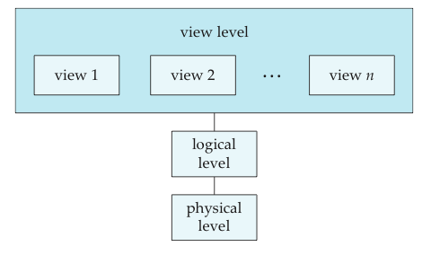
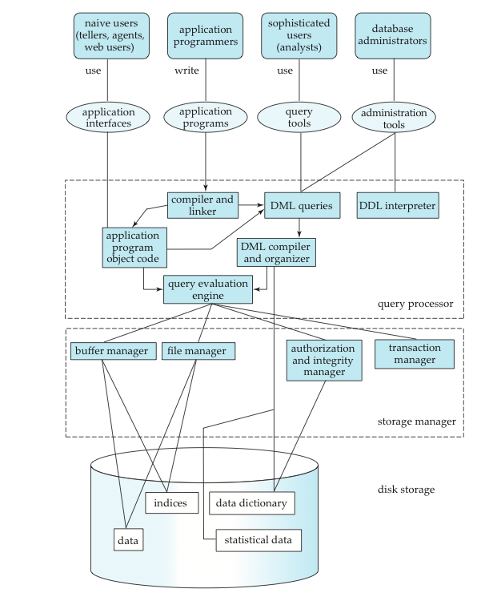

A `database-management system` (DBMS，数据库管理系统) is a collection of interrelated data and a set of programs to access those data.  The collection of data, usually referred to as the `database`. The primary goal of a DBMS is to provide a way to store and retrieve database information that is both `convenient` and `efficient`.

### Purpose of Database System

Keeping organizational information in a file-processing system has a number of major disadvantages:

* Data redundancy and inconsistency
    * Users of one program may be unaware of potentially useful data held by other programs.
* Difficulty in accessing data
    * Programs are written to satisfy particular functions.  
    * Any new requirement needs a new program.
* Data isolation
    * Same data is held by different programs 
    * Each program maintains its own set of data
* Integrity problems
* Atomicity problems
* Concurrent-access anomalies
* Security problems

### View of data

#### Data Abstraction
The need for efficiency has led designers to use complex data structures to represent data in the database.

* `Physical level`. The lowest level of abstraction *how* the data are actually stored
* `Logical level`. The next-higher level of abstraction describes *what* data are stored in the database, and what relationships exist among those data. Each record is described by a type definition, and the interrelationship of these record types is defined as well.
* `View level`. The highest level of abstraction describes only part of the entire data. The system may provide many views for the same database. Computer users see a set of application programs that hide details of the data types.

#### Instances and Schemas

* `Instance`: the collection of information stored in the database at a particular moment
* `schema`: the overall design of the database.

Database systems have several schemas, partitioned according to the levels of abstraction. The `Physical schema` describes the database design at the physical level, while the `logical schema` describes the database design at the logical level.

Applications programs are said to exhibit `physical data independence` if they do not depend on the `physical schema`, and thus need not be rewritten if the physical schema changes.

#### Data Models

`Data Model`(数据库): a collection of conceptual tools for describing data, data relationships, data semantics, and consistency constraints.

* `Relational Model`(关系数据库)
* `Entity-Relationship Model` (实体对象模型)
* `Object-Based Data Model` (基于对象的数据模型)
* `Semistructed Data Model`

### Database Language

A database system provides a `data-definition language`(DDL) to specify the database schema and a `data-manipulation language`(DML) to express database queries and updates.

### Data Storage and Querying

A database system is partitioned into modules that deal with each of the responsibilities of the overall system. The functional components of a database system can be broadly divided into the `storage manager` and the `query processor`

The `storage manager` is the component of a database system that provides the interface between the low-level data stored in the database and the application programs and queries submitted to the system. it is responsible for storing, retrieving, and updating data in the database. The storage manager translates the various DML statement into low-level file-system commands.

The `query processor` includes:

* `DDL interpreter`, which interprets DDL statements and records the definitions in the data dictionary.
* `DML compiler`, which translates DML statements in a query language into an evaluation plan consisting of low-level instructions that the query evaluation engine understands.
* `Query evaluation engine`, which executes low-level instructions generated by the DML compiler.

###  Transaction management

`Transaction management` ensures that the database remains in a consistent (correct) state despite system failures. The transaction manager ensures that concurrent transaction executions proceed without conflicting.

### Database Architecture

The architecture of a database system is greatly influenced by the underlying computer system on which the database system runs. Database system can be centralized, or client-server, where one server machine executes work on behalf of multiple client machines.

