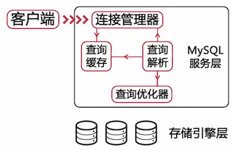
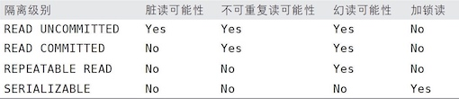
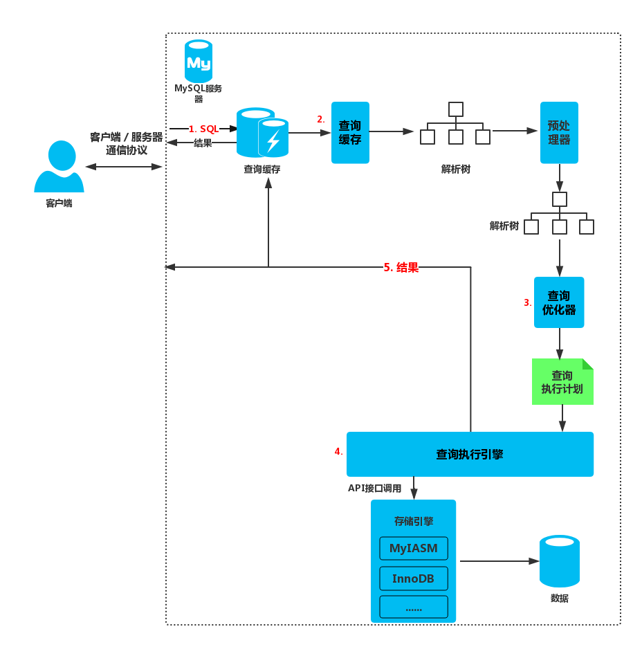

初稿。。。。。。。。。。
！！！！！！！！！！


### 1 MySQL架构和历史

MySQL最重要、最与众不同的特性是它的存储引擎架构，这种架构的设计将查询处理(Query Processing)及其他系统任务(Server Task)和数据的存储/提取相分离。这种处理和存储分离的设计可以在使用时根据性能、特性，以及其他需求来选择数据存储方式。

#### MySQL逻辑架构





当客户端链接到MySQL服务器时，服务器需要对其进行认证。认证基于用户名、原始主机信息和密码。随后MySQL会解析查询，并创建内部数据结构(解析树)，然后对其进行各种优化，包括重写查询、决定表的读取顺序，以及选择合适的索引等。优化器会请求存储引擎提供容量或者某个具体操作的开销信息等。


#### 并发控制

在处理并发读或者写时，可以通过由读锁(read lock)和写锁(write lock)组成的锁系统来解决。读锁是共享的，多个客户在同一时刻可以同时读取同一资源，而互不干扰。写锁是排他的，只有一个用户能执行写入，并防止其他用户读取正在写入的同一资源。

问题是加锁也需要消耗资源。锁的各种操作，包括获得锁、检查锁是否已经解除、释放锁等，都会增加系统的开销。所谓的**锁策略**，就是在锁的开销和数据的安全性之间寻求平衡，这种平衡当然也会影响到性能。每种MySQL存储引擎都可以实现自己的锁策略和锁粒度。

**表锁**(table lock)是MySQL中最基本的锁策略，并且是开销最小的策略。表锁会锁定整张表。用户在对表进行写操作(插入、删除、更新等)前，需要先获得锁，这会阻塞其他用户对该表的所有读写操作。

**行级锁**(row lock)可以最大程度地支持并发处理，同时也带来了最大的锁开销。在InnoDB和XtraDB等存储引擎中实现了行级锁。

#### 事务

**事务**(transaction)是数据库应用中完成单一逻辑功能的操作集合。


##### ACID特性

关系型数据库的事务具有ACID特性，即**原子性**(Atomicity)，**一致性**(Consistency)，**隔离性**(Isolation)，**持久性**(Durability)。


* 事务的**原子性**是指事务是一个**不可再分割的最小工作单元**，整个事务中的所有操作要么都执行，要么都不执行，不可能只执行其中的一部分。例如资金从账户A转账到账户B时，需要在账户A中进行取出操作，在账户B中进行存入操作。这两个操作必须保证要么都发生要么都不发生。
* 事务的**一致性**是指数据库总是从一个一致性的状态转换到另外一个一致性的状态。例如资金转账前后，账户A和B的余额之和应该是保持不变的。
* 事务的**隔离性**是指一个事务所做的修改在最终提交以前，对其他事务是不可见的。
* 事务的**持久性**是指事务执行完成后，该事务对数据库的更改就会永久保存到数据库中。例如当资金转账成功后，即使发生系统故障，账户A、B的余额也应该保持转账成功结束后的新值。


##### 隔离级别

SQL标准中定义了四种隔离级别，每一种级别都规定了一个事务中所做的修改，哪些在事务内和事务间是可见的，哪些是不可见的。较低级别的隔离通常可以执行更高的并发，系统的开销也更低。

* **未提交读**(READ UNCOMMITTED): 事务中的修改，即使没有提交，对其他事务也都是可见的。事务可以读取未提交的数据，这也被称为**脏读**(dirty read)。在实际应用中一般很少使用。
* **提交读**(READ COMMITTED): 一个事务从开始直到提交之前，所做的任何修改对其他事务都是不可见的。也叫做不可重复读(nonrepeatable read)，因为执行两次同样查询，可能得到不一样的结果。
* **可重复读**(REPEATABLE READ): 在同一个事务中多次读取同样记录的结果是一致的。但无法解决**幻读**(phantom read)的问题: 当某个事务在读取某个范围内的记录时，另外⼀个事务又在该范围内插⼊了新的记录，当之前的事务再次读取该范围的记录时，会产⽣幻⾏。InnoDB存储引擎通过多版本并发控制(MVCC)解决了幻读的问题。
* **序列化读**(SERIAZABLE)：所有的事务操作都必须串行操作。这种隔离级别最高，但是牺牲了系统的并发性。简单来说，序列化会在读取的每一行数据上都加锁，所以可能导致大量的超时和锁争用的问题。




##### 死锁

MySQL实现了各种死锁检测和死锁超时机制。越复杂的系统，比如InnoDB存储引擎，越能检测到死锁的循环依赖并立即返回一个错误。InnoDB目前处理死锁的方法是，将持有最少行级排他锁的事务进行回滚。

锁的行为和顺序是和存储引擎相关的。死锁的产生有双重原因：有些因为真正的数据冲突，但有些完全是由于存储引擎的实现方式导致的。死锁发生以后，只有部分或者完全回滚其中一个事务，才能打破死锁。


##### MySQL中的事务

MySQL默认采用自动提交(autocommit)模式：如果不是显示地开始一个事务，则每个查询都被当作一个事务执行提交操作。当AUTOCOMMIT=0时，所有的查询都是在一个事务中，直到显式地执行COMMIT提交或者ROLLBACK回滚，这时该事务结束，同时又开始了另外一个事务。

MySQL服务器层不管理个事务，事务是由下层的存储引擎实现的。所以在同一个事务中，使用多种存储引擎是不可靠的。如果在事务中混合使用了事务型和非事务型表(例如InnoDB和MyISAM表)，该事务需要回滚，那么非事务型的表的变更就无法撤销，这会导致数据库处于不一致的状态，这种情况很难修复。


#### 多版本并发控制

MySQL的大多数事务型存储引擎实现的都不是简单的行级锁。基于并发性能的考虑，它们一般都同时实现了**多版本并发控制**(MVCC)。可以认为MVCC是行级锁的一个变种，但是它在很多情况下避免了加锁操作，因此开销耕地。


MVCC的实现，是通过保存数据在某个时间点的快照实现的。根据事务开始的时间不同，每个事务对同一张表，同一时刻看到的数据可能是不一样的。InnoDB的MVCC，是通过在每行记录后面保存两个隐藏的列来实现的。这两个列，一个保存了行的创建时间，一个保存行的过期时间(或删除时间)。当然存储的并不是实际的时间值，而是系统版本号(system version number)。每开始一个事务，系统版本号都会自动递增。事务开始时刻的系统版本号会作为事务的版本号，⽤来和查询到的每⾏记录的版本号进⾏⽐较。


下⾯看⼀下在可重复读的隔离级别下，MVCC具体是怎么进行读操作的。

InnoDB会根据以下两个条件检查每⾏记录：

* InnoDB只查找版本早于当前事务版本的数据⾏（也就是，⾏的系统版本号⼩于或等于事务的系统版本号），这样可以确保事务读取的⾏，要么是在事务开始前已经存在的，要么是事务⾃⾝插⼊或者修改过的。
* ⾏的删除版本要么未定义，要么⼤于当前事务版本号。这可以确保事务读取到的⾏，在事务开始之前未被删除。

只有符合上述两个条件的记录，才能返回作为查询结果。保存这两个额外系统版本号，使⼤多数读操作都可以不⽤加锁。这样设计使得读数据操作很简单，性能很好，并且也能保证只会读取到符合标准的⾏。

#### MySQL的存储引擎

在文件系统中，MySQL将每个数据库(也可以称之为schema)保存为数据目录下的一个子目录。创建表时，MySQL会在数据库子目录下创建一个和表同名的`.frm`文件保存表的定义。


##### InnoDB

InnoDB是MySQL的默认事务型引擎，也是最重要、使用最广泛的存储引擎。它被设计用来处理大量的短期(short-lived)事务，短期事务大部分情况是正常提交的，很少会被回滚。除非有非常特别的愿意需要使用其他的存储引擎，否则应该优先考虑InnoDB引擎。

InnoDB的数据存储在表空间(tablespace)中，表空间是由InnoDB管理的一个黑盒子，由一系列的数据文件组成。InnoDB采用MVCC来控制高并发，并且实现了四个标准的隔离级别，其默认级别是可重复读，并且通过间隙锁(next-key locking)策略防止幻读的出现。

InnoDB表是基于聚簇索引建立的，对主键查询有很高的性能。


##### MyISAM

MyISAM不支持事务和行级锁，而且有一个毫无疑问的缺陷就是崩溃后无法安全回复。MyISAM提供了大量的特性，包括全文索引、压缩、空间函数(GIS)等。

MyISAM对整张表加锁，而不是针对行。读取时会对需要读到的所有表加共享锁，写入时则对表加排他锁。但是在表有读取查询的同时，也可以往表中插入新的记录。

对于MyISAM表，即使是BLOB和TEXT等长字段，也可以基于其前500个字符创建索引。MyISAM也支持全文索引，这是一种基于分词创建的索引，可以支持复杂的查询。

如果表在创建并导入数据以后，不会再进行修改操作，那么这样的表或许适合MyISAM压缩表。压缩表中的记录是独立压缩的，所以读取单行的时候不需要去解压整个表（甚至也不解压行所在的整个页面）。压缩表可以极大地减少磁盘空间占用，因此也可以减少磁盘I/O，从而提升查询性能，压缩表也支持索引，但索引也是只读的。


### 2 MySQL基准测试

基准测试是针对系统设计的一种压力测试。通常的目标是为了掌握系统的行为。基准测试不是真实的压力测试，相对来说比较简单。真实压力是不可预期且变化多端的，有时候情况会过于复杂而难以解释。


### 3 服务器性能剖析
### 4 Schema与数据库类型优化

#### 选择优化的数据类型
#### MySQL scheme设计中的陷阱
#### 范式和反范式

在范式化的数据库中，每个事实数据会出现并且只出现⼀次。相反，在反范式化的数据库中，信息是冗余的，可能会存储在多个地⽅。

#### 缓存表和汇总表
#### 加快ALTER TABLE操作的操作 


### 5 创建高性能的索引
### 6 查询性能优化

### 临时笔记 - MySQL数据库结构优化
数据库结构优化的目的

减少数据冗余
尽量避免数据维护中出现更新，插入和删除异常
节约数据存储空间
提高查询效率


数据库结构设计的步骤

需求分析：全面了解产品设计的存储需求
逻辑设计：设计数据的逻辑存储结构
物理设计：根据所使用的数据库特点进行表结构设计
维护优化：根据实际情况对索引、存储结构进行优化


数据库设计范式

为了设计出没有数据冗余和数据维护异常的数据库结构

数据库三范式

数据库设计的第一范式

* 数据库表中的所有字段都只具有单一属性
* 单一属性的列由基本的数据类型所构成的
* 设计出来的表都是简单的二维表

数据库设计的第二范式

* 要求一个表中具有一个业务主键，也就是说符合第二范式的表中不能存在非主键列对部分主键的依赖关系

数据库设计的第三范式

* 指每一个非主属性既不部分依赖于也不传递依赖于业务主键，也就是在第二范式的基础上消除了非主属性对主键的传递依赖。


需求分析及逻辑注册

用户登陆及用户管理功能

* 用户必须注册并登陆系统才能进行网上交易
* 同一时间一个用户只能在一个地方登陆
* 用户信息： 用户名，密码，手机号，姓名，注册日期，在线状态，出生日期

商品展示及商品管理功能

* 商品信息： 商品名称，分类名称，出版社名称，图书价格，图书描述，作者
* 分类信息：分类名称，分类描述
* 商品分类：商品名称，分类名称

供应商管理功能

* 供应商信息：出版社名称，地址，电话，联系人，银行账号

在线销售功能

* 订单表：订单编号，下单用户名，下单日期，支付金额，物流单号
* 订单商品关联表：订单编号，订单商品分类，订单商品名，商品数量


范式化设计的优缺点

优点： 

* 可以尽量的减少数据冗余，数据表更新快体积小，
* 范式化的更新操作比反范式化更快
* 范式化的表通常比反范式化更小

缺点：

* 对于查询需要对多个表进行关联
* 更难进行索引优化


反范式化优缺点：

优点：

* 可以减少表的关联
* 可以更好的进行索引优化

缺点：

* 存在数据冗余及数据维护异常
* 对数据的修改需要更多的成本

物理设计：根据所选择的关系型数据库的特点对逻辑模型进行存储结构设计

* 定义数据库、表及字段的命名规范
* 选择合适的存储引擎
* 为表中的字段选择合适的数据类型
* 建立数据库结构


定义数据库、表及字段的命名规范

* 数据库、表及字段的命名要遵循可读性原则 MySQL对大小写敏感
* 数据库、表及字段的命名要遵循表意性原则
* 数据库、表及字段的命名要遵循长名原则

为表中的字段选择合适的数据类型：当一个列可以选择多种数据类型时，应该优先考虑数字类型，其次是日期或二进制类型，最后是字符类型。对于相同级别的数据类型，应该优先选择占用空间小的数据类型。

如何选择整数类型


选择正确的实数类型


如何选择varchar和char类型

varchar类型的存储特点

* varchar用于存储变长字符串，只占用必要的存储空间。varchar和char定义的是字符的长度，不是字节的长度。
* 列的最大长度小于255则只占用一个额外字节用于记录字符串长度
* 列的最大长度大于255则要占用两个额外字节用于记录字符串长度
* varchar(5)和varchar(200)存储“MYSQL”字符串的性能不同

使用场景

* 字符串列的最大长度比平均长度大很多
* 字符串列很少被更新
* 使用了多字节字符集存储字符串


CHAR类型的存储特点

* Char类型是定长的
* 字符串存储在CHAR类型的列中会删除末尾的空格
* 最大宽度为255

使用场景

* 适合存储长度相近的值，例如MD5值
* 适合存储短字符串
* 适合存储经常更新的字符串列


DATETIME类型

datetime = YYYY-MM-DD HH:MM:SS 格式存储日期时间

datetime类型与时区无关，占用8个字节的存储空间


TIMESTEP类型

存储了由格林尼治时间1970年1月1日到当前时间的秒数

以YYYY-MM-DD HH:MM:SS的格式显示，占用4个字节

timestamp类型显示依赖于所指定的时间，在行的数据修改时可以自动修改timestamp列的值

!!! note "自动更新"
在我们设计表的时候，考虑将行数据的创建时间和最后更新时间记录下来是很好的实践。尤其是可能需要做数据同步或者对数据新鲜度有要求的表。举些应用场景，更新距上次更新超过2小时的行数据，或者是将一个月前的订单数据归档等等。我们想把这个的需求丢给数据库服务器管理，而不是在应用程序中对每一条语句设置创建时间和最后更新时间字段。在mysql中，这实现起来很容易。我们需要借助于DEFAULT CURRENT_TIMESTAMP 和 ON UPDATE CURRENT_TIMESTAMP

```sql
--创建测试表
CREATE TABLE `timestampTest` (
  `id` int(11) NOT NULL AUTO_INCREMENT,
  `name` varchar(20) DEFAULT NULL,
  `create_time` timestamp NOT NULL DEFAULT CURRENT_TIMESTAMP,
  `last_modify_time` timestamp NOT NULL DEFAULT CURRENT_TIMESTAMP ON UPDATE CURRENT_TIMESTAMP,
  PRIMARY KEY (`id`)
) ENGINE=InnoDB DEFAULT CHARSET=utf8

--检测默认值，插入测试数据
INSERT INTO timestampTest (name) VALUES ('aa'),('bb'),('cc');

--检测自动更新，更新某条数据
UPDATE timestampTest SET name = 'ab' WHERE id = 1;
```

https://www.cnblogs.com/zhaoyanghoo/p/5581710.html


date类型用于保存1000-01-01到9999-12-31之间的日期

time类型用于存储时间数据，格式为HH：MM：SS

存储日期时间数据的注意事项

* 不要使用字符串类型来存储日期时间数据，日期时间类型通常比字符串占用的存储时间小，在进行查找过滤时可以利用日期来进行对比，还有这丰富的日期处理函数

如何为Innodb选择主键

* 主键应该尽可能小
* 主键应该是顺序增常的，增加数据的插入效率
* Innodb的主键和业务主键可以不同的

### 临时笔记 - 数据库索引优化

#### B树和哈希索引
B树索引的特点

* 以B+树的结构存储数据
* 能够加快数据的查询速度
* 更适合进行范围查找

在什么情况下可以用到B树索引

* 全值匹配的查询 order_sn="98349"
* 匹配最左前缀的查询
* 匹配列前缀的查询 order_sn like "98843%'
* 匹配范围值的查询 order_sn > '235343' and order_sn < '236556'
* 精确匹配左前列并范围匹配另外一列
* 只访问索引的查询

B树索引的使用限制

* 不是按照索引最左列开始查找
* 使用索引时不能跳过索引中的列
* NOT in 和<> 操作无法使用索引
* 如果查询中有某个列的范围查询，则其右边所有列都无法使用索引

Hash索引的特点

* 基于哈希表实现的，只有查询条件精确匹配哈希索引中的所有列时，才能够使用到哈希索引
* 对于哈希索引中的所有列，存储引擎都会为每一行计算一个哈希码，哈希索引中存储的就是哈希码。

哈希索引的限制

* 哈希索引必须进行二次查找
* 无法用于排序
* 无法进行范围查找
* 哈希码的计算可能存在哈希冲突

MySQL常见索引和各种索引区别
```
PRIMARY KEY（主键索引）  ALTER TABLE `table_name` ADD PRIMARY KEY ( `column` ) 
UNIQUE(唯一索引)     ALTER TABLE `table_name` ADD UNIQUE (`column`)
INDEX(普通索引)     ALTER TABLE `table_name` ADD INDEX index_name ( `column` ) 
FULLTEXT(全文索引)      ALTER TABLE `table_name` ADD FULLTEXT ( `column` )
组合索引   ALTER TABLE `table_name` ADD INDEX index_name ( `column1`, `column2`, `column3` ) 
```

** 普通索引：最基本的索引，没有任何限制
* 唯一索引：与"普通索引"类似，不同的就是：索引列的值必须唯一，但允许有空值。
* 主键索引：它 是一种特殊的唯一索引，不允许有空值。
* 全文索引：仅可用于 MyISAM 表，针对较大的数据，生成全文索引很耗时好空间。
* 组合索引：为了更多的提高mysql效率可建立组合索引，遵循”最左前缀“原则。


#### 使用索引好处和缺陷
为什么要使用索引

* 索引大大减少了存储引擎需要扫描的数据量；
* 索引可以帮助我们进行排序以避免使用临时表；
* 索引可以把随机I/O变为顺序I/O。

索引不是越多越好

* 索引会增加写操作的成本；
* 太多的索引会增加查询优化器的选择时间。

索引就好比一本书的目录，它会让你更快的找到内容，显然目录（索引）并不是越多越好，假如这本书1000页，而有500页是目录，它当然效率低，目录是要占纸张的,而索引是要占磁盘空间的。


#### 索引优化策略

索引列上不能使用表达式和函数

```sql
select * from product 
where to_days(out_date) - to_days(current_date) <= 30
```

```sql
select * from product
where out_date <= date_add(current_time, interval 30 day)
```

前缀索引和索引列的选择性

```sql
create index index_name ON table(col_name(n));
```

索引的选择性是不重复的索引值和表的记录数的比值。

联合索引：如何选择索引列的顺序

* 经常会被使用到的列优先
* 选择性高的列优先
* 宽度小的列优先

如果⼀个索引包含（或者说覆盖）所有需要查询的字段的值，我们就称 之为“覆盖索引”


### 临时笔记= SQL查询优化

1.1 获取有性能问题SQL的三种方式

通过用户反馈获取存在性能问题的SQL；
通过慢查日志获取存在性能问题的SQL；
实时获取存在性能问题的SQL；

1.1.2 慢查日志分析工具
相关配置参数：

```
slow_query_log # 启动停止记录慢查日志，慢查询日志默认是没有开启的可以在配置文件中开启(on)
slow_query_log_file # 指定慢查日志的存储路径及文件，日志存储和数据从存储应该分开存储

long_query_time # 指定记录慢查询日志SQL执行时间的阀值默认值为10秒通常,对于一个繁忙的系统来说,改为0.001秒(1毫秒)比较合适
log_queries_not_using_indexes #是否记录未使用索引的SQL
```
  常用工具：mysqldumpslow和pt-query-digest

pt-query-digest --explain h=127.0.0.1,u=root,p=p@ssWord  slow-mysql.log

 实时获取有性能问题的SQL（推荐）
 
```sql
SELECT id,user,host,DB,command,time,state,info
FROM information_schema.processlist
WHERE TIME>=60
```
  查询当前服务器执行超过60s的SQL，可以通过脚本周期性的来执行这条SQL，就能查出有问题的SQL。


 
过上图可以清晰的了解到MySql查询执行的大致过程：

* 发送SQL语句。
* 查询缓存，如果命中缓存直接返回结果。
* SQL解析，预处理，再由优化器生成对应的查询执行计划。
* 执行查询，调用存储引擎API获取数据。
* 返回结果。

 缓存查找是利用对大小写敏感的哈希查找来实现的，Hash查找只能进行全值查找（sql完全一致），如果缓存命中，检查用户权限，如果权限允许，直接返回，查询不被解析，也不会生成查询计划。
在一个读写比较频繁的系统中，建议关闭缓存，因为缓存更新会加锁。将query_cache_type设置为off,query_cache_size设置为0。


### 参考

1. 高性能MySQL
2. 扛得住的MySQL架构， imooc
3. 


