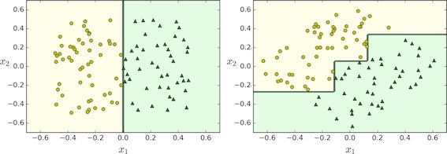

### Classification

```Python
from sklearn.datasets import load_iris 
from sklearn.tree import DecisionTreeClassifier

iris = load_iris() 
# petal length and width 
X = iris.data[:, 2:] 
y = iris.target
tree_clf = DecisionTreeClassifier(max_depth=2) 
tree_clf.fit(X, y)
tree_clf.predict([[5, 1.5])
```


#### Cost Function

SkLearn uses the CART algorithm. CART cost function for classification is

$$J(k, t_k) = 
\frac{m_{left}}{m}G_{left} + \frac{m_{right}}{m}G_{right}$$

where $G_{left/right}$ measures the impurity of the left/right subset, and $m_{left/right}$ is the number of instances in the left/right subset.

The CART algorithm is a greedy algorithms: it greedily searches for an optimum split at the top level, then repeats the process at each level. It does not check whether or not the split will lead to the lowest possible impurity several levels down.

Finding the optimal tree is known to be an *NP-Complete* problem: it requires $O(\exp(m))$ time.

#### Computational Complexity

* Predictions: $O(\log m)$, where $m$ is the number of instances.
    * traversing the tree from the root to a leaf, the height of the tree is $O(\log m)$.
* Training: $O(nm \log m)$, where $n$ is the number of features.
    * compares all features$n$ on all samples$m$ at every level of the tree.

#### Gini impurity or entropy


Most of the time it does not make a big difference: they lead to similar trees. Gini impurity is slightly faster to compute, so it is a good default. However, when they differ, 

* Gini impurity tends to isolate the most frequent class in its own branch of the tree
* while entropy tends to produce slightly more balanced trees.


### Regression

```Python
from sklearn.tree import DecisionTreeRegressor

tree_reg = DecisionTreeRegressor(max_depth=2)
tree_reg.fit(X, y)
```


#### Cost Function

CART cost function for regression:

$$J(k, t_k)=
\frac{m_{left}}{m}
\text{MSE}_{left} + \frac{m_{right}}{m}\text{MSE}_{right}$$

### Instability

Decision Trees love orthogonal decision boundaries, which makes them sensitive to training set rotation.



<p><small>After the dataset is rotated by 45°, the decision boundary looks unnecessarily convoluted.</small></p>

One way to limit this problem is to use PCA, which often results in a better orientation of the training data.

More generally, the main issue with Decision Trees is that they are very sensitive to small variations in the training data.