### Linear Regression with Multiple Variables

#### Multiple Features (variables)

Notation:

* $m$ = the number of training examples
* $n$ = the number of features
* $x^{(i)}$  = the input (feature) of $i^{th}$ training example
* $x^{(i)}_j$ =  value of feature $j$ of $i^{th}$ training example

The multivariable form of the hypothesis function accommodating these multiple features is as follows:

$$h_\theta(x)=\theta_0+\theta_1x_1+\theta_2x_2+\theta_3x_3+⋯+\theta_nx_n=\theta^Tx$$ 

($n+1$- dimensional vector)

For convenience of notation, define $x_0=1$


#### Gradient descent

**Hypothesis**: $h_\theta(x) = \theta^Tx$

**Parameters**: $\theta$

**Cost Function**: $J(\theta)=\frac{1}{2m}\Sigma^m_{i=1}(h_\theta(x^{(i)})-y^{(i)})^2$

**Gradient descent**:

Repeat until converge

$\theta_j := \theta_j -\alpha\frac{\partial}{\partial \theta_j}J(\theta)=\theta_j -\alpha\frac{1}{m}(h_\theta(x^{(i)})-y^{(i)})x_j^{(i)}$

simultaneously update for every $j= 0,1,...,n$.


##### Feature Scaling

We can speed up gradient descent by having each of our input values in roughly the same range. This is because $\theta$ will descend quickly on small ranges and slowly on large ranges, and so will oscillate inefficiently down to the optimum when the variables are very uneven.


**Idea: Make sure features are on a similar scale.**

Two techniques to help with this are **feature scaling** and **mean normalization**.

* **Feature scaling** involves dividing the input values by the range (i.e. the maximum value minus the minimum value) of the input variable, resulting in a new range of just 1. 

* **Mean normalization** involves subtracting the average value for an input variable from the values for that input variable resulting in a new average value for the input variable of just zero. 


Replace $x_i$ with $x_i -\mu_i$ to make features have approximately zero mean (Do not apply to $x_0=1$)

$$x_i =\frac{ x_i - \mu_i}{S_i}$$

where  $\mu_i$ is average value of $x_i$ in training set, $S_i$ is the range (max-min) or standard deviation of $x_i$.

E.g. $x_1=\frac{size-1000}{2000}, x_2=\frac{\#bedrooms-2}{5}$

##### Learning rate

**Debugging**: How to make sure gradient descent is working correctly.

-- How to choose learning rate $\alpha$.

Gradient descent is working correctly if $J(\theta)$ decreases after every iteration.

Use smaller $\alpha$. For sufficiently small $\alpha$, $J(\theta)$ should decrease on every iteration.

**Automatic convergence test**. Declare convergence if $J(\theta)$ decreases by less than $E$ in one iteration, where $E$ is some small value such as $10^{−3}$. However in practice it's difficult to choose this threshold value.

**Summary**:

* If  $\alpha$  is too small: slow convergence.
* If $\alpha$ is too large: may not decrease on every iteration; may not converge.

#### Computing Parameters Analytically

##### Normal equation:

Gradient descent gives one way of minimizing $J$. The "Normal Equation" method minimizes $J$ by explicitly taking its derivatives with respect to the $θj$ ’s, and setting them to zero. This allows us to find the optimum theta without iteration. The normal equation formula is given below:

$$\theta = (X^TX)^{-1}X^Ty$$

Matlab command: 

```Matlab
pinv(X'*X)*X'*y
```

where `pinv` is `peudoinversion` of matrix. It is different to `inv`.

##### Gradient descent v.s. Normal equation

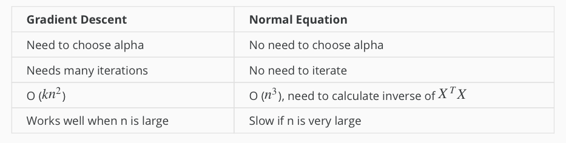


##### Normal Equation Non-invertible

The common reason causes non-invertible:

* Redundant features(linearly dependent)
E.g. $x_1$ = size in feet$^2$, $x_2$ = size in m$^2$
* Too many features(e.g. $m<=n$).
-- Delete some features, or use regularization.


where $m$ is the number of training examples, $n$ is the number of features.

Solutions to the above problems include deleting a feature that is linearly dependent with another or deleting one or more features when there are too many features.

### Logistic Regression - Classification

The classification problem is just like the regression problem, except that the values $y$ we now want to predict take on only a small number of discrete values.

#### Binary Classification

**Binary classification problem** : $y$ can take on only two values, 0 and 1.

##### Examples


* Email: Spam/Not Spam?
* Online Transaction: Fraudulent(Yes/NO)?
* Tumor: Malignant/ Benign?

Given $x(i)$, the corresponding $y(i)$ is also called the **label** for the training example.

##### Hypothesis Representation

It doesn't make sense for $h_\theta(x)$ to take values larger than 1 or smaller than0, when we know that $ y\in \{0,1\}$. To fix this, let's change the form for our hypotheses $h_\theta(x)$ to satisfy $0\leq_\theta(x)\leq 1$. This is accomplished by plugging $\theta^Tx$ into the Logistic Function.

**Logistic Function**:
also called `sigmoid` (/'sɪgmɔɪd/) function

$$\begin{align*}& h_\theta (x) = g ( \theta^T x ) \newline \newline& z = \theta^T x \newline& g(z) = \dfrac{1}{1 + e^{-z}}\end{align*}$$
    
1. The sigmoid function g(z), maps any real number to the (0, 1) interval, making it useful for transforming an arbitrary-valued function into a function better suited for classification.

2. $h_\theta(x)$ gives us the probability that our output is 1. Probability that prediction is 0 is just the complement of probability that it is 1:

$$\begin{align*}& h_\theta(x) = P(y=1 | x ; \theta) = 1 - P(y=0 | x ; \theta) \newline& P(y = 0 | x;\theta) + P(y = 1 | x ; \theta) = 1\end{align*}$$

##### Decision boundary

The **decision boundary** is the line that separates the area where $y$ = 0 and where $y = 1$. It is defined by hypothesis function.

##### Cost Function

We cannot use the same cost function that we use for linear regression because the Logistic Function will cause the output to be wary, causing many local optima.

Instead, our cost function for logistic regression looks like:

$$\begin{align*}& J(\theta) = \dfrac{1}{m} \sum_{i=1}^m \mathrm{Cost}(h_\theta(x^{(i)}),y^{(i)}) \newline & \mathrm{Cost}(h_\theta(x),y) = -\log(h_\theta(x)) \; & \text{if y = 1} \newline & \mathrm{Cost}(h_\theta(x),y) = -\log(1-h_\theta(x)) \; & \text{if y = 0}\end{align*}$$

Cost function's two conditional cases can be compressed into one case:

$$Cost(h_\theta(x),y)= -y \log(h_\theta(x))-(1-y) \log(1-h_\theta(x))$$

The entire cost function can be written as follows:

$$ J(\theta) = -\dfrac{1}{m} \sum_{i=1}^m[ y ^{(i)}\log(h_\theta(x^{(i)}))+(1-y^{(i)}) \log(1-h_\theta(x^{(i)}))]$$


A vectorized implementation is:

$$h=g(X\theta)$$
$$J(\theta)=\frac{1}{m}(-y^T\log(h)-(1-y)^T\log(1-h))$$

And the gradient of the cost is a vector of the same length as $\theta$ where the $j^{th}$ element is defined as follows:

$$\frac{\partial J(\theta)}{\partial \theta_j}=\frac{1}{m}\Sigma_{i=1}^m(h_\theta(x^{(i)})-y^{(i)})x^{(i)}_j$$

A vectorized implementation is:

$$\frac{\partial J(\theta)}{\partial \theta_j}=\frac{1}{m}(h-y)^TX$$


##### Gradient Descent

Repeat until {

$$\theta_j:=\theta_j-\frac{\alpha}{m}\Sigma^m_{i=1}(h_\theta(x^{(i)})-y^{(i)})x^{(i)}_j$$
}

A vectorized implementation is:

$$\theta:=\theta-\frac{\alpha}{m}X^T(g(X\theta)-y)$$

##### Advanced Optimization

There are more sophisticated, faster ways to optimize $\theta$ that can be used instead of gradient descent:

* Conjugate gradient
* BFGS
* L-BFGS

You should not write these algorithms yourself, but use the libraries provided by Octave and Matlab instead.

#### Multiclass classification

##### Example

* Email foldering/tagging: Work, friends, family, hobby
* Medical diagrams: Not ill, Cold, Flu
* Weather: Sunny, Cloudy, Rain, Snow

##### Method

Since $y = \{0,1...n\}$, we divide our problem into $n+1$ (+1 because the index starts at 0) binary classification problems; in each one, we predict the probability that 'y' is a member of one of our classes.


We are basically choosing one class and then lumping all the others into a single second class. We do this repeatedly, applying binary logistic regression to each case, and then use the hypothesis that returned the highest value as our prediction.


$$\begin{align*}& y \in \lbrace0, 1 ... n\rbrace \newline& h_\theta^{(0)}(x) = P(y = 0 | x ; \theta) \newline& h_\theta^{(1)}(x) = P(y = 1 | x ; \theta) \newline& \cdots \newline& h_\theta^{(n)}(x) = P(y = n | x ; \theta) \newline& \mathrm{prediction} = \max_i( h_\theta ^{(i)}(x) )\newline\end{align*}$$

**To summarize**:

* Train a logistic regression classifier hθ(x) for each class to predict the probability that  $y = i$.
* To make a prediction on a new x, pick the class that maximizes $h_\theta(x)$.


### Overfitting and normalization

#### The problem of Overfitting

**Underfitting**, or **high bias**, is when the form of our hypothesis function $h$ maps poorly to the trend of the data. It is usually caused by a function that is too simple or uses too few features. 

**Overfitting**, or **high variance**, is caused by a hypothesis function that fits the available data but does not generalize well to predict new data. It is usually caused by a complicated function that creates a lot of unnecessary curves and angles unrelated to the data.

There are two main options to address the issue of overfitting:

1. ***Reduce the number of features***:
Manually select which features to keep.
(Use a model selection algorithm).

2. ***Regularization***
Keep all the features, but reduce the magnitude of parameters $\theta_j$. Regularization works well when we have a lot of slightly useful features.

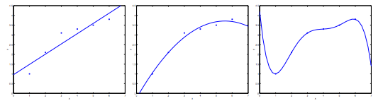

The figure above shows the Underfitting, Normal, Overfitting.

#### Regularized Linear Regression

We regularize all of theta parameters in a single summation as:


$$J(\theta)= \dfrac{1}{2m}[ \sum_{i=1}^m (h_\theta(x^{(i)}) - y^{(i)})^2 + \lambda\ \sum_{j=1}^n \theta_j^2]$$

where the $\lambda$, or lambda, is the **regularization parameter**. It determines how much the costs of our theta parameters are inflated.  If $\lambda$ is chosen to be too large, it may smooth out the function too much and cause underfitting. 

**Note that you should not regularize the parameter $\theta_0$**.


The corresponding gradient descent is

$$\begin{align*} & \text{Repeat}\ \lbrace \newline & \ \ \ \ \theta_0 := \theta_0 - \alpha\ \frac{1}{m}\ \sum_{i=1}^m (h_\theta(x^{(i)}) - y^{(i)})x_0^{(i)} \newline & \ \ \ \ \theta_j := \theta_j - \alpha\ \left[ \left( \frac{1}{m}\ \sum_{i=1}^m (h_\theta(x^{(i)}) - y^{(i)})x_j^{(i)} \right) + \frac{\lambda}{m}\theta_j \right] &\ \ \ \ \ \ \ \ \ \ j \in \lbrace 1,2...n\rbrace\newline & \rbrace \end{align*}$$

With some manipulation our update rule can also be represented as:

$$\theta_j := \theta_j(1 - \alpha\frac{\lambda}{m}) - \alpha\frac{1}{m}\sum_{i=1}^m(h_\theta(x^{(i)}) - y^{(i)})x_j^{(i)}$$

##### Normal Equation

To add in regularization, the equation is the same as our original, except that we add another term inside the parentheses:

$$\begin{align*}& \theta = \left( X^TX + \lambda \cdot L \right)^{-1} X^Ty \newline& \text{where}\ \ L = \begin{bmatrix} 0 & & & & \newline & 1 & & & \newline & & 1 & & \newline & & & \ddots & \newline & & & & 1 \newline\end{bmatrix}\end{align*}$$

Recall that if $m < n$, then $XTX$ is non-invertible. However, when we add the term $\lambda L$, then $XTX + \lambda L$ becomes invertible.


#### Regularized Logistic Regression

We regularize all of $\theta$ parameters in a single summation as:

$$ J(\theta) = -\dfrac{1}{m} \sum_{i=1}^m[ y ^{(i)}\log(h_\theta(x^{(i)}))+(1-y^{(i)}) \log(1-h_\theta(x^{(i)}))]+ \frac{\lambda}{2m} \sum_{j=1}^n \theta_j^2$$

The corresponding gradient descent is

$$\theta_j:=\theta_j-\frac{\alpha}{m}\Sigma^m_{i=1}(h_\theta(x^{(i)})-y^{(i)})x^{(i)}_j+\frac{\alpha\lambda}{m}\theta_j$$


### Neural Networks

#### Why Neural Networks

The number of quadratic features closes to $\frac{n^2}{2}$, it is computationally expensive.

The number of cubic features closes to $O(n^3)$, it is more computationally expensive.

Computer vision problem looks at matrixes. Because dimensions of pixel images often large (e.g. n= 7500 for 50$\times$50 pixel images(RGB)), the number of quadratic features for the problem are 3 million.

#### Background of Neural Networks

**Origins**: Algorithms that try to mimic the brain. It was very widely used in 80s and early 90s; popularity diminished in late 90s. It is now a state of the art technique for many application, because its expensive computation can be meet.


#### Model Representation

At a very simple level, neurons are basically computational units that take inputs (`dendrites`) as electrical inputs (`spikes`) that are channeled to outputs (`axons`).

* Input: `Dendrite`（树突）
* Output: `Axon`（轴突）


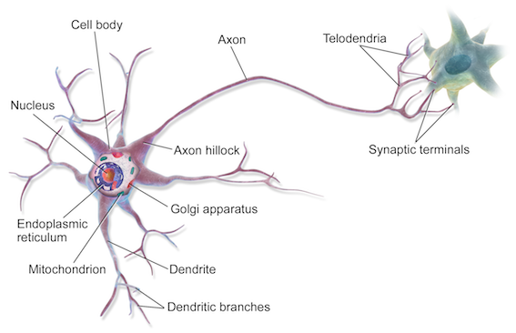

 

In neural networks, dendrites are like the input features $x_1⋯x_n$, and the output is the result of our hypothesis function. $x_0$ input node is sometimes called the `bias unit`. It is always equal to 1. In neural networks, we use the same logistic function as in classification, $\frac{1}{1+e^{-\theta^Tx}}$, yet we sometimes call it a sigmoid (logistic) activation function. In this situation, our "theta" parameters are sometimes called `weights`.

**Visually, a simplistic representation looks like:**

$$\begin{bmatrix}x_0 \newline x_1 \newline x_2 \newline \end{bmatrix}\rightarrow\begin{bmatrix}\ \ \ \newline \end{bmatrix}\rightarrow h_\theta(x)$$

Input nodes (layer 1), also known as the `input layer`, go into another node (layer 2), which finally outputs the hypothesis function, known as the `output layer`.

We can have intermediate layers of nodes between the input and output layers called the `hidden layers`.

In this example, we label these intermediate or hidden layer nodes $a^2_0⋯a^2_n$ and call them `activation units`.

$$\begin{align*}& a_i^{(j)} = \text{"activation" of unit $i$ in layer $j$} \newline& \Theta^{(j)} = \text{matrix of weights controlling function mapping from layer $j$ to $j+1$}\end{align*}\\
\text{ will be of dimension }s_{j+1}\times(s_{j+1})$$

The values for each of the "activation" nodes is obtained as follows:

$$\begin{align*} a_1^{(2)} = g(\Theta_{10}^{(1)}x_0 + \Theta_{11}^{(1)}x_1 + \Theta_{12}^{(1)}x_2 + \Theta_{13}^{(1)}x_3) \newline a_2^{(2)} = g(\Theta_{20}^{(1)}x_0 + \Theta_{21}^{(1)}x_1 + \Theta_{22}^{(1)}x_2 + \Theta_{23}^{(1)}x_3) \newline a_3^{(2)} = g(\Theta_{30}^{(1)}x_0 + \Theta_{31}^{(1)}x_1 + \Theta_{32}^{(1)}x_2 + \Theta_{33}^{(1)}x_3) \newline h_\Theta(x) = a_1^{(3)} = g(\Theta_{10}^{(2)}a_0^{(2)} + \Theta_{11}^{(2)}a_1^{(2)} + \Theta_{12}^{(2)}a_2^{(2)} + \Theta_{13}^{(2)}a_3^{(2)}) \newline \end{align*}$$

If network has $s_j$ units in layer $j$ and $s_{j+1}$ units in layer $j+1$, then $\Theta^{(j)}$ will be of dimension $s_{j+1}×(s_j+1)$. The $+1$ comes from the addition in $\Theta^{(j)}$ of the `bias nodes`, $x_0$ and $\Theta^{(j)}_0$. In other words the output nodes will not include the bias nodes while the inputs will. 

We're going to define a new variable $z^{(j)}_k$ that encompasses the parameters inside our $g$ function. In our previous example if we replaced by the variable $z$ for all the parameters we would get:

$$\begin{align*}a_1^{(2)} = g(z_1^{(2)}) \newline a_2^{(2)} = g(z_2^{(2)}) \newline a_3^{(2)} = g(z_3^{(2)}) \newline \end{align*}$$

In other words, for layer $j=2$ and node $k$, the variable $z$ will be:

$$z_k^{(2)} = \Theta_{k,0}^{(1)}x_0 + \Theta_{k,1}^{(1)}x_1 + \cdots + \Theta_{k,n}^{(1)}x_n$$

The vector representation of $x$ and $z_j$ is:

$$\begin{align*}x = \begin{bmatrix}x_0 \newline x_1 \newline\cdots \newline x_n\end{bmatrix} &z^{(j)} = \begin{bmatrix}z_1^{(j)} \newline z_2^{(j)} \newline\cdots \newline z_n^{(j)}\end{bmatrix}\end{align*}$$

Setting $x=a^{(1)}$, we can rewrite the equation as:

$$z^{(j)} = \Theta^{(j-1)}a^{(j-1)}$$

Now we can get a vector of our activation nodes for layer $j$ as follows:

$$a^{(j)} = g(z^{(j)})$$

Last Step:

$$h_\Theta(x) = a^{(j+1)} = g(z^{(j+1)})$$


#### Examples and Intuitions 

The $\Theta^{(1)}$ matrices for AND, NOR, and OR are:

$$\begin{align*}AND:\newline\Theta^{(1)} &=\begin{bmatrix}-30 & 20 & 20\end{bmatrix} \newline NOR:\newline\Theta^{(1)} &= \begin{bmatrix}10 & -20 & -20\end{bmatrix} \newline OR:\newline\Theta^{(1)} &= \begin{bmatrix}-10 & 20 & 20\end{bmatrix} \newline\end{align*}$$

We can combine these to get the $XNOR$ logical operator (which gives 1 if $x_1$ and $x_2$ are both 0 or both 1).

$$\begin{align*}\begin{bmatrix}x_0 \newline x_1 \newline x_2\end{bmatrix} \rightarrow\begin{bmatrix}a_1^{(2)} \newline a_2^{(2)} \end{bmatrix} \rightarrow\begin{bmatrix}a^{(3)}\end{bmatrix} \rightarrow h_\Theta(x)\end{align*}$$

For the transition between the first and second layer, we'll use a $\Theta^{(1)}$ matrix that combines the values for AND and NOR:

$$\Theta^{(1)} =\begin{bmatrix}-30 & 20 & 20 \newline 10 & -20 & -20\end{bmatrix}$$

For the transition between the second and third layer, we'll use a $\Theta^{(2)}$ matrix that uses the value for OR:

$$\Theta^{(2)} =\begin{bmatrix}-10 & 20 & 20\end{bmatrix}$$

Let's write out the values for all our nodes:

$$\begin{align*}& a^{(2)} = g(\Theta^{(1)} \cdot x) \newline& a^{(3)} = g(\Theta^{(2)} \cdot a^{(2)}) \newline& h_\Theta(x) = a^{(3)}\end{align*}$$


#### Multiclass Classification

To classify data into multiple classes, we let our hypothesis function return a vector of values. Say we wanted to classify our data into one of four categories. We will use the following example to see how this classification is done. This algorithm takes as input an image and classifies it accordingly:

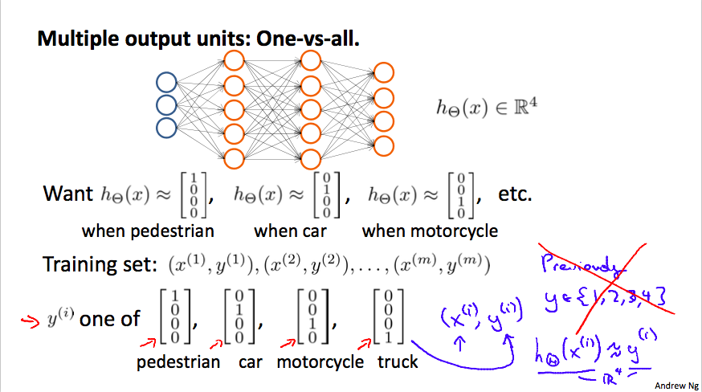

We can define our set of resulting classes as $y$:

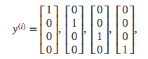


Each $y(i)$ represents a different image corresponding to either a car, pedestrian, truck, or motorcycle. The inner layers, each provide us with some new information which leads to our final hypothesis function. The setup looks like:

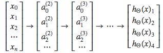

Our resulting hypothesis for one set of inputs may look like:

$$h_\Theta(x) =\begin{bmatrix}0 \newline 0 \newline 1 \newline 0 \newline\end{bmatrix}$$

In which case our resulting class is the third one down, or $h_\Theta(x)_3$, which represents the motorcycle.

#### Cost Function

Let's first define a few variables that we will need to use:

* $L$ = total number of layers in the network
* $s_l$ = number of units (not counting bias unit) in layer $l$
* $K$ = number of output units/classes

Recall that in neural networks, we may have many output nodes. We denote $h_\Theta(x)^k$ as being a hypothesis that results in the $k$th output. Our cost function for neural networks is going to be a generalization of the one we used for logistic regression. Recall that the cost function for regularized logistic regression was:

$$J(\theta) = - \frac{1}{m} \sum_{i=1}^m [ y^{(i)}\ \log (h_\theta (x^{(i)})) + (1 - y^{(i)})\ \log (1 - h_\theta(x^{(i)}))] + \frac{\lambda}{2m}\sum_{j=1}^n \theta_j^2$$

For neural networks, it is going to be slightly more complicated:

$$\begin{gather*} J(\Theta) = - \frac{1}{m} \sum_{i=1}^m \sum_{k=1}^K \left[y^{(i)}_k \log ((h_\Theta (x^{(i)}))_k) + (1 - y^{(i)}_k)\log (1 - (h_\Theta(x^{(i)}))_k)\right] + \\\frac{\lambda}{2m}\sum_{l=1}^{L-1} \sum_{i=1}^{s_l} \sum_{j=1}^{s_{l+1}} ( \Theta_{j,i}^{(l)})^2\end{gather*}$$

We have added a few nested summations to account for our multiple output nodes. In the first part of the equation, before the square brackets, we have an additional nested summation that loops through the number of output nodes.

In the regularization part, after the square brackets, we must account for multiple $\Theta$ matrices. The number of columns in our current theta matrix is equal to the number of nodes in our current layer (including the bias unit). The number of rows in our current $\Theta$ matrix is equal to the number of nodes in the next layer (excluding the bias unit). As before with logistic regression, we square every term.

Note:

* the double sum simply adds up the logistic regression costs calculated for each cell in the output layer
* the triple sum simply adds up the squares of all the individual $\Theta$s in the entire network.
* the $i$ in the triple sum does not refer to training example $i$

#### Backpropagation Algorithm

`Backpropagation` is neural-network terminology for minimizing cost function, similar to `gradient descent` in logistic and linear regression. Our goal is to realize:

$$\min_\Theta J(\Theta)$$

That is, we want to minimize cost function $J$ using an optimal set of parameters in $\Theta$. The algorithm to minimize the cost function is as follows:

**Backpropagation algorithm**:

1. Training set $\{(x^{(1)},y^{(1)}),...,(x^{(m)},y^{(m)})\}$
2. Set $\Delta_{ij}^{(l)}=0$ (for all $l,i,j$)
3. For $i=1$ to $m$
    * Set $a^{(1)}=x^{(i)}$
    * Perform forward propagation to compute $a^{(l)}$ for $l=2,3,...,L$
    * Using $y^{(i)}$, compute $\delta^{(L)}=a^{(L)}-y^{(i)}$
    * Compute $\delta^{(L-1)},...,\delta^{(2)}$
    * $\Delta^{(l)}_{ij}:=\Delta^{(l)}_{ij} +a_{ij}\delta_i^{(l+1)}$
* $D_{ij}^{(l)}=\frac{1}{m}\Delta_{ij}^{(l)}+\lambda\Theta_{ij}^{(l)}$ if $j\ne0$
* $D_{ij}^{(l)}=\frac{1}{m}\Delta_{ij}^{(l)}$ if $j=0$

#### Gradient Checking
Gradient checking will assure that our backpropagation works as intended. We can approximate the derivative of our cost function with:

$$\dfrac{\partial}{\partial\Theta}J(\Theta) \approx \dfrac{J(\Theta + \epsilon) - J(\Theta - \epsilon)}{2\epsilon}$$

With multiple theta matrices, we can approximate the derivative with respect to $Θ_j$ as follows:

$$\dfrac{\partial}{\partial\Theta_j}J(\Theta) \approx \dfrac{J(\Theta_1, \dots, \Theta_j + \epsilon, \dots, \Theta_n) - J(\Theta_1, \dots, \Theta_j - \epsilon, \dots, \Theta_n)}{2\epsilon}$$

A small value for $\epsilon$ such as $\epsilon=10^{-4}$, guarantees that the math works out properly. If the value for $\epsilon$ is too small, we can end up with numerical problems.

Once we compute `numerical gradient`, we can check that it's approximate to `analytical gradient`. We don't use numerical grads, because it is very slow.

#### Putting it Together

**Training a Neural Network**:

* Randomly initialize the weights
* Implement forward propagation
* Implement the cost function
* Implement backpropagation to compute partial derivatives
* Use gradient checking to confirm that your backpropagation works. Then disable gradient checking.
* Use gradient descent or a built-in optimization function to minimize the cost function with the weights in theta.

### Advice

Advice for applying machine learning and Machine Learning System Design
#### Advice for applying machine learning
##### Deciding What to Try Next

Errors in your predictions can be troubleshooted by:

*   Getting more training examples
*   Trying smaller sets of features
*   Trying additional features
*   Trying polynomial features
*   Increasing or decreasing λ

Don't just pick one of these avenues at random. We'll explore diagnostic techniques for choosing one of the above solutions in the following sections.

##### Evaluating a Hypothesis

A hypothesis may have low error for the training examples but still be inaccurate (because of overfitting).

With a given dataset of training examples, we can split up the data into two sets: a **training set** and a **test set** .

The new procedure using these two sets is then:

1.  Learn $\Theta$ and minimize $J_{train}(\Theta)$ using the training set
2.  Compute the test set error $J_{test}(\Theta)$

###### The test set error

1.  For linear regression: $J_{test}(\Theta) = \dfrac{1}{2m_{test}} \sum_{i=1}^{m_{test}}(h_\Theta(x^{(i)}_{test}) - y^{(i)}_{test})^2$
2.  For classification ~ Misclassification error (aka 0/1 misclassification error):

$err(h_\Theta(x),y) = \{\begin{matrix} 1 & \mbox{if } h_\Theta(x) \geq 0.5\ and\ y = 0\ or\ h_\Theta(x) < 0.5\ and\ y = 1\newline 0 & \mbox otherwise \end{matrix}$


This gives us a binary 0 or 1 error result based on a misclassification.

The average test error for the test set is

$\text{Test Error} = \dfrac{1}{m_{test}} \sum^{m_{test}}_{i=1} err(h_\Theta(x^{(i)}_{test}), y^{(i)}_{test})$

This gives us the proportion of the test data that was misclassified.

##### Model Selection and Train/Validation/Test Sets

*   Just because a learning algorithm fits a training set well, that does not mean it is a good hypothesis.
*   The error of your hypothesis as measured on the data set with which you trained the parameters will be lower than any other data set.

In order to choose the model of your hypothesis, you can test each degree of polynomial and look at the error result.

**Without the Validation Set (note: this is a bad method - do not use it)**

1.  Optimize the parameters in Θ using the training set for each polynomial degree.
2.  Find the polynomial degree d with the least error using the test set.
3.  Estimate the generalization error also using the test set with $J_{test}(\Theta^{(d)})$, (d = theta from polynomial with lower error);

In this case, we have trained one variable, d, or the degree of the polynomial, using the test set. This will cause our error value to be greater for any other set of data.

**Use of the CV set**

To solve this, we can introduce a third set, the **Cross Validation Set** , to serve as an intermediate set that we can train d with. Then our test set will give us an accurate, non-optimistic error.

One example way to break down our dataset into the three sets is:

*   Training set: 60%
*   Cross validation set: 20%
*   Test set: 20%

We can now calculate three separate error values for the three different sets.

**With the Validation Set (note: this method presumes we do not also use the CV set for regularization)**

1.  Optimize the parameters in Θ using the training set for each polynomial degree.

2.  Find the polynomial degree d with the least error using the cross validation set.

3.  Estimate the generalization error using the test set with $J_{test}(\Theta^{(d)})$, (d = theta from polynomial with lower error);

This way, the degree of the polynomial d has not been trained using the test set.

(Mentor note: be aware that using the CV set to select 'd' means that we cannot also use it for the validation curve process of setting the lambda value).

##### Diagnosing Bias vs. Variance

In this section we examine the relationship between the degree of the polynomial d and the underfitting or overfitting of our hypothesis.

*   We need to distinguish whether **bias** or **variance** is the problem contributing to bad predictions.

*   High bias is underfitting and high variance is overfitting. We need to find a golden mean between these two.

The training error will tend to **decrease** as we increase the degree d of the polynomial.

At the same time, the cross validation error will tend to **decrease** as we increase d up to a point, and then it will **increase** as d is increased, forming a convex curve.

**High bias (underfitting)** : both $J_{train}(\Theta)$ and $J_{CV}(\Theta)$ will be high. Also, $J_{CV}(\Theta) \approx J_{train}(\Theta)$.

**High variance (overfitting)** : $J_{train}(\Theta)$ will be low and $J_{CV}(\Theta)$ will be much greater than$J_{train}(\Theta)$.

The is represented in the figure below:


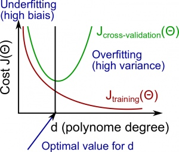

##### Regularization and Bias/Variance

Instead of looking at the degree d contributing to bias/variance, now we will look at the regularization parameter λ.

*   Large λ: High bias (underfitting)
*   Intermediate λ: just right
*   Small λ: High variance (overfitting)

A large lambda heavily penalizes all the Θ parameters, which greatly simplifies the line of our resulting function, so causes underfitting.

The relationship of λ to the training set and the variance set is as follows:

**Low λ** : $J_{train}(\Theta)$ is low and $J_{CV}(\Theta)$ is high (high variance/overfitting).

**Intermediate λ** : $J_{train}(\Theta)$ and $J_{CV}(\Theta)$ are somewhat low and $J_{train}(\Theta) \approx J_{CV}(\Theta)$.

**Large λ** : both $J_{train}(\Theta)$ and $J_{CV}(\Theta)$ will be high (underfitting /high bias)

The figure below illustrates the relationship between lambda and the hypothesis:

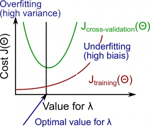

In order to choose the model and the regularization λ, we need:

1.  Create a list of lambdas (i.e. λ∈{0,0.01,0.02,0.04,0.08,0.16,0.32,0.64,1.28,2.56,5.12,10.24});
2\. Create a set of models with different degrees or any other variants.
3\. Iterate through the $\lambda$s and for each $\lambda$ go through all the models to learn some $\Theta$.
4\. Compute the cross validation error using the learned Θ (computed with λ) on the $J_{CV}(\Theta)$ without regularization or λ = 0.
5\. Select the best combo that produces the lowest error on the cross validation set.
6\. Using the best combo Θ and λ, apply it on $J_{test}(\Theta)$ to see if it has a good generalization of the problem.

##### Learning Curves

Training 3 examples will easily have 0 errors because we can always find a quadratic curve that exactly touches 3 points.

*   As the training set gets larger, the error for a quadratic function increases.
*   The error value will plateau out after a certain m, or training set size.

**With high bias**

**Low training set size** : causes $J_{train}(\Theta)$ to be low and $J_{CV}(\Theta)$ to be high.

**Large training set size** : causes both $J_{train}(\Theta)$ and $J_{CV}(\Theta)$ to be high with $J_{train}(\Theta)$≈$J_{CV}(\Theta)$.

If a learning algorithm is suffering from **high bias** , getting more training data **will not (by itself) help much** .

For high variance, we have the following relationships in terms of the training set size:

**With high variance**

**Low training set size** : $J_{train}(\Theta)$ will be low and $J_{CV}(\Theta)$ will be high.

**Large training set size** : $J_{train}(\Theta)$ increases with training set size and $J_{CV}(\Theta)$ continues to decrease without leveling off. Also, $J_{train}(\Theta)$<$J_{CV}(\Theta)$ but the difference between them remains significant.

If a learning algorithm is suffering from **high variance** , getting more training data is **likely to help.**

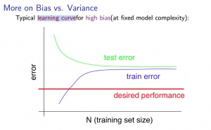


##### Deciding What to Do Next Revisited

Our decision process can be broken down as follows:

* Getting more training examples: Fixes high variance
* Trying smaller sets of features: Fixes high variance
* Adding features: Fixes high bias
* Adding polynomial features: Fixes high bias
* Decreasing λ: Fixes high bias
* Increasing λ: Fixes high variance

###### Diagnosing Neural Networks

*   A neural network with fewer parameters is **prone to underfitting** . It is also **computationally cheaper** .
*   A large neural network with more parameters is **prone to overfitting** . It is also **computationally expensive** . In this case you can use regularization (increase λ) to address the overfitting.

Using a single hidden layer is a good starting default. You can train your neural network on a number of hidden layers using your cross validation set.

###### Model Selection:

Choosing M the order of polynomials.

How can we tell which parameters Θ to leave in the model (known as "model selection")?

There are several ways to solve this problem:

*   Get more data (very difficult).
*   Choose the model which best fits the data without overfitting (very difficult).
*   Reduce the opportunity for overfitting through regularization.

**Bias: approximation error (Difference between expected value and optimal value)**

*   High Bias = UnderFitting (BU)
*   $J_{train}(\Theta)$ and $J_{CV}(\Theta)$ both will be high and $J_{train}(\Theta)$ ≈ $J_{CV}(\Theta)$

**Variance: estimation error due to finite data**

*   High Variance = OverFitting (VO)
*   $J_{train}(\Theta)$ is low and $J_{CV}(\Theta)$ ≫$J_{train}(\Theta)$

**Intuition for the bias-variance trade-off:**

*   Complex model => sensitive to data => much affected by changes in X => high variance, low bias.
*   Simple model => more rigid => does not change as much with changes in X => low variance, high bias.

One of the most important goals in learning: finding a model that is just right in the bias-variance trade-off.

**Regularization Effects:**

*   Small values of λ allow model to become finely tuned to noise leading to large variance => overfitting.
*   Large values of λ pull weight parameters to zero leading to large bias => underfitting.

**Model Complexity Effects:**

*   Lower-order polynomials (low model complexity) have high bias and low variance. In this case, the model fits poorly consistently.
*   Higher-order polynomials (high model complexity) fit the training data extremely well and the test data extremely poorly. These have low bias on the training data, but very high variance.
*   In reality, we would want to choose a model somewhere in between, that can generalize well but also fits the data reasonably well.

**A typical rule of thumb when running diagnostics is:**

*   More training examples fixes high variance but not high bias.
*   Fewer features fixes high variance but not high bias.
*   Additional features fixes high bias but not high variance.
*   The addition of polynomial and interaction features fixes high bias but not high variance.
*   When using gradient descent, decreasing lambda can fix high bias and increasing lambda can fix high variance (lambda is the regularization parameter).
*   When using neural networks, small neural networks are more prone to under-fitting and big neural networks are prone to over-fitting. Cross-validation of network size is a way to choose alternatives.

#### Machine Learning System Design

##### Prioritizing What to Work On

Different ways we can approach a machine learning problem:

*   Collect lots of data (for example "honeypot" project but doesn't always work)
*   Develop sophisticated features (for example: using email header data in spam emails)
*   Develop algorithms to process your input in different ways (recognizing misspellings in spam).

It is difficult to tell which of the options will be helpful.

##### Error Analysis

The recommended approach to solving machine learning problems is:

*   Start with a simple algorithm, implement it quickly, and test it early.
*   Plot learning curves to decide if more data, more features, etc. will help
*   Error analysis: manually examine the errors on examples in the cross validation set and try to spot a trend.

It's important to get error results as a single, numerical value. Otherwise it is difficult to assess your algorithm's performance.

You may need to process your input before it is useful. For example, if your input is a set of words, you may want to treat the same word with different forms (fail/failing/failed) as one word, so must use "stemming software" to recognize them all as one.

##### Error Metrics for Skewed Classes

It is sometimes difficult to tell whether a reduction in error is actually an improvement of the algorithm.

*   For example: In predicting a cancer diagnoses where 0.5% of the examples have cancer, we find our learning algorithm has a 1% error. However, if we were to simply classify every single example as a 0, then our error would reduce to 0.5% even though we did not improve the algorithm.

This usually happens with **skewed classes** ; that is, when our class is very rare in the entire data set.

Or to say it another way, when we have lot more examples from one class than from the other class.

For this we can use **Precision/Recall** .

*   Predicted: 1, Actual: 1 --- True positive
*   Predicted: 0, Actual: 0 --- True negative
*   Predicted: 0, Actual, 1 --- False negative
*   Predicted: 1, Actual: 0 --- False positive

**Precision** : of all patients we predicted where y=1, what fraction actually has cancer?


$$\dfrac{\text{True Positives}}{\text{Total number of predicted positives}} = \dfrac{\text{True Positives}}{\text{True Positives}+\text{False positives}}$$


**Recall** : Of all the patients that actually have cancer, what fraction did we correctly detect as having cancer?


$$\dfrac{\text{True Positives}}{\text{Total number of actual positives}}= \dfrac{\text{True Positives}}{\text{True Positives}+\text{False negatives}}$$

These two metrics give us a better sense of how our classifier is doing. We want both precision and recall to be high.

In the example at the beginning of the section, if we classify all patients as 0, then our **recall** will be $\dfrac{0}{0 + f} = 0$, so despite having a lower error percentage, we can quickly see it has worse recall.

Accuracy = $\frac {\text{true positive + true negative}} {\text{total population}}$

Note 1: if an algorithm predicts only negatives like it does in one of exercises, the precision is not defined, it is impossible to divide by 0\. F1 score will not be defined too.

##### Trading Off Precision and Recall

We might want a **confident** prediction of two classes using logistic regression. One way is to increase our threshold:

*   Predict 1 if: $h_\theta(x) \geq 0.7$

*   Predict 0 if: $h_\theta(x) < 0.7$

This way, we only predict cancer if the patient has a 70% chance.

Doing this, we will have **higher precision** but **lower recall** (refer to the definitions in the previous section).

In the opposite example, we can lower our threshold:

*   Predict 1 if: $h_\theta(x) \geq 0.3$

*   Predict 0 if: $h_\theta(x) < 0.3$

That way, we get a very **safe** prediction. This will cause **higher recall** but **lower precision** .

The greater the threshold, the greater the precision and the lower the recall.

The lower the threshold, the greater the recall and the lower the precision.

In order to turn these two metrics into one single number, we can take the **F value** .

One way is to take the **average** :

$\dfrac{P+R}{2}$

This does not work well. If we predict all y=0 then that will bring the average up despite having 0 recall. If we predict all examples as y=1, then the very high recall will bring up the average despite having 0 precision.

A better way is to compute the **F Score** (or F1 score):

$\text{F Score} = 2\dfrac{PR}{P + R}$

In order for the F Score to be large, both precision and recall must be large.

We want to train precision and recall on the **cross validation set** so as not to bias our test set.

##### Data for Machine Learning

How much data should we train on?

In certain cases, an "inferior algorithm," if given enough data, can outperform a superior algorithm with less data.

We must choose our features to have **enough** information. A useful test is: Given input x, would a human expert be able to confidently predict y?

**Rationale for large data** : if we have a **low bias** algorithm (many features or hidden units making a very complex function), then the larger the training set we use, the less we will have overfitting (and the more accurate the algorithm will be on the test set).


### Support Vector Machines

#### Training Objective

The smaller the weight vector `w`, the larger the margin. So we want to minimize $\lVert w\rVert$ to get a large margin.

##### Hard Margin

If we also want to avoid any margin violation (`hard margin`), then we need the decision function to be greater than 1 for all positive trainig instances, and lower than  -1 for negative training instances. If we define $t^{(i)} = -1$ for negative instances (if $y^{(i)}>0$) and $t^{(i)}=1$ for positive instances (if $y^{(i)}=1$), then we can express this constraint as $t^{(i)}(w^T\cdot x^{(i)}+b) \le 1$ for all instances. 

**Hard Margin linear SVM classifier objective**

$$
\min_{w,b} \frac{1}{2}w^T\cdot w \\
\text{subject to } t^{(i)}(w^T\cdot x^{(i)}+b) \le 1  \quad for \quad i =1,2,...,m
$$

##### Soft Margin
To get the soft margin objective, we need to introduce a `slack variable` $\zeta^(i)\le0$ for each instance: $\zeta^{(i)}$ measures how much the $i^{th}$ instance is allowed to violate the margin. We now have two conflicting objectives: making the slack variables as small as possible to reduce the margin violations, and makeing $\frac{1}{2}w^T\cdot w $ as small as possible to increase the margin.

**Soft Margin linear SVM classifier objective**

$$
\min_{w,b} \frac{1}{2}w^T\cdot w + C\sum^m_{i=1}\zeta^{(i)}\\
\text{subject to } t^{(i)}(w^T\cdot x^{(i)}+b) \le 1 - \zeta^{(i)} \quad for \quad i =1,2,...,m
$$
#### Implementation


```python
import numpy as np
from sklearn import datasets
from sklearn.pipeline import Pipeline
from sklearn.preprocessing import StandardScaler
from sklearn.svm import LinearSVC
from sklearn.svm import SVC
import matplotlib.pyplot as plt
```

#### Soft Margin Classification


```python

### load data sets
iris = datasets.load_iris()
x = iris['data'][:,(2,3)] ### petal length, petal width
y = (iris['target'] == 2).astype(np.float64) ### Iris-Virginica
```


```python
%matplotlib inline
plt.scatter(x[:,0], x[:,1], c=y)
```


    <matplotlib.collections.PathCollection at 0x110ecf0f0>


```python
### plot decision boundary
def make_meshgrid(x, y, h=.02):
    """Create a mesh of points to plot in

    Parameters
    ----------
    x: data to base x-axis meshgrid on
    y: data to base y-axis meshgrid on
    h: stepsize for meshgrid, optional

    Returns
    -------
    xx, yy : ndarray
    """
    x_min, x_max = x.min() - 1, x.max() + 1
    y_min, y_max = y.min() - 1, y.max() + 1
    xx, yy = np.meshgrid(np.arange(x_min, x_max, h),
                         np.arange(y_min, y_max, h))
    return xx, yy

def plot_contours(model, xx, yy, **params):
    """Plot the decision boundaries for a classifier.

    Parameters
    ----------
    ax: matplotlib axes object
    clf: a classifier
    xx: meshgrid ndarray
    yy: meshgrid ndarray
    params: dictionary of params to pass to contourf, optional
    """
    Z = model.predict(np.c_[xx.ravel(), yy.ravel()])
    Z = Z.reshape(xx.shape)
    out = plt.contourf(xx, yy, Z, **params)
    return out
```


```python
### svm
svm_clf = Pipeline([
    ('scalar', StandardScaler()),
    ('linear_svc', LinearSVC(C=1, loss='hinge'))])
svm_clf.fit(x, y)
```


    Pipeline(steps=[('scalar', StandardScaler(copy=True, with_mean=True, with_std=True)), ('linear_svc', LinearSVC(C=1, class_weight=None, dual=True, fit_intercept=True,
         intercept_scaling=1, loss='hinge', max_iter=1000, multi_class='ovr',
         penalty='l2', random_state=None, tol=0.0001, verbose=0))])


```python
plot_contours(svm_clf, xx, yy,
              cmap=plt.cm.coolwarm, alpha=0.8)
plt.hold
plt.scatter(x[:,0], x[:,1], c=y)
```


    <matplotlib.collections.PathCollection at 0x111e5c128>


#### Nonelinear SVM Classification

One approach to handling nonlinear datasets is to add more features, such as polynomial features. In some cases result in a linearly separable dataset.


```python
from sklearn.preprocessing import PolynomialFeatures

polynomial_svm_clf = Pipeline([
    ('poly_features', PolynomialFeatures(degree=3)),
    ('scaler', StandardScaler()),
    ('svm, clf', LinearSVC(C=10, loss='hinge'))
])

polynomial_svm_clf.fit(x, y)
```


    Pipeline(steps=[('poly_features', PolynomialFeatures(degree=3, include_bias=True, interaction_only=False)), ('scaler', StandardScaler(copy=True, with_mean=True, with_std=True)), ('svm, clf', LinearSVC(C=10, class_weight=None, dual=True, fit_intercept=True,
         intercept_scaling=1, loss='hinge', max_iter=1000, multi_class='ovr',
         penalty='l2', random_state=None, tol=0.0001, verbose=0))])


```python
xx, yy = make_meshgrid(x[:,0], x[:,1])
plot_contours(polynomial_svm_clf, xx, yy,
              cmap=plt.cm.coolwarm, alpha=0.8)
plt.hold
plt.scatter(x[:,0], x[:,1], c=y)
```


    <matplotlib.collections.PathCollection at 0x112f0a470>


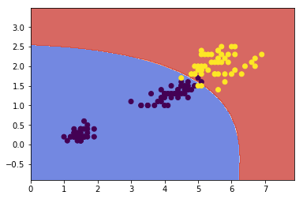


#### Gaussian RBF Kernal

Define the similarity function to be the Gaussian Radial Basis Function (RBF):

$$\phi(x, \gamma) = exp(-\gamma \lVert x-l\rVert ^2)$$

Let's try the Gaussian RBF kernel using the `SVC` class:


```python
rbf_kernel_svm_clf = Pipeline([
    ('svm_clf', SVC(kernel='rbf', gamma=0.1, C=0.1))
])
rbf_kernel_svm_clf.fit(x,y)
```


    Pipeline(steps=[('svm_clf', SVC(C=0.1, cache_size=200, class_weight=None, coef0=0.0,
      decision_function_shape=None, degree=3, gamma=0.1, kernel='rbf',
      max_iter=-1, probability=False, random_state=None, shrinking=True,
      tol=0.001, verbose=False))])


```python
plot_contours(rbf_kernel_svm_clf, xx, yy,
              cmap=plt.cm.coolwarm, alpha=0.8)
plt.hold
plt.scatter(x[:,0], x[:,1], c=y)
```


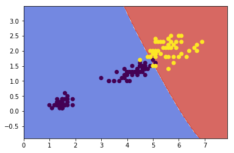


Other kernals such as `sigmoid`, `precomputed` are also used. With so many kernels to choose from, as a rule of thumb, you should always try the linear kernel first, especailly if the training set is very large or if it has plenty of features. If the training set is not too large, you should try the Gaussian RBF kernel as well; it works well in most cases.

#### Complexity

Time complexity of algorithms above:

* `LinearSVC`: $O(m\times n)$
* `SGDClassifier`: $O(m\times n)$
* `SVC`: $O(m^2\times n) \text{ to } O(m^3\times n)$


### K-means Clustering


The K-Means Algorithm is the most popular and widely used algorithm for automatically grouping data into coherent subsets.

1.  Randomly initialize two points in the dataset called the _cluster centroids_ .

2.  _Cluster assignment_: assign all examples into one of two groups based on which cluster centroid the example is closest to.

3.  _Move centroid_: compute the averages for all the points inside each of the two cluster centroid groups, then move the cluster centroid points to those averages.

4.  Re-run (2) and (3) until we have found our clusters.

Main variables are:

*   K (number of clusters)

*   Training set ${x^{(1)}, x^{(2)}, \dots,x^{(m)}}$

*   Where $x^{(i)} \in \mathbb{R}^n$


**The algorithm:**

```
Randomly initialize K cluster centroids mu(1), mu(2), ..., mu(K)
Repeat:
   for i = 1 to m:
      c(i):= index (from 1 to K) of cluster centroid closest to x(i)
   for k = 1 to K:
      mu(k):= average (mean) of points assigned to cluster k
```

##### Explaination

The **first for-loop** is the _Cluster Assignment_ step. We make a vector _c_ where _c(i)_ represents the centroid assigned to example _x(i)_ .

We can write the operation of the Cluster Assignment step more mathematically as follows:

$c^{(i)} = \arg \min_k\ ||x^{(i)} - \mu_k||^2$

That is, each $c^{(i)}$ contains the index of the centroid that has minimal distance to $x^{(i)}$.

By convention, we square the right-hand-side, which makes the function we are trying to minimize more sharply increasing. It is mostly just a convention. But a convention that helps reduce the computation load because the Euclidean distance requires a square root but it is canceled.

Without the square:

$||x^{(i)} - \mu_k|| = ||\quad\sqrt{(x_1^i - \mu_{1(k)})^2 + (x_2^i - \mu_{2(k)})^2 + (x_3^i - \mu_{3(k)})^2 + ...}\quad||$

With the square:

$||x^{(i)} - \mu_k||^2 = ||\quad(x_1^i - \mu_{1(k)})^2 + (x_2^i - \mu_{2(k)})^2 + (x_3^i - \mu_{3(k)})^2 + ...\quad||$

...so the square convention serves two purposes, minimize more sharply and less computation.

The **second for-loop** is the 'Move Centroid' step where we move each centroid to the average of its group.

More formally, the equation for this loop is as follows:

$\mu_k = \dfrac{1}{n}[x^{(k_1)} + x^{(k_2)} + \dots + x^{(k_n)}] \in \mathbb{R}^n$

Where each of $x^{(k_1)}, x^{(k_2)}, \dots, x^{(k_n)}$ are the training examples assigned to group $mμ_k$.

If you have a cluster centroid with **0 points** assigned to it, you can randomly **re-initialize** that centroid to a new point. You can also simply **eliminate** that cluster group.

After a number of iterations the algorithm will _**converge**_ , where new iterations do not affect the clusters.

Note on non-separated clusters: some datasets have no real inner separation or natural structure. K-means can still evenly segment your data into K subsets, so can still be useful in this case.

##### Choosing the Number of Clusters

Choosing K can be quite arbitrary and ambiguous.

**The elbow method**: plot the cost J and the number of clusters K. The cost function should reduce as we increase the number of clusters, and then flatten out. Choose K at the point where the cost function starts to flatten out.

However, fairly often, the curve is **very gradual** , so there's no clear elbow.

**Note:** J will **always** decrease as K is increased. The one exception is if k-means gets stuck at a bad local optimum.

Another way to choose K is to observe how well k-means performs on a **downstream purpose** . In other words, you choose K that proves to be most useful for some goal you're trying to achieve from using these clusters.

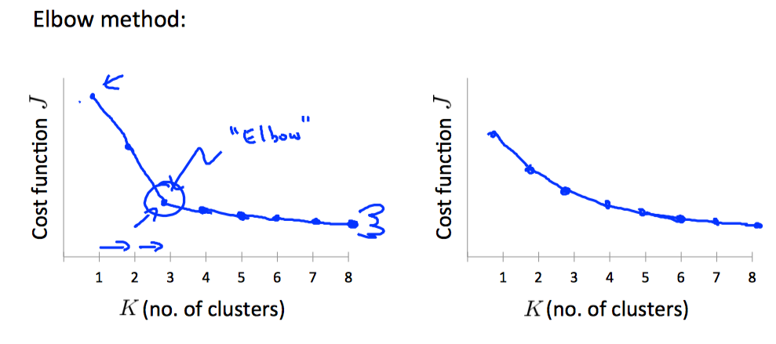


### Principal Component Analysis

The most popular dimensionality reduction algorithm is _Principal Component Analysis_ (PCA)

Before applying PCA, there is a data pre-processing step we must perform:

**Data preprocessing**

*   Given training set: $x(1),x(2),…,x(m)$
*   Preprocess (feature scaling/mean normalization): $\mu_j = \dfrac{1}{m}\sum^m_{i=1}x_j^{(i)}$

*   Replace each $x_j^{(i)}$ with $x_j^{(i)} - \mu_j$

*   If different features on different scales (e.g., $x_1$ = size of house, $x_2$ = number of bedrooms), scale features to have comparable range of values.

Above, we first subtract the mean of each feature from the original feature. Then we scale all the features $x_j^{(i)} = \dfrac{x_j^{(i)} - \mu_j}{s_j}$.

We can define specifically what it means to reduce from 2d to 1d data as follows:

$\Sigma = \dfrac{1}{m}\sum^m_{i=1}(x^{(i)})(x^{(i)})^T$

The z values are all real numbers and are the projections of our features onto $u^{(1)}$.

So, PCA has two tasks: figure out $u^{(1)},\dots,u^{(k)}$ and also to find $z_1, z_2, \dots, z_m$.

The mathematical proof for the following procedure is complicated and beyond the scope of this course.

**1\. Compute "covariance matrix"**

$\Sigma = \dfrac{1}{m}\sum^m_{i=1}(x^{(i)})(x^{(i)})^T$

This can be vectorized in Octave as:

$$Sigma = (1/m) * X' * X;$$

We denote the covariance matrix with a capital sigma (which happens to be the same symbol for summation, confusingly---they represent entirely different things).

Note that $x^{(i)}$ is an n×1 vector, $(x^{(i)})^T$ is an 1×n vector and X is a m×n matrix (row-wise stored examples). The product of those will be an n×n matrix, which are the dimensions of Σ.

**2\. Compute "eigenvectors" of covariance matrix Σ**

```octave
[U,S,V] = svd(Sigma);
```

svd() is the 'singular value decomposition', a built-in Octave function.

What we actually want out of svd() is the 'U' matrix of the Sigma covariance matrix: $U \in \mathbb{R}^{n \times n}$. U contains $u^{(1)},\dots,u^{(n)}$, which is exactly what we want.

**3\. Take the first k columns of the U matrix and compute z**

We'll assign the first k columns of U to a variable called `Ureduce`. This will be an n×k matrix. We compute z with:

$z^{(i)} = \text{Ureduce}^T \cdot x^{(i)}$

$\text{Ureduce}Z^T$ will have dimensions k×n while x(i) will have dimensions n×1\. The product $\text{Ureduce}^T \cdot x^{(i)}$ will have dimensions k×1.

To summarize, the whole algorithm in `octave` is roughly:

```octave
Sigma = (1/m) * X' * X; % compute the covariance matrix
[U,S,V] = svd(Sigma);   % compute our projected directions
Ureduce = U(:,1:k);     % take the first k directions
Z = X * Ureduce;        % compute the projected data points
```


##### Choosing the Number of Principal Components

How do we choose _number of principal components_ $k$? 

One way to choose k is by using the following formula:

*   Given the average squared projection error: $\dfrac{1}{m}\sum^m_{i=1}||x^{(i)} - x_{approx}^{(i)}||^2$

*   Also given the total variation in the data: $\dfrac{1}{m}\sum^m_{i=1}||x^{(i)}||^2$

*   Choose k to be the smallest value such that: $\dfrac{\dfrac{1}{m}\sum^m_{i=1}||x^{(i)} - x_{approx}^{(i)}||^2}{\dfrac{1}{m}\sum^m_{i=1}||x^{(i)}||^2} \leq 0.01$

In other words, the squared projection error divided by the total variation should be less than one percent, so that **99% of the variance is retained** .

**Algorithm for choosing k**

1.  Try PCA with k=1,2,…

2.  Compute $U_{reduce}, z, x$

3.  Check the formula given above that _99% of the variance is retained_. If not, go to step one and increase k.

This procedure would actually be horribly inefficient. In Octave, we will call svd:

<pre>[U,S,V] = svd(Sigma)
</pre>

Which gives us a matrix S. We can actually check for 99% of retained variance using the S matrix as follows:

$\dfrac{\sum_{i=1}^kS_{ii}}{\sum_{i=1}^nS_{ii}} \geq 0.99$

##### Advice for Applying PCA

The most common use of PCA is to speed up supervised learning.

Given a training set with a large number of features (e.g. $x^{(1)},\dots,x^{(m)} \in \mathbb{R}^{10000}$ ) we can use PCA to reduce the number of features in each example of the training set (e.g. $z^{(1)},\dots,z^{(m)} \in \mathbb{R}^{1000}$).

Note that we should define the PCA reduction from $x^{(i)}$ to $z^{(i)}$ only on the training set and not on the cross-validation or test sets. You can apply the mapping z(i) to your cross-validation and test sets after it is defined on the training set.


### Anomaly Detection

##### Problem Motivation

Just like in other learning problems, we are given a dataset ${x^{(1)}, x^{(2)},\dots,x^{(m)}}$.

We are then given a new example, $x_{test}$, and we want to know whether this new example is abnormal/anomalous.

We define a "model" p(x) that tells us the probability the example is not anomalous. We also use a threshold ϵ (epsilon) as a dividing line so we can say which examples are anomalous and which are not.

A very common application of anomaly detection is detecting fraud:

*   $x^{(i)} =$ features of user i's activities

*   Model p(x) from the data.

*   Identify unusual users by checking which have p(x)<ϵ.

If our anomaly detector is flagging **too many** anomalous examples, then we need to **decrease** our threshold ϵ

##### Gaussian Distribution

The Gaussian Distribution is a familiar bell-shaped curve that can be described by a function $\mathcal{N}(\mu,\sigma^2)$

Let x∈ℝ. If the probability distribution of x is Gaussian with mean μ, variance $\sigma^2$, then:

$x \sim \mathcal{N}(\mu, \sigma^2)$

The little ∼ or 'tilde' can be read as "distributed as."

The Gaussian Distribution is parameterized by a mean and a variance.

Mu, or μ, describes the center of the curve, called the mean. The width of the curve is described by sigma, or σ, called the standard deviation.

The full function is as follows:

$\large p(x;\mu,\sigma^2) = \dfrac{1}{\sigma\sqrt{(2\pi)}}e^{-\dfrac{1}{2}(\dfrac{x - \mu}{\sigma})^2}$

We can estimate the parameter μ from a given dataset by simply taking the average of all the examples:

$\mu = \dfrac{1}{m}\displaystyle \sum_{i=1}^m x^{(i)}$

We can estimate the other parameter, $\sigma^2$, with our familiar squared error formula:

$\sigma^2 = \dfrac{1}{m}\displaystyle \sum_{i=1}^m(x^{(i)} - \mu)^2$


##### Algorithm

Given a training set of examples, $\lbrace x^{(1)},\dots,x^{(m)}\rbrace$ where each example is a vector, $x \in \mathbb{R}^n$.

$p(x) = p(x_1;\mu_1,\sigma_1^2)p(x_2;\mu_2,\sigma^2_2)\cdots p(x_n;\mu_n,\sigma^2_n)$

In statistics, this is called an "independence assumption" on the values of the features inside training example x.

More compactly, the above expression can be written as follows:

$= \displaystyle \prod^n_{j=1} p(x_j;\mu_j,\sigma_j^2)$

**The algorithm**

Choose features $x_i$ that you think might be indicative of anomalous examples.

Fit parameters $\mu_1,\dots,\mu_n,\sigma_1^2,\dots,\sigma_n^2$

Calculate $\mu_j = \dfrac{1}{m}\displaystyle \sum_{i=1}^m x_j^{(i)}$

Calculate $\sigma^2_j = \dfrac{1}{m}\displaystyle \sum_{i=1}^m(x_j^{(i)} - \mu_j)^2$

Given a new example x, compute p(x):

$p(x) = \displaystyle \prod^n_{j=1} p(x_j;\mu_j,\sigma_j^2) = \prod\limits^n_{j=1} \dfrac{1}{\sqrt{2\pi}\sigma_j}exp(-\dfrac{(x_j - \mu_j)^2}{2\sigma^2_j})$

Anomaly if p(x)<ϵ

A vectorized version of the calculation for μ is $\mu = \dfrac{1}{m}\displaystyle \sum_{i=1}^m x^{(i)}$. You can vectorize $\sigma^2$ similarly.

##### Developing and Evaluating an Anomaly Detection System

To evaluate our learning algorithm, we take some labeled data, categorized into anomalous and non-anomalous examples ( y = 0 if normal, y = 1 if anomalous).

Among that data, take a large proportion of **good** , non-anomalous data for the training set on which to train p(x).

Then, take a smaller proportion of mixed anomalous and non-anomalous examples (you will usually have many more non-anomalous examples) for your cross-validation and test sets.

For example, we may have a set where 0.2% of the data is anomalous. We take 60% of those examples, all of which are good (y=0) for the training set. We then take 20% of the examples for the cross-validation set (with 0.1% of the anomalous examples) and another 20% from the test set (with another 0.1% of the anomalous).

In other words, we split the data 60/20/20 training/CV/test and then split the anomalous examples 50/50 between the CV and test sets.

**Algorithm evaluation:**

Fit model p(x) on training set $\lbrace x^{(1)},\dots,x^{(m)} \rbrace$

On a cross validation/test example x, predict:

If p(x) < ϵ ( **anomaly** ), then y=1

If p(x) ≥ ϵ ( **normal** ), then y=0

Possible evaluation metrics (see "Machine Learning System Design" section):

*   True positive, false positive, false negative, true negative.

*   Precision/recall

*   $F_1$ score

Note that we use the cross-validation set to choose parameter ϵ

##### Anomaly Detection vs. Supervised Learning

When do we use anomaly detection and when do we use supervised learning?

Use anomaly detection when...

*   We have a very small number of positive examples (y=1 ... 0-20 examples is common) and a large number of negative (y=0) examples.

*   We have many different "types" of anomalies and it is hard for any algorithm to learn from positive examples what the anomalies look like; future anomalies may look nothing like any of the anomalous examples we've seen so far.

Use supervised learning when...

*   We have a large number of both positive and negative examples. In other words, the training set is more evenly divided into classes.

*   We have enough positive examples for the algorithm to get a sense of what new positives examples look like. The future positive examples are likely similar to the ones in the training set.

##### Choosing What Features to Use

The features will greatly affect how well your anomaly detection algorithm works.

We can check that our features are **gaussian** by plotting a histogram of our data and checking for the bell-shaped curve.

Some **transforms** we can try on an example feature x that does not have the bell-shaped curve are:

*   log(x)

*   log(x+1)

*   log(x+c) for some constant

*   $\sqrt{x}$

*   $x^{1/3}$

We can play with each of these to try and achieve the gaussian shape in our data.

There is an **error analysis procedure** for anomaly detection that is very similar to the one in supervised learning.

Our goal is for p(x) to be large for normal examples and small for anomalous examples.

One common problem is when p(x) is similar for both types of examples. In this case, you need to examine the anomalous examples that are giving high probability in detail and try to figure out new features that will better distinguish the data.

In general, choose features that might take on unusually large or small values in the event of an anomaly.

##### Multivariate Gaussian Distribution

The multivariate gaussian distribution is an extension of anomaly detection and may (or may not) catch more anomalies.

Instead of modeling $p(x_1),p(x_2),\dots$ separately, we will model p(x) all in one go. Our parameters will be: $\mu \in \mathbb{R}^n$ and $\Sigma \in \mathbb{R}^{n \times n}$

$p(x;\mu,\Sigma) = \dfrac{1}{(2\pi)^{n/2} |\Sigma|^{1/2}} exp(-1/2(x-\mu)^T\Sigma^{-1}(x-\mu))$

The important effect is that we can model oblong gaussian contours, allowing us to better fit data that might not fit into the normal circular contours.

Varying Σ changes the shape, width, and orientation of the contours. Changing μ will move the center of the distribution.

Check also:

*   [The Multivariate Gaussian Distribution](http://cs229.stanford.edu/section/gaussians.pdf) [http://cs229.stanford.edu/section/gaussians.pdf](http://cs229.stanford.edu/section/gaussians.pdf) Chuong B. Do, October 10, 2008.

Following examples illustrate the basic meaning of parameters in multivariable gaussian distribution:

```
mean = [0, 0]
cov = [[1, 0], [0, 1]]  ### diagonal covariance
### Draw random samples from a multivariate normal distribution
x, y = np.random.multivariate_normal(mean, cov, 5000).T
plt.plot(x, y, 'x',color='y')
plt.axis('equal')
plt.hold

### change mean
mean = [0, 10]
x, y = np.random.multivariate_normal(mean, cov, 5000).T
plt.plot(x, y, '.', color='b')

### change variances
mean = [10, 10]
cov = [[1, 0], [0, 10]]  ### diagonal covariance
x, y = np.random.multivariate_normal(mean, cov, 5000).T
plt.plot(x, y, '-', color='r')
plt.show()
```


##### Anomaly Detection using the Multivariate Gaussian Distribution

When doing anomaly detection with multivariate gaussian distribution, we compute μ and Σ normally. We then compute p(x) using the new formula in the previous section and flag an anomaly if p(x) < ϵ.

The original model for p(x) corresponds to a multivariate Gaussian where the contours of $p(x;\mu,\Sigma)$ are axis-aligned.

The multivariate Gaussian model can automatically capture correlations between different features of x.

However, the original model maintains some advantages: it is computationally cheaper (no matrix to invert, which is costly for large number of features) and it performs well even with small training set size (in multivariate Gaussian model, it should be greater than the number of features for Σ to be invertible).

### Recommender Systems

##### Problem Formulation

Recommendation is currently a very popular application of machine learning.

Say we are trying to recommend movies to customers. We can use the following definitions

*   $n_u =$ number of users

*   $n_m =$ number of movies

*   $r(i,j) = 1$ if user $j$ has rated movie $i$

*   $y(i,j) =$ rating given by user $j$ to movie $i$ (defined only if $r(i,j)=1$)

##### Content Based Recommendations

We can introduce two features, $x_1$ and $x_2$ which represents how much romance or how much action a movie may have (on a scale of 0−1).

One approach is that we could do linear regression for every single user. For each user $j$, learn a parameter $\theta^{(j)} \in \mathbb{R}^3$. _Predict user $j$ as rating movie $i$ with $(\theta^{(j)})^Tx^{(i)}$ stars_.

*   $\theta^{(j)} =$ parameter vector for user $j$

*   $x^{(i)} =$ feature vector for movie $i$

For user $j$, movie $i$, predicted rating: $(\theta^{(j)})^T(x^{(i)})$

*   $m^{(j)} =$ number of movies rated by user $j$

To learn $\theta^{(j)}$, we do the following

$min_{\theta^{(j)}} = \dfrac{1}{2}\displaystyle \sum_{i:r(i,j)=1} ((\theta^{(j)})^T(x^{(i)}) - y^{(i,j)})^2 + \dfrac{\lambda}{2} \sum_{k=1}^n(\theta_k^{(j)})^2$

This is our familiar linear regression. The base of the first summation is choosing all $i$ such that $r(i,j) = 1$.

To get the parameters for all our users, we do the following:

$min_{\theta^{(1)},\dots,\theta^{(n_u)}} = \dfrac{1}{2}\displaystyle \sum_{j=1}^{n_u} \sum_{i:r(i,j)=1} ((\theta^{(j)})^T(x^{(i)}) - y^{(i,j)})^2 + \dfrac{\lambda}{2} \sum_{j=1}^{n_u} \sum_{k=1}^n(\theta_k^{(j)})^2$

We can apply our linear regression gradient descent update using the above cost function.

The only real difference is that we **eliminate the constant** $\dfrac{1}{m}$.

##### Feature Finder

It can be very difficult to find features such as "amount of romance" or "amount of action" in a movie. To figure this out, we can use _feature finders_ .

We can let the users tell us how much they like the different genres, providing their parameter vector immediately for us.

To infer the features from given parameters, we use the squared error function with regularization over all the users:

$min_{x^{(1)},\dots,x^{(n_m)}} \dfrac{1}{2} \displaystyle \sum_{i=1}^{n_m} \sum_{j:r(i,j)=1} ((\theta^{(j)})^T x^{(i)} - y^{(i,j)})^2 + \dfrac{\lambda}{2}\sum_{i=1}^{n_m} \sum_{k=1}^{n} (x_k^{(i)})^2$

You can also **randomly guess** the values for theta to guess the features repeatedly. You will actually converge to a good set of features.

##### Collaborative Filtering Algorithm

To speed things up, we can simultaneously minimize our features and our parameters:

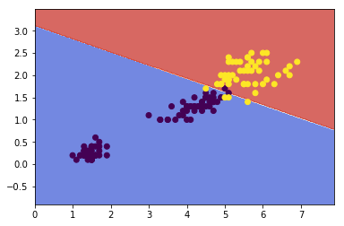


$J(x,\theta) = \dfrac{1}{2} \displaystyle \sum_{(i,j):r(i,j)=1}((\theta^{(j)})^Tx^{(i)} - y^{(i,j)})^2 + \dfrac{\lambda}{2}\sum_{i=1}^{n_m} \sum_{k=1}^{n} (x_k^{(i)})^2 + \dfrac{\lambda}{2}\sum_{j=1}^{n_u} \sum_{k=1}^{n} (\theta_k^{(j)})^2$

It looks very complicated, but we've only combined the cost function for $\theta$ and the cost function for $x$.

Because the algorithm can learn them itself, the bias units where $x_0=1$ have been removed, therefore $x\in \mathcal{R}^ n$ and $\theta \in \mathcal{R} ^n$.

These are three steps in the algorithm:

1.  Initialize $x^{(i)},...,x^{(n_m)},\theta^{(1)},...,\theta^{(n_u)}$ to small random values. This serves to break symmetry and ensures that the algorithm learns features $x^{(i)},...,x^{(n_m)}$ that are different from each other.

2.  Minimize $J(x^{(i)},...,x^{(n_m)},\theta^{(1)},...,\theta^{(n_u)})$ using gradient descent (or an advanced optimization algorithm).  E.g. for every $j=1,...,n_u,i=1,...n_m$:
    
    $x_k^{(i)} := x_k^{(i)} - \alpha\left (\displaystyle \sum_{j:r(i,j)=1}{((\theta^{(j)})^T x^{(i)} - y^{(i,j)}) \theta_k^{(j)}} + \lambda x_k^{(i)} \right)$
    
    $\theta_k^{(j)} := \theta_k^{(j)} - \alpha\left (\displaystyle \sum_{i:r(i,j)=1}{((\theta^{(j)})^T x^{(i)} - y^{(i,j)}) x_k^{(i)}} + \lambda \theta_k^{(j)} \right)$
    
3.  For a user with parameters θ and a movie with (learned) features x, predict a star rating of $\theta^Tx$.

##### Vectorization: Low Rank Matrix Factorization

Given matrices X (each row containing features of a particular movie) and Θ (each row containing the weights for those features for a given user), then the full matrix Y of all predicted ratings of all movies by all users is given simply by: $Y = X\Theta^T$.

Predicting how similar two movies i and j are can be done using the distance between their respective feature vectors x. Specifically, we are looking for a small value of $||x^{(i)} - x^{(j)}||$.

##### Implementation Detail: Mean Normalization

If the ranking system for movies is used from the previous lectures, then new users (who have watched no movies), will be assigned new movies incorrectly. Specifically, they will be assigned θ with all components equal to zero due to the minimization of the regularization term. That is, we assume that the new user will rank all movies 0, which does not seem intuitively correct.

We rectify this problem by normalizing the data relative to the mean. First, we use a matrix Y to store the data from previous ratings, where the ith row of Y is the ratings for the ith movie and the jth column corresponds to the ratings for the jth user.

We can now define a vector

$\mu = [\mu_1, \mu_2, \dots , \mu_{n_m}]$

such that

$\mu_i = \frac{\sum_{j:r(i,j)=1}{Y_{i,j}}}{\sum_{j}{r(i,j)}}$

Which is effectively the mean of the previous ratings for the ith movie (where only movies that have been watched by users are counted). We now can normalize the data by subtracting u, the mean rating, from the actual ratings for each user (column in matrix Y):

As an example, consider the following matrix Y and mean ratings μ:

$Y = \begin{bmatrix} 5 & 5 & 0 & 0 \newline 4 & ? & ? & 0 \newline 0 & 0 & 5 & 4 \newline 0 & 0 & 5 & 0 \newline \end{bmatrix}, \quad \mu = \begin{bmatrix} 2.5 \newline 2 \newline 2.25 \newline 1.25 \newline \end{bmatrix}$

The resulting Y′ vector is:

$Y' = \begin{bmatrix} 2.5 & 2.5 & -2.5 & -2.5 \newline 2 & ? & ? & -2 \newline -.2.25 & -2.25 & 3.75 & 1.25 \newline -1.25 & -1.25 & 3.75 & -1.25 \end{bmatrix}$

Now we must slightly modify the linear regression prediction to include the mean normalization term:

$(\theta^{(j)})^T x^{(i)} + \mu_i$

Now, for a new user, the initial predicted values will be equal to the μ term instead of simply being initialized to zero, which is more accurate.


### Large Scale Machine Learning

#### Learning with Large Datasets

We mainly benefit from a very large dataset when our algorithm has high variance when m is small. Recall that if our algorithm has high bias, more data will not have any benefit.

Datasets can often approach such sizes as m = 100,000,000\. In this case, our gradient descent step will have to make a summation over all one hundred million examples. We will want to try to avoid this -- the approaches for doing so are described below.

#### Stochastic Gradient Descent

Stochastic gradient descent is an alternative to classic (or batch) gradient descent and is more efficient and scalable to large data sets.

Stochastic gradient descent is written out in a different but similar way:

$cost(\theta,(x^{(i)}, y^{(i)})) = \dfrac{1}{2}(h_{\theta}(x^{(i)}) - y^{(i)})^2$

The only difference in the above cost function is the elimination of the m constant within $\dfrac{1}{2}$.

$J_{train}(\theta) = \dfrac{1}{m} \displaystyle \sum_{i=1}^m cost(\theta, (x^{(i)}, y^{(i)}))$

$J_{train}$ is now just the average of the cost applied to all of our training examples.

The algorithm is as follows

1.  Randomly 'shuffle' the dataset

2.  For $i = 1\dots m$

$\Theta_j := \Theta_j - \alpha (h_{\Theta}(x^{(i)}) - y^{(i)}) \cdot x^{(i)}_j$

This algorithm will only try to fit one training example at a time. This way we can make progress in gradient descent without having to scan all m training examples first. Stochastic gradient descent will be unlikely to converge at the global minimum and will instead wander around it randomly, but usually yields a result that is close enough. Stochastic gradient descent will usually take 1-10 passes through your data set to get near the global minimum.

##### Mini-Batch Gradient Descent

Mini-batch gradient descent can sometimes be even faster than stochastic gradient descent. Instead of using all m examples as in batch gradient descent, and instead of using only 1 example as in stochastic gradient descent, we will use some in-between number of examples b.

Typical values for b range from 2-100 or so.

For example, with b=10 and m=1000:

Repeat:

For $i = 1,11,21,31,\dots,991$

$\theta_j := \theta_j - \alpha \dfrac{1}{10} \displaystyle \sum_{k=i}^{i+9} (h_\theta(x^{(k)}) - y^{(k)})x_j^{(k)}$

We're simply summing over ten examples at a time. The advantage of computing more than one example at a time is that we can use vectorized implementations over the b examples.

#### Stochastic Gradient Descent Convergence

How do we choose the learning rate α for stochastic gradient descent? Also, how do we debug stochastic gradient descent to make sure it is getting as close as possible to the global optimum?

One strategy is to plot the average cost of the hypothesis applied to every 1000 or so training examples. We can compute and save these costs during the gradient descent iterations.

With a smaller learning rate, it is **possible** that you may get a slightly better solution with stochastic gradient descent. That is because stochastic gradient descent will oscillate and jump around the global minimum, and it will make smaller random jumps with a smaller learning rate.

If you increase the number of examples you average over to plot the performance of your algorithm, the plot's line will become smoother.

With a very small number of examples for the average, the line will be too noisy and it will be difficult to find the trend.

One strategy for trying to actually converge at the global minimum is to **slowly decrease α over time** . For example $\alpha = \dfrac{\text{const1}}{\text{iterationNumber + const2}}$

However, this is not often done because people don't want to have to fiddle with even more parameters.

#### Online Learning

With a continuous stream of users to a website, we can run an endless loop that gets (x,y), where we collect some user actions for the features in x to predict some behavior y.

You can update θ for each individual (x,y) pair as you collect them. This way, you can adapt to new pools of users, since you are continuously updating theta.

#### Map Reduce and Data Parallelism

We can divide up batch gradient descent and dispatch the cost function for a subset of the data to many different machines so that we can train our algorithm in parallel.

You can split your training set into z subsets corresponding to the number of machines you have. On each of those machines calculate $\displaystyle \sum_{i=p}^{q}(h_{\theta}(x^{(i)}) - y^{(i)}) \cdot x_j^{(i)}$, where we've split the data starting at p and ending at q.

MapReduce will take all these dispatched (or 'mapped') jobs and 'reduce' them by calculating:

$\Theta_j := \Theta_j - \alpha \dfrac{1}{z}(temp_j^{(1)} + temp_j^{(2)} + \cdots + temp_j^{(z)})$

For all $j = 0, \dots, n$.

This is simply taking the computed cost from all the machines, calculating their average, multiplying by the learning rate, and updating theta.

Your learning algorithm is MapReduceable if it can be _expressed as computing sums of functions over the training set_ . Linear regression and logistic regression are easily parallelizable.

For neural networks, you can compute forward propagation and back propagation on subsets of your data on many machines. Those machines can report their derivatives back to a 'master' server that will combine them.


