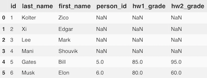

#### Overview of relational data

The term technical term “relation” can be interchanged with the standard notion we have of “tabular data,” say an instance of a “Person” relation:


**Person**


| ID | Last Name | First Name | Role |
| :---: | :---: | :---: | :---: |
| 1 | Kolter | Zico | Instructor |
| 2 | Xi | Edgar | TA |
| 3 | Lee | Mark | TA |
| 4 | Mani | Shouvik | TA |
| 5 | Gates | Bill | Student |
| 6 | Musk | Elon | Student |

* Rows are called **tuples** (元祖 or records), represent a single instance of this relation, and must be unique.
* Columns are called **attributes**(属性), specify some element contained by each of the tuples.
* ** Primary key**(主键): an *unique ID *for every tuple in a relation (i.e. every row in the table), each relation must have exactly one primary key
* **foreign key**(外键): an attribute that points to the primary key of *another* relation
* **Indexes**(索引) are created as ways to “quickly” access elements of a table
    * In practice, use data structure like a B-tree or several others
    * searching for value takes $𝑂(\log 𝑛)$ time
    * Indexes don’t have to be on a single column, can have an index over multiple columns (with some ordering)

#### Entity relationships 

The nature of inter-table relationships via primary and foreign keys actually leads to a number of different possible **entity relationships**(实体关系) (i.e., relationships between a row in one table and a row in another). Several types of inter-table relationships

1. One-to-one
2. (One-to-zero/one)
3. One-to-many (and many-to-one)
4. Many-to-many


These relate one (or more) rows in a table with one (or more) rows in another table, via a foreign key.


##### One-to-many relationship

We have already seen a one-to-many relationship: one role can be shared by many people, denoted as follows


**Role**

| ID | Name |
| :---: | :---: | 
| 1 | Instructor | 
| 2 | TA | 100 | 
| 3 | Student | 

##### One-to-one relationships

In a true one-to-one relationship spanning multiple tables, each row in a table has exactly one row in another table


**Andrew ID**

| Person ID | Andrew ID |
| :---: | :---: |
| 1 | zkoler |
| 2 | esx |
| 3 | marklee |
| 4 | shouvikm |
| 5 | bgates |
| 6 | muskleman |


##### One-to-zero/one relationships

More common in databases is to find “one-to-zero/one” relationships broken across multiple tables.


Consider adding a “Grades” table to our database: each person can have at most one tuple in the grades table.


**Grades**

| Person ID | HW1 Grade | HW2 Grade |
| :---: | :---: | :---: |
| 5 | 85 | 95 | 
| 6 | 80 | 60 |


##### Many-to-many relationships

Alternatively, consider adding two tables, a “homework” table that represents information about each homework, and an associative table that links homeworks to people.


**Homework**

| ID | Name | Points | Release Date | Due Date |
| :---: | :---: | :---: | :---: | :---: |
| 1 | HW1 | 100 | 2018-01-24 | 2018-02-07 |
| 2 | HW2 | 100 | 2018-02-07 | 2018-02-21 |


**Person Homework**

| Person ID | Homework ID | Score | 
| :---: | :---: | :---: |
| 5 | 1 | 85 |
| 5 | 2 | 95 |
| 6 | 1 | 80 |
| 6 | 2 | 60 |

#### Pandas 

[Pandas](https://pandas.pydata.org/) is a “Data Frame” library in Python, meant for manipulating in memory data with row and column labels (as opposed to, e.g., matrices, that have no row or column labels).

Pandas is *not* a relational database system, but it contains functions that mirror some functionality of relational databases.

Operations in Pandas are typically not in place (that is, they return a new modified `DataFrame`, rather than modifying an existing one). Use the `inplace=True` flag to make them done in place.


Create a DataFrame with our Person example:

```Python
import pandas as pd
df = pd.DataFrame([(1, 'Kolter', 'Zico'), 
                   (2, 'Xi', 'Edgar'),
                   (3, 'Lee', 'Mark'), 
                   (4, 'Mani', 'Shouvik'),
                   (5, 'Gates', 'Bill'),
                   (6, 'Musk', 'Elon')], 
                  columns=["id", "last_name", "first_name"])
df.set_index("Person ID", inplace=True)
```

If you select a single row or column in a Pandas `DataFrame`, this will return a `Series` object, which is like a one-dimensional` DataFrame` (it has only an index and corresponding values, not multiple columns)

##### Common Pandas data access

You can access individual elements using the `.loc[row, column]` notation, where `row` denotes the index you are searching for and `column` denotes the column name.

```Python
# access the last name of person with ID 1
df.loc[1, "last_name"]  
# access all last names, return a Pandas Series
df.loc[:, "last_name"]  
# access all last name, return a Pandas DataFrame
df.loc[:, ['last_name']] 
# access last name of person with ID 1,2, return a DataFrame
df.loc[[1,2],:]
# change the last name of person with ID 1
df.loc[1,"last_name"] = "Kilter"
# Add a new entry with index=7 
df.loc[7,:] = ("Moore", "Andrew") 
# Index rows and columns by zero-index
df.iloc[0,0]
```

#### SQLite

[SQLite ](https://www.sqlite.org/index.html) is a full-featured database, but it does not use a client/server model.  Databases are instead stored directly on disk and accessed just via the library.  This has the advantage of being very simple, with no server to configure and run, but for large applications it is typically insufficient.

SQLite, as the name suggests, uses the SQL (structured query language) language for interacting with the database.

#### Creating a database and table

You can create a database and connect using this boilerplate code:

```Python
import sqlite3 
conn = sqlite3.connect("people.db") 
cursor = conn.cursor()
conn.close()
```

Create a new table:

```Python
cursor.execute(
""" CREATE TABLE role (
    id INTEGER PRIMARY KEY,
    name TEXT 
)""")
```

##### Creating a new table and inserting data

Insert data into the table:

```Python
cursor.execute("INSERT INTO role VALUES (1, 'Instructor')") 
cursor.execute("INSERT INTO role VALUES (2, 'TA')") 
cursor.execute("INSERT INTO role VALUES (3, 'Student')") 
conn.commit()
```

Delete items from a table:

```Python
cursor.execute("DELETE FROM role WHERE id == 3") 
conn.commit()
```

#### Pandas

Alternatively, it can be handy to dump the results of a query directly into a Pandas `DataFrame`.  Fortunately, Pandas provides a nice call for doing this, the `pd.read_sql_query()` function, with takes the database connection and an optional argument to set the index of the Pandas `Dataframe` to be one of the columns.

```python
pd.read_sql_query("SELECT * from person;", conn, index_col="id")
```


#### Joins


Join operations merge multiple tables into a single relation (can be then saved as a new table or just directly used). You join two tables on columns from each table, where these columns specify which rows are kept.


Four typical types of joins:

1. Inner
2. Left
3. Right
4. Outer


#### Inner Join

Join two tables where we only return the rows where the two joined columns contain the same value.

| ID | Last Name | First Name | HW1 Grade | HW2 Grade |
| :---: | :---: | :---: | :---: | :---: |
| 5 | Gates | Bill | 85 | 95 |
| 6 | Musk | Elon | 80 | 60 |

```Python
df_person = pd.read_sql_query("SELECT * FROM person", conn)
df_grades = pd.read_sql_query("SELECT * FROM grades", conn)
df_person.merge(df_grades, how="inner", left_on = "id", right_on="person_id")
```

If you alternatively want to join on the index for the left or right data frame, you specify the `left_index` or `right_index` parameters as so:

```python
df_person.set_index("id", inplace=True)
df_grades.set_index("person_id", inplace=True)
df_person.merge(df_grades, how="inner", left_index=True, right_index=True)
```


##### Left/Right Join

Whereas an inner join only kept those rows with corresponding entires in both tables, a left join will keep _all_ the items in the left table, and add in the attribution from the right table (filling with NaNs if no match exists in the right table).  Any row value that occurs in the right table but not the left table is discarded.

For the rest of this section, we'll simply write the Pandas code to perform the relevant join, then show the output it produces, rather than explicitly write the table that results.


```python
df_person = pd.read_sql_query("SELECT * FROM person", conn)
df_grades = pd.read_sql_query("SELECT * FROM grades", conn)
df_person.merge(df_grades, how="left", left_on = "id", right_on="person_id")
```




##### 

Outer joins (also called a cross product) keep all rows that occur in either table, so essentially take the union of the left and right joins.


```python
df_person.merge(df_grades, how="outer", left_on = "id", right_on="person_id")
```

