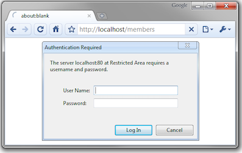

#### Issuing HTTP queries

<C>Requests</C> allows you to send organic, grass-fed HTTP/1.1 requests, without the need for manual labor. View [Documentation](http://docs.python-requests.org/en/master/).

```Python
import requests
response = requests.get("http://www.datasciencecourse.org") 
# some relevant fields 
response.status_code 
response.content # or response.text 
response.headers 
response.headers['Content-Type']
```

常见的HTTP状态码：

| HTTP Status Code | Details  |
| --- | --- |
| 200 | 服务器成功返回网页 |
| 404 | 请求的网页不存在 |
| 500 | 服务器内部错误 |
| 503 | 服务不可用  |


You’ve seen URLs like these:

<small>https://www.google.com/url?sa=t&rct=j&q=&esrc=s&source=web&cd=9&cad=rja&uact=8…</small>

The weird statements after the url are parameters, you would provide them using the requests library like this:

```Python
params = {"sa":"t", "rct":"j", "q":"", "esrc":"s", 
    "source":"web", "cd":"9", "cad":"rja", "uact":"8"} 
response = requests.get("http://www.google.com/url", params=params)
```

#### Authentication

There are various authentication schemes that APIs use, listed here in relative order of complexity:

* No authentication
* [HTTP basic authentication](https://en.wikipedia.org/wiki/Basic_access_authentication)(HTTP基本认证)
* Cookie based user login
* [OAuth](https://oauth.net/2/)
* API keys
* Custom Authentication

##### HTTP basic authentication




```Python
r = requests.get(url,  auth=('username', 'password'))
```

##### Cookie based user login

Cookie based user login is what the majority of services use when you login with a browser (i.e. username and password). Once you sign in to a service like Facebook, the response stores a cookie in your browser to remember that you have logged in (HTTP is stateless). Each subsequent request to the same domain (i.e. any page on `facebook.com`) also sends the cookie that contains the authentication information to remind Facebook's servers that you have already logged in.

```Python
# 在headers中加入知乎的Cookie
headers = {
    'Cookie': <知乎的Cookie>,   # 加入Cookie
    'Host': 'www.zhihu.com',
    'User-Agent': 'Mozilla/5.0 (Macintosh; Intel Mac OS X 10_11_4) 
    AppleWebKit/537.36 (KHTML, like Gecko) Chrome/53.0.2785.116
     Safari/537.36',
}
r = requests.get('https://www.zhihu.com', headers=headers)
```

##### OAuth

Many REST APIs however use [OAuth](https://oauth.net/2/) (authentication using tokens) which can be thought of a programmatic way to "login" _another_ user. Using tokens, a user (or application) only needs to send the login credentials once in the initial authentication and as a response from the server gets a special *signed token*. This signed token is then sent in future requests to the server (in place of the user credentials).


例如通过微信登陆吃鸡游戏。使用第三方应用（吃鸡游戏）登录时，最传统的办法是让用户直接游戏登录页面输账号和密码，但是有的用户觉得注册新账号麻烦（或者APP根本没有提供注册，仅提供关联账号），于是就使用相关的社交账号(微信)通过用户的账号和密码去微信那里获取用户数据，但这样做有很多严重的缺点：

* 吃鸡游戏需要明文保存用户的微信账号和密码，这样很不安全。
* 吃鸡游戏拥有了获取用户在微信所有的权限，包括删除好友、给好友发消息、更改密码、注销账号等危险操作。
* 用户只有修改密码，才能收回赋予吃鸡游戏的权限。但是这样做会使得其他所有获得用户授权的第三方应用程序全部失效。
* 只要有一个第三方应用程序被破解，就会导致用户密码泄漏，以及所有使用微信登录的网站的数据泄漏。


为了解决以上的问题，OAuth协议应运而生。

Python的OAuth认证详见[Requests-oAuthlib](https://requests-oauthlib.readthedocs.io/en/latest/).

##### API Keys

A similar concept common used by many APIs is to assign API Keys to each client that needs access to server resources. The client must then pass the API Key along with _every_ request it makes to the API to authenticate. This is because the server is typically relatively stateless and does not maintain a session between subsequent calls from the same client. Most APIs allow you to pass the API Key via a special HTTP Header: "Authorization: Bearer <API_KEY>".

```Python
headers={'Authorization': 'Bearer <API_KEY>'}
requests.get(url, headers=headers, params=params)
```

#### Common data formats and handling

The three most common formats:

1. CSV (comma separate value) files
2. JSON (Javascript object notation) files and strings
3. HTML/XML (hypertext markup language / extensible markup language) files and strings

##### CSV

Using `Pandas` library to parse CSV files:

```Python
import pandas as pd
dataframe = pd.read_csv(csv_file, delimiter=',', quotechar='"')
```

##### JSON

A number of different data types can be represented

* Number: 1.0 (always assumed to be floating point) 
* String: "string" 
* Boolean: true or false 
* List (Array): [item1, item2, item3,…]
* Dictionary: {"key":value}


Lists and Dictionaries can be embedded within each other:

* [{"key":[value1, [value2, value3]]}]

Easily to use built-in library `json` to read/write Python objects from/to JSON files

```Python
import json
response = requests.get(url)iu87
data = json.loads(response.content) #将JSON字符串转化为JSON对象
json.load(file) # 从文件中读取JSON对象
json.dumps(obj) # 将JSON对象转化为JSON字符串 
json.dump(obj, file) # 将JSON对象写入文件
```

注意json.load/json.loads, json.dump/json.dumps的区别


有一个很好的JSON教程： http://www.json.org

##### XML/HTML

There are a number of XML/HTML parsers for Python, but a nice one for data science is the BeautifulSoup library (specifically focused on getting data out of XML/HTML files).

```Python
# get all the links within the data science course schedule 
from bs4 import BeautifulSoup 
import requests 
response = requests.get("http://www.datasciencecourse.org/2016")
root = BeautifulSoup(response.content) 
root.find("section",id="schedule")\ 
    .find("table").find("tbody").findAll("a")
```


### Regular expressions and parsing

A few common methods to call regular expressions in Python:

```Python
match = re.match(r"data science", text) # check if start of text matches 
match = re.search(r"data science", text) # find first match or None 
for match in re.finditer("data science", text):
    # iterate over all matches in the text
    ...
all_matches = re.findall(r"data science", text) # return all matches
```

You can also use “compiled” version of regular expressions

```Python
regex = re.compile(r"data science") 
regex.match(text, [startpos, [endpos]]) 
regex.search(...)
regex.finditer(...)
regex.findall(...)
```

#### Matching multiple potential characters


The real power of regular expressions comes in the ability to match multiple possible sequence of characters

Special characters in regular expressions: `.^$*+?{}\[]|()` (if you want to match these characters exactly, you need to escape them: `\$`)


Match sets of characters:

* Match the character 'a': `a` 
* Match the character 'a', 'b', or 'c': `[abc]`
* Many any character except 'a', 'b', or 'c': `[^abc]` 
* Match any digit: `\d` (= `[0-9]`) 
* Match any alpha-numeric plus underscore: `\w` (= `[a-zA-z0-9_]`) 
* Match whitespace: `\s` (= `[ \t\n\r\f\v]`, (a space, tab, and various newline characters))
* Match any character:`.` (including newline with `re.DOTALL`)

#### Matching repeated characters

Can match one or more instances of a character (or set of characters)

- match `a` exactly once: `a`.
- match `a` zero or one times: `a?`.
- match `a` zero or more times: `a*`.
- match `a` one or more times: `a+`.
- match `a` exactly n times: `a{n}`.

#### Grouping

We often want to obtain more information that just whether we found a match or not (for instance, we may want to know what text matched)

**Grouping**: enclose portions of the regular expression in quotes to "remember" these portions of the match

(\w+)\s([Ss]cience)

```python
match = re.search(r"(\w+)\s([Ss]cience)", text) 
print(match.start(), match.groups()) # 49 (’data', ’science')
```
#### Substitutions

Regular expressions provide a power mechanism for replacing some text with outer text

```python
better_text = re.sub(r"data science", r"schmada science", text)
```

To include text that was remembered in the matching using groups, use the escaped sequences \1, \2, … in the substitution text

```python
better_text = re.sub(r"(\w+)\s([Ss])cience", r"\1 \2hmience", text)
```

#### Ordering and greedy matching

There is an order of operations in regular expressions

`abc|def` matches the strings "abc" or "def", not "ab(c or d)ef" You can get around this using parenthesis e.g. `a(bc|de)f` This also creates a group, use `a(?:bc|de)f` if you don’t want to capture it.


By default, regular expressions try to capture as much text as possible (greedy matching), If you want to capture the least amount of text possible use `<(.*?)>` this will just match the <a> term.


进一步阅读资料[Regular Expression HOWTO](https://docs.python.org/3/howto/regex.html).


### Application: Yelp

从Yelp提取符合条件的餐厅的评论。Yelp认证使用API Keys, 在注册账号、[生成Key](https://www.yelp.com/developers/v3/manage_app)之后，通过Yelp Search API ( [API documentation](https://www.yelp.com/developers/documentation/v3/business_search) )，可以根据地址、类别等关键字查询相应的商业服务。

`all_restaurants(api_key, query)`方法根据给定地区(query)和密钥(api_key)查询该地区所有的餐厅。该方法每次查询50(limit=50)个餐厅。

```Python
def all_restaurants(api_key, query):
    """
    Retrieve ALL the restaurants on Yelp for a given query.
    Args: query (string): Search term
    Returns: results (list): list of dicts representing each business
    """
    url = 'https://api.yelp.com/v3/businesses/search'
    headers = {'Authorization': 'Bearer ' + api_key}
    limit = 50
    offset = 1
    data = []
    while len(data) % limit == 0:
        params={'location':query, 'categories': 'Restuarants', 
                'limit':limit, 'offset': offset}
        r = requests.get(url, headers=headers, params=params)
        businesses = json.loads(r.text)['businesses']
        if len(businesses) == 0:
            break
        data.extend(list(map(lambda x: x['name'], businesses)))
        offset += limit
        time.sleep(0.5)
    return data
```

接下来解析从API获取的信息，解析出符合目标的餐厅的网址：

```Python
def parse_api_response(data):
    """
    Parse Yelp API results to extract restaurant URLs.
    Args: data (string): String of properly formatted JSON.
    Returns: a list of URLs as strings from the input JSON.
    """
    businesses = data['businesses']
    return list(map(lambda x : x['url'], businesses))
```

解析出网址以后，需要依次访问每个网页，提取出评论信息：

```Python
def extract_reviews(url):
    """
    Retrieve ALL of the reviews for a single restaurant on Yelp.
    url(string): URL corresponding to the restaurant of interest.
    Returns: a list of dictionaries containing 
            extracted review information
    """
    next_page = url
    reviews = []
    while next_page:
        r = requests.get(next_page)
        review_infos, next_page = parse_page(r.text)
        reviews.extend(review_infos)
        time.sleep(0.5)
    return reviews
    
def parse_page(html):
    """
    Parse the reviews on a single page of a restaurant.
    html (string): String of HTML corresponding to a Yelp restaurant
    Returns:
    tuple(list, string): a tuple of two elements
        first element: list of dictionaries 
            corresponding to the extracted review information
        second element: URL for the next page of reviews 
            (or None if it is the last page)
    """
    soup = BeautifulSoup(html)
    review_infos = []
    reviews = soup.select('.review')
    first = True
    for review in reviews:
        if first:
            first = False
            continue
        review_id = review.get('data-review-id')
        user_id = review.get('data-signup-object').split(':')[1]
        rating = float(review.select_one('.i-stars').get('title').split()[0])
        date = review.select('.rating-qualifier')[0].text.strip().split('\n')[0]
        text = review.p.text
        review_info = {
            'review_id': review_id, # string
            'user_id': user_id, # string
            'rating': rating, # float
            'date': date, # ('yyyy-mm-dd')
            'text': text # string
        }
        review_infos.append(review_info)
    next_page = None
    next_page_info = soup.select_one('.review-pager')\
        .select('.arrange_unit')[-1] # get next page
    if next_page_info.span.text == 'Next':
        next_page = next_page_info.a.get('href')
        print(next_page)
    return (review_infos, next_page)
```


