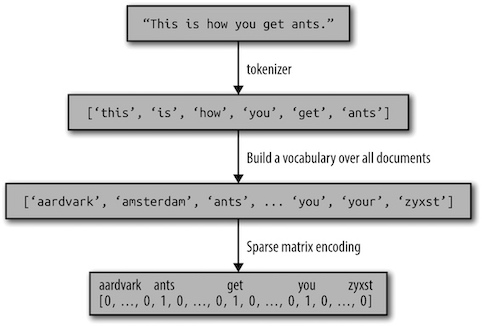

在文本分析的语境中，数据集通常被称为**语料库**(corpus)，每个由单个文本表示的数据点被称为**文档**(document).


### 将文本数据表示为词袋

用于机器学习的文本一般用**词袋**表示(bag-of-words)：它舍弃了输入文本中的大部分结构，如章节、段落、句子和格式，只计算语料库中**每个单词在每个文本中的出现频次**。


对于文档语料库，计算词袋包括以下三个步骤：

1. **分词**(tokenization)：将每个文档划分为出现在其中的单词[称为词例(token)], 比如按空格和标点划分。
2. **构建词表**(vocabulary building)：收集一个词表，里面包含出现在任意文档中的所有词，并对它们进行编号(比如按字母顺序排序)。
3. **编码**(encoding)：对于每个文档，计算词表中每个单词在该文档中的出现频次。



```Python
from sklearn.feature_extraction.text import CountVectorizer
vect = CountVectorizer()                        # 实例化CountVectorizer
vect.fit(bards_words)                           # 分词，并构建词表
bag_of_words = vect.transform(bards_words)      # 构建词袋
```
CountVectorizer使用正则表达式提取词例。 默认使用的正则表达式是"\b\w\w+\b"，它的含义是找到所有包含至少两个字母或数字(\w)且被词边界(\b)分隔的字符序列。

#### 停用词

删除没有信息量的单词可以使用**停用词**列表，或者舍弃那些出现过于频繁的单词。

```Python
# 设置停用词列表stop_words, 舍弃出现最频繁的单词max_df
vect = CountVectorizer(min_df=5, stop_words="english", max_df=500).
                    fit(text_train)
```


#### 用tf-idf缩放数据

使用**词频-逆向文档频率**(term frequency-inverse document frequency, tf-idf)按照预计的特征信息量大小来缩放特征: 它衡量的是一个单词在语料库的文档中的重要性。

这一方法对在某个特定文档中经常出现的术语给予很高的权重，但对在语料库的许多文档中都经常出现的术语给予的权重却不高。如果一个单词在某个特定文档中经常出现，但在许多文档中却不常出现，那么这个单词很可能是对文档内容的很好描述。

单词$w$在文档$d$中的tf-idf分数为：

$$\text{tfdif}(w,d) = \text{tf}\times\text{idf} =\text{tf}\log(\frac{N+1}{N_w+1})+ 1$$

其中$N$是训练集中的文档数量，$N_w$是训练集中出现单词$w$的文档数量，$tf$(词频)是单词$w$在查询文档$d$(你想要变换或编码的文档)中出现的次数。一个词的TF-IDF值是它的"词频"（TF）和"逆文档频率"（IDF）的乘积。


#### n元分词

使用前述的词袋的主要缺点之一是完全舍弃了单词顺序。因此，“it’s bad, not good at all” （电影很差，一点也不好）和“it’s good, not bad at all”（电影很好，还不错）这两个字符串的词袋表示完全相同，尽管它们的含义相反。将“not”（不）放在单词前面，这只是上下文 很重要的一个例子（可能是一个极端的例子）。幸运的是，使用词袋表示时有一种获取上下文的方法，就是不仅考虑单一词例的计数，而且还考虑相邻的两个或三个词例的计数。

两个词例被称为**二元分词**(bigram)，三个词例被称为**三元分词**(trigram)，更一般的词例序列被称为$n$元分词($n$-gram)。单个词例也被称为**一元分词**(unigram).

```Python
cv = CountVectorizer(ngram_range=(1, 3)). # 一元分词和三元分词
            fit(bards_words) # 构建词袋
print("Vocabulary size: {}".format(len(cv.vocabulary_)))
print("Vocabulary:\n{}".format(cv.get_feature_names()))
```

<small>
Vocabulary size: 39 Vocabulary:

['be', 'be fool', 'but', 'but the', 'but the wise', 'doth', 'doth think', 'doth think he', 'fool', 'fool doth', 'fool doth think', 'he', 'he is', 'he is wise', 'himself', 'himself to', 'himself to be', 'is', 'is wise', 'knows', 'knows himself', 'knows himself to', 'man', 'man knows', 'man knows himself', 'the', 'the fool', 'the fool doth', 'the wise', 'the wise man', 'think', 'think he', 'think he is', 'to', 'to be', 'to be fool', 'wise', 'wise man', 'wise man knows']
</small>


### 示例：电影评论的情感分析

使用IMDB网站的电影评论数据集([下载地址](http://ai.stanford.edu/~amaas/data/sentiment/))。这个数据集包含评论文本，还有一个正面/负面的评论标签。


### 进展

近年来，在文本处理方面有许多非常令人激动的新进展，并且都和神经网络有关。第一个进展是使用连续向量表示，也叫做词**向量**(word vector)。另一个进展是使用**递归神经网络**(recurrent neural network, RNN)进行文本处理。

