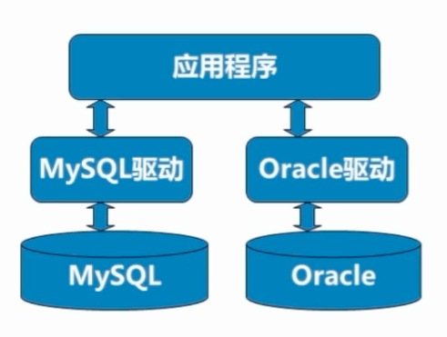
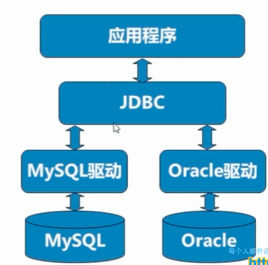

#### 概述

JDBC（Java DataBase Connectivity) Java数据库连接 一套标准





#### 入门

1. 搭建开发环境：创建数据库/表
2. 编写程序，在程序中加载数据库驱动
3. 建立连接
4. 创建用于向数据库发送SQL的Statement对象
5. 从代表结果集的ResultSet中取出数据
6. 断开与数据库的连接，并释放相关资源

```
create database jdbctest;
use jdbctest;
create table user (
    uid int primary key auto_increment,
    usernmae varchar(20), 
    password varchar(20),
    name varchar(20)
);
insert into user values (null, 'aaa', '111', 'jerry');
insert into user values (null, 'bbb', '222', 'baby');
```


#### API详解

DriverManager 驱动管理类

* 注册驱动：`Class.forName("com.mysql.jdbc.Driver")`
* 获得连接： `DriverManager.getConnection(url, username, password)`
    * url写法： "jdbc:mysql://ip_address:port/database_name"
        * jdbc: 协议
        * mysql：子协议
        * url本地简写： "jdbc:mysql:///database_name"

Connection: 连接对象

* 创建执行SQL语句的对象：
    * `connection.createStatement()`            执行SQL语句，有SQL注入的漏洞存在
    * `connection.prepareStatement(String sql)` 预编译SQL语句，解决了SQL注入的漏洞
    * `connection.prepareCall(String sql)`      执行SQL中存储过程
* 进行事务的管理：
    * `setAutoCommit(boolean autoCommit)`      设置事务自动提交
    * `commit() `                              事务提交
    * `rollback()`                             事务回滚

Statement

* 执行SQL语句
    * `boolean: execute(String sql)`             执行SQL
    * `ResultSet: executeQuery(string sql)`      执行SQL中的select语句
    * `int: executeUpdate(String sql)`           执行SQL中的insert/update/delete语句
* 执行批处理操作
    * `addBatch(Strign sql)`                     添加到批处理中
    * `executeBatch()`                           执行批处理
    * `clearBatch()`                             清空批处理

ResultSet

* 根据不同的数据类型，使用getInt/Boolean/String(columnName)获取数据
　
ResultSet还提供了对结果集进行滚动的方法：

* next()：移动到下一行
* Previous()：移动到前一行
* absolute(int row)：移动到指定行
* beforeFirst()：移动resultSet的最前面。
* afterLast() ：移动到resultSet的最后面。


#### 资源释放

JDbc程序运行完成后，切记要释放程序在运行过程中，创建的那些与数据库进行交互的对象，例如ResultSet, Statement和Connection对象。

特别是Connection对象，它是非常稀有的资源，用完后必须马上释放，如果Connection不能及时、正确的关闭

#### CRUD操作

CRUD操作(create 添加数据read读取数据 update 修改数据delete删除数据) 

```java
public void crudOperation() {
    Connection connection = null;
    Statement statement = null;
    ResultSet resultSet = null;
    try {
        // 注册驱动
        Class.forName("com.mysql.jdbc.Driver");
        // 获得连接
        connection = DriverManager.getConnection("jdbc:mysql:///jdbctest", "root", "imLarry123!");
        // 获得执行SQL语句的对象
        statement = connection.createStatement();
        // 编写SQL语句
        String insertSQL = "insert into user values (null, '123', '3243', 'peek')";
        String updateSQL = "update user set username = 'peek', password = '345', name='pick' where uid = 4";
        String deleteSQL = "delete from user where uid = 2";
        String querySQL = "select * from user";
        // 执行SQL语句
        statement.executeUpdate(insertSQL);
        statement.executeUpdate(updateSQL);
        statement.executeUpdate(deleteSQL);
        resultSet = statement.executeQuery(querySQL);
        while (resultSet.next()) {
            int uid = resultSet.getInt("uid");
            String username = resultSet.getString("username");
            String password = resultSet.getString("password");
            String name = resultSet.getString("name");
            System.out.println(uid + "  " + username + "  " + password + " " + name);
        }
    } catch (Exception e) {
        e.printStackTrace();
    } finally {
        // 释放资源
        if (statement != null) {
            try {
                statement.close();
            } catch (Exception e) {
                e.printStackTrace();
            }
        }
        if (connection != null) {
            try {
                connection.close();
            } catch (Exception e) {
                e.printStackTrace();
            }
        }

        if (resultSet != null) {
            try {
                 resultSet.close();
            } catch (Exception e) {
                e.printStackTrace();
            }
        }
    }
}
```

### JDBC utils

```java
/**
 * JDBC工具类
 */
public class JDBCUtils {

    public static final String driverClass;
    public static final String url;
    public static final String username;
    public static final String password;

    static {
        // 加载属性文件并解析：
        Properties properties = new Properties();
        // 获得属性文件的输入流: 通常不采用FileInputStream方式，因为可能文件不是本地的
        InputStream inputStream = JDBCUtils.class.getClassLoader().getResourceAsStream("jdbc.properties");
        try {
            properties.load(inputStream);
        } catch (Exception e) {
            e.printStackTrace();
        }
        driverClass = properties.getProperty("driverClass");
        url = properties.getProperty("url");
        username = properties.getProperty("username");
        password = properties.getProperty("password");
    }
    /**
     * 注册驱动的方法
     * @throws ClassNotFoundException;
     */
    public static void loadDriver() throws ClassNotFoundException {
        Class.forName(driverClass);

    }

    /**
     * 获得连接的方法
     */
    public static Connection getConnection() throws Exception {
        loadDriver();
        Connection conn = DriverManager.getConnection(url, username, password);
        return conn;
    }

    /**
     * 释放资源的方法
     */
    public static void release(Statement statement, Connection connection) {
        if (statement != null) {
            try {
                statement.close();
            } catch (Exception e) {
                e.printStackTrace();
            }
        }
        if (connection != null) {
            try {
                connection.close();
            } catch (Exception e) {
                e.printStackTrace();
            }
        }
    }

    /**
     * 释放资源的方法
     */
    public static void release(ResultSet resultSet, Statement statement, Connection connection) {
        release(statement, connection);
        if (resultSet != null) {
            try {
                resultSet.close();
            } catch (Exception e) {
                e.printStackTrace();
            }
        }
    }

    public static void main(String[] args) {
        Connection connection = null;
        Statement statement = null;

        try {
            // 获得连接;
            connection = JDBCUtils.getConnection();
            // 创建执行SQL语句的对象
            statement = connection.createStatement();
            // 编写SQL
            String sql = "insert into user values (null, '123', '3454', 'fsadj')";
            // 执行SQL
            statement.executeUpdate(sql);
        } catch (Exception e) {
            e.printStackTrace();
        } finally {
            // 释放资源
            JDBCUtils.release(statement, connection);
        }
    }

}
```


!!! note 
    Class.getResourceAsStream()与ClassLoader.getResourceAsStream()的区别
    1. Class.getResourceAsStream(String path) ：
path 不以'/'开头时默认是从此类所在的包下取资源，以'/'开头则是从ClassPath(Src根目录)根下获取。
其只是通过path构造一个绝对路径，最终还是由ClassLoader获取资源。 
    1. Class.getClassLoader.getResourceAsStream(String path) ：
默认则是从ClassPath根下获取，path不能以'/'开头，最终是由ClassLoader获取资源。
    1. ServletContext. getResourceAsStream(String path)：
默认从WebAPP根目录下取资源，Tomcat下path是否以’/'开头无所谓，当然这和具体的容器实现有关。
 
 
#### JDBC的SQL注入的漏洞
 
SQL注入的漏洞 已知用户名，但不知道密码，仍旧能登陆网站

解决方法 使用`connection.preparedStatement(sql)`

* 可以边面SQL注入的问题
* 对SQL进行预编译，从而提高数据库的执行效率
* 允许使用占位符的形式进行替换，简化sql语句的编写

#### 连接池

连接池是创建和管理一个连接的缓冲池的技术，这些连接准备好被任何需要它们的线程使用。

应用程序直接获取连接的缺点：用户每次请求都需要向数据库获得连接，而数据库创建连接通常需要消耗相对较大的资源，创建时间也较长。这样极大的浪费了数据库的资源，并且极易造成数据库服务器内存溢出。


[c3p0](https://www.mchange.com/projects/c3p0/)(JDBC3 Connection and Statement Pooling)


#### 留言板

实现有留言板功能的网站，具有注册、登陆、留言等具体功能，使用了JSP、Servlet和JDBC等技术