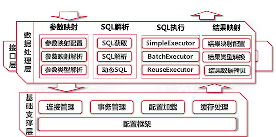

### 简介

#### 概述

> [MyBatis](http://www.mybatis.org/mybatis-3/zh/index.html)是一款优秀的持久层框架，它支持定制化 SQL、存储过程以及高级映射。MyBatis 避免了几乎所有的JDBC代码和手动设置参数以及获取结果集。MyBatis可以使用简单的XML或注解来配置和映射原生信息，将接口和Java的POJOs映射成数据库中的记录。

ORM： 对象关系映射 （object relation mapping)

object: java中的实体内对象
mapping：object和relation之间的映射
relation: 数据库中的表

ORM模型可以用传统JDBC实现，但是传统JDBC程序的设计缺陷

* 大量配置信息硬编码：将数据库位置、密码等保存在代码中，违反软件开发的[OCP原则](../Java/Head First设计模式/3 Decorator Pattern.md#2-the-open-closed-principle)
* 大量的无关业务处理的编码：数据库连接的打开和关闭，sql语句的建立和发送
* 扩展优化极为不便：数据库连接池

适合于：

* 更加关注SQL优化的项目
* 需求频繁更新改动的项目

#### 项目案例效果演示 
#### 数据库+界面准备工作
#### 项目整合开发