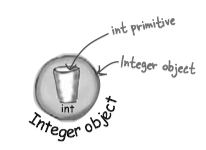

### 1 Static methods

Methods in the `Math` class don't use any instance variable values. Because the methods of `Math are 'static', you don't need to have an instance of `Math`. All you need is the `Math` class.

```Java
int x = Math.round(42.2);
int y = Math.min(56, 12);
int z = Math.abs(-343);
```

If you try to make an instance of class `Math`:

```Java
Math mathObject = new Math()
```

You'll get an error:

```
Math() has private access in java.lang.Math
```

This error shows that the `Math` constructor is marked `private`! That means you can NEVER say `new` on the `Math` class to make a new `Math` object.

<big><i>The keyword <b>static</b> lets a method run <b>without any instance of the class</b>.</i></big>

```Java
public static int min(int a, int b) {
    //return the lesser of a  and b
}
```

!!! note "static method v.s. non-static method"

    * Call a static method using a class name (e.g.`Math.min(88, 12)`)
    * Call a non-static method using a reference variable name (e.g. `t2.play()`)

    
!!! important
    
    static方法可以理解为没有this的方法。在static方法的内部不能调用非静态方法。this关键字表示对"调用方法的那个对象"的引用。当在方法内部调用同一个类的另一个方法时，编译器会自动添加this。

#### Comparison between abstract class and private constructor


Often (although not always), a class with static method is not to be instantiated. But this does not mean that a class with one or more static methods should never be instantiated. In fact, every class you put a `main()` method in is a class with a static method in it.


An abstract class is impossible to be instantiated. And a non-abstract class with private constructor means only code from within the class can invoke the constructor.

#### Usage

**Static methods can't use non-static methods/variables**, because static methods run without knowing about any particular instance of the static method's class.

```Java
public class Duck {
    private int size;
    
    public static void main (String[] args) {
        // which Duck? Whose size?
        System.out.println("Size of duck is " + size);
        // Calling getSize() just postpones 
        // the inevitable-getSize() use the size instance varible.
        System.out.println("size is " + getSize());
    }
    
    public void setSize(int s) {
        size = s;
    }
    
    public int getSize() {
        return size;
    }
}
```

### 2 Static variable

<important>Static variable: value is the same for All instances of the class.</important>


* Static variables are shared by all instances of a class. 
* In other words, one value per *class*, instead of one value per *instance*.

```Java
public class Duck {
    private int size;
    // The static duckCount variable is initialized
    // ONLY when the class is first loaded,
    // NOT each time a new instance is made
    private static int duckCount = 0;
    
    public Duck() {
        // Now it will keep incrementing each time the Duck constructor runs
        // because duck Count is static and won't reset to 0.
        duckCount++;
    }
    
    public void setSize(int s) {
        size = s;
    }
    
    public int getSize() {
        return size;
    }
}
```

#### Initializing a static variable

There are two guarantees about static initialization:

* Static variables in a class are initialized before any *object* of that class can be created.
* Static variables in a class are initialized before any *static method* of the class runs.
* If you don't explicitly initialize a static variable, it gets a default value when declared. ( in exactly the same way that instance variables are given default values)

#### Static final

<important> Static final variables are constants.</important>

A variable marked **`final`** means that -- once initialized -- it can never change. In other words, the value of the `static final` variable will stay the same as long as the class is loaded. 

For example, `Math.PI` is declared as

```Java
public static final double PI = 3.141592653589793;
```

Name convection: *Constant variables names should be in all caps!*


`final` variables in Java must be initialized.

```Java
final class initialize_final {
    // x will have a default value without initialization.
    private int x; 
    // y must be initialized.
    private final int y = 0; 
    //ERROR! z must be initialized.
    private final int z;
    // h must be initialized.
    private static final int h;  

    static { //static final variable can be initialized here.
        h = 10;
    }
}
//output: Error: variable z not initialized in the default constructor.
```

#### Static block

A **static block**(静态块) or **static initializer**(静态初始化程序) is a block of code that runs when a class is loaded, _before any other code can use the class_ , so it's a great place to initialize a static final variable.

```Java
public class Bar {
    public static final double BAR_SIGN;
    static {
        // this code runs as soon as the class is loaded,
        // before any static method is called,
        // and even before any static variable can be used.
        BAR_SIGN = (double) Math.random();
    }
}
```

Important Notes:

* Static blocks will be executed only once as soon the class is **loaded in memory**.
* They are executed in **the order which they appear** in the class.
* You cannot refer to any instance variables from within the static blocks.
* You can have as many static blocks as many you want in a class.


```Java
class StaticSuper{
    static { 
        System.out.println("super static block"); 
    }
    
    StaticSuper(){
        System.out.println("super constructor"); 
    }
}

public class StaticTests extends StaticSuper {
	static int rand;

	static {
		rand = (int) (Math.random()*6);
		System.out.println("static block" + rand);
	}

	StaticTests() {
		System.out.println("constructor");
	}

	public static void main(String [] args) {
		System.out.println("int main");
		StaticTests st = new StaticTests();
	}
}
```

output: 

```
super static block
static block2
int main
super constructor
constructor
```

#### Final

The keyword **final** can modify non-static variables, including instance variables, local variables, and even method parameters. In each case, it means the same thing: _the value can't be changed_ .

* A final **variable** means you can't **change** its value.
* A final **method** means you can't **override** the method.
* A final **class** means you can't **extend** the class.

!!! note
    If the class is final, you don't need to mark the method final.


### 3 Wrapping a primitive

Sometimes you want to treat a primitive like an object. For example, in all versions of Java prior to 5.0, you can't put a primitive directly into a collection like ArrayList or HashMap:

```Java
int x = 32;
ArrayList list = new ArrayList();
// ArrayList only has add() methods that
// take object references,  not primitives.
list.add(x);
```

When you need to treat a primitive like an object, wrap it. Java provide wrapper classes for every primitive type. Each one is named after the primitive type it wraps, but with the first letter capitalized.

* Boolean
* Character // different: char
* Byte
* Short
* Integer // different: int
* Long
* Float
* Double



#### Autoboxing

The **autoboxing/unboxing**(自动装箱/拆箱) feature added to Java 5.0 does the conversion from primitive to wrap/unwrap object *automatically*!

```Java
public void doNumsNewWay() {
    // Make an ArrayList of type Integer
    ArrayList<Integer> listOfNumbers = new ArrayList<Integer>();
    // Just add it!
    listOfNumbers.add(3); 
    // And the compiler automatically unwraps (unboxes) the Integer object
    // so you can assign the int value directly to a primitive without
    // having to call the intValue() method on the Integer object.
    int num = listOfNumbers.get(0);
}
```

Autoboxing works almost everywhere:

* Method arguments: `void takeNumber(Integer i){}`
* Return values: `int giveNumber(){ Integer x = new Integer(42); return x; }`
* Boolean expressions: `if (bool) {System.out.println("true");}`
* Option on numbers: `Integer i = new Integer(42); i++`
* Assignments: `double x = 10.0; Double d = x;`

#### Wrapper method

Wrappers have a bunch of really useful static methods.

```Java
String s = "2";
int x = Integer.parseInt(s);
double d = Integer.parseDobule("420.24");

double d = 42.5;
String doubleString = Double.toString(d);
```

### 4 Number formatting

Java has a powerful and flexible formatting through a <C>Formatter</C> class in `java.util`. You don't need to create and call methods on the <C>Formatter</C> class yourself, just calling a static <C>String.format()</C> method and passing it the thing you want formatted along with formatting instructions.

```Java
String s = String.format("%, d", 1000000000);
System.out.println(s); // output: 1,000,000,000
```

#### The format specifier

The **format specifier**(格式说明符) is the things that go after the percentage (%) sign.

A format specifier can have up to five different parts (not including the “%”). Everything in brackets **[ ]** below is **optional**, so only the percent (%) and the type are required. But the **order** is also **mandatory**, so any parts you DO use must go in this order.

<font color="red"><big><b>
%[argument number][flags][width][.precision]type
</b></big></font>

* **flags**: It is for special formatting options like inserting commas, or putting negative numbers in parentheses, or to make the numbers left justified.
* **width**: It defines the MINIMUM number of characters that will be used. If the number is longer than the width, it'll still be used in full, but if it's less than the width, it'll be padded with zeros.
* **precision**: It defines the precision. It sets the number of decimal places.
* **type**: It is mandatory and will usually be "d" for a decimal integer or "f" for a floating point number.

A few examples:

* <C>%,d</C>: insert commas and format the number as a decimal integer.
* <C>%,.2f</C>: insert commas and format the number as a floating point with a precision of two decimal places.


#### Date Formatting

Date formats use a two-character type that starts with "t".


```Java
import java.util.Date
//The complete data and time: %tc
//output: Mon Jul 30 16:33:29 CST 2017
String.format("%tc", new Date()); 
// Just the time %tr
String.format("%tr", new Date()); // output: 04:35:11 PM
// Day of the week, month and day %tA %tB %td
Date today = new Date(); 
// output: Sunday, November 28
String.format(“%tA, %tB %td”,today,today,today)
// output: Sunday, November 28
String.format(“%tA, %<tB % td”,today); 
```

#### Calendar

For a time-stamp of "now" use Date. But for everything else, use **Calendar** (in `:::Java java.util.Calendar`).

Calendar is actually an abstract class, so you can't use `new`. Instead, use the static `getInstance()` method, which gives you an **instance of a concrete Calendar subclass**.

Examples of working with a Calendar object:

```Java
Calendar c = Calendar.getInstance(); 
// set time to Jan 7, 2004 at 15:40 (Notice the month is zero-based)
c.set(2004,0,7,15,40);
long day1 = c.getTimeInMillis();
day1 += 1000 * 60 * 60; 
c.setTimeInMillis(day1); 
//new hour 16
System.out.println("new hour " + c.get(c.HOUR_OF_DAY));  
c.add(c.DATE, 35); 
// add 35 days Wed Feb 11 16:40:03 CST 2004

System.out.println("add 35 days " + c.getTime());  c.roll(c.DATE, 35);
// roll 35 days Tue Feb 17 16:40:03 CST 2004
System.out.println("roll 35 days " + c.getTime()); c.set(c.DATE, 1); 
//set to 1 Sun Feb 01 16:40:03 CST 2004
System.out.println("set to 1 " + c.getTime()); 
```

