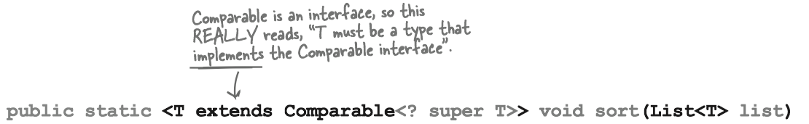
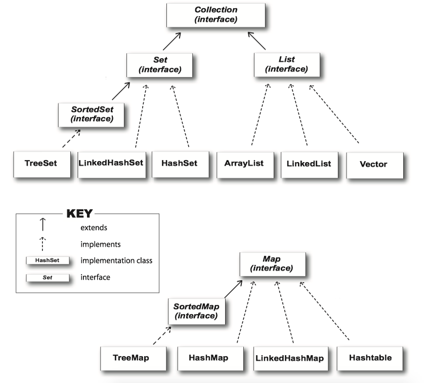

#### Collections.sort()

Problem: <C>ArrayList</C> class does NOT have a <C>sort()</C> method

Solution: you could use the <C>Collections.sort()</C> method

Example: sort a list of songs by song title.

```Java
ArrayList<String> songList = new ArrayList<>();
getSongs();
Collections.sort(songList);
```

#### Sorting objects

Question: What if you need <Song> objects, not just simple <C>Strings</C>.

Try: We override <C>toString()</C> method in class <Object>.

```Java
// We override toString(), because when you do a 
// System.out.println(aSongObject),
// we want to see the title.
// When you do a System.out.println(aListOfSongs),
// it calls the toString() method of EACH element in the list.
public String toString() {
    return title;
}
```

Result: However, it won’t compile!

That's see the signature of <C>Collection.sort()</C> from Java Doc:


```Java
public static <T extends Comparable<? super T>> void sort​(List<T> list)
```

The <C>sort</C> method (along with other things in the whole collection framework in Java) makes heavy use of ***generics***. Anytime you see something with angle brackets<> in Java source code or documentation, it means generics.

#### Generics types

**Generics means more type safety.**

Virtually all of the code you write that deals with generics will be collection-related code. The main point of generics is let you write type-safe collections. (e.g. the compiler stop you from putting a <C>Dog</C> into a list of Ducks).

Before generics (which means before Java 5.0), the compiler could not care less what you put into a collection, because all collection implementations were declared to hold type <C>Object</C>. You could put *anything* in any <C>ArrayList</C>; it was like all <C>ArrayList</C> were declared as <C>ArrayList</C><<C>Object</C>>.

#### Learning generics

* Creating instances of generified *classes*(like <C>ArrayList</C>)
    * `:::Java new ArrayList<Song>()`
* Declaring and assigning *variables* of generic types
    * `:::Java List<Song> songList = new ArrayList<Song>()`
* Declaring (and invoking) *methods* that take generic types
    * `:::Java void foo(List<Song> List)`
    * `:::Java x.foo(songList)` 


Think of E" as a stand-in for "the type of element you want this collection to hold and return." (E is for Element.) 

#### Generic methods

A generic *class* means that the *class declaration* includes a type parameter. A generic *method* means that the method declaration uses a type parameter in its signature.

You can use type parameters in a method in several different ways:

* Using a type parameter defined in the class declaration

```Java
public class ArrayList<E> extends AbstractList<E> ... {
    // You can use the "E" here ONLY because
    // it's already defined as part of the class
    public boolean add(E o)
```

* Using a type parameter that was NOT defined in the class declaration

```Java
// Here we can use <T> because we declared "T" earlier in the method declaration
public <T extends Animals> void takeThing<ArrayList<T> list)
```

If the class itself doesn't use a type parameter, you can still specify one for a method, by declaring it in a really unusual space -- *before the return type*. This method says that T can be "any type of Animal".


This:

```Java
public <T extends Animals> void takeThing<ArrayList<T> list)
```

***Is NOT*** the same as this:

```Java
public void takeThing(ArrayList<Animal> list)
```

The first one, means that any <C>ArrayList</C> declared of a type that is <C>Animal</C> or one of <C>Animal</C>'s subtypes, is legal. So you could invoke the top method using an <C>ArrayList<Dog></C>, <C>ArrayList<Cat></C> or <C>ArrayList<Animal></C>.

But.. the one on the bottom, means that ***only*** an <C>ArrayList<Animal></C> is legal.

**The <C>Collections.sort()</C> method**

The <C>Collections.sort()</C> method can take only lists of <C>Comparable</C> objects.

<C>Song</C> is NOT a subtype of <C>Comparable</C>, so you cannot <C>sort()</C> the list of Songs.

#### Extends

In generics, the keyword "extends" really means "is-a", and works for BOTH classes and interfaces.



#### Comparable interface

<C>Comparable</C> is an interface.

```Java
public interface Comparable<T> {
    public int compareTo(T o);
}
```


<big><b>The new, improved, comparable <C>Song</C> class</b></big>

We decide we want to sort by title, so we implement the <C>compareTo()</C> method to compare the title of the <C>Song</C> passed to the method against the title of the song on which the <C>compareTo()</C> method was invoked.

```Java
public class Song implements Comparable <Song>
{
    String title;
    String artist;
    String rating;
    String bpm;
    
    
    public Song(String t, String a, String r, String b) {
        title = t;
        artist = a;
        rating = r;
        bpm = b;
    }
    
    // The sort() method sends a Song to compareTo()
    // to see how that Song compares to the Song 
    // on which the method was invoked.
    public int compareTo(Song s)
    {
        // Strings have a compareTo() method
        return title.compareTo(s.getTitle());
    }
}
```
    
#### Comparator interface


```Java
public interface Comparator<T> {
...
```

<C>Comparator</C> v.s. <C>Comparable</C>

* Invoking the one-argument <C>sort(List o)</C> method means the list element’s <C>compareTo()</C> method determines the order. So the elements in the list MUST implement the <C>Comparable</C> interface.
* Invoking <C>sort(List o, Comparator c)</C> means the list element’s <C>compareTo()</C> method will NOT be called, and the <C>Comparator</C>’s <C>compare()</C> method will be used instead. That means the elements in the list do NOT need to implement the <C>Comparable</C> interface.

```Java
// Create a class that implements Comparator
// its type parameter matches the type we're going to compare - in this case Song objects.
class ArtistCompare implements Comparator<Song> {
    public int compare(Song one, Song two) {
        // We're letting the String variables (for artist) do the actual comparison.
        // since Strings already know how to alphabetize themselves.
        return one.getArtist().compareTo(two.getArtist());
}
}

// Make an instance of the Comparator
ArtistCompare artistCompare = new ArtistCompare();
// Invoke sort(), passing it the list and a reference to the new custom Comparator object.
Collections.sort(songList, artistCompare);
```

Uh-oh. The sorting all works, but now we have duplicates... We need a <C>Set</C> instead of a <C>List</C>.

#### An Example: SortMountain

```Java
import java.util.Collections;
import java.util.Comparator;
import java.util.LinkedList;

public class SortMountains {

    LinkedList<Mountain> mtn = new LinkedList<Mountain>();


    public static void main(String[] agrs) {
        new SortMountains().go();
    }

    public void go() {
        mtn.add(new Mountain("Longs", 14255));
        mtn.add(new Mountain("Elbert", 14433));
        mtn.add(new Mountain("Maroon", 14156));
        mtn.add(new Mountain("Castle", 14265));
        System.out.println("as entered:\n"+mtn);
        NameCompare nc = new NameCompare();
        Collections.sort(mtn, nc);
        System.out.println("by name:\n " + mtn);
        HeightCompare hc = new HeightCompare();
        Collections.sort(mtn, hc);
        System.out.println("by height:\n" + mtn);
    }

    class NameCompare implements Comparator<Mountain> {

        @Override
        public int compare(Mountain one, Mountain two) {
            return one.getName().compareTo(two.getName());
        }
    }

    class HeightCompare implements Comparator<Mountain> {
        @Override
        public int compare(Mountain one, Mountain two) {
            return one.getHeight() - two.getHeight();
        }
    }

}

class Mountain {
    private String name;
    private int height;

    public int getHeight() {
        return this.height;
    }

    public String getName() {
        return this.name;
    }

    public Mountain(String name, int height) {
        this.name = name;
        this.height = height;
    }

    public String toString () {
        return name + " " +Integer.toString(height);
    }


}
```


### Collection

#### The Collection API

Note that the <C>Map</C> interface doesn't actually extend the <Collection> interface, but <C>Map</C> is still considered part of the "Collection Framework" (集合框架，also known as the "Collection API").



#### Object equality

What makes two objects equal?

***reference*** equality v.s. ***object*** equality.

**Reference equality**: Two references that refer to the same object on the heap are equal. If you want to know if two references are really referring to the same object, use the == operator, which (remember) compares the bits in the variables. If both references point to the same object, the bits will be identical.

**Object equality**: Two references, two objects on the heap, but the objects are considered *meaningfully equivalent*. If you want to treat two different objects as equal, you must override both the <C>hashCode()</C> and <C>equals()</C> methods inherited from class <C>Object</C>.


!!! Question
    How a <C>HashSet</C> checks for duplicates: <C>hashCode()</C> and <C>equals()</C>?

When you put an object into a <C>HashSet</C>, it uses the object's hashcode value to determine where to put the object in the <C>Set</C>. But it also compares the object's hashcode to the hashcode of all the other objects of the <C>HashSet</C>, and if there's no matching hashcode, the <C>HashSet</C> assumes that this new object is not a duplicate. If the <C>HashSet</C> finds a matching hashcode for two objects, the <C>HashSet</C> will then call one of the object's <C>equals()</C> methods to see if these hashcode-matched objects really *are* equal.


The <C>Song</C> class with overriden <C>hashcode</C> and <C>equals()</C>.

```java
public class Song implements Comparable <Song>
{
...
    public boolean equals(Object aSong) {
        Song s = (Song) aSong;
        // Strings have an overriden equals() method.
        return getTitle().equals(s.getTitle());
    }
    
    public int hashCode() {
        //The String class has an overriden hashCode() method, so you can just return the result of calling hashCode() on the title.
        return title.hashCode();
    }
...
}

// Instantiate a TreeSet 
TreeSet<Song> songSet = new TreeSet<Song>();
// We can add all the songs from the HashSet using addAll().
songSet.addAll(songList); 
```

<hh>Java Object Law For <C>HashCode()</C> and <C>equals()</C><hh>:

The API docs for class <C>Object</C> state the rules you MUST follow:


* If two objects are equal, they MUST have matching hashcodes.
* If two objects are equal, calling <C>equals()</C> on either object MUST return true. In other words, `:::java if (a.equals(b)) then (b.equals(a))`.
* If two objects have the same hashcode value, they are NOT required to be equal. But if they’re equal, they MUST have the same hashcode value.
* So, if you override <C>equals()</C>, you MUST override <C>hashCode()</C>.
* The default behavior of <C>hashCode()</C> is to generate a unique integer for each object on the heap. So if you don’t override <C>hashCode()</C> in a class, no two objects of that type can EVER be considered equal.
* The default behavior of <C>equals()</C> is to do an == comparison. In other words, to test whether the two references refer to a single object on the heap. So if you don’t override <C>equals()</C> in a class, no two objects can EVER be considered equal since references to two different objects will always contain a different bit pattern.
    * <C>a.equals(b)</C> must also mean that <C>a.hashCode() == b.hashCode()</C>
    * But <C>a.hashCode() == b.hashCode()</C> does NOT have to mean <C>a.equals(b)</C>

#### How TreeSets sort

To use a <C>TreeSet</C>, one of these things must be true:

* The elements in the list must be of a type that implements <C>Comparable</C>.
* You use the <C>TreeSet</C>’s overloaded constructor that takes a <C>Comparator</C>.

```Java
import java.util.Comparator;
import java.util.TreeSet;

class BookCompare implements Comparator<Book> {
    public int compare(Book one, Book two) {
        return (one.title.compareTo(two.title));
    }
}


public class Book implements Comparable {

    String title;

    public Book(String t) {
        title = t;
    }

    public int compareTo(Object b) {
        Book book = (Book) b;
        return (title.compareTo(book.title));
    }

    public String toString() {
        return title;
    }

    public static void main(String[] args) {
        Book b1 = new Book("How Cats Work");
        Book b2 = new Book("Remix your Body");
        Book b3 = new Book("Finding Emo");
        BookCompare bCompare = new BookCompare();
        TreeSet<Book> tree = new TreeSet<Book>(bCompare);
        tree.add(new Book("How Cats Work"));
        tree.add(new Book("Finding Emo"));
        tree.add(new Book("Remix your Body"));
        System.out.println(tree);
    } // end main
}
```


### Polymorphism and Generics

#### A problem with polymorphism


<C>TestGenerics1</C> shows how polymorphism works with regular arrays. Because of polymorphism, the compiler let us pass a <C>Dog</C> array to a method with an <C>Animal</C> array argument. However, the <C>ArrayList</C><<C>Animal</C>> argument WILL NOT accept an <C>ArrayList</C><<C>Dog</C>>, as <C>TestGenerics3</C> shows .

```Java tab="TestGenerics1"
public class TestGenerics1 {

    //If a method argument is an array of Animals, it will also take an array of any Animal subtype.
    //In other words, if a method is declared as: void foo(Animal[] a) { }
    // Assuming Dog extends Animal, you are free to call both: foo(anAnimalArray); foo(aDogArray);

    public static void main(String[] args) {
        new TestGenerics1().go();
    }

    public void go() {
        // Declare and create an Animal array, that holds both dogs and cats.
        Animal[] animals = {new Dog(), new Cat(), new Dog()};
        // Declare and create a Dog array, that holds only Dogs
        // (the compiler won’t let you put a Cat in).
        Dog[] dogs = {new Dog(), new Dog(), new Dog()};
        takeAnimals(animals);
        takeAnimals(dogs); //
    }

    // The crucial point is that the takeAnimals() method can take an Animal[] or a Dog[]
    // Since Dog IS-A Animal.
    public void takeAnimals (Animal[] animals){
        for (Animal a : animals) {
            a.eat();
        } // end for
    } // end takeAnimals

} // end class
```

```Java tab="TestGenerics3"
import java.util.ArrayList;

public class TestGenerics3 extends TestGenerics1 {

    @Override
    public void go() {
        ArrayList<Animal> animals = new ArrayList<Animal>();
        animals.add(new Dog());
        animals.add(new Cat());
        animals.add(new Dog());
        takeAnimals(animals); // we know this works fine

        // Make a Dog ArrayList, and put a couple Dog in.
        ArrayList<Dog> dogs = new ArrayList<Dog>();
        dogs.add(new Dog());
        dogs.add(new Dog());

        // Will this work now that we change from Animal[] to ArrayList<Animal>
        takeAnimals(dogs);
    }

    public void takeAnimals(ArrayList<Animal> animals) {
        for (Animal a : animals) {
            a.eat();
        }
    } // end method
}
```
... blank line ...

If you declare a method to take <C>ArrayList</C><<C>Animal</C>>, it can take ONLY an <C>ArrayList</C><<C>Animal</C>>, not ArrayList<Dog> or <C>ArrayList</C><<C>Cat</C>>.

Question: why they won’t let you pass a <C>ArrayList</C><<C>Dog</C>> into a method that takes an <C>ArrayList</C><<C>Animal</C>>?

The reason is to stop you from possibly putting a <C>Cat</C> in what was actually a <C>Dog</C> list.

```Java
public void takeAnimals(ArrayList<Animal> animals) {
    //Yikes!! We just stuck a Cat in what might be Dogs-only ArrayList.
    animals.add(new Cat());
}
```

Question: Why does it work with arrays??

Because **array types are checked again at runtime, but collection type checks happen only when you compile.**


```Java
public void go() { 
    Dog[] dogs = {new Dog(), new Dog(), new Dog()}; 
    takeAnimals(dogs); 
}
public void takeAnimals(Animal[] animals) { 
    // We put a new Cat into a Dog array.
    // The compiler allowed i.
    // But, JVM stopped it, throw an Exception during run.
    animals[0] = new Cat(); 
}
```
#### Generic wildcards

QUESTION: Wouldn’t it be dreamy if there were a way to still use polymorphic collection types as method arguments, so that my veterinary program could take <C>Dog</C> lists and <C>Cat</C> lists?

There is a way to create a method argument that can accept an <C>ArrayList</C> of any <C>Animal</C> subtype. The simplest way is to use a **wildcard**.

```Java
public void takeAnimals(ArrayList<? extends Animal> animals) { 
    for(Animal a: animals) {
        a.eat();
}
```


When you use a wildcard in your method argument, the compiler will STOP you from doing anything that could hurt the list referenced by the method parameter:

**You can still invoke methods on the elements in the list, but you cannot add elements to the list.**

In other words, you can do things with the list elements, but you can’t put new things in the list. So you’re safe at runtime, because the compiler won’t let you do anything that might be horrible at runtime.

So, this is OK inside <C>takeAnimals()</C>:

```Java
for(Animal a: animals) { a.eat(); }
```

But THIS would not compile:

```Java
animals.add(new Cat());
```

Two syntax for wildcard:

```Java
// the results are the same
public <T extends Animal> void takeThing(ArrayList<T> list)
public void takeThing(ArrayList<? extends Animal> list)
```

**Bounded Wildcards: <? super/extends T>**:

The syntax <? <C>super T</C>> denotes an unknown type that is a supertype of T (or T itself; remember that the supertype relation is reflexive). 

The syntax <? <C>extends T</C>> denotes an unknown type that is a subtype of T.


#### Generic array

For historical and technical reasons, *generic array creation is disallowed in Java*. Instead, we need to use a cast:

```Java
a = new Item[cap] // error
a = (Item[]) new Object[cap] // use a cast
```