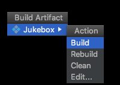

### 1 Java deployment

#### Deployment options


* **Local**: The entire application runs on the end-user’s computer, as a stand-alone, probably GUI, program, deployed as an executable JAR (we’ll look at JAR in a few pages.)

* **Combination of local and remote**: The application is distributed with a client portion running on the user’s local system, connected to a server where other parts of the application are running.

* **Remote**: The entire Java application runs on a server system, with the client accessing the system through some non-Java means, probably a web browser.

#### JAR

A **JAR** file is a **J**ava **AR**chive. It's based on the pkzip file format, and it lets you bundle all your classes.

How do you get it to run? You make the JAR ***executable***. An executable JAR means the end-user doesn't have to pull the class files out before running the program. The user can run the app while the class files are still in the JAR. 

The trick is to create a ***manifest*** file, that goes in the JAR and holds information about the files in the JAR. The manifest file must tell the JVM *which class has the main() method*!


**Making an executable JAR**:

* Make sure all of your class files are in the classes directory
* Create a `manifest.txt` file that states which class has the <C>main()</C> method
    * Make a text file named `manifest.txt` that has a one line: `Main-Class: MyApp`
    * Press the return key after typing the MainClass line, or your manifest may not work correctly. Put the manifest file into the “classes” directory.
* Run the jar tool to create a JAR file that contains everything in the classes directory, plus the manifest.
    * %cd MiniProject/classes 
    * %jar -cvmf manifest.txt app1.jar *.class OR 
    * %jar -cvmf manifest.txt app1.jar MyApp.class


#### JAR in IntelliJ IDEA

* Create Artifact: go to `File-Project Structure`, add new Artifact.


* Add new manifest file


 
 * Add resources: click +, and select file you want to add.
 * Build: On the main menu, choose Build | Build Artifact. From the drop-down list, select the desired artifact of the type JAR.
 

* Run: Open the Run/Debug Configurations dialog (e.g. Run | Edit Configurations). Click + and select JAR Application.


NOTE: 不要使用File来定位文件，使用

```Java
InputStream stream = Thread.currentThread().getContextClassLoader().getResourceAsStream("file-to-add");
```
来获取文件。

#### Package

Put your classes in packages, because packages prevent class name conflicts.

Sun strongly suggests a package naming convention that greatly reduces that risk -- pretend every class with your reverse domain name.


<font color='red'><big><C>com.headfirstjava.projects.Chart</C></big></font>

To put your class in a package:

* Choose a package name
* Put a package statement in your class
    * `package com.headfirstjava;` 
* Set up a matching directory structure
    * Keep your source code in a directory structure that matches the package structure, and you’ll avoid a ton of painful headaches down the road. 
* Compiling with the -d (directory) flag
    * `%javac -d ../classes com/headfirstjava/PackageExercise.java`
* Running code
    *  `%java com.headfirstjava.PackageExercise`

### 2 Java Web Start

With Java Web Start(JWS), you application is launched for the first time from a Web browser (get it? Web Start?) but it runs as a stand-alone application (well, almost), without the constraints of the browser. And once it's downloaded to the end-user's machine, it *stays* here.


#### How Java Web Start works

[A Java Web Start demo from Oracle](https://docs.oracle.com/javase/tutorialJWS/samples/uiswing/TextFieldDemoProject/TextFieldDemo.jnlp)


* The client clicks on a Web page link to your JWS application (a `.jnlp` file).
* The Web server (HTTP) gets the request and sends back a `.jnlp` file (this is NOT the JAR).
    * The `.jnlp` file is an XML document that states the name of the application’s executable JAR file. 
* Java Web Start (a small 'helper app' on the client) is started up by the browser. The JWS helper app reads the `.jnlp` file, and asks the server for the JAR file.
* The Web server ‘serves’ up the requested `.jar` file.
* Java Web Start gets the JAR and starts the application by calling the specific `main()` method (just like an executable JAR).

    

#### The <C>.jnlp</C> file

`.jnlp`(Java Network Launch Protocol) file describes your application. This is the file the JWS app reads and uses to find your JAR and launch the app.


JNLP file for the demo 
 
```xml
<!-- JNLP File for TextDemo -->
<jnlp
  spec="1.0+"
  codebase="https://docs.oracle.com/javase/tutorialJWS/samples/uiswing/TextFieldDemoProject"
  href="TextFieldDemo.jnlp">
  <information>
    <title>TextFieldDemo</title>
    <vendor>The Java(tm) Tutorial</vendor>
    <homepage href="https://docs.oracle.com/javase/tutorial/uiswing/examples/components/index.html#TextFieldDemo"/>
    <description>TextFieldDemo</description>
    <description kind="short">Uses a text field and a text area.
    Searches for a text typed in the text field and highlights the found text in the text area.
    </description>
    <offline-allowed/> // The user can run program without being connected to the internet.
  </information>
  <resources>
    <j2se version="1.7+"/> 
    <jar href="TextFieldDemo.jar"/> // the name of executable JAR!
  </resources>
  <application-desc main-class="components.TextFieldDemo"/>
</jnlp>
```

* The 'codebase' tag is where you specify the 'root' of where you web start stuff is on the server.
* The 'href' is the location of the `.jnlp` file relative to the codebase.

#### Deploying with JWS

Steps for making and deploying a Java Web Start app

* Make an executable JAR for your application
* Write a `.jnlp` file
* Place your JAR and `.jnlp` files on your Web server.
* Add a new mime type to your Web server.
* Create a Web page with a link to your `.jnlp` file