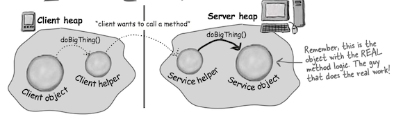
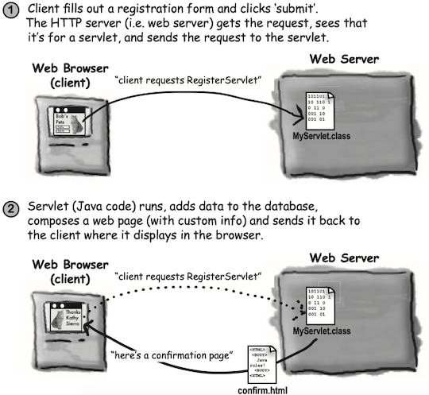

> The Java Remote Method Invocation (RMI, 远程方法调用) system allows an object running in one Java virtual machine to invoke methods on an object running in another Java virtual machine. <small>[Java Tutorial](https://docs.oracle.com/javase/tutorial/rmi/index.html)</small>

### RMI

#### client and server helpers

A design for remote method calls, Create four things: server, client, server helper, client helper

* Create client and server apps. The server app is the remote service that has an object with the method that the client wants to invoke.
* Create client and server ‘helpers’. They’ll handle all the low-level networking and I/O details so your client and service can pretend like they’re in the same heap.

The role of the 'helpers': the client calls a method on the client helper, *as if the client helper were the actual service. The client helper is a proxy for the Real Thing*. 

Your client object gets to act like it’s making remote method calls. But what it’s really doing is calling methods on a heap-local 'proxy' object that handles all the low-level details of Sockets and streams.

#### How the method call happens

* Client object calls doBigThing() on the client helper object

* Client helper packages up information about the call (arguments, method name, etc.) and ships it over the network to the service helper.

* Service helper unpacks the information from the client helper, finds out which method to call (and on which object) and invokes the real method on the real service object.

In RMI, the client helper is a ‘stub’ and the server helper is a ‘skeleton’.

#### Making the Remote Service

* Make a **Remote Interface**
* Make a **Remote Implementation**
* Generate the **stubs** and ske****letons using rmic
* Start the **RMI registry** (rmiregistry)
* Start the **remote service**

### 2 Servlet

Servlets are Java programs that run on (and with) an HTTP web server. When a client uses a web browser to interact with a web page, a request is sent back to the web server. If the request needs the help of a Java servlet, the web server runs the servlet code. Servlet code is simply code that runs on the server, to do work as a result of whatever the client requests.

### Jini