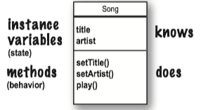
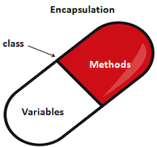

### 1 Methods

<b>A class define what an object <i>{==knows==}</i> and what an object <i>{==does==}</i></b>. Things an object knows are its ***instance variables***(state), things an object does are its ***methods***(behavior).



#### Method Parameters

<b>A method uses <i>parameters</i>. A caller passes <i>arguments</i>.</b>

* Arguments are the things you pass into the methods.
* If a method takes a parameters, you must pass it something.
* Methods can return values. Every method is declared is declared with a return type.
* If you declare a method to return a value, you *must* return a value of the declared type or a value that is *compatible* with the declared type.
* Java is ***pass-by-value***, which means ***pass-by-copy***.

#### Method Return

Methods can return values. *Every* method is declared with a return type.

* A `void` return type means the method doesn't give anything back.
* If you declare a method to return a value, you *must* return a value of the declared type! (or a value that is *compatible* with the declared type.)

### 2 Getters and setters

**Getters** and **setters** let you, well, ***get and set things***.

* A Getter's sole purpose in life is to send back, as a return value, the value of whatever it is that particular Getter is supposed to be Getting.


### 3 Encapsulation


By forcing everybody to call a setter method, we can protect variables from unacceptable changes.

```java
theCat.height = 0 //yikes! we can't let this happen

public void setHeight(int ht){
    // we put in checks to guarantee a minimum cat height.
    if (ht > 9) height=ht;
}
```

An **encapsulation** *starter* rule of thumb: _mark your instances variables ***private***, and provide ***public*** getters and setters for access control._

* Encapsulations puts a force-field around instance variables, so nobody can set them to something *inappropriate*.
* The point to setters (and getters, too) is that ***you can change your mind later, without breaking anybody else’s code***!




> In object oriented programming languages, encapsulation is used to refer to one of two related but distinct notions, and sometimes to the combination thereof: (1) A language mechanism for **restricting direct access** to some of the object's components.(2) A language construct that facilitates the **bundling of data with the methods** operating on that data. [[wiki](https://en.wikipedia.org/wiki/Encapsulation_(computer_programming))]

**Advantages of Encapsulation**:

* **Data Hiding**: The user will have no idea about the inner implementation of the class. It will not be visible to the user that how the class is storing values in the variables. He only knows that we are passing the values to a setter method and variables are getting initialized with that value.
* **Increased Flexibility**: We can make the variables of the class as read-only or write-only depending on our requirement. If we wish to make the variables as read-only then we have to omit the setter methods like `setName()`, `setAge()` etc. from the above program or if we wish to make the variables as write-only then we have to omit the get methods like `getName(`), `getAge()` etc. from the above program
* **Reusability**: Encapsulation also improves the re-usability and easy to change with new requirements.
* **Testing code is easy**: Encapsulated code is easy to test for unit testing.


```Java
class GoodDog {
    private int size; //Make the instance variable private
    public int getSize() { // make the getter methods public
        return size; 
    }

    public void setSize(int s) {  // make the setter methods public
        size = s; 
    }

    // even though the methods don't really add new functionality,
    // the cool thing is that you can change your mind later.
    // you can come back and make a method safer, faster, better
    void bark() {
        if (size > 60) { 
            System.out.println(“Wooof! Wooof!”); 
        } else if (size > 14) {
            System.out.println(“Ruff! Ruff!”); } 
        else {
            System.out.println(“Yip! Yip!”); 
        }
    }
}
```

### 4 Instance variables

You don't have to initialize instance variables, because they always have a default value:

* intergers: 0
* floating points: 0.0
* booleans: false
* references: null

#### Instance v.s. local variables

The difference between instance and local variables:

* **Instance** variables are declared _inside a class_ but not within a method.
* **Local** variables are declares _within a method_ .
* **Local** variables _must be initialized_ before use.

```Java
class AddThing { 
    int a;  // instance variable: it have a default value.
    int b = 12; // instance variable
    public int add() { 
        // local variable: it must be initialized before use!
        int total = a + b;         
        return total;
    }
}
```

### 5 Comparing variables

If you want to know if the value of two objects are **equal**, you need the `.equal()` method.

```java
// These two have the same value
new String("test").equals("test") // --> true 
```

To see if two **reference** are the **same** (which means they refer to the same object on the heap) use the `==` operator.

```Java
Foo a = new Foo(); 
Foo b = new Foo(); 
Foo c = a; 
if (a == b) { // false } 
if (a == c) { // true } 
if (b == c) { // false }
```

To compare two primitives, use the `==` operator.

* Operator `==` doesn't care about the size of the variable, so all the extra zeros on the left end don't matter.

```java
int a = 3;
byte b = 3;
if (a==b){ //true}
```
    
!!! summary
    * `==` tests for **reference equality** (whether they are the same object).
    * `.equals()` tests for **value equality**(whether they are logically "equal").
